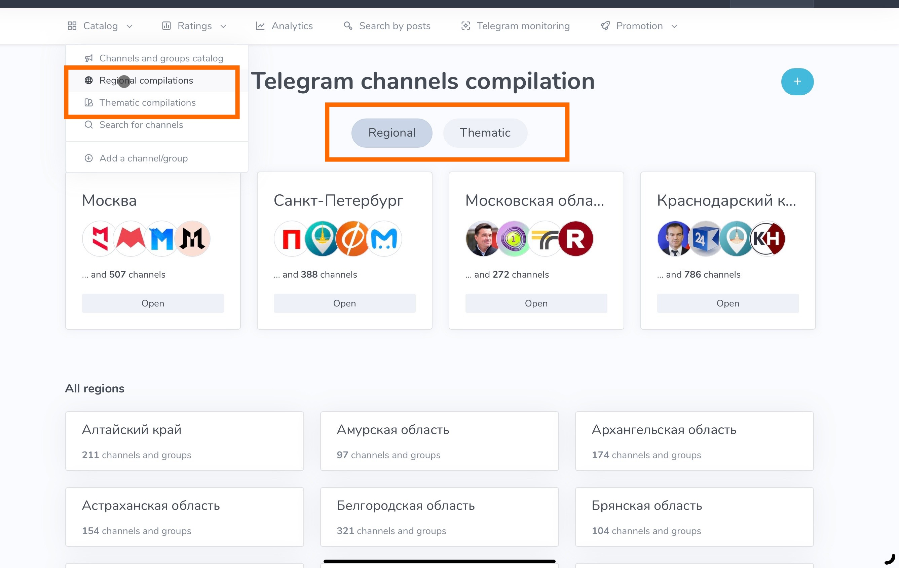
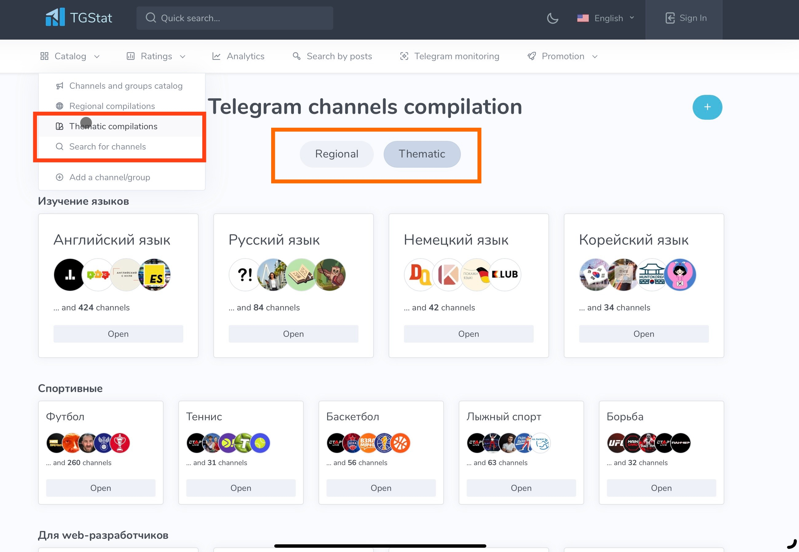
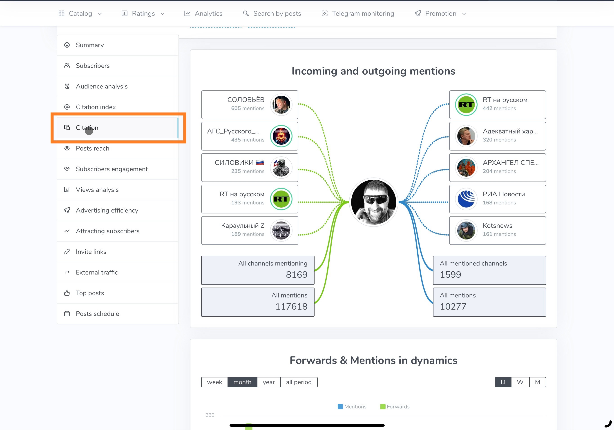
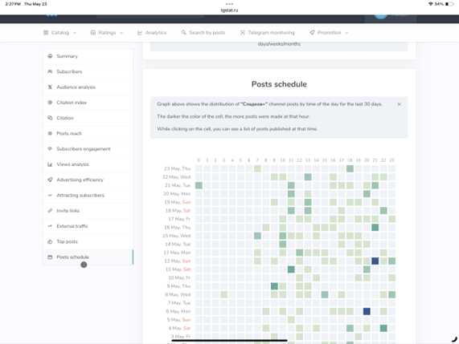

# TGStat

## URL



## Description

TGStat is a Russia-based social media analytics platform that offers comprehensive statistics and insights for public Telegram channels and open groups. With its extensive database, it provides detailed information on popular Telegram channels and members, including engagement metrics, growth trends, and audience demographics. TGStat covers statistics for over 14,000 Telegram channels, encompassing:

\-        Subscriber numbers

\-        Average post reach

\-        Daily views

\-        Share count

\-        Mentions

\-        Posting frequency

TGStat is useful for discovery, especially for those monitoring events in Russian-speaking countries, post-Soviet regions or far-right groups. It analyzes a diverse set of channels and public groups. The statistics are current and updated daily.

_**What problem does it solve?**_

TGStat solves a discovery and time management issue. Telegram’s search function lacks advanced features and filters, making it difficult for unfamiliar users to find specific information. Success often relies on knowing local terminology and search nuances. However, TGStat can assist through discovery, comparison, and analytics.

**Discovery:** It assists researchers in finding relevant channels to follow on specific topics. Some features are:

1. _Filter by country:_ On TGStat, users can filter channels by country. The list of countries available in the search filters are: Russia, Ukraine, Belarus, Uzbekistan, Kazakhstan, Kyrgyzstan, Iran, China, India, and Ethiopia.\

<figure><figcaption>
Public channels and open groups arranged by country
</figcaption></figure>

However, posts in public channels and open groups from other countries and languages are also often covered by TGStat analytics.\
&#x20;

<figure><figcaption>
Sample public channel in another language
</figcaption></figure>

2. _Filter by theme/region:_ When researching Telegram channels in Russia, channels are grouped by region and by theme/topics. For the other countries, channels can be filtered by theme but not by regions.

<figure><figcaption>
Search by region for Russia-based channel and groups
</figcaption></figure>

<figure><figcaption>
Filter by theme/topic for Russia-based channels and groups
</figcaption></figure>

3. _Filter by rating:_ TGStat also has a rating system for both channel and posts. This in turn is a useful indicator of channel popularity and audience engagement.

**Comparison:** TGStat also solves the problem of visualizing posts reach and its relationship with other actors, channels and content. TGstat can pull up a specific channel's analytics and show the relationship between channels through the “citation” section. This section shows who cites whom. Some thematic similarities in content between channels overlap.

<figure><figcaption>
Sample citation showing the relationship between a channel in question and other channels
</figcaption></figure>

&#x20;

<figure><figcaption></figcaption></figure>

Another way to see the relationship between channels is through the "similar channels" and “related channels” section of the profile in question.&#x20;

\
In addition, users can see the popularity of a channel or group overtime.

<figure><figcaption>
After finding individual channels, users can expand their search based on the "related channels" or "similar channels" feature
</figcaption></figure>

&#x20;_**Analytics:**_ TGStat assists in analyzing content and reach.  It provides insight on the channel or group’s performance, such as subscriber numbers, subscribers acquired overtime or those acquired based on popularity of posts, reach, views per posts, and engagement metrics (likes, comments, shares) per individual posts. This enables the user to understand what type of content resonates with a particular audience.

<figure><figcaption>
Users can check post popularity by date and by hour after it's been published
</figcaption></figure>

<figure><figcaption>
External traffic on channel in question
</figcaption></figure>

<figure><figcaption>
Post frequency of channel in question (darker colors indicate heightened posting activity) 
</figcaption></figure>

## Cost

TGStat has both free and paid versions. However, the most important features of the tool are available for free.

&#x20;The versions are: Free, Premium Analytics, Premium Search

&#x20;

|           | **Free** | **Premium Analytics**                                                                          | **Premium Search**                                                                             |
| --------- | -------- | ---------------------------------------------------------------------------------------------- | ---------------------------------------------------------------------------------------------- |
| **Price** | 0 RUB    | 
1 mo – 2 490 RUB

3 mo – 7 090 RUB

6 mo – 13 390 RUB

12mo – 25 390 RUB
 | 
1 mo – 2 190 RUB

3 mo – 6 200 RUB

6 mo – 11 800 RUB

12mo – 22 300 RUB
 |

**Free vs. Premium Analytics**

Below are some of the different features available in a free account vis a vis a Premium Analytics subscription. (List is not exhaustive, but focuses on main features that may be helpful for open source researchers)

&#x20;&#x20;

|                                     | **Free**                                        | **Premium Analytics**                                                             |
| ----------------------------------- | ----------------------------------------------- | --------------------------------------------------------------------------------- |
| “View Analysis” section             | Last 5 posts available for analysis             | Unlimited                                                                         |
| “Advertising Effectiveness” section | Latest 5 activities available for analysis      | Unlimited                                                                         |
| “Attracting Subscribers” section    | Last 6 months available for analysis            | Unlimited                                                                         |
| “Invitation Links” section          | Last 10 invitation links available for analysis | Unlimited                                                                         |
| “Top Posts” section                 | Not available                                   | Unlimited time period, customized view, and available for export of data to Excel |
| Citation                            | Not available                                   | Available                                                                         |
| Similar Channels/ Related Channels  | Not available                                   | Available                                                                         |

**Free v. Premium Seach**

Below are some of the different features available in a free account vis a vis a Premium Search subscription. The number of channels users can search and the number of requests for advanced search are limited. (List is not exhaustive, but focuses on main features that may be helpful for open source researchers)

|                                                      |               |                    |
| ---------------------------------------------------- | ------------- | ------------------ |
|                                                      | **Free**      | **Premium Search** |
| Number of channels per day                           | 10            | Unlimited          |
| Number of channels per month                         | 200           | Unlimited          |
| Number of channel search requests per day            | 30            | Unlimited          |
| Number of channel search requests per month          | 500           | Unlimited          |
| Search through full catalog of posts                 | Limited       | Available          |
| Filter by time period                                | Limited       | Available          |
| Filter by language, country, subject and source type |               | Available          |
| Filter by channel and group mentions                 | Not available | Available          |
| Export of search results to Excel                    | Not Available | Available          |

Other paid features are:  Access to Stat API (fee comparison here: [https://tgstat.ru/en/api/stat](https://tgstat.ru/en/api/stat)), Access to Search API ([https://tgstat.ru/en/api/search](https://tgstat.ru/en/api/search)), Access to Callback API ([https://tgstat.ru/en/api/callback](https://tgstat.ru/en/api/callback))

### Level of Difficulty

2 - EASY TO USE&#x20;

### Requirements

The free version of the tool requires:

1\.       Internet and laptop/mobile device

2\.       Telegram account

The paid version of the tool requires:

1\.       Internet and laptop/mobile device

2\.       Telegram account

3\.       Paid subscription (the paywall accepts foreign credit cards)

### Limitations

The tool has very few limitations.&#x20;

1. It requires logging in to access important features.&#x20;

If not logged in, users can see the channel’s “Summary” analytics.&#x20;

<figure><figcaption></figcaption></figure>

If not logged in, users are unable to access the following features: subscribers, citation index, citation, average post reach, subscriber engagement, post views analysis, attracting subscribers, external traffic, and top posts.

<figure><figcaption></figcaption></figure>

2. Video "How To" guides are mostly in Russian.&#x20;

### Ethical Consideration

If you're considering using TGStat, it's wise to weigh these potential limitations against your needs. It might be a good option for getting a basic overview of your Telegram channel or group, but for more in-depth analysis, you might need to explore other options.

* **Be mindful of data accuracy/specify data provenance:** TGStat relies on data provided by Telegram, so the accuracy of the information it presents depends on Telegram's data. Be mindful of discrepancies and seek to validate data if possible. It is advisable to specify data provenance by citing TGstat.
* **Be mindful of over-quantification and limited scope of data:** Balance any research with other approaches so that it is not dominated only by data, numerical information, measurement, etc. Analytics tools might offer some in-depth analytics but users must be aware and specify where the limits are of the data.
* **Privacy Concerns:** You're providing your Telegram data to a third-party service, so there are inherent privacy risks. Make sure you trust the tool and understand their data practices.
* **Be mindful of OPSEC concerns when logging in:** It is advisable for users to be aware of any security vulnerabilities associated with accessing the metrics through loggin in.&#x20;

### Guide

Russian language guide on the following link provided by TGStat.ru (In the process of searching guides in English): [https://tgstat.com/blog/video-course-1024](https://tgstat.com/blog/video-course-1024) (Turning on the Auto Translate feature on YouTube gives a useable translation of the guide)

_**Use case**_

TGStat has been particularly used in content verification, especially in tracking the spread of disinformation/ misinformation. (See: DFRLab’s lists of research involving misinformation. A good example is the following article from DFRLab: [https://dfrlab.org/2024/02/08/russian-milbloggers-falsely-accuse-kazakhstan-of-opening-a-nato-military-facility/](https://dfrlab.org/2024/02/08/russian-milbloggers-falsely-accuse-kazakhstan-of-opening-a-nato-military-facility/))

### Tool Provider

No information at the moment. Will be updated when information is available.&#x20;

### &#x20;Advertising Trackers

This tool doesn't appear to use tracking cookies.&#x20;

&#x20;

### Page Maintainer

Afton&#x20;
