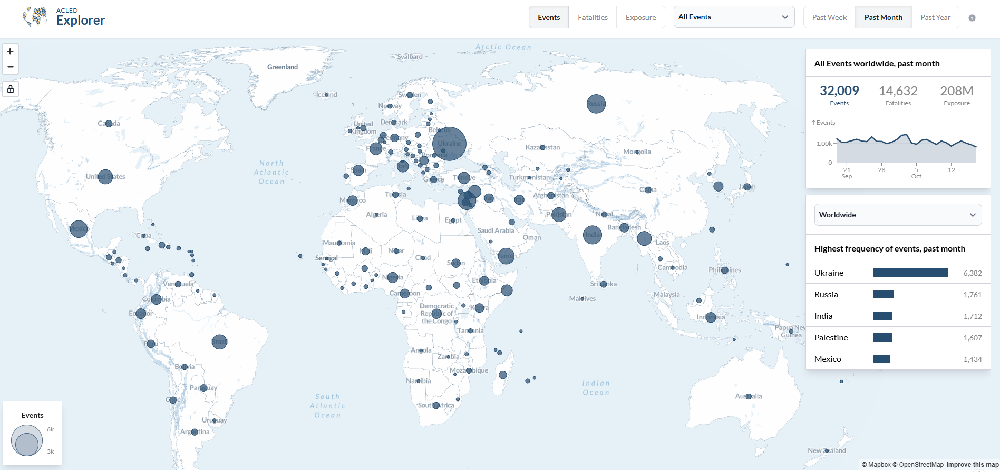

# ACLED (Armed Conflict Location & Event Data Project)

## URL

[https://acleddata.com/](https://acleddata.com/)\
(as of Jan 31, 2025)

## Description

ACLED provides detailed, up-to-date information on political violence and protest events worldwide. The toolset includes the [ACLED Explorer](https://acleddata.com/platform/explorer), [Trendfinder](https://acleddata.com/platform/trendfinder), [Conflict Alert System (CAST)](https://acleddata.com/platform/cast-conflict-alert-system), and a [Conflict Exposure Calculator](https://acleddata.com/platform/conflict-exposure-calculator), allowing users to track, analyze, and forecast conflict dynamics. Users can download datasets and utilize interactive dashboards for in-depth analysis of trends, country-specific profiles, and more. Covering **all countries and territories**, ACLED’s data supports research, humanitarian, and policy applications by enabling users to observe conflict patterns, identify trends, and assess regional stability risks.

* **Timely Data:** A detailed dataset on the dates, locations, actors, and fatalities of political violence and protests, updated weekly.
* [**Analysis reports**](https://acleddata.com/analysis/): Written reports by ACLED analysts and researchers based on ACLED data.
* **Analysis Tools:** Interactive dashboards, trend reports, and maps visualizing conflict data over time and across regions.
* **Country Profiles:** In-depth reports on specific countries, analyzing conflict dynamics and historical context.
* **Data Export:** Downloadable datasets in various formats for custom analysis.


Some functions or Dashboards within ACLED (such as CAST) might not work with an Ad- or tracking-blocker or on browsers with very strict security settings. The author's research doesn't indicate that this is of high concern, but you're responsible for your own digital footprint. You can download monthly reports for most of the tools, or use a VM to connect to ACLED if you want to avoid switching off these tools on your computer.


## **Features**

### **Data**

* [**Data export tool**](https://acleddata.com/data-export-tool/)**:** Weekly updated conflict and protest data, as well as[ curated datasets.](https://acleddata.com/curated-data-files/)
* [**ACLED Explorer**](https://acleddata.com/explorer/): Filters data by location, actor, and event type, with exportable tables and charts. Still the quickest route to map/table/chart views and CSV/XLS downloads of the full 1997-present archive.
* [**Early Warning Dashboard**](https://acleddata.com/early-warning/dashboard/) **(2025-)** – ACLED has merged Trendfinder into a revamped Early Warning Dashboard that now houses all four risk tools (Trendfinder, CAST, Conflict Exposure Calculator and Conflict Index) behind a single login. A shared header lets you set date range, geography and actor/event filters once and carry them across modules; a new dark-mode toggle improves readability during night-shift monitoring or presentations.
  * [**ACLED Trendfinder**](https://acleddata.com/trendfinder/): Interactive trend-tracking for political violence and demonstrations.
  * [**CAST (Conflict Alert System)**](https://acleddata.com/conflict-alert-system/): Provides forecasts for political violence up to six months ahead.
  * **Conflict Exposure Calculator**: Assesses population exposure to conflict within specified areas and timeframes.
  * [**Conflict Index**](https://acleddata.com/conflict-index/): Severity ranking that [combines four indicators](https://acleddata.com/conflict-index/about/) (fatalities, events, locations, and actors) to rank global conflicts.
* [**Special Projects**](https://acleddata.com/special-projects-local-observatories/): Focuses on conflicts like Ukraine and Yemen, with real-time monitoring.

### **Analysis - Tools**


The following part of the text contains detailed function information in collapsible containers for convenience.


#### _**ACLED Explorer**_

The [ACLED Explorer](https://acleddata.com/platform/explorer/) enables filtering and summarizing data, generating tables and charts showing conflict and protest-related data, including types, actors, locations, and periods from 2018 onwards.

<figure><figcaption></figcaption></figure>

#### _**ACLED Trendfinder**_

ACLED Trendfinder provides interactive tools for tracking global political violence and demonstrations. It enables the identification of significant changes, historical context, and early warning signs of conflict emergence across countries and regions.

<figure><figcaption></figcaption></figure>

Trendfinder Functions

* **Annual Trend graph**: a bar chart and line graph with a time range slider.
* **Compare**: compare events to the previous month or year.
* **Dark theme toggle**
* **Data download:** download data in `.xlsx` format.
* **Filter by Event / Sub event Types**: filter events e.g., Battles, Protests, Riots, etc.
* **Individual event details**: when viewing subnational results, these are viewable on the map and include event and sub-event type and actors involved,
* **Map view:** see events plotted on a map.
* **Table view**: see a table of events by country or subnational area.
* **Reset button**
* **Select country**: filter by a specific country.
* **Table View - Event Count and Change Statistics**: filterable by country, Provinces or District, Events in the current Week, Yearly Average, and Percentage Change.
* **Zoom tool:** zoom in and out on the map.

#### _**ACLED Conflict Alert System (CAST)**_

The [ACLED Conflict Alert System (CAST)](https://acleddata.com/platform/cast-conflict-alert-system) forecasts global political violence events up to six months in advance, providing monthly updates and accuracy metrics for previous forecasts.

<figure><figcaption></figcaption></figure>

Forecasts function overview

* **Map view:** see forecast trends of decreases/increases from the average plotted on a map.
* **Zoom tool:** zoom in and out on the map.
* **Table view of Forecasted Events**: filterable by country, number of events, forecast average, and predicted change.
* **Filter by country**: filter by country.
* **Filter by outcome:** filter by what event types are expected.
* **Filter by comparing the forecast** to the previous time period from one month to 12 months.
* **Filter by selected forecast date:** up to six months in the future.
* **Forecast trends graph view**: a line graph with a time range slider showing historical and forecasted events.
* **What's driving the forecast**: a bar chart visualization of events behind the forecasts.

Accuracy metrics in the CAST system enable users to assess the accuracy of the forecast compared to the last six months.

<figure><figcaption></figcaption></figure>

Accuracy metrics overview

* **Zoom tool:** zoom in and out on the map.
* **Map view:** mean percentage error plotted on a map (toggle between percentage error and error).
* **Filter by time period:** from six months or a specific month.
* **Filter by country**: filter by country.
* **Filter by outcome:** filter by what event types are expected.
* **Table view of Forecasted Events**: Country, Observed Events, Forecast, Error, and Percentage Error (filterable by country).

CAST monthly forecasts are concise digests produced by ACLED’s Conflict Alert System that project organised political violence six months ahead and are released at the start of every month. Each report pairs a global hotspot map and Early-Warning Watch List with country-level risk charts, model-performance metrics and brief analytical commentary. Readers can [browse the full series ](https://acleddata.com/category/cast/)or download the [latest edition](https://acleddata.com/2025/06/12/cast-monthly-report-june-2025/) directly from ACLED’s website.

#### _**Conflict Exposure Calculator**_

[Shows the number of people](https://acleddata.com/platform/conflict-exposure-calculator) exposed to conflict in the selected area and time period.

<figure><figcaption></figcaption></figure>

Conflict exposure calucator functions

* **Data download:**: download data in `.xlsx` format
* **Level of aggregation**: Country, Global, Provinces, or District Level Location.
* **Filter** by event or actor type and Actors.
* **Filter by country:** filter by country or countries.
* **Filter by date range.**
* **Table View:** Country, distance, best, percentage of the country population, and total events.

#### _**Weekly Conflict Finder**_

The Weekly Conflict Index provides a singular measure of conflict intensity in every country in the world.

Example below: May 2024.

<figure><figcaption></figcaption></figure>

#### **Special Projects**

**Focused Conflict Monitoring**: ACLED provides analysis on several current conflicts and political violence, including the [Ukraine Conflict Monitor](https://acleddata.com/monitor/ukraine-conflict-monitor), [Yemen Conflict Observatory](https://acleddata.com/yemen-conflict-observatory/), and [Gaza Monitor](https://acleddata.com/monitor/gaza-conflict-monitor).


Not every focused conflict monitor is available for every registered user.


<figure><figcaption></figcaption></figure>

## Cost

* [ ] Free
* [x] Partially Free
* [ ] Paid

The free _myACLED_ tier provides access to dashboards and aggregated data, while higher tiers (Research, Partner, Enterprise) may involve a fee and give disaggregated or real‑time event data.

## Level of difficulty

<table><thead><tr><th data-type="rating" data-max="5"></th></tr></thead><tbody><tr><td>2</td></tr></tbody></table>

Medium – interactive dashboards and API require some technical skill.

## Requirements

* **Web -** any modern web browser.
* **API** - to access ACLED Data, please register for an account in the [ACLED Access Portal](https://acleddata.com/api-documentation/getting-started) or login with your existing account information.
* **Interactive Conflict Index Dashboard:** requires registration with an email address.

## Limitations

The ACLED dataset and tools come with several limitations that researchers should be aware of before deciding to utilize them in their projects:

* **Geographical Coverage**: While ACLED covers all countries worldwide, there may be gaps in coverage, especially in regions with less accessible information or ongoing conflicts.
* **Data Updates**: Though ACLED regularly updates its dataset, there can be a lag in reporting certain events due to the time required to verify information. This might affect research that requires the most current data.
* **Resolution and Granularity**: The level of detail and granularity of data can vary by location and event, potentially impacting analyses that require uniform detail across datasets.
* **Access Restrictions**: Some detailed data or analysis tools may be available only to users with specific access levels, limiting the scope of research for those with basic access.
* **Dependence on Open Sources**: The quality and reliability of ACLED data is dependent on the availability and veracity of open sources. In regions where the media is restricted or unreliable, this could impact the accuracy of the dataset.
* _**Conflict Alert System (CAST):**_ As a future forecasting system, it comes with caveats regarding accuracy. To understand more, see the methodology [here](https://acleddata.com/acleddatanew/wp-content/uploads/dlm_uploads/2023/07/ACLED-CAST-Methodology-%E2%80%93-July-2023.pdf). CAST forecasts are indicative and should not be treated as certainties.

Researchers should consider these limitations alongside their research goals and methodologies to determine whether ACLED's tools and datasets suit their needs.

## Ethical Considerations

When using ACLED's tools and datasets, researchers must navigate several ethical considerations to ensure responsible utilization and dissemination of sensitive information. Users are advised to consult ACLED's [Terms of Use](https://acleddata.com/terms-of-use/) for detailed guidelines.

* **Data Misinterpretation**: There is a risk that data could be misinterpreted or taken out of context, potentially leading to harmful conclusions or actions. Researchers must strive for accuracy and clarity in their analyses.
* **Bias and Representation**: It's essential to acknowledge biases in data collection and reporting processes and understand how they may affect the representation of certain groups or incidents.
* **Ethical Use and Attribution**: Users of ACLED data should use the data ethically, including proper attribution and acknowledgment of ACLED as the data source, and should not use the data for purposes that could incite violence or conflict. Users must follow ACLED’s End User License Agreement, content‑usage terms, and attribution policy when reusing the data.

Researchers and users of ACLED data are encouraged to engage with these ethical considerations thoughtfully, ensuring their work contributes positively to global understanding and rthe esolution of international conflicts.

## Guides and articles

To effectively use ACLED, especially for beginners or those looking to refine their skills, the following resources are highly recommended:

#### **Official Wiki**

ACLED offers a [Quick Guide to ACLED Data](https://acleddata.com/resources/quick-guide-to-acled-data/) and maintains a Resource Library for users seeking comprehensive information.

**Tutorials and Articles**

* The [ACLED API Documentation](https://apidocs.acleddata.com/) remains the primary resource for developers integrating ACLED data into applications.
* [**Keeping ACLED Data Updated**](https://acleddata.com/knowledge-base/keeping-acled-data-updated/) – A brief FAQ outlining ACLED’s “living dataset” policy: new events are added and historical records may be revised during the weekly Monday–Tuesday release cycle. It lists the kinds of changes users should expect (additions, substitutions, deletions) and reminds analysts to refresh local copies regularly to avoid version drift.

#### Use Cases:

* _Eclipse Mania, Coastal Earthquakes, Bridge Collapse, and Breaking the Ramadan Fast_. Available at: [https://gijn.org/stories/eclipse-mania-coastal-earthquakes-bridge-collapse/](https://gijn.org/stories/eclipse-mania-coastal-earthquakes-bridge-collapse/) (Accessed: 15 May 2024).
* Ruser, N. (2018). _How to Scrape Interactive Geospatial Data_, _bellingcat_. Available at: [https://www.bellingcat.com/resources/how-tos/2018/09/05/scrape-interactive-geospatial-data/](https://www.bellingcat.com/resources/how-tos/2018/09/05/scrape-interactive-geospatial-data/) (Accessed: 15 May 2024).
* ‘Mapping the Unknown: Using ACLED Data and GIS to Understand Conflict Zones’, _Medium_, 20 October. Available at: [https://medium.com/@avoukenas/mapping-the-unknown-using-acled-data-and-gis-to-understand-conflict-zones-f6f927e04cf1](https://medium.com/@avoukenas/mapping-the-unknown-using-acled-data-and-gis-to-understand-conflict-zones-f6f927e04cf1) (Accessed: 15 May 2024).
* For more recent use cases, consider exploring ACLED's Analysis section, which features up-to-date reports and insights.

#### Video:

* _Accessing ACLED Data_ (2023). Available at: [https://www.youtube.com/watch?v=wpInq3Lhqow](https://www.youtube.com/watch?v=wpInq3Lhqow) (Accessed: 15 May 2024).
* _The ACLED Conflict Alert System (CAST)_ (2024). Available at: [https://www.youtube.com/watch?v=CZMNv7y\_9lQ](https://www.youtube.com/watch?v=CZMNv7y_9lQ) (Accessed: 15 May 2024). Voukenas, A. (2023)
* For the latest tutorials, visit ACLED's [YouTube channel](https://www.youtube.com/@ACLEDinfo), which hosts current content on data access and tools.

#### Developer Resources

* [https://apidocs.acleddata.com/](https://acleddata.com/api-documentation/elements-acleds-api)

**Community and Support**

* [https://acleddata.com/knowledge-base/](https://acleddata.com/conflict-data/knowledge-base)
* [https://acleddata.com/about/local-networks](https://acleddata.com/about/local-networks)

## Tool provider

The Armed Conflict Location & Event Data Project (ACLED) [https://acleddata.com/](https://acleddata.com/) - ACLED is an independent non‑profit organisation incorporated in Wisconsin, United States

ACLED was created by [Clionadh Raleigh](https://acleddata.com/prof-clionadh-raleigh/), a Professor of Political Violence and Geography at the University of Sussex, in 2005 as a component of her PhD work. Since 2014, ACLED has operated as a non-profit, non-governmental organization incorporated in Wisconsin. ACLED operates as an independent, impartial, international non-profit organization that collects data on violent conflict and protests globally. It is a registered non-profit with 501(c)(3) status in the United States

## Advertising Trackers

* [ ] This tool has not been checked for advertising trackers yet.
* [x] This tool uses [tracking cookies](https://acleddata.com/opt-out-preferences/). Use with caution.
* [ ] This tool does not appear to use tracking cookies.

| Page maintainer |
| --------------- |
| Martin Sona     |
|                 |
