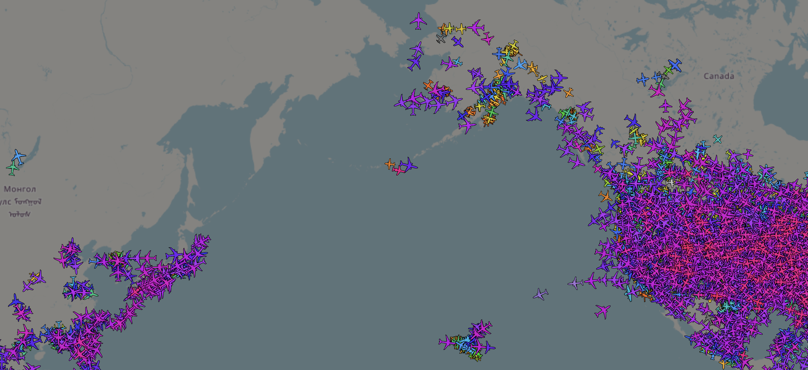

# ADS-B Exchange

## URL

[https://globe.adsbexchange.com/](https://globe.adsbexchange.com/)

## Description

ADSB Exchange provides real-time and historic flight tracking information across the globe, including aircraft identifiers, like call number, aircraft registration number, and flight information.&#x20;

The website captures information via its network of volunteers, or [feeders](https://map.adsbexchange.com/mlat-map/), with ADS-B receivers across the globe, as well as from satellite information ([MLAT](https://www.icao.int/sites/default/files/sp-files/APAC/Documents/edocs/mlat_concept.pdf)). All data that is displayed on the map is a result of real time data capture, and no extrapolation of the aircraft routes takes place. In other words, if there are no nearby receivers to detect an aircraft, only the last truly known location will be shown, not its expected route based on speed and heading.

The platform allows filtering by many different categories. Furthermore, unlike other aircraft tracking websites that allow aircraft owners to request that their aircraft be excluded from public tracking, this site continues to display those aircraft as well.

Flight tracking platforms like ADS-B Exchange can be used for open-source investigations, including but not limited to:

* analyzing real-time news, such as [Yevgeny Prigozhin’s plane crash](https://www.flightradar24.com/blog/russian-legacy-600-crashes-near-tver/);
* monitoring the movement of [private jets](https://www.occrp.org/en/project/russian-asset-tracker/faq-what-is-plane-tracking);
* document and analyze travel patterns of [high-profile individuals](https://www.theguardian.com/world/2022/aug/03/flight-trackers-flightradar24-ads-b-exchange).

ADS-B Exchange can also be used for verification of events through aircraft movement tracking.&#x20;

### Key Features

1. **No** **acceptance of take-down requests**

ADS-B Exchange [does not accept take-down requests](https://support.adsbexchange.com/hc/en-us/articles/36737581489037-How-Can-My-Aircraft-Be-Removed-From-the-ADS-B-Exchange-Website), thus listing all aircraft that broadcast [ADS-B](https://en.wikipedia.org/wiki/Automatic_Dependent_Surveillance%E2%80%93Broadcast) or [Mode S](https://en.wikipedia.org/wiki/Secondary_surveillance_radar#Mode_S), the primary means of tracking aircraft globally. The FAA (US Federal Aviation Administration) enables aircraft that have privacy concerns to apply to the [Privacy ICAO Aircraft Address (PIA)](https://www.faa.gov/air_traffic/technology/equipadsb/privacy) program , which will enable the aircraft to transmit a temporary asigned aircraft address instead of their actual address. Aircraft using the PIA program will still be displayed on ADS-B Exchange and can be filtered out separately (see below for a detailed description of the filters).

2. **See aircraft available only on ADS-B Exchange**

The website allows you to see the aircraft that have made take-down requests on other platforms by navigating to the [LADD](https://www.faa.gov/pilots/ladd) (Limited Aircraft Data Displayed) filter, though is primarily of US aircraft.&#x20;

<figure><figcaption>
ADS-B Exchange tracking platform, and the process for navigating to the filter that displays aircraft that have made take-down requests on other platforms. 
</figcaption></figure>

<figure><figcaption></figcaption></figure>

Below is a brief overview of the ADS-B website features. Upon entering the map view, the user can see a world map with current aircraft and various menus at the top and to the side.&#x20;

The detailed flight info (1) can be viewed by hovering over any aircraft of interest. Even more information will appear upon clicking an aircraft. Items 2 through 6 allow additional filtering and map manipulation. The user can hover over any button to get more information about what it does.&#x20;

<figure><figcaption>
Imagine 1: Overview of ADS-B Exchange map with live aircraft. Users can hover over every button to get explanations of what each button does. 
</figcaption></figure>

## Identifiers and where to find them

When conducting flight tracking as part of an investigation, it is important to understand which types of data to examine and which information may provide useful leads. In flight-tracking research, particular attention is often given to various identifiers.

Flight-tracking websites provide a wide range of information. However, depending on the research question, researchers typically focus on identifiers such as call signs, aircraft registrations, serial numbers, and hex codes. These identifiers can help researchers distinguish aircraft and connect flight activity to relevant information during an investigation.


Tip: not all identifiers may be available on a single aircraft tracking website. Cross-check with other sites to find all the relevant information.


Below is an overview of the different identifiers available on ADS-B Exchange and how to find them. Note that ADS-B Exchange does not provide flight number information. However, it does provide the call sign, hex/ICAO code, and registration number, which are all visible from just hovering over any aircraft. The serial number is only available AFTER you click on an aircraft and click on Full Details on the menu on the left hand side of the map. This number is available only with a subscription.

<figure><figcaption>
Image 2: overview of how to find call sign, Hex/ICAO Code, registration/tail number and MSN/Serial number. Note that the MSN/Serial Number can be accessed in Full Details about the aircraft, but it will be available only to paying customers.
</figcaption></figure>

### Call Sign

_**For live flights:**_

Call signs can be seen when you hover your cursor over a plane of interest in the live map. It is the top most field, as shown in Image 2. Users can find additional details when clicking on the aircraft, after which a detailed listing of the aircraft appears on the left hand side.

_**For completed/historical flights:**_

1. Identify another known aircraft identifier, such as Hex/ICAO code, or registration number.&#x20;
2. Expand the filter functionality on the right side, as shown on Image 1, item 3.&#x20;
3. Enter any of the known aircraft identifiers in the filters available in the Search tab. The recommended identifiers are the registration number or the Hex/ICAO code. After entering the information, hit "Search", after which the aircraft detailed information will appear on the left side of the screen. The Call Sign will be at the top of the aircraft information (in yellow in Image 3), and using the history function will enable a look back at all the Call Numbers for that aircraft beyond the most recent flight.

<figure><figcaption>
Image 3: An example of how to search for Call Sign for a historic aircraft, using ADS-B Exchange's Filter/Search functionality on the right hand side of the screen, and the resulting information coming up for the search result.
</figcaption></figure>

### Registration number / Tail Number, Hex/ICAO Code

_**For live flights:**_

Both of these flight identifiers can be seen when you hover your cursor over a plane of interest in the live map. The Hex/ICAO code is the second field and the Registration/Tail number is the third field on both the hover view and on the aircraft detail view (the window that pops up on the left), as shown in Image 2. The user can hover over an aircraft, or click on it to get this information.&#x20;

_**For completed/historical flights:**_

1. Identify another known aircraft identifier, such as the call sign.&#x20;
2. Expand the filter functionality on the right side, as shown on Image 1, item 3.&#x20;
3. Enter the call sign in the filters available in the Filter tab. Once you hit "Filter", the aircraft information will appear on the left side of the screen. You can look at the history of that particular aircraft as shown in Image 3. **Note that changing the dates will show different flights identifiers, including call signs and Hex Codes for that same aircraft registration number. In other words, it is not possible to look at the historic information of a particular Call Sign.** &#x20;

<figure><figcaption>
Image 4: Some of ADS-B Exchange's filter options, which allow the user to find specific aircraft by these filters.
</figcaption></figure>

### Serial Number / MSN

The serial number is only available AFTER you click on an aircraft and click on Full Details on the menu on the left hand side of the map. This number is available only with a subscription. See Image 2 for details of where to find this.&#x20;

## Other filters

ADS-B Exchange has quite a few filters for other identifiers and details of current flights. **It is important that the user "Reset" the filter when trying to filter by a new category, otherwise there could be some issues with the data on the map not displaying correctly.**


There are two characters that can be used for obtaining additional information:&#x20;

1. the pipe (|) can be used to list out more than one identifier in the field that is being filtered for, though spaces should be omitted.
2. the period (.) can be used as a wildcard if the user doesn't know one or more characters in the identifier, for example "JA..".&#x20;


<figure><figcaption>
Image 5: Filters available for ADS-B Exchange platform
</figcaption></figure>

* **Filter by altitude** - this can be helpful if the user wants to search for a particular altitude, such as low flying aircraft or aircraft that are about to land. **The altitude must be in feet.**&#x20;
* **Filter by callsign** - helpful for filtering aircraft with known call signs. The results will show anything that includes that particular callsign. For example, when searching for JAL4, the results will include any flight that has additional numbers at the end, such as JAL46 or JAL466.
* **Filter by squawk** - this is a code transmitted by the aircraft so the air traffic control can track its status. If there are emergencies, the squawk code will be used to relay that information to the air traffic control, for example if there is a radio failure. A full listing of squawk codes can be found [here](https://en.wikipedia.org/wiki/List_of_transponder_codes).&#x20;
* **Filter by type code** - here one can filter for the type of aircraft, for example, a Boeing 737, Airbus 220, or other types using standard shorthand naming convention. These are the ICAO type codes, and can be found fully on the [ICAO web page](https://www.icao.int/operational-safety/doc-8643-aircraft-type-designators/search) under Type Designator column. In order to search for more than one aircraft at a time, use the pipe (|) between each type code, without spaces. It is also possible to use the period (.) as a wildcard. For example, instead of searching for B732 (Boeing 737-200 series), it is possible to search for "B73." instead to find all Boeing 737 aircraft, regardless of their specific subsidies. Additional details can be found [here](https://support.adsbexchange.com/hc/en-us/articles/44653064937741-Map-Help).&#x20;
* **Filter by type description** - the type description is the overall type of aircraft, such as a helicopter, a two engine airplane, four engine airplane, turboprop aircraft, etc. The [Map Help](https://support.adsbexchange.com/hc/en-us/articles/44653064937741-Map-Help)  has more details about how to filter by type description. This filter is similar to category filter (below), but this filter focuses more on how the propulsion is created such as turboprop, two engines, four engines, etc., rather than propulsion power, like thrust power, which is what the category filter focuses on.
* **Filter by ICAO hex description** - used if there is a specific hex code/ICAO code that needs to be looked up. It is possible to use the pipe (|) to look up for multiple hex codes at once, and the period (.)  to look up hex codes where the user may not know all the numbers, for example "C06..." if the last three digits are not known.
* **Filter by source** - here it's possible to find aircraft that are being tracked using one of the many sources that ADS-B Exchange displays. This could be helpful if searching for aircraft that are not being tracked by ADS-B, for example.
* **Filter by DB flag** - this filter identifies aircraft that are showing up as military, aircraft that are requesting to take down their information (primarily US aircraft, which are part of the [Limiting Aircraft Data Displayed (LADD) Program](https://www.faa.gov/pilots/ladd)), and aircraft that are in the [FAA PIA](https://www.faa.gov/air_traffic/technology/equipadsb/privacy) program.  &#x20;
* Filter by registration - also known as the tail number, this field can be searched using the pipe (|) for more than one registration number, or the period (.) for unknown characters.&#x20;
* **Filter by country** - this field allows searching for aircraft that are registered to a specific country. The country must be spelled out completely, for example "United States" or "United Kingdom", to obtain the desired results.&#x20;
* **Filter by category** - this field allows one to search by the categorization of the emitter, which specifies the category of the type of aircraft, with the full listing of the codes [here](https://support.adsbexchange.com/hc/en-us/articles/44705224053517-Emitter-Category-ADS-B-DO-260B-2-2-3-2-5-2). For example it is possible to filter for just balloons (B2), light aircraft (A1), etc. This filter is similar to type description filter, but this filter focuses more on propulsion power, like thrust power, rather than the specifics of how the propulsion is created such as turboprop, two engines, four engines, etc.&#x20;

## Use Cases

ADS-B is particularly good at monitoring aircraft that have been taken down on other platforms. It may be helpful to set up a filter to show only the aircraft that are available on ADS-B Exchange, and monitor what's out there.&#x20;

Once you find an aircraft of interest, you can look up more information about the aircraft or current news to understand the context of the flight.&#x20;

## Cost

* [ ] Free
* [x] Partially Free
* [ ] Paid

There is one subscription tier, which can be paid monthly or annually. A subscription will provide additional flight information, additional historic flight information, and aircraft owner information. These are some features identified as relevant for open source investigations, though a full listing of the additional features can be found on their [website](https://store.adsbexchange.com/collections/subscriptions).

## Level of difficulty

<table><thead><tr><th data-type="rating" data-max="5"></th></tr></thead><tbody><tr><td>3</td></tr></tbody></table>

## Requirements

1. A stable internet connection.
2. Modern web browser

## Limitations

* **No sensors, no aircraft**. Since ADS-B Exchange relies on its own network of data recievers, there will be gaps where there are not data receivers. Furthermore, ADS-B Exchange does not extrapolate aircraft position if there is no live data available, therefore only known and detected positions are shown. ADS-B Exchange's [API documentation](https://www.adsbexchange.com/version-2-api/) and Github page indicate that ["when the regular lat and lon are older than 60 seconds they are no longer considered valid, this will provide the last position and show the age for the last position. aircraft will only be in the aircraft json if a messages has been received in the last 60 seconds.](https://github.com/wiedehopf/readsb/blob/dev/README-json.md)" This likely means that the plane icon or marker drops from the map.&#x20;
* &#x20;In some cases, there are areas that have limited data, such as in the Pacific Ocean.&#x20;

<figure><figcaption>
Image 6: ADS-B Exchange area of the map showing limited aircraft due to lack of sensors and lack of extrapolation of aircraft route. 
</figcaption></figure>

* **No origin and destination airport code.** While it is possible to visually see the areas of take off and landing, this information is not explicitly available on ADS-B Exchange and it is challenging to see all aircraft that have a particular listed origin or destination.&#x20;
* **No flight numbers.** Flight numbers, which are provided by the airlines to the public for transportation identification purposes, are not included in any ADS-B Exchange data. Since these can vary significantly from the Call Sign, and if this is something that is required for research, it will have to be acquired on one of the other flight tracking platforms. Or if one wishes to search for aircraft by its flight number, one will have to first obtain the call sign elsewhere and then look up the flight on ADS-B Exchange.&#x20;
* **Not complete data on free plan.** In order to access more detailed aircraft information, such as the aircraft serial number or longer history, one must have a paid plan. It may be easier to cross reference the aircraft with another platform to obtain this information.&#x20;
* **Aircraft photos.** The photo for a flight may not be the actual aircraft that it being tracked. It is best to verify that the aircraft photo matches the aircraft registration number and airline/make if using the photo.&#x20;
* **Flight info interaction challenges.** Some aircraft cannot be selected or clicked on, which seems to happen when their signal has not been received for some time, for example, of aircraft flying over the Pacific Ocean to or from Asia. &#x20;
* **Historic call sign information not available.** There is not a way to look up all aircraft that have flown a particular call sign historically. This may be an issue if one wants to look for patterns for a particular flight route or destination pair.&#x20;
* **ADS-B and GPS spoofing:** Feeding false data and coordinates into flight-tracking platforms [is common](https://www.icao.int/sites/default/files/APAC/Meetings/2025/2025%20ICAO%20APAC%20Radio%20Navigation%20Symposium%20%20Radio%20N/8-Risks%20Beyond%20GNSS/SP22-ADS-B-spoofing-and-mitigating-measures.pdf), and researchers should consider this possibility when looking at the data. An example of false aircraft data fed into ADS-B Exchange appears in [this](https://alecmuffett.com/article/143548) discussion, as well as [here](https://discussions.flightaware.com/t/aircraft-position-was-way-off/97025). &#x20;

## Ethical Considerations

**Privacy** - whenever performing any analysis of movement of aircraft, remember that there are people behind every aircraft and every flight. Please weight the consequences of publishing your findings vs keeping the information private.&#x20;

**Context** - every flight has context behind it. It is always a good idea to not only cross check with other flight tracking platforms (if possible), but also collect contextual data to verify claims about what is being shown on the flight tracking platform.&#x20;

**Copyright** - the platform [use terms](https://support.adsbexchange.com/hc/en-us/articles/37364077703693-What-is-ADS-B-Exchange-s-data-use-policy) should be reviewed and adhered to whenever writing about findings or analyses from ADS-B Exchange.&#x20;

## Guide

ADS-B Exchange Map Help. [https://support.adsbexchange.com/hc/en-us/articles/44653064937741-Map-Help](https://support.adsbexchange.com/hc/en-us/articles/44653064937741-Map-Help) (Accessed September 15, 2026)

ADS-B Exchange Help Center. [https://support.adsbexchange.com/hc/en-us#](https://support.adsbexchange.com/hc/en-us) (accessed September 15, 2026)&#x20;

Fiorella, Giancarlo, (2019, October 15). A beginner's guide to flight tracking. Bellingcat.[ https://www.bellingcat.com/resources/how-tos/2019/10/15/a-beginners-guide-to-flight-tracking/](https://www.bellingcat.com/resources/how-tos/2019/10/15/a-beginners-guide-to-flight-tracking/) (accessed September 15 2026)

## Tool provider

[JETNET LLC](https://www.jetnet.com/resources/press-releases/jetnet-acquires-ads-b-exchange), based in the USA, acquired ADS-B Exchange in January 2023.&#x20;

## Advertising Trackers

* [ ] This tool has not been checked for advertising trackers yet.
* [x] This tool uses tracking cookies. Use with caution.&#x20;
* [ ] This tool does not appear to use tracking cookies.

| Page maintainer           |
| ------------------------- |
| Alexandra Malikova, Afton |
|                           |
