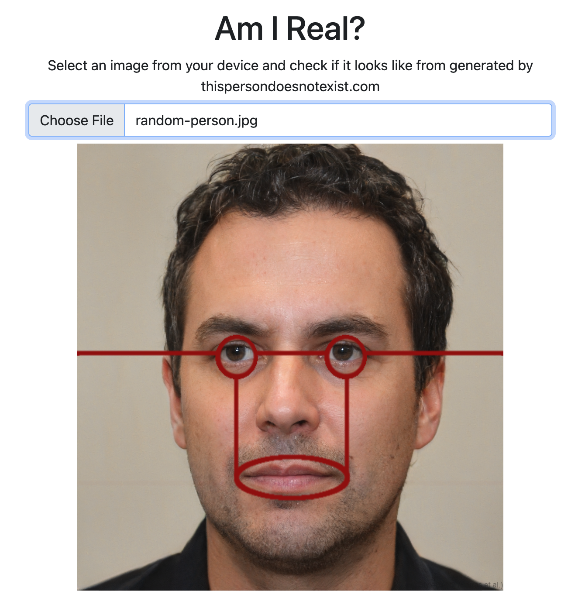

# Am I Real?

## URL

[https://seintpl.github.io/AmIReal/](https://seintpl.github.io/AmIReal/)

## Description

This basic online tool allows users to upload an image file and conduct a quick visual check to determine whether it was likely generated by ThisPersonDoesNotExist.com, a site that uses AI to create images resembling real human faces. Such images tend to follow a specific pattern with regards to the positioning of the eyes and mouth.&#x20;

As the [site notes](https://seintpl.github.io/AmIReal/): "The algorithm always puts the eyes in almost the same position in the photo, as well as the mouth. By overlaying the pattern on these photos, the observer can determine if the face was GAN-generated and doesn't belong to a real person."

Using this pattern as an overlaid guide, Am I Real? enables users to quickly scan any image to get a sense of whether it might have been produced by AI. The user can also move the overlaid guide up, down, left or right, or rotate it (in case the face is not positioned exactly in the centre of the image). The site does not perform any other checks to determine whether an image might have been generated by AI.

Here is a sample upload, showing a precise match between the alignment of eyes/mouth and the red overlaid Am I Real? guide:

<figure><figcaption></figcaption></figure>

While this alignment does not definitively confirm that the photo was generated by AI, it's a good indicator that the image warrants further investigation.

## Cost

* [x] Free
* [ ] Partially Free
* [ ] Paid

## Level of difficulty

<table><thead><tr><th data-type="rating" data-max="5"></th></tr></thead><tbody><tr><td>1</td></tr></tbody></table>

## Requirements

The tool can be accessed through any modern web browser.

## Limitations

* **Accuracy:** Although this tool can provide some insight into whether an image might have been generated by AI, it does not offer any definitive answers, and should only be used as part of a [deeper analysis](https://reutersinstitute.politics.ox.ac.uk/news/spotting-deepfakes-year-elections-how-ai-detection-tools-work-and-where-they-fail) of any given image. The site advises users to combine the tool with other techniques, such as scanning the image for aberrations (ie, non-matching earrings or background deviations).
* **Format:** The site accepts only direct uploads. Image URLs cannot be scanned, so any photo must first be downloaded to the user's device and then uploaded to the site prior to beginning the analysis.

## Ethical Considerations

* **Potential for misuse:** There has been much discussion online around the [ethical implications](https://www.cnn.com/2019/02/28/tech/ai-fake-faces) of AI generators and their potential for misuse. A tool like Am I Real? could potentially be used to address some of the shortfalls inherent in these images, enabling the development of increasingly sophisticated deepfakes that are harder to detect.&#x20;
* **Privacy:** Users should consider the privacy implications of submitting personal or sensitive videos or images to an online service.

## Tool provider

The tool was created by Polish OSINT analyst Krzysztof Wosiński ([@SEINT\_pl](https://x.com/SEINT_pl)).

## Similar tools

[DeepFake-O-Meter](https://zinc.cse.buffalo.edu/ubmdfl/deep-o-meter/): A drag-and-drop online tool designed to pinpoint deepfake images and videos, using a variety of AI detectors.

[InVID](https://bellingcat.gitbook.io/toolkit/more/all-tools/invid): This toolkit, which supports the verification of images, videos and audio, enables registered users to assess the probability that content has been manipulated by AI.

| Page maintainer           |
| ------------------------- |
| Bellingcat volunteer team |
| August 2026               |
