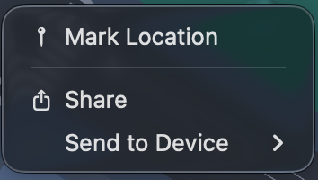
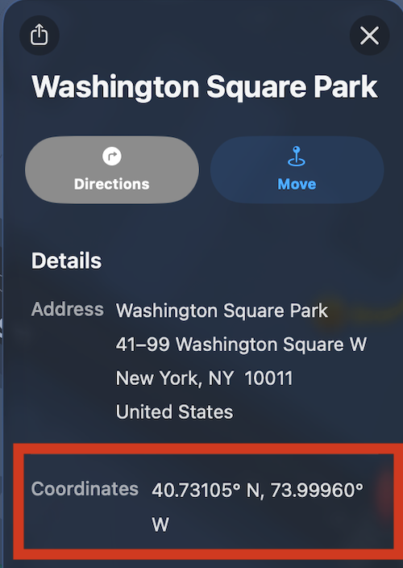
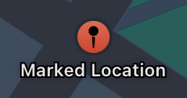
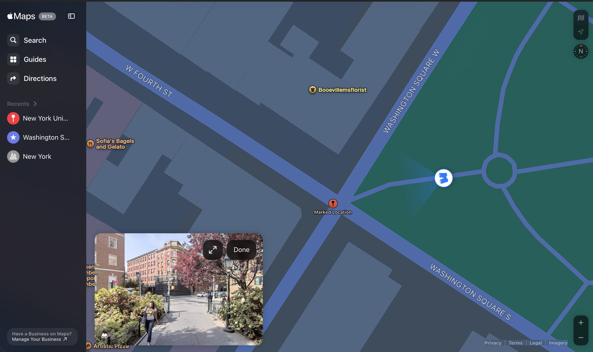

# Apple Maps

## URL

[https://maps.apple.com](https://maps.apple.com)

## Description

Apple Maps is the default map app pre-installed on Mac and iOS devices, and is also available via the web browser in any operating system.

Apple Maps is known to have [particularly detailed data](https://www.apple.com/newsroom/2021/09/apple-maps-introduces-new-ways-to-explore-major-cities-in-3d/) in metropolitan areas and landmarks. Researchers can use it as an additional tool to complement their searches in other map and street view apps.

**Privacy focus**: Apple Maps is noteworthy for better [privacy](https://www.apple.com/legal/privacy/). The mobile and desktop app processes route data on-device and uses rotating, anonymous identifiers that cannot be linked to the user's personal Apple ID. Due to this privacy model, the browser Duckduckgo has [opted to use Apple Maps](https://spreadprivacy.com/duckduckgo-apple-mapkit-js/) in its search results related to addresses and mapping.

#### Basic functionalities

Apple Maps is similar to other global or regional map and navigation apps in offering:

* **High-resolution Imagery:** 2D view, real-time traffic, and satellite imagery.
* **Detailed city data:** [3D views and indoor maps](https://en.wikipedia.org/wiki/Detailed_City_Experience) of significant landmarks, airports, and shopping centers.
* **Search functions:** Location search by place name or coordinates.
* **Look Around:** Equivalent to Google's Street View. The function was [expanded](https://virtualstreets.org/index.php/2025/07/08/apple-look-around-whats-happening-behind-the-scenes/) [since 2023](https://9to5mac.com/2023/04/07/new-apple-maps-features/?fbclid=IwY2xjawSoWsNleHRuA2FlbQIxMQBicmlkETFWVjJyeGljQXg0akVKbWI3c3J0YwZhcHBfaWQQMjIyMDM5MTc4ODIwMDg5MgABHu2m3RjoxsnA0oc6QrckDkMBJFr8xt_fKFKFFMNZYFjENYQd5NzbiQ42dyLF_aem_YWdncwCDSYOkTP7Yh554pxvB5TjQ\&brid=YWdncwHsBzzNnWWj_tXmYsvRj90Y) to cover larger urban areas beyond capital cities in Europe, Asia, and the Middle East.

#### Getting coordinates



Left-click and choose 'Marked Location from the menu.

<figure><figcaption></figcaption></figure>

This will drop a pin on the map. The pin will be automatically shown with a place name, usually the nearest landmark.

<figure><figcaption></figcaption></figure>

Click on the pin, and a left panel appears. You will see the coordinates shown. Copy and paste from there.

<figure><figcaption></figcaption></figure>



Drop a pin by double-clicking on the map. A pin will appear as "Marked Location".

<figure><figcaption></figcaption></figure>

To obtain the coordinates, look at the URL in your web browser.

<figure><figcaption></figcaption></figure>

In the example above, the coordinates are 40.731013, -73.999495.



#### Accessing street level imagery



Once you click on the pin, the street-level imagery appears in a small box to the lower-left corner, adjacent to the information panels. (See the red rectangle below.) 

Simply click on the street level image to enlarge to fullscreen view.



To use **Look Around**, click on the binoculars icon at the lower-left corner.

The street-level imagery will open at the lower-left corner. The binoculars icon is shown on the map to indicate where the street-level imagery was captured, and the direction of your view. You can enlarge the Look Around imagery.

<figure><figcaption></figcaption></figure>



#### Flyover (Future upgrade announced June 2026)

The Flyover feature is broadly equivalent to Google Earth’s 3D imagery. The function is available on the desktop and mobile apps, and _not_ available via the web browser.

In a planned upgrade for iOS 27 and MacOS 27, Flyover will be upgraded to combine 3D Gaussian splatting (3DGS) and aerial footage for a more visually appealing, photorealistic experience. The new Flyover experience will be available in 350 cities.


Researchers should be aware that the Flyover's underlying model blends current and historical data, as well as various information sources. Therefore, details observed in the Flyover (e.g., a tree, or graffiti on walls) should not be taken as the most factually accurate rendering of the places shown.


## Cost

* [x] Free
* [ ] Partially Free
* [ ] Paid

## Level of difficulty

<table><thead><tr><th data-type="rating" data-max="5"></th></tr></thead><tbody><tr><td>1</td></tr></tbody></table>

## Requirements

* Desktop app: built-in Maps app in the Mac operating system.
* Web: any modern web browser.
* Mobile: iOS. (Android users can access using the web browser.)
* Developer Platform: Apple account with email address and a credit card.

## Limitations

* **Coverage**: Apple Maps provides rich data in developed countries, but lacks up-to-date coverage in some regions, particularly in developing countries. See Apple's [Feature Availability Page](https://www.apple.com/ios/feature-availability/) for information by country.
* **Cross-Platform Compatibility**: Open-source research teams may need cross-platform compatibility. For example, one researhcer may need to share an Apple Maps URL (to a marked location, or a guide or review) with a Windows user or archive the linked page in a Windows system. One tool for converting Apple Maps shared URLs to a Google Maps link is: [GotoAppleMaps](https://gotoapplemaps.com/from/apple-maps/).
* **API Rate Limits:** the developer API has rate limits. See [Apple Maps Server API](https://developer.apple.com/documentation/applemapsserverapi/) for more information.
* **API Use:** the Apple Maps API has restrictions on things like caching. See the [Apple Developer Program License Agreement](https://developer.apple.com/support/terms/apple-developer-program-license-agreement/) for more information.

## Ethical Considerations

* **Bias and Representation**: Apple Maps' limited coverage in developing countries and the focus on major metropolitan areas can create [implicit biases](https://www.deseret.com/u-s-world/2021/7/2/22537588/map-bias-the-world-probably-doesnt-look-like-you-think/). Researchers should seek other maps or location-based data sources for a more balanced view.
* **Researchers' safety and privacy**: Researchers (especially those who keep a collection of marked places for their investigations within their on-device map apps) should regularly review their threat models in device safety and privacy, and take precautions accordingly.

## Similar tools

Windows users can check [satellites.pro](https://satellites.pro/). See the Bellingcat Toolkit guide [here](https://bellingcat.gitbook.io/toolkit/more/all-tools/satellites.pro).

## Guide

#### **Official guides**

The following may be helpful for non-Mac users needing to check Apple Maps temporarily or occasionally.

* Apple Support: Change your map view in Maps on Ma&#x63;_,_ [_https://support.apple.com/en-gb/guide/maps/mpsaf9c43d8f/mac_](https://support.apple.com/en-gb/guide/maps/mpsaf9c43d8f/mac) (Retrieved 24 June, 2026)
* _Apple Support: Organize places in My Guides in Maps on iPhone,_ [https://support.apple.com/guide/iphone/organize-places-in-my-guides-iph0a53d4d7f/ios](https://support.apple.com/guide/iphone/organize-places-in-my-guides-iph0a53d4d7f/ios) (Retrieved 24 June, 2026)

#### **Hand gestures and keyboard shortcuts**

Researchers who conduct open-source research on mobile devices would benefit from familiarising themselves with the Apple Maps hand gestures.

* GuideWise - Youtube Channel, 21 Nov 2025, How to Use One-Handed Zoom in Apple Maps on iPhone (Quick Guide), [https://www.youtube.com/watch?v=VaWKqNqnnVA](https://www.youtube.com/watch?v=VaWKqNqnnVA)

Keyboard shortcuts and hand gestures are also available on the desktop app:

* Keyboard shortcuts and hand gestures in Apple Maps on Mac, [https://support.apple.com/en-gb/guide/maps/mps36380d1ed/mac](https://support.apple.com/en-gb/guide/maps/mps36380d1ed/mac)

#### Developer Resources

* [https://developer.apple.com/maps/](https://developer.apple.com/maps/)

## Tool provider

Apple Inc. [https://www.apple.com/](https://www.apple.com/) - United States

## Advertising Trackers

* [ ] This tool has not been checked for advertising trackers yet.
* [x] This tool uses tracking cookies. Use with caution.
* [ ] This tool does not appear to use tracking cookies.

| Page maintainer                                                  |
| ---------------------------------------------------------------- |
| Author: Bellingcat Volunteer Team. (June 2026 update: river\_n). |
