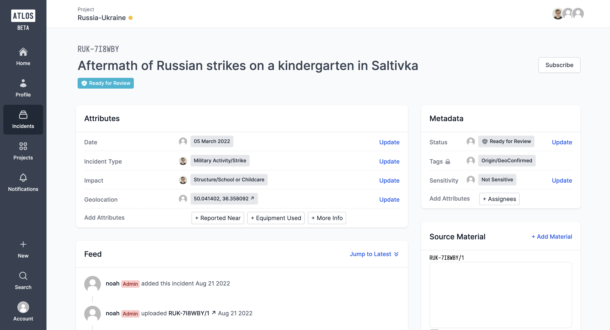
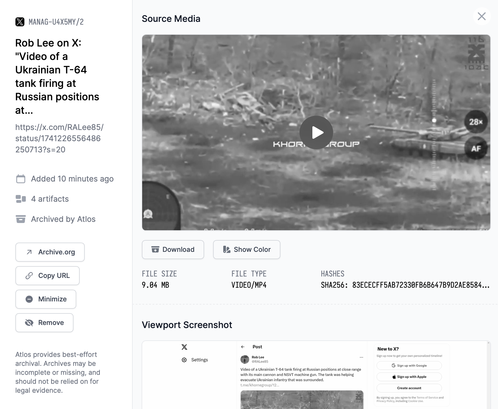
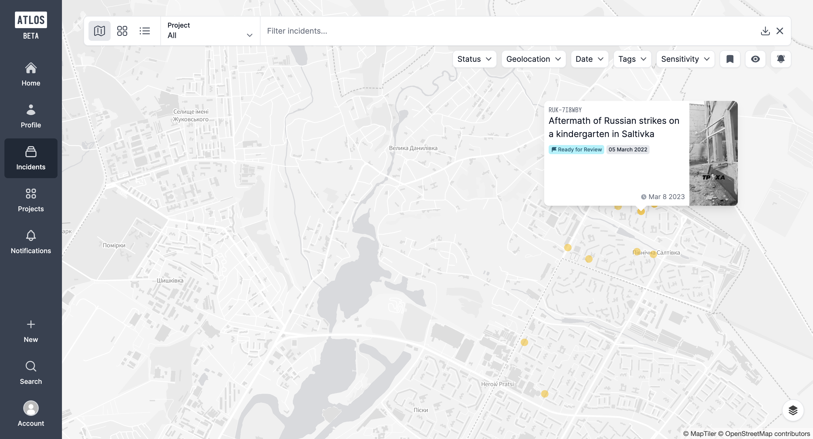

# Atlos

## URL

[https://www.atlos.org/](https://www.atlos.org/)

## Description

The main objective of Atlos is to enable teams of investigators to collaborate easily, even on large-scale investigations. Investigations can be divided into several cases or occurrences which are also called ‘incidents’.

<figure><figcaption>
View of an ‘incident’ page on Atlos. The 'Feed' section shows recent activity on the Atlos platform including whether researchers have added new files or incidents. Source: <a href="https://docs.atlos.org/overview/">https://docs.atlos.org/overview/</a>
</figcaption></figure>

You can, on a single page:

* create and characterise each case;
* alert everyone to the presence of graphic images before researchers get to see it to prevent [vicarious trauma](https://docs.atlos.org/safety-and-security/vicarious-trauma/);
* collect digital material such as photos, videos and pdfs from all over the Internet (press articles, Telegram or X posts,...);
* ... and archive it automatically;

<figure><figcaption>
View of an archived file, in this example a video. Source: <a href="https://docs.atlos.org/incidents/source-material/">https://docs.atlos.org/incidents/source-material/</a>
</figcaption></figure>

* see material displayed in default greyscale, or colour;
* organise who is assigned to a case or will receive updates on it;
* work on the case simultaneously
* .... and transparently (no comments written on ATLOS can be deleted afterwards, the whole investigation process is recorded);
* specify the GPS coordinates and find the incident on a map;
* analyse the progress of your investigation (How many incidents are waiting to be addressed? To which locations are incidents geolocated?...).

<figure><figcaption>
Geolocated incidents are visualised on a map. Source: <a href="https://docs.atlos.org/">https://docs.atlos.org/</a>
</figcaption></figure>

<figure><figcaption>
Example for a project overview which shows a list of incidents, their status, date and incident type. Source: <a href="https://docs.atlos.org/investigations/searching-and-visualizing-data/">https://docs.atlos.org/investigations/searching-and-visualizing-data/</a>
</figcaption></figure>

This platform is open source (see [https://github.com/atlosdotorg/atlos](./#url)), and you can:

* use its web version or [host it yourself](https://docs.atlos.org/technical/self-hosting/);
* [import and export](https://docs.atlos.org/investigations/import-and-export-data/) your data in CSV format;
* create custom integrations, for example with third-party archiving and publishing tools.

## Cost

* [ ] Free
* [x] Partially Free
* [ ] Paid

Free for up to 10 incidents that can be created and edited per month. Even with this free version, you have unlimited view access, your team can be of any size, and you can export your data whenever you want.

Further pricing information can be found [here](https://docs.atlos.org/overview/pricing/). &#x20;

## Level of difficulty

<table><thead><tr><th data-type="rating" data-max="5"></th></tr></thead><tbody><tr><td>2</td></tr></tbody></table>

## Requirements

At the top of the [tool webpage](https://www.atlos.org/), click on ‘Join Atlos’ and fill in the short form with your e-mail address and name and choose a password. You will be able to use multi-factor authentification to secure your access to Atlos.

<figure><figcaption>
Source: <a href="https://www.atlos.org/">https://www.atlos.org/</a>
</figcaption></figure>

## Limitations

If your investigation is small-scale, a spreadsheet may suffice.

If you want to archive a document while working on Atlos, put it in the Source Material category, not in the comments, otherwise only the text and URL are saved.

Your specific use cases may not yet have been encountered by the Atlos team. If you feel the platform is missing an important feature, you can [contact the team via e-mail](https://www.atlos.org/#contact).

Note that the tool providers have clarified [in their FAQ section](https://www.atlos.org/) that 'while Atlos' archival function supports journalistic investigations, it’s not suitable for legal or forensic evidence.'

## Ethical Considerations

Take a look at the Atlos security and risk model which is available [here](https://docs.atlos.org/safety-and-security/risk-model/).&#x20;

## Guides and articles

* [Atlos Docs](https://docs.atlos.org/)
* Chris Osieck: [Geolocating conflicts in Fall 2022 with various methods, and a preview of the new tool Atlos](https://medium.com/@chrisosieck/geolocating-conflicts-in-fall-2022-with-various-methods-and-a-preview-of-the-new-tool-atlos-ae76f86bb1a3), 2022.

## Tool provider

ATLOS is a collaborative platform created by two Stanford University students ([Miles McCain](https://github.com/milesmcc) and [Noah Schechter](https://github.com/noah-schechter), United States) who formed a non-profit association.

## Advertising Trackers

* [ ] This tool has not been checked for advertising trackers yet.
* [ ] This tool uses tracking cookies. Use with caution.
* [x] This tool does not appear to use tracking cookies.

| Page maintainer |
| --------------- |
| Stéphanie LADEL |
