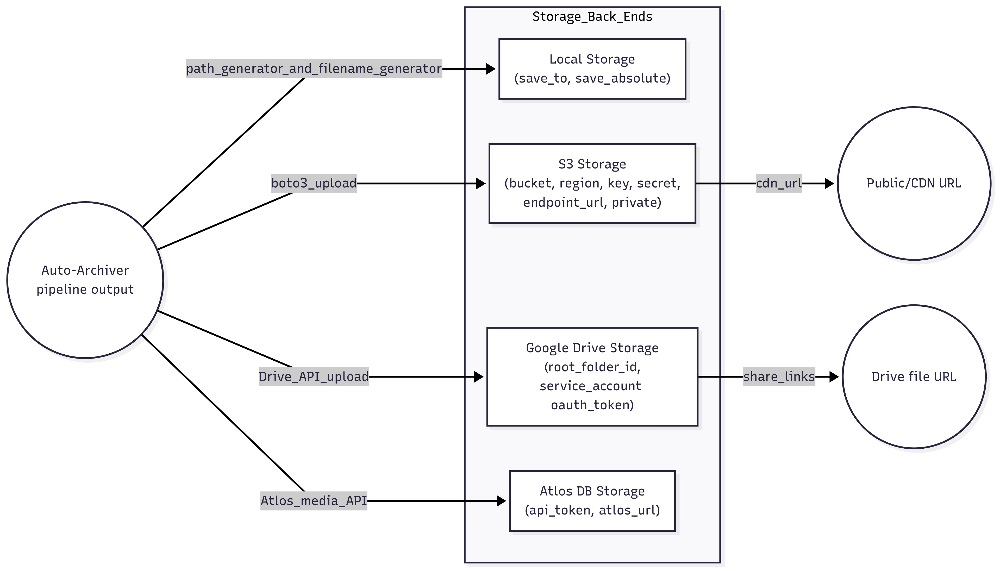

# Auto Archiver

## URL

[https://github.com/bellingcat/auto-archiver](https://github.com/bellingcat/auto-archiver)

## Description

<figure><figcaption><p>A screen grab of an Auto Archiver execution for the Tajik-Kyrgyz border conflict. <a href="https://www.bellingcat.com/resources/2022/09/22/preserve-vital-online-content-with-bellingcats-auto-archiver-tool/">Source</a>.</p></figcaption></figure>

The Auto Archiver, developed by Bellingcat, is an [open-source tool](https://github.com/bellingcat/auto-archiver) designed for journalists and researchers to archive digital content from social media platforms systematically. Users input URLs into a Google Sheets document, and the tool then archives the specified posts, videos, or images. The Auto Archiver supports multiple platforms, including Telegram, TikTok, Twitter, and VKontakte, and utilizes the Wayback Machine as a fallback for general web content. This tool has proven essential for capturing content quickly, particularly in volatile contexts where online materials are at risk of deletion, such as the ongoing Russia-Ukraine conflict.

## Why It’s an Essential Tool

The Auto Archiver’s automation, platform support, and reliance on robust, open-source archiving techniques make it indispensable. Unlike manual archiving, which can be time-consuming and inconsistent, the Auto Archiver enables rapid, reliable capture of relevant content, streamlining investigative workflows and helping journalists and researchers ensure that valuable information remains accessible. Furthermore, its open-source nature allows users to verify and adapt the tool to fit their specific needs, providing transparency and flexibility essential for responsible, ethical use.

The Auto Archiver has been actively used by Bellingcat and other open-source researchers, particularly for investigations related to major conflicts and fast-moving events where online content is at high risk of deletion.&#x20;

&#x20;Notable instances and case studies:

**Russia-Ukraine War**:[ Bellingcat has used the Auto Archiver to systematically](https://www.bellingcat.com/resources/how-tos/2022/03/08/how-to-archive-telegram-content-to-document-russias-invasion-of-ukraine/) capture social media posts, videos, and images shared by both official and individual accounts on platforms like Telegram and Twitter. During the initial stages of the invasion, many accounts posted videos and images showing military movements, damage to infrastructure, and civilian experiences. Due to the risk of these posts being deleted or censored, the Auto Archiver has been a critical tool for creating a permanent record of this content, aiding in ongoing investigations and historical documentation.

**Human Rights Investigations in Myanmar**: The tool has reportedly been used to [document social media posts related to human rights violations in Myanmar](https://osr4rightstools.org/auto-archiver), especially during the 2021 military coup. The tool enabled researchers to capture posts documenting protests, government crackdowns, and other rights abuses, many of which were at risk of being taken down by the government or by the platforms themselves under pressure.

**Tracking Misinformation and Disinformation Campaigns**: Researchers focusing on misinformation have utilized the Auto Archiver (and comparable tools like Hunchly) to [save tweets and posts involved in coordinated disinformation campaigns](https://gijn.org/resource/investigating-digital-threats-disinformation/). For example, during elections or in the context of high-profile political events, coordinated misinformation can quickly flood social media platforms, often spreading widely before accounts or posts are removed. The Auto Archiver preserves these posts, allowing analysts to later examine the strategies used in these campaigns, even if the original content is no longer publicly accessible.

**Documentation of Environmental Disasters**: In [cases of environmental crises](https://www.deezer.com/de/episode/653737531), such as the 2020 wildfires in Australia or the 2023 earthquakes in Turkey and Syria, the Auto Archiver has been used to record firsthand accounts, videos, and images shared by residents. These records serve not only as evidence for immediate response and analysis but also as historical documentation that can assist future disaster response planning and research.

## Usage of Auto-Archiver

<figure><figcaption><p>Frontend of a fresh Auto Archiver in Bellingcat's hosted version of the tool.</p></figcaption></figure>

### Self-Hosting: Step-By-Step Setup (abbreviated)

1. **Set Up Google Cloud Project**:
   * Create a Google Cloud project and enable Google Sheets and Google Drive APIs.
   * Set up a Service Account in Google Cloud, download the JSON credentials file, and share the Google Sheets file with this service account.
2. **Download and Install Requirements**:
   * Ensure **Python 3.8+** is installed on your machine.
   *   Install necessary libraries by running:

       ```bash
       bashCopy codepip install -r requirements.txt
       ```
3. **Configure Environment Variables**:
   * Create a `.env` file in the project directory.
   * Add the paths and credentials (e.g., Google Service Account JSON path, API keys for Telegram, Twitter, etc.).
4. **Set Up Additional Dependencies**:
   * Install **FFmpeg** (for media processing) and **Geckodriver** with **Firefox** for web automation.
5. **Run the Archiver**:
   *   Execute the script by running:

       ```bash
       bashCopy codepython auto_archiver.py
       ```
   * Input URLs in the designated Google Sheet, and the script will archive the content based on the platform and method specified.


To secure API keys, store them in a protected environment file (e.g., `.env`) rather than directly in the code, use environment variables to access them; avoid sharing or exposing keys in public repositories to prevent unauthorized access and ensure data integrity.


This setup covers the essentials to get the Auto Archiver running. More detailed troubleshooting and configuration options can be found in the [Bellingcat GitHub repository](https://github.com/bellingcat/auto-archiver).

## Cost

* [x] Free
* [ ] Partially Free
* [ ] Paid

## Level of difficulty

<table><thead><tr><th data-type="rating" data-max="5"></th></tr></thead><tbody><tr><td>3</td></tr></tbody></table>

## Requirements

* Google Service Account
* Python 3.8 or above
* FFmpeg
* Firefox and Geckodriver
* Telegram API keys and bot token (optional)
* Twitter API V2 bearer token (optional)
* VKontakte username and password (optional)
* Internet Archive account (optional)

## Limitations

* **Setup Complexity**: Initial configuration requires technical knowledge, including the setup of API keys and dependencies.
* **API Dependence**: Archiving capabilities depend on third-party APIs and may be subject to changes or limitations by the platforms themselves.
* **Limited Fallback for Videos**: The Wayback Machine may not capture certain dynamic video content, reducing archiving completeness for specific formats or platforms.

## Ethical Considerations

*   #### 1. **Respect Privacy and Consent**

    * **Public vs. Private Content**: Only archive content that is publicly accessible and intended for public consumption. Avoid archiving private information or content that could infringe on individual privacy rights.
    * **Sensitive Data**: Be cautious with content involving minors, vulnerable individuals, or sensitive personal information (e.g., medical or legal details) unless it’s crucial for a public-interest investigation.

    #### 2. **Ensure Content Authenticity and Accuracy**

    * **Verify Content**: Before using archived content in reporting or analysis, verify its source, context, and authenticity. Archiving should not be equated with verification—false information can also be archived.
    * **Metadata Integrity**: When possible, preserve metadata (e.g., timestamps, author information) that helps establish the content’s authenticity and timeline, especially for legal or historical documentation.

    #### 3. **Minimize Harm and Avoid Misrepresentation**

    * **Context Matters**: Always consider the context in which archived material will be used, especially if it could be misinterpreted or lead to harm. For example, posts from conflict zones can sometimes mislead if taken out of their original setting.
    * **Avoid Manipulation**: Do not alter archived material or present it in a way that could distort its original meaning or intent.

    #### 4. **Adhere to Platform Terms and Legal Constraints**

    * **Platform Guidelines**: Check each platform’s terms of service and API guidelines to ensure compliance, particularly regarding automated data collection and usage rights.
    * **Copyright and IP Rights**: Respect copyright laws when archiving content from media outlets or other protected sources. If using archived content for reporting, consider fair use, especially if involving copyrighted images or videos.

    #### 5. **Consider Legal Implications for Automated Archiving (CYA)**

    * **Legal Restrictions by Jurisdiction**: Laws on automated data collection and archiving can vary by jurisdiction, particularly around content created by individuals. Be informed about local laws regarding data retention and use.
    * **Avoid Creating Digital Evidence Trails**: Where archiving could implicate individuals or groups (e.g., in authoritarian settings), use caution to avoid creating records that could endanger the sources or individuals involved.

## Guides and articles

Ramalho, M. (2022, September 22). _**Preserve Vital Online Content With Bellingcat’s Auto Archiver**_**. Bellingcat.** [https://www.bellingcat.com/resources/2022/09/22/preserve-vital-online-content-with-bellingcats-auto-archiver-tool/](https://www.bellingcat.com/resources/2022/09/22/preserve-vital-online-content-with-bellingcats-auto-archiver-tool/)

_**Bellingcat/auto-archiver**_**.** (2024). \[Python]. Bellingcat. [https://github.com/bellingcat/auto-archiver](https://github.com/bellingcat/auto-archiver) (Original work published 2021)

## Tool provider

Bellingcat

## Advertising Trackers

* [ ] This tool has not been checked for advertising trackers yet.
* [ ] This tool uses tracking cookies. Use with caution.
* [x] This tool does not appear to use tracking cookies. (But google does, so... small caveat there)

| Page maintainer |
| --------------- |
| Martin Sona     |
|                 |
