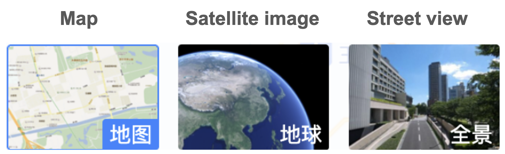
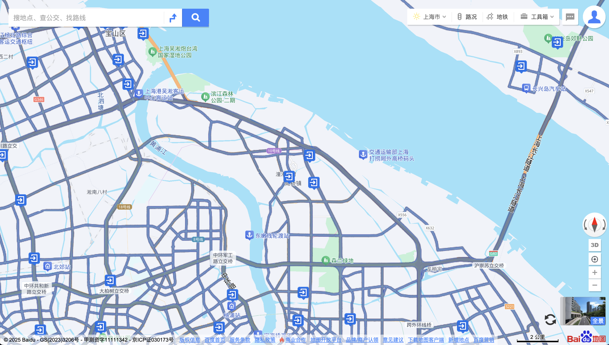
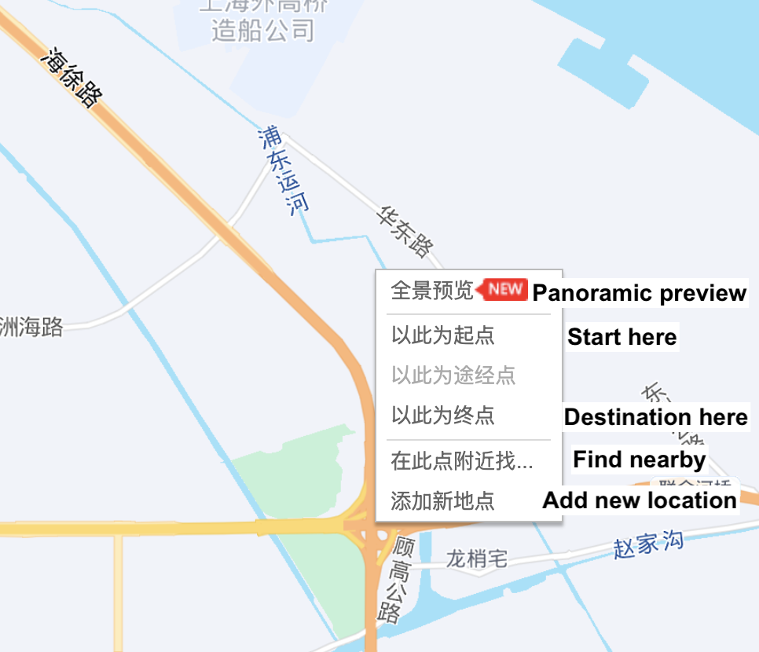

# Baidu Maps

## URL

Main page, [http://map.baidu.com/](http://map.baidu.com/)

API documentation, [https://api.map.baidu.com/](https://api.map.baidu.com/)

## Description

Baidu Maps offers maps, street view, satellite imagery, and real-time route planning. It is available via the web browser or as a mobile application.

#### The basics

In the web version, search for a location. To select layers, point your cursor to the bottom-right corner and 3 options will appear (i.e., default map view, satellite image, or street view). Select the layer you wish to explore.

<figure><figcaption>
For example, a search for Shanghai's Waigaoqiao (a port and commercial district) will show this view in the web browser.
</figcaption></figure>

<figure><figcaption>
Navigation to the regular map, satellite image and street view, found at the bottom right corner of the web browser
</figcaption></figure>

Note that the reference number at the bottom left, e.g., "GS(2023)1234", refers to the year when the image was approved for publication by the relevant government authority, China's State Bureau of Surveying and Mapping. This is not necessarily the year when the image was captured.

**Street view**

Street views are generally available on the road networks, indicated by the thickened routes. For a static preview, place the cursor onto the route. Click to enter street view mode.

<figure><figcaption>
The thickened gray routes indicate that street view is available.
</figcaption></figure>

Panoramic preview for street view

See above: From the regular map view, point to the main road, right-click to show a shortcut menu > select the first item which means "panoramic preview" in English.&#x20;

See below: The 360º preview is shown.

**Time machine 时光机**

The "time machine" function allows you to access older street view images, going as far back as 2013 (if available). From the current street view image, the time machine function is available at the bottom, indicated by a clock icon.

<figure><figcaption>
The "time machine" will show older street view images available (year and month of image captured). The approval reference is in the bottom right corner.
</figcaption></figure>

**The Enigma of Coordinates in China**

Most of the world uses the coordinate system [WGS-84](https://en.wikipedia.org/wiki/World_Geodetic_System) (colloquially known as Earth coordinates), whereas China uses [GCJ-02](https://en.wikipedia.org/wiki/Restrictions_on_geographic_data_in_China#GCJ-02) (Mars coordinates). GCJ-02 uses an encryption algorithm that applies random offsets to the latitude and longitude of locations. Obfuscating the geographic data is for [national security purposes](https://en.wikipedia.org/wiki/Restrictions_on_geographic_data_in_China).

Baidu Maps goes even further in its BD-09 coordinates system, applying additional encryption based on GCJ-02.

**Where to get the coordinates in Baidu Maps**

When searching for a location on Baidu Maps, the BD-09 coordinates are shown in the URL.

Another way to search is: [https://api.map.baidu.com/lbsapi/getpoint/](./#url). Search for a location and the BD-09 coordinates are shown in the top-right. **Note that in Chinese mapping tools, longitude comes before latitude**.

<figure><figcaption>
Example: From the Baidu Maps API getpoint page, the coordinates will show on the top-right when searching for Dafen Village, Shenzhen
</figcaption></figure>

To search by coordinates instead, enter the coordinates (longitude first) and check the box for reverse search using coordinates.

**3D models**

A 3D view is available. Baidu Maps also offers an API for building third-party apps that leverage 3D models and live data: [https://lbs.baidu.com/solutions/threedsvisualization](https://lbs.baidu.com/solutions/threedsvisualization)

### Similar tools

Open-source researchers can cross-reference with other leading mapping services, including AMap (Gaode Maps) and Tencent Map (QQ Maps).

For open-source researchers accessing Chinese map tools from overseas, Baidu Maps is the only tool that provides street view on the web browser. (Street view is not available on AMap, and is only available in Tencent Map's mobile version.)

Note that all three mapping tools use (at least in part) the BeiDou Navigation Satellite System 北斗卫星导航系统 for their satellite and positioning capabilities. BeiDou is the global positioning and satellite technology developed by China, and [competes with GPS and Galileo](https://www.gpsworld.com/chinas-beidou-challenges-u-s-gps-dominance/). The exact ways that BeiDou is leveraged depends on the device, the chip, and the location where the mapping tool is used. &#x20;

Another tool to compare satellite imagery of China is [https://www.earthol.com/](https://www.earthol.com/)

<figure><figcaption>
Main page, Earthol.com. The English annotations are added.
</figcaption></figure>

## Cost

* [x] Free
* [ ] Partially Free
* [ ] Paid

(Developer API use may be charged)

## Level of difficulty

<table><thead><tr><th data-type="rating" data-max="5"></th></tr></thead><tbody><tr><td>1</td></tr></tbody></table>

## Requirements

* **Web**: any modern web browser
* **Mobile**: iOS and Android (basic functionality is available without registering an account)
* **Developer Platform**_:_ email address and account registration

## Limitations

Researchers and developers should consider several limitations:

* **Geographical Restrictions**: The most detailed coverage is limited to China. Little to no data is available for other countries.
* **Language Barrier**: The user interface is only available in Chinese.
* **Access Speed**: International users will experience slower access speeds.&#x20;
* **Barriers accessing the API**: Non-Chinese individuals may have difficulty registering a Baidu developer account, preventing them from using Baidu's location-based services APIs. For individual developer accounts, only Chinese individuals are allowed. Company developer accounts can be opened by overseas companies.&#x20;

## Ethical Considerations

* See the Bellingcat toolkit's [About Maps and Satellites](https://bellingcat.gitbook.io/toolkit/more/all-tools/about-maps-and-satellites) page for some general caveats when working with maps and satellite imagery including censorship and content control.
* **Privacy Concerns**: Like many mapping services, Baidu Maps gathers user data, raising concerns about user privacy. (Concerns about Baidu Maps' collection of user data were raised in a [2016 report from Citizen Lab, University of Toronto](https://citizenlab.ca/2016/02/privacy-security-issues-baidu-browser/) and in an [April 2021 notice from the Cyberspace Administration of China](https://www.cac.gov.cn/2021-04/30/c_1621370239178608.htm), which named all leading Chinese mapping tools among 33 apps for extensively collecting user data, beyond what is relevant to their service provision.)

## Guide

**Tutorials**

* _Baidu Maps (Baidu Ditu 百度地图) And Tutorials in English_ (no date) _BaiduinEnglish_. [https://www.baiduinenglish.com](https://www.baiduinenglish.com)
* Extracting Chinese geographic data from Baidu Map API. (December 2020) [https://journals.sagepub.com/doi/full/10.1177/1536867X20976313](https://journals.sagepub.com/doi/full/10.1177/1536867X20976313)
* Cross-platform complementarity: Assessing the data quality and availability of Google Street View and Baidu Street View (Feburary 2025). [https://doi.org/10.1177/27541231241311474](https://doi.org/10.1177/27541231241311474)

**Video Tutorial**

* _Baidu Maps : The Chinese Google Maps_ (2023). Available at: [https://www.youtube.com/watch?v=hKVUOgoDUxs](https://www.youtube.com/watch?v=hKVUOgoDUxs) (French with English transcription).

**Articles**

* How China is tearing down Islam. Financial Times. (November 2023) [https://ig.ft.com/china-mosques/](https://ig.ft.com/china-mosques/)
* Interrogating China’s “Google Maps” to Investigate the Xinjiang Detention Centers. March 2021. Global Investigative Journalism Network. [https://gijn.org/stories/interrogating-chinas-google-maps-to-investigate-the-xinjiang-detention-centers/](https://gijn.org/stories/interrogating-chinas-google-maps-to-investigate-the-xinjiang-detention-centers/)
* Baidu found China’s “ghost cities,” but it is keeping their locations mostly a secret (2015). Quartz. [https://web.archive.org/web/20151105031544/http://qz.com/540571/baidu-found-chinas-ghost-cities-but-it-is-keeping-their-locations-mostly-a-secret/](./#url)

## Tool provider

Baidu Inc [http://www.baidu.com/](http://www.baidu.com/) - China

## Advertising Trackers

* [x] This tool has not been checked for advertising trackers yet.
* [ ] This tool uses tracking cookies. Use with caution.
* [ ] This tool does not appear to use tracking cookies.

| Page maintainer           |
| ------------------------- |
| Bellingcat Volunteer Team |
|                           |
