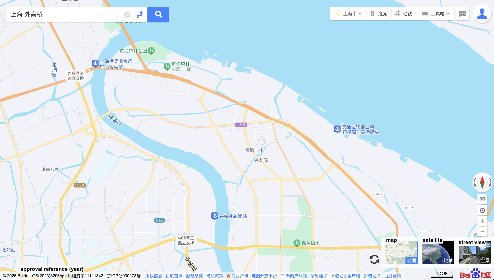

# Baidu Maps

## URL

Main page, http://map.baidu.com/&#x20;

API documentation, https://api.map.baidu.com/

## Description

Baidu Maps offers maps, street view, satellite imagery, and real-time route planning. It is available via the web browser or as a mobile application.&#x20;

#### The Basics

Go to http://map.baidu.com/ and enter the Chinese term of what you are searching for. For example, here's a search for Shanghai's Waigaoqiao, a container port and free trade zone.&#x20;

<figure><figcaption>
Map result when searching for "Shanghai Waigaoqiao". English annotations added. (Retrieved March 2025)
</figcaption></figure>

Click on the rectangles to see the satellite image or the activate the street view.&#x20;

Note that the map (or satellite image) shows a reference number at the bottom left, e.g., GS(2023)3206. The year refers to the year when the image was approved for publication by the government authority (State Bureau of Surveying and Mapping) — this is not necessarily the same year when the image was captured.&#x20;

Street view

Street views are usually available for roads as navigation for drivers and public transportation is a main use case for general app users. You'll find that street views usually are not available for areas that cannot be accessed by vehicles, e.g., parks or residential compounds.

Click on the rectangle for street view (right-hand-side). Availability is indicated by the greyish routes. Place your cursor onto these routes, click to go into street view mode.&#x20;

<figure><figcaption>
Put your cursor onto the grey route, and a static preview will be shown. 
</figcaption></figure>

Shortcuts for previewing street view - may be helpful when searching large areas during geolocation

(format into left image) Alternatively, from the regular map view, point to the main road and right-click to show a shortcut menu > select the first item  "panoramic preview".&#x20;

(re-format into right image) The preview is shown on the map

**Time machine 时光机**

You can access previous street view images, going as far back as 2013, using the "time machine" function. Go into the current street view image, and the "time machine" function is available at the bottom, indicated by a clock icon.

<figure><figcaption>
The "time machine" will show older street view images available (year and month of image captured). The approval reference is in the bottom right corner.
</figcaption></figure>

**The enigma of coordinates in China**

Most of the world uses the coordinate system WGS-84 (colloquially known as Earth coordinates), whereas China uses GCJ-02 (Mars coordinates). GCJ-02 uses an encryption algorithm that applies random offsets to the latitude and longitude of locations. Obfuscating the geographic data is for [national security purposes](https://en.wikipedia.org/wiki/Restrictions_on_geographic_data_in_China). &#x20;

Baidu Maps goes even further to apply additional encryption based on GCJ-02, and created its own DD-09 coordinates system.&#x20;

(When Google Maps shows China, the map is also in GCJ-02.)&#x20;

**In Baidu Maps, where to get the coordinates**

If you search a location on Baidu Maps, you'll see the BB-09 coordinates shown in the URL.&#x20;

Another way to search is to go to: https://api.map.baidu.com/lbsapi/getpoint/. Here's an example searching for Dafen Village, the artists' village well-known for producing oil painting replicas. When you search for Dafen Village, the BB-09 coordinates are shown in the top-right: 114.14265, 22.615801. Note that in Chinese map tools, the longitude is listed before latitude.&#x20;

<figure><figcaption></figcaption></figure>

To search by coordinates, enter the coordinates (longitude first) and check the box for reverse search using coordinates.&#x20;

### Similar tools

Cross-reference the other leading mapping services AMap (also known as Gaode Maps) and Tencent Map (also known as QQ Maps).&#x20;

Although all 3 mapping services rely on China's BeiDou Navigation Satellite System (citation) for their real-time navigation and satellite imagery, their user experience designs are different. Recommended navigation routes, the availability of street views, indoor maps, and 3D maps will also differ.&#x20;

To quickly compare satellite imagery from different services, this can be a handy tool: [https://www.earthol.com/](https://www.earthol.com/)

<figure><figcaption>
Main page, Earthol.com. The English annotations are added.
</figcaption></figure>

## Cost

* [x] Free
* [ ] Partially Free
* [ ] Paid

(Developer API use may be charged)

## Level of difficulty

<table><thead><tr><th data-type="rating" data-max="5"></th></tr></thead><tbody><tr><td>1</td></tr></tbody></table>

## Requirements

* **Web**: any modern web browser
* **Mobile**: iOS and Android (basic functionality is available without registering an account)
* **Developer Platform**_:_ email address.

## Limitations

Researchers and developers should consider several limitations:

* **Geographical Restrictions**: The most detailed coverage is limited to China. Less detailed data available for other countries.&#x20;
* **Language Barrier**
* **Access Speed**: International users will experience slower access speeds or need a Chinese IP address to access certain APIs.&#x20;
* **API Rate Limits**

## Ethical Considerations

* **Note the caveats detailed in the Bellingcat tool map guide, including censorship and content control**
* **Privacy Concerns**: Like many mapping services, Baidu Maps gathers user data, raising concerns about user privacy. ([2016 report from Citizen Lab, University of Toronto](https://citizenlab.ca/2016/02/privacy-security-issues-baidu-browser/); in April 2021, the Cyberspace Administration of China named all 3 of the Chinese mapping services among 33 apps for extensively collecting user data, going beyond what is relevant to their service provision. Original government notice - in Chinese, archived [https://web.archive.org/web/20250307015057/https://www.cac.gov.cn/2021-04/30/c\_1621370239178608.htm](https://web.archive.org/web/20250307015057/https://www.cac.gov.cn/2021-04/30/c_1621370239178608.htm))

## Guide

**Tutorials and Articles**

* _Baidu Maps (Baidu Ditu 百度地图) And Tutorials in English_ (no date) _BaiduinEnglish_. Available at: [https://www.baiduinenglish.com](https://www.baiduinenglish.com) (Accessed: 18 April 2024).
* _How can the language in Baidu be changed for Baidu Maps?_ (no date). Available at: [https://poe.com/p/How-can-the-language-in-Baidu-be-changed-for-Baidu-Maps](./#url) (Accessed: 18 April 2024).

**Video Tutorials**

* _Baidu Maps : The Chinese Google Maps_ (2023). Available at: [https://www.youtube.com/watch?v=hKVUOgoDUxs](https://www.youtube.com/watch?v=hKVUOgoDUxs) (Accessed: 18 April 2024). (French with English transcription).

## Tool provider

Baidu Inc [http://www.baidu.com/](http://www.baidu.com/) - China

## Advertising Trackers

* [x] This tool has not been checked for advertising trackers yet.
* [ ] This tool uses tracking cookies. Use with caution.
* [ ] This tool does not appear to use tracking cookies.

| Page maintainer                      |
| ------------------------------------ |
| Bellingcat Volunteer Team/Unassigned |
|                                      |
