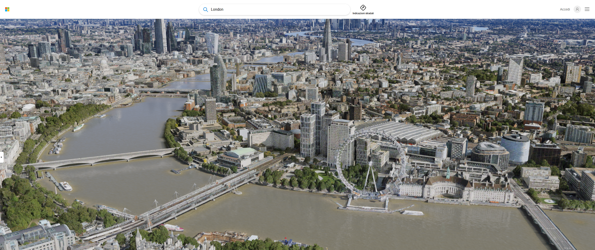

# Bing Maps

## URL

[https://www.bing.com/maps/](https://www.bing.com/maps/)

## Description

Bing Maps is a web mapping service provided by Microsoft. It gives users access to detailed maps and satellite imagery, serving various purposes for geographical research, including open source investigations. The imagery includes samples taken by satellite sensors, 3D city models and terrain.&#x20;

**Features:**

* Adress and place search: Search for a specific location in the map.&#x20;

<figure><figcaption>
Screenshot of search results for Amsterdam.
</figcaption></figure>

* 3D view: Explore locations in 3D, offering a more spatial perspective of buildings and terrain compared to the flat map view. In particular Bing Map 3D view is notably light and fast to load, while still offering good visual quality, even in dense urban areas. Useful for researchers who need to inspect multiple locations in detail.&#x20;

<figure><figcaption>
Screenshot of search results for London (3D view)
</figcaption></figure>

Multiple language support: The interface and search results are available in multiple languages.&#x20;

**Developer Features:**&#x20;

Bing Maps also provides a set of features aimed at developers building their own applications on top of the platform, rather than end users browsing the site directly:

* Custom data overlays: The ability to overlay custom data points and layers with different visual themes, accessible through the Bing Maps API.&#x20;
* Building level geocoding: Geocoding precise to the building level for more than 70 million addresses in the United States.&#x20;
* Developer support and APIs: A set of APIs and developer support options that allow building custom applications on top of Bing Maps data.&#x20;

Bing Maps is available in the following formats:

* Web
* Mobile
* Developer API

## Use Cases

Bing Maps can be a valuable tool for open source researchers in various ways, such as:

* **Geolocation Verification:** Verifying the location of a photo or video shared on social media to confirm the authenticity of claims made online.
* **Investigative Reporting:** Tracking and mapping out relevant locations to a story, thereby providing readers with a clearer understanding of the spatial relationships and geographical details of the investigation. One issue to remember is that Bing map imagery may not be up to date see [How often are Bing satellite Maps updated?](https://www.studycountry.com/wiki/how-often-are-bing-satellite-maps-updated) for more information.
* **Historical Analysis:** Comparing current maps with historical data to highlight changes over time in areas of interest, which can add depth to stories on urban development, environmental changes, or socio-economic shift.
* **Infrastructure Analysis:** Analyzing satellite images and 3D maps of critical infrastructure for changes or developments that might indicate political, military, or economic events.
* **Environmental Monitoring:** Monitoring changes in landscapes, forest cover, water bodies, etc., to report on environmental issues or natural disasters.
* **Gathering Geopolitical Intelligence:** Mapping conflict zones, territorial control changes, or military movements using updated satellite imagery to understand geopolitical dynamics.

## Cost

* [ ] Free
* [x] Partially Free
* [ ] Paid

Developer API may incur costs depending on usage (see: [https://www.microsoft.com/en-us/maps/bing-maps/licensing](https://azure.microsoft.com/en-us/pricing/details/api-management/))..

## Level of difficulty

<table><thead><tr><th data-type="rating" data-max="5"></th></tr></thead><tbody><tr><td>1</td></tr></tbody></table>

## Requirements

* **Web:** any modern web browser
* **Mobile**: iOS and Android
* **Developer Platform:** Azure account with email address and a credit card.

## Limitations

* **Licensing and Cost**: Bing Maps API incurs costs for extensive usage beyond the provided free usage quotas, which might not be suitable for projects with limited budgets (see: [https://www.microsoft.com/en-us/maps/bing-maps/licensing](https://azure.microsoft.com/en-us/pricing/details/api-management/)).
* **Data Coverage**: While comprehensive, Bing Maps has less detailed mapping data in certain remote or less-populated regions compared to other services such as Google Maps.
* **Developer API Limits**: There are daily rate limits on API calls, which may impact large-scale applications or services requiring high numbers of requests (see: [https://www.microsoft.com/en-us/maps/bing-maps/product/](https://www.microsoft.com/en-us/maps/bing-maps/product/)).
* **Update Frequency**: The frequency of map updates for certain areas may not be as regular as some users require, potentially affecting the accuracy of the maps. See [How often are Bing satellite Maps ?](https://www.studycountry.com/wiki/how-often-are-bing-satellite-maps-updated) for more information.
* **Feature Set**: Although Bing Maps offers a wide range of functionalities, it lacks features found in other mapping services, such as the more advanced analytical tools and detailed terrain information found in [Google Earth Pro](https://bellingcat.gitbook.io/toolkit/more/all-tools/google-earth-pro).
* **Bird Eye and Streetside View:** As of January 2026, Bing Maps Bird’s Eye View and Streetside View are no longer available.

## Ethical Considerations

When open source researchers use Bing Maps, they should consider the following ethical aspects:

* **Privacy and Anonymity**: Be cautious when reporting on sensitive areas or topics. Ensure individuals' locations or movements are not disclosed without consent, especially in contexts where revealing locations could endanger lives or privacy.
* **Data Accuracy and Misrepresentation**: Verify the accuracy of the information provided by Bing Maps. Misrepresenting a location, either intentionally or accidentally due to outdated or incorrect map data, can lead to misinformation and harm reputations. For more information see [Google Earth, Google satellite, and Bing aerial accuracy](https://gis.stackexchange.com/questions/86734/google-earth-google-satellite-and-bing-aerial-accuracy).
* **Impartiality and Bias**: Understand the limitations of Bing Maps in representing disputed territories or areas of conflict. Be aware of how the depiction of these areas might convey a particular political stance or bias, affecting the impartiality of the reportage. Examples of this can be seen in [border bias](https://www.washingtonpost.com/technology/2020/02/14/google-maps-political-borders/) and [local 'safety' bias](https://www.newstatesman.com/spotlight/tech-regulation/emerging-technologies/2022/08/mapping-navigational-apps-gis-safety-bias-google-maps).

## Guide

To effectively use Bing Maps, especially for beginners or those looking to refine their skills, the following resources are highly recommended:

**Official Wiki**

* **No official wiki** (but the Bing Maps Blog is available here: [https://blogs.bing.com/maps/](https://blogs.bing.com/maps/))
* **Unofficial GIS Wiki:** [http://wiki.gis.com/wiki/index.php/Bing\_Maps](http://wiki.gis.com/wiki/index.php/Bing_Maps)

**Tutorials and Articles**

* Hanham, M. (2015) _There’s a Map for That_, _bellingcat_. Available at: [https://www.bellingcat.com/resources/how-tos/2015/04/10/theres-a-map-for-that/](https://www.bellingcat.com/resources/how-tos/2015/04/10/theres-a-map-for-that/) (Accessed: 30 June 2026).
* Khachatryan, N. (2019) _The Mysterious Disappearance of Jeannette Island (on Google Maps)_, _bellingcat_. Available at: [https://www.bellingcat.com/news/rest-of-world/2019/01/09/the-mysterious-disappearance-of-jeannette-island-on-google-maps/](https://www.bellingcat.com/news/rest-of-world/2019/01/09/the-mysterious-disappearance-of-jeannette-island-on-google-maps/) (Accessed: 30 June 2026).

**Video Tutorials**

* _How to use Bing Maps for Routing Multiple Addresses_ (2021). Available at: [https://www.youtube.com/watch?v=btCzoDX9WmI](https://www.youtube.com/watch?v=btCzoDX9WmI) (Accessed: 30 June 2026).

#### Developer Resources

* **Developing with Bing Maps:** Discover how to integrate Bing Maps into your applications with [developer resources](https://docs.microsoft.com/en-us/bingmaps/).

**Community and Support**

* **Community Forum:** [https://answers.microsoft.com/en-us/bing/forum/bing\_maps](https://answers.microsoft.com/en-us/bing/forum/bing_maps)

## Tool provider

Microsoft [https://www.microsoft.com](https://www.microsoft.com) - United States

## Advertising Trackers

* [x] This tool has not been checked for advertising trackers yet.
* [ ] This tool uses tracking cookies. Use with caution.
* [ ] This tool does not appear to use tracking cookies.

| Page maintainer    |
| ------------------ |
| Riccardo Giannardi |
|                    |
