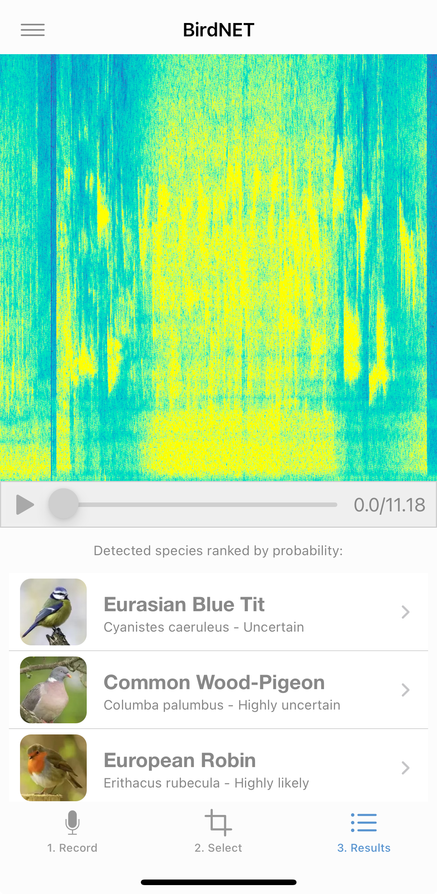

# BirdNet

## URL

[https://birdnet.cornell.edu/map](https://birdnet.cornell.edu/map)

[https://birdnet.cornell.edu/app/](https://birdnet.cornell.edu/app/)&#x20;

## Description

BirdNET is a machine-learning bird sound identification project that can help users identify bird species from audio recordings and view recent anonymised bird sound detections on a global map.\
\
The main public map, [BirdNET LiveMap](https://birdnet.cornell.edu/api2/live), displays anonymised BirdNET observations from around the world. It shows recent detections, species names, total observations, observations in the last 24 hours, hourly activity, and the most frequently observed species in different regions. It is useful for getting a quick view of where BirdNET users are detecting bird sounds, but it should not be treated as a complete representative biodiversity dataset.

BirdNET can be useful in two main ways.

The LiveMap can provide environmental context by showing recent bird sound detections in different parts of the world.

The BirdNET browser demo and mobile apps help identify bird calls captured in video or audio recordings, especially for narrowing down the regions of the world in which those recordings could have been taken. This can support geolocation or chronolocation work by suggesting whether a recording is consistent with a particular region, habitat, or season.

The newer BirdNET Live mobile app is designed for continuous real-time identification and can run on devices without an internet connection.

<figure><figcaption>
The LiveMap also displays the total number of observations, the number of observations in the last 24 hours, the number of species identified, the number of users in the last 24 hours and other details.
</figcaption></figure>

<figure><figcaption>
The BirdNET mobile app allows you to record audio, select a clip, and it will analyse the recorded bird sounds, displaying the detected species ranked by probability
</figcaption></figure>

## Cost

* [x] Free
* [ ] Partially Free
* [ ] Paid

## Level of difficulty

<table><thead><tr><th data-type="rating" data-max="5"></th></tr></thead><tbody><tr><td>1</td></tr></tbody></table>

## Requirements

The LiveMap is free to use with no sign up requirements.

Similarly, the associated BirdNet app has no sign up requirements and allows for recording and identification of bird species. It also provides a checklist of birds in the user's location and predicts those likely to occur depending on the time of year.

## Limitations

The location data provided is on the basis of user input which might not always be accurate. The map also does not provide exact coordinates so detections are shown only approximately.

Some regions or areas are only sparsely covered due to low numbers of users.

Accuracy of identification may vary depending on the sound quality of the recording provided.

Detailed metadata and raw audio are not available making it difficult to conduct a detailed analysis.

BirdNET results are not definitive identifications. High-confidence results can still be wrong, especially when recordings are noisy, short, compressed, distorted, distant, or contain overlapping bird sounds.

## Ethical Considerations

The LiveMap collects user data for 15 days including user devices inputting data via the app and stores this data for research purposes. The data collected includes the IP address, identification of the browser and potentially the operating system, the website referrer URL and the date and time.

After 15 days it anonymizes the IP address. Users may submit a [written request](https://birdnet.cornell.edu/privacy/) to receive information on the data collected.

Do not upload or submit audio that may contain private conversations, sensitive personal information, or material you do not have permission to share.&#x20;

Do not treat BirdNET identifications as forensic proof.

## Guide

[What is BirdNet?](https://www.birds.cornell.edu/ccb/birdnet/)

A [repository of use cases](https://birdnet-team.github.io/BirdNET-Analyzer/projects.html) based on the LiveMap

BirdNET Live app [user guide](https://birdnet-team.github.io/birdnet-live-app/user/)

BirdNET [browser demo](https://birdnet.cornell.edu/demo/)

## Tool provider

Developed by BirdNET, a collaboration between the K. Lisa Yang Center for Conservation Bioacoustics at the Cornell Lab of Ornithology in the United States and Chemnitz University of Technology in Germany.

## Similar Tools

[Merlin](https://bellingcat.gitbook.io/toolkit/more/all-tools/merlin) allows identification of birds similarly through sound recordings like the BirdNet app but also [visually](https://merlin.allaboutbirds.org/) through photo identification.

Merlin has greater geographical reach and covers USA, Canada, Europe and some commonly found species in Central and South America, and India.

Both BirdNet and Merlin are developed by Cornell Lab.

## Advertising Trackers

* [ ] This tool has not been checked for advertising trackers yet.
* [ ] This tool uses tracking cookies. Use with caution.
* [x] This tool does not appear to use tracking cookies.

| Page maintainer                                               |
| ------------------------------------------------------------- |
| Bellingcat Volunteer Team. Updated by Piya Garg in June 2026. |
|                                                               |
