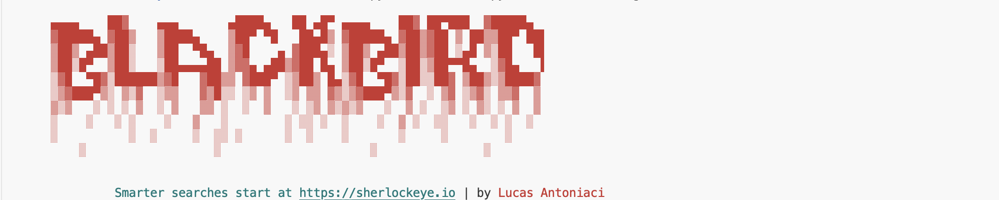
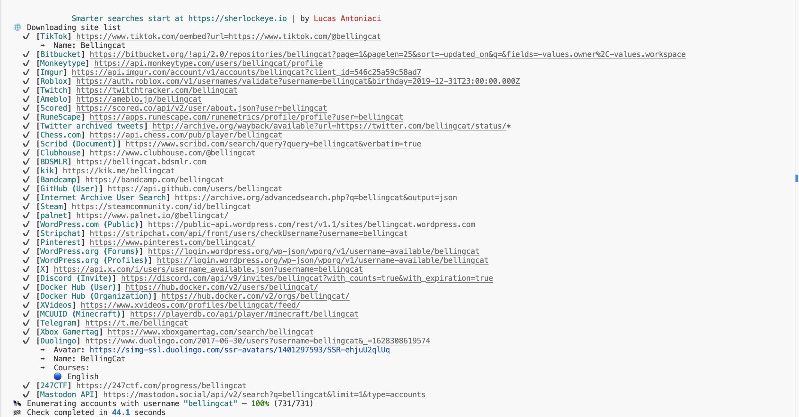

# Blackbird

## URL

[https://github.com/p1ngul1n0/blackbird](https://github.com/p1ngul1n0/blackbird)\
(last update Aug 2025, as of 31. January 2026)

## Description

Blackbird is a Python command-line tool that searches for accounts associated with a given username or email address across social networks and websites.

For username searches, the tool is integrated with the [WhatsMyName](https://github.com/WebBreacher/WhatsMyName) project, which maintains a database of 600+ sites for accurate reverse username lookups. The data sources maintained by the WhatsMyName team can be found [here](https://github.com/WebBreacher/WhatsMyName/blob/main/wmn-data.json).

<figure><figcaption><p>Blackbird's logo, displayed in the terminal upon launching the tool</p></figcaption></figure>


For email address searches, it queries the servers of websites in the WhatsMyName database to check whether an account exists for a given address. When a valid account is found, a direct URL to the user's profile is returned.

Beyond simply listing matched accounts, the tool automatically extracts publicly available metadata from discovered profiles — such as names, locations, and profile images — and supports exporting results in PDF, CSV, or HTTP response formats for further analysis.

Like other username enumeration tools such as [Sherlock](https://bellingcat.gitbook.io/toolkit/more/all-tools/sherlock), it checks usernames against its own distinct collection of sources, meaning results for the same username will differ between tools. It provides broader coverage of NSFW and alternative social media platforms, including Gab and Truth Social, while Sherlock tends to surface stronger results on mainstream social networks that are currently or were previously popular, such as LinkedIn, ICQ, 9Gag, and Letterboxd.

<figure><figcaption><p>Blackbird's results for the username "bellingcat", showing 731 sites cheked in 44.1 seconds, with matched accounts found on platforms including Tiktok, GitHub and Twitch. </p></figcaption></figure>

A built-in AI analysis feature interprets discovered profiles to generate behavioural and technical summaries. This is available free of charge within daily usage limits, and according to the tool's documentation, no personal data is shared with the API.

The rate of false positives and invalid results is generally low. Because it surfaces unique results compared to similar tools, using it in conjunction with other username and email search tools is recommended to achieve the widest possible coverage.


## Cost

* [x] Free
* [ ] Partially Free
* [ ] Paid

## Level of difficulty

<table><thead><tr><th data-type="rating" data-max="5"></th></tr></thead><tbody><tr><td>3</td></tr></tbody></table>

## Requirements

* Python3
* Basic familiarity with the command line, as the tool is operated entirely through a terminal.

## Limitations & Ethical Considerations

In terms of username investigations, the tool may miss valid results from various sources that can be surfaced with other tools like [Sherlock](https://bellingcat.gitbook.io/toolkit/more/all-tools/sherlock).

## Guide

* Installation and simple usage: [https://github.com/p1ngul1n0/blackbird](https://github.com/p1ngul1n0/blackbird)
* Full documentation, with advanced use cases: [https://p1ngul1n0.gitbook.io/blackbird](https://p1ngul1n0.gitbook.io/blackbird)


## Installation

Clone the repository and navigate into the project folder:

```
git clone https://github.com/p1ngul1n0/blackbird
cd blackbird
```

Install the required dependencies:

```
pip install -r requirements.txt
```

> **Note:** If you are using Python 3, you may need to use `pip3` instead of `pip`. See the Pro Tips section for details.


## Usage And Pro tips

You can search for multiple usernames or email addresses in a single command by listing them together:

```
python blackbird.py --username bellingcat username2 username3
```

Alternatively, if you have a long list, pass a text file directly:

```
python blackbird.py --username-file usernames.txt
python blackbird.py --email-file emails.txt
```

Results can be exported in multiple formats using dedicated flags:

```
python blackbird.py --username bellingcat --pdf
python blackbird.py --username bellingcat --csv
python blackbird.py --username bellingcat --json
```

To route all requests through a proxy, for example for anonymity or to bypass regional restrictions:

```
python blackbird.py --username bellingcat --proxy "http://myproxy:9090"
```

Advanced queries can be built using built-in categories, boolean operators, and substring matches on source names. To search for all accounts with a given username on sites categorised as "social":

```
python blackbird.py --filter "cat=social" --username bellingcat
```

The tool includes a built-in AI analysis feature that generates behavioural summaries based on the platforms where a username or email is found. To enable it, first generate a local API key:

```
python blackbird.py --setup-ai
```

Then run a search with the `--ai` flag:

```
python blackbird.py --username bellingcat --ai
```

AI-generated summaries are also included in exported PDF reports. Usage is free but subject to a daily quota. Importantly, only the names of the discovered sites are sent to the API — no personal data or profile content is transmitted.


## Similar Tools

Blackbird sits in the middle ground between quick, browser-based username checkers and deeper enumeration tools that extract extensive metadata. Its strength lies in alternative and NSFW platform coverage through its WhatsMyName integration, but investigators will often need to combine it with other tools to cover mainstream social networks and extract richer profile data.

* [**Namechk**](https://bellingcat.gitbook.io/toolkit/more/all-tools/namechk)
* [**WhatsMyName**](https://bellingcat.gitbook.io/toolkit/more/all-tools/whats-my-name)
* [**Maigret**](https://bellingcat.gitbook.io/toolkit/more/all-tools/maigret)
* [**Sherlock**](https://bellingcat.gitbook.io/toolkit/more/all-tools/sherlock)
* [**Skopenow**](https://bellingcat.gitbook.io/toolkit/more/all-tools/skopenow)

## Tool provider

Original developer is [Lucas Antoniaci](https://www.linkedin.com/in/lucas-antoniaci/).

## Advertising Trackers

* [x] This tool has not been checked for advertising trackers yet.
* [ ] This tool uses tracking cookies. Use with caution.
* [ ] This tool does not appear to use tracking cookies.


| Paige Maintainer           |
| -------------------------- |
| tsvetelina and Martin Sona |
