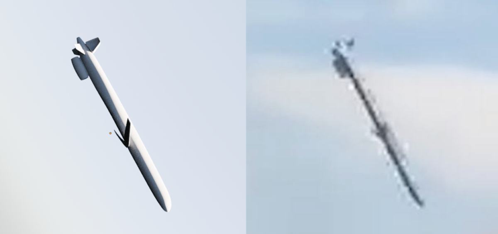

# Blender

## URL

[https://www.blender.org/](https://www.blender.org/)

## Description

Blender is a tool for 3D creation, designed to support a wide range of tasks from modeling and animation to rendering and video editing. It is developed as an open-source project, making it entirely free to use for both personal and commercial purposes. The software is well-suited for artists, animators, and designers looking to create detailed 3D models, engaging animations, and realistic visual effects. One of the key features of Blender is its ability to support the entire 3D pipeline, simplifying the workflow for users by providing a single platform for all 3D creation needs. It has a role in open source investigations as a tool for visualising, simulating and geospatial analysis.

The image below shows a Blender model on the left used in Bellingcat's [_Russian Missile Identified in Kyiv Children’s Hospital Attack_ investigation](https://www.bellingcat.com/news/2024/07/09/russian-missile-identified-in-kyiv-childrens-hospital-attack/).

<figure><figcaption>
Image from <em>Russian Missile Identified in</em><a href="https://www.bellingcat.com/news/2024/07/09/russian-missile-identified-in-kyiv-childrens-hospital-attack/"> <em>Kyiv Children’s Hospital Attack</em></a>
</figcaption></figure>

### Use Cases

Blender, while primarily seen as a tool for 3D modeling and animation, can indirectly support open source research activities in several ways:

* **Visualizations**: Create detailed 3D visualizations of geographical locations, buildings, or items based on data gathered during Open source investigations. This can help in understanding the spatial characteristics of an area or object.
* **Simulations**: Simulate scenarios based on open source research data, such as the movement of people or vehicles. This can be useful for understanding incidents.
* **Information Presentations**: Use Blender's video editing capabilities to produce presentations or reports that incorporate 3D models and simulations based on gathered intelligence.
* **Geospatial Analysis**: Though not a direct application, 3D models created in Blender can be used alongside geospatial analysis tools to enhance the understanding of terrain and other geographical data.

## Cost

* [x] Free
* [ ] Partially Free
* [ ] Paid

## Level of difficulty

<table><thead><tr><th data-type="rating" data-max="5"></th></tr></thead><tbody><tr><td>4</td></tr></tbody></table>

## Requirements

Desktop minimum requirements:

* Windows 8.1 (64-bit), CPU: 4 cores with SSE4.2 support, RAM: 8 GB RAM, GPU: 2 GB VRAM with OpenGL 4.3.
* macOS 11.2 (Big Sur), CPU: Apple Silicon or Intel, RAM: 8 GB, GPU: GPU with Metal 2.2.
* Linux Distribution with glibc 2.28 or newer (64-bit), CPU: 4 cores with SSE4.2 support, RAM: 8GB, GPU: 2 GB VRAM with OpenGL 4.3.

## Limitations

* **Performance on Low-End Devices:** Blender requires a relatively powerful computer, especially for complex scenes or high-poly meshes. Users with low-end devices may experience lag or inability to use some features effectively. For rendering models in particular it's worth reading carefully about how to fine tune Blender starting with the Blender manual's [Performance Considerations](https://docs.blender.org/manual/en/2.79/render/blender_render/optimizations/performance.html).
* **Steep Learning Curve:** Due to its comprehensive suite of tools and features, Blender can be overwhelming for beginners.
* **Limited Technical Support:** Being an open-source project, Blender relies on community and volunteer support. There's no official technical support team, which might be a limitation for commercial projects requiring immediate assistance.

## Ethical Considerations

When considering the use of Blender, it's essential to address certain ethical considerations:

* **Open Source Contribution Ethics**: As an open-source tool, the ethics around contribution and use should be discussed. Users and developers should consider how they contribute back to the community, either through code, documentation, or financial support.
* **Data Privacy**: The Blender software tool does not collect user data for improvement or analytics purposes. Only if you download and contribute to [https://opendata.blender.org/](https://opendata.blender.org/) do they do this. The Blender website collects minimal with no third party tracking user data detailed here: [https://www.blender.org/privacy-policy/](https://www.blender.org/privacy-policy/)
* **Sustainability**: The environmental impact of running high-performance software like Blender, especially in terms of energy consumption during rendering processes, should be considered. Users and developers might look for ways to minimize this impact.

## Guide

To effectively use Blender, especially for beginners or those looking to refine their skills, the following resources are highly recommended:

**Official Wiki**

* [**Blender Manual**](https://docs.blender.org/manual/en/latest/)**:** full official Blender manual.

**Tutorials and Articles**

* _Blender Guru_ (2022) _Blender Guru_. Available at: [https://www.blenderguru.com](https://www.blenderguru.com) (Accessed: 30 October 2025).
* PremiumBeat (2021) _Complete Beginner’s Guide to Blender - PremiumBeat_, _The Beat: A Blog by PremiumBeat_. Available at: [https://www.premiumbeat.com/blog/blender-software-guide/](https://www.premiumbeat.com/blog/blender-software-guide/) (Accessed: 30 October 2025).
* _Blender for Forensic Architecture - M2 Hospital Bombing in Aleppo_ (2017) _BlenderNation_. Available at: [https://www.blendernation.com/2017/02/25/blender-forensic-architecture-m2-hospital-aleppo/](https://www.blendernation.com/2017/02/25/blender-forensic-architecture-m2-hospital-aleppo/) (Accessed: 30 October).
* Sheldon, M. (2023) _Anatomy of a Shelling: How Russian Rocket Artillery Struck Mykolaiv_, _bellingcat_. Available at: [https://www.bellingcat.com/news/2023/01/27/anatomy-of-a-shelling-how-russian-rocket-artillery-struck-mykolaiv/](https://www.bellingcat.com/news/2023/01/27/anatomy-of-a-shelling-how-russian-rocket-artillery-struck-mykolaiv/) (Accessed: 30 October 2025).
* Gonzales, M.S., Giancarlo Fiorella, Jake Godin, Carlos (2024) _Russian Missile Identified in Kyiv Children’s Hospital Attack_, _bellingcat_. Available at: [https://www.bellingcat.com/news/2024/07/09/russian-missile-identified-in-kyiv-childrens-hospital-attack/](https://www.bellingcat.com/news/2024/07/09/russian-missile-identified-in-kyiv-childrens-hospital-attack/) (Accessed: 30 October 2025).

**Books**

* [**Blender 3D: Noob to Pro**](https://en.wikibooks.org/wiki/Blender_3D:_Noob_to_Pro): WikiBook for Blender
* Brito, A. (2024) _Blender 4.0: Precise Modeling for Architecture, Engineering, and 3D Printing_.

#### **Video Tutorials**

* [**YouTube Official Blender Channel**](https://www.youtube.com/user/BlenderFoundation)**:** Official YouTube channel for Blender, the Free and Open Source 3D Creation Suite.
* _Blender 4.0 Beginner Donut Tutorial (NEW) - YouTube_ (no date). Available at: [https://www.youtube.com/playlist?list=PLjEaoINr3zgEPv5y--4MKpciLaoQYZB1Z](https://www.youtube.com/playlist?list=PLjEaoINr3zgEPv5y--4MKpciLaoQYZB1Z) (Accessed: 30 October 2025).
* _Modelling from a Photograph - Blender_ (2019). Available at: [https://www.youtube.com/watch?v=7DfSDCFgINE](https://www.youtube.com/watch?v=7DfSDCFgINE) (Accessed: 30 October 2025).
* _Camera Matching in Blender – Forensic Architecture Investigative Toolkit 01_ (2023). Available at: [https://www.youtube.com/watch?v=MoEwL2fbtDM](https://www.youtube.com/watch?v=MoEwL2fbtDM) (Accessed: 30 October 2025).
* _Camera Calibration - fSpy to Blender_ (2019). Available at: [https://www.youtube.com/watch?v=9ZPFuVQ\_MFQ](https://www.youtube.com/watch?v=9ZPFuVQ_MFQ) (Accessed: 30 October 2025).
* _Perfect Photo and Camera Match with fSpy and Blender_ (2018). Available at: [https://www.youtube.com/watch?v=VRgqMvy16IU](https://www.youtube.com/watch?v=VRgqMvy16IU) (Accessed: 30 October 2025).

#### Developer Resources

* [**Blender Developer Portal**](https://developer.blender.org/): code and create Blender.

**Community and Support**

* [**Community Forum**](https://www.blender.org/community/)**:** Find independent Blender groups all around the globe.
* [**Blender Chat**](https://chat.blender.org/)**:** an independent chat server created to help the Blender community to communicate in real-time (registration required).
* [**Blender Stack Exchange**](https://blender.stackexchange.com/)**:** Blender Stack Exchange is a question and answer site for people who use Blender to create 3D graphics, animations, or games. It only takes a minute to sign up.
* [**Blender Discord:**](https://discord.com/invite/blender) the Place to get the latest news about Blender.

## Tool provider

The [Blender Foundation](https://www.blender.org/about/foundation/) (2002), [https://www.blender.org/about/foundation/](https://www.blender.org/about/foundation/) - the Netherlands.

* **Advertising Trackers**

- [x] This tool has not been checked for advertising trackers yet.
- [ ] This tool uses tracking cookies. Use with caution.
- [ ] This tool does not appear to use tracking cookies.

| Page maintainer           |
| ------------------------- |
| Bellingcat Volunteer Team |
|                           |
