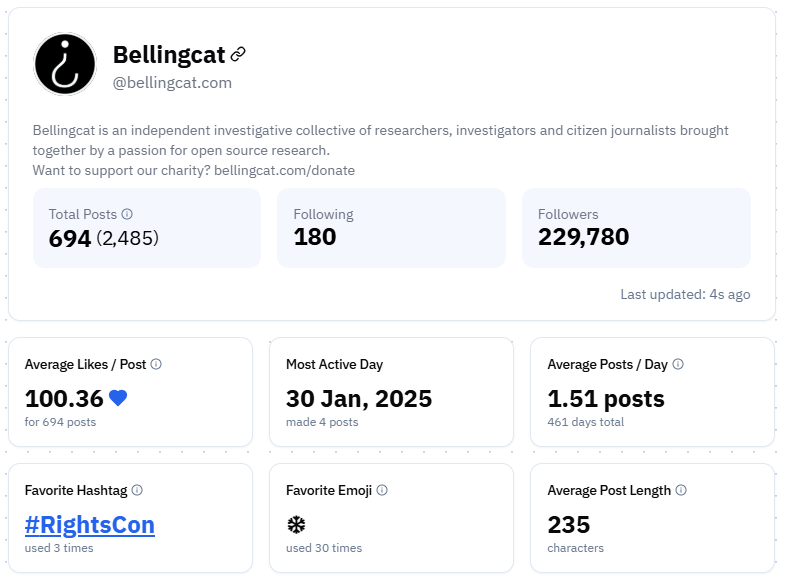

# Bluesky Insights

## URL

[https://bskyinsights.com](https://bskyinsights.com)

## Description

Bluesky Insights is a free, browser‑based analytics site for the Bluesky social network. It pulls publicly viewable profile and post data and turns it into at‑a‑glance metrics (followers/posts), engagement summaries, word‑clouds, and time‑of‑day activity charts; it also surfaces a profile’s current **Top Post** and “interesting stats” (e.g., favorite hashtag/emoji, average post length). No account authentication is required to view public content on Bluesky, allowing you to analyze any public handle directly in the browser.

## **Features**

**Overview Metrics**

* **Total Posts, Following, Followers**: A quick snapshot of overall activity and reach.
* **Average Likes, Reposts, Replies**: High-level engagement averages to gauge how each post typically performs.
* **Favorite Hashtag & Emoji**: Identifies which hashtag or emoji appears most often in your posts.
* **Most Active Day**: Pinpoints the single day with the highest posting volume.

<figure><figcaption>
A Bluesky Insights dashboard view for Bellingcat’s account, showing key metrics like total posts, followers, average likes, and favorite hashtag (#RightsCon).
</figcaption></figure>

**Engagement Rate**

* Shows likes, reposts, quotes, and replies over a selected time range (e.g., last 7 days).
* Includes easy-to-read charts for spotting engagement spikes and trends.

<figure><figcaption>
A 7-day engagement overview, visualizing likes, reposts, quotes, and replies, along with total posts and average interactions.
</figcaption></figure>

**Posts Breakdown by Type**

* Pie chart illustrating the proportion of original posts, reposts, quotes, and replies.
* Quickly see if you’re more of a content creator, curator, or conversationalist.

<figure><figcaption>
A pie chart from Bluesky Insights illustrating the user’s post distribution (posts, reposts, quotes, replies), with ‘Active Dialoguer’ highlighting that 68% of engagement comes from direct replies.
</figcaption></figure>

**Word Cloud**

* Automatically generates a cloud of frequently used words and hashtags in your posts. (The download feature will save it as a \*.png file without watermarks.)
* Helps reveal dominant themes, topics, or campaigns the user engages with most.

<figure><figcaption>
A snapshot of frequently used words from Bellingcat's Bluesky posts, with ‘research,’ ‘open,’ and ‘source’ standing out as prominent themes.
</figcaption></figure>

**Top Post**

* Identifies best-performing post, based on likes, reposts, replies, or other interactions.

<figure><figcaption>
Bellingcat’s top-performing Bluesky post, highlighting their new flight-tracking project for Guantanamo Bay, garnered significant engagement through likes, reposts, and quotes.
</figcaption></figure>

**Posts Activity by Hour**

* Identifying peak posting times can indicate a user’s likely time zone or routine, which can help in creating a bar chart showing posting times across a 24-hour period.
* From an open source research standpoint, identifying peak posting times can indicate a user’s likely time zone or routine, helping to pinpoint when they’re most responsive to events. This allows researchers to focus their monitoring efforts during the most active windows, improving real-time data collection and analysis.

<figure><figcaption>
Hourly posting distribution for this Bluesky account, highlighting a pronounced activity peak in the late afternoon.
</figcaption></figure>

#### **Open Source Research Applications**

* **Profile Monitoring**: Analyze public figures, organizations, or suspicious accounts for posting habits and engagement trends.
* **Disinformation Tracking**: Detect potential “coordinated” engagement patterns or sudden spikes in follower counts.
* **Narrative Analysis**: Examine common themes and keywords across user-generated content.
* **Comparative Analysis**: Compare multiple Bluesky accounts to identify similarities in timing, content, or engagement trends.

By enabling analytics on Bluesky profiles, Bluesky Insights can provide valuable insights for researchers, journalists, and analysts investigating interactions or influence within this decentralized platform.

## Cost

* [x] Free
* [ ] Partially Free
* [ ] Paid

**Free**. The site states it “provides a free analytics service for Bluesky users” [Terms of Service, 2024‑12‑07](https://bskyinsights.com/terms-of-service)

## Level of difficulty

<table><thead><tr><th data-type="rating" data-max="5"></th></tr></thead><tbody><tr><td>1</td></tr></tbody></table>

Point‑and‑click, no install. Enter any **public** Bluesky handle in a modern browser and read the charts; basic familiarity with social‑media engagement metrics helps when interpreting results. No API keys, cookies, or command line required [OSINT Combine guide](https://www.osintcombine.com/post/bluesky-osint-guide)

## Requirements

* No sign-up or login required.
* Works with any modern web browser (Chrome, Firefox, Safari, etc.).
* Bluesky handle for the target profile (e.g., `@username.bsky.social`).

## Limitations

* **Public‑data only.** Private/DM content and posts hidden by labels/moderation workflows will not be available; Bluesky uses an open labeling system that can affect visibility of some content [moderation architecture, 2024‑03‑15](https://docs.bsky.app/blog/blueskys-moderation-architecture).
* **Rate limits & stability.** The tool depends on Bluesky’s public APIs/streams and can be throttled by service rate limits; Bluesky documents rate‑limiting and developers have discussed a **global** IP rate cap (e.g., 3,000 calls/5 min) that may affect high‑volume services [rate‑limits guide](https://docs.bsky.app/docs/advanced-guides/rate-limits?utm_source=chatgpt.com), [atproto discussion, 2024‑02‑08](https://github.com/bluesky-social/atproto/discussions/2160).
* **Realtime leaderboard caveats.** The “Live Hashtag Leaderboard” relies on Jetstream (websocket firehose); transient disconnects or client‑side aggregation choices may lead to gaps or brief skew [developer thread](https://www.reddit.com/r/BlueskySocial/comments/1in9okk/i_made_a_live_hashtag_leaderboard_for_bluesky_to/?utm_source=chatgpt.com).
* **Pinned‑posts viewer constraints.** Some posts cannot render off‑site due to Bluesky embed restrictions; the developer notes API limitations and falls back to linking out to the post feature [post/comments, 2025‑02.](https://www.reddit.com/r/BlueskySocial/comments/1j4ecc4/i_built_a_bluesky_bookmarks_page_to_quickly/)
* **ToS/affiliation.** The site is unaffiliated with Bluesky Social; use in line with Bluesky’s Terms and Developer Guidelines site ToS, [Bluesky developer guidelines](https://docs.bsky.app/docs/support/developer-guidelines), [Bluesky ToS, 2025‑08‑14](https://bsky.social/about/support/tos).

## Ethical Considerations

* **Respect User Privacy**: Although data is public, users may not expect deep analytics done based on their data.
* **Avoid Misuse**: Use responsibly for legitimate open source research purposes.

## Guides and articles

**Blueprint for Bluesky: An OSINT Guide** (OSINT Combine, 2024‑12‑17) — search tips, public‑data access without auth, and monitoring workflows. [Link](https://www.osintcombine.com/post/bluesky-osint-guide)

**Bluesky Developer APIs** — official docs hub and HTTP reference. [Link](https://docs.bsky.app/?utm_source=chatgpt.com)

**Advanced Guides: Rate Limits** — practical guidance on Bluesky service throttling. [Link](https://docs.bsky.app/docs/advanced-guides/rate-limits?utm_source=chatgpt.com)

**Advanced Guides: Posts** — record schema and API examples (useful for interpreting what the tool surfaces). [Link](https://docs.bsky.app/docs/advanced-guides/posts?utm_source=chatgpt.com)

## Tool provider

**Developer:** _Sahaj Jain_ — [Bluesky Insights profile (directory)](https://blueskydirectory.com/profiles/bskyinsights.com?utm_source=chatgpt.com) • [Personal site](https://iamsahaj.xyz/?utm_source=chatgpt.com) • GitHub: jnsahaj (Gurugram, India; currently @ Vercel) [bio](https://iamsahaj.xyz/).

**License:** **Unknown / Closed source** (no public repository or open‑source license published for Bluesky Insights). See site [Terms of Service.](https://bskyinsights.com/terms-of-service)

## Advertising Trackers

* [ ] This tool has not been checked for advertising trackers yet.
* [x] This tool uses tracking cookies. Use with caution.
* [ ] This tool does not appear to use tracking cookies.

| Page maintainer |
| --------------- |
| Martin Sona     |
