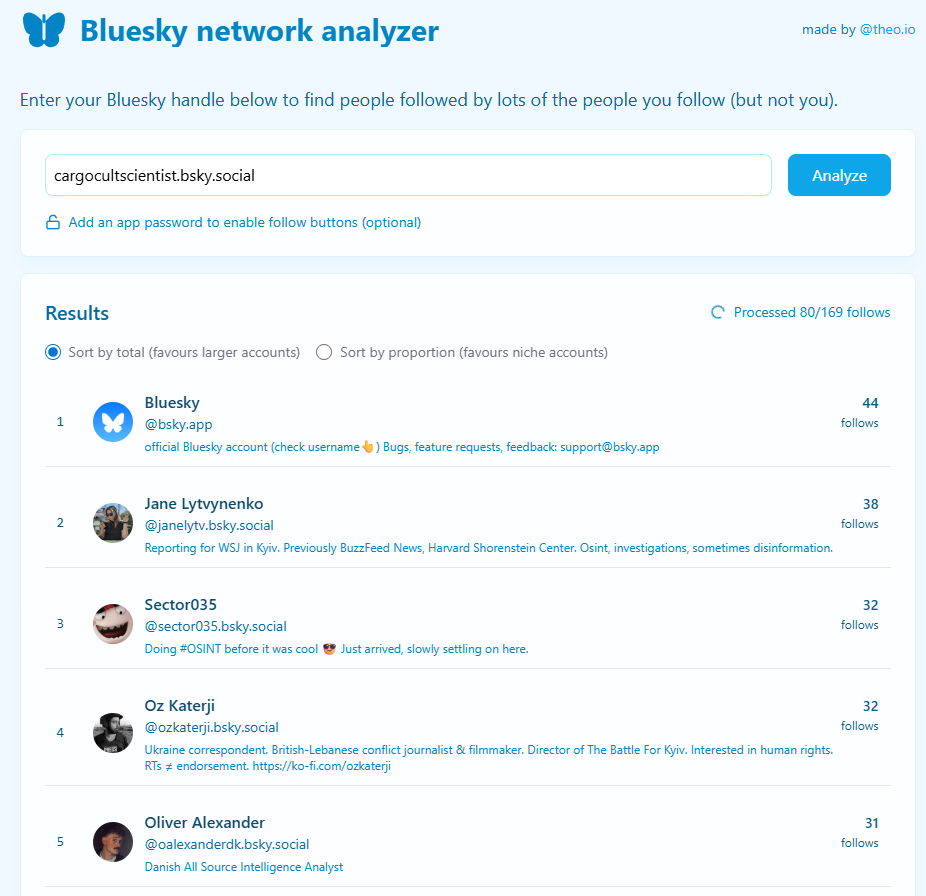

# BskyFollowFinder

## URL

[https://bsky-follow-finder.theo.io/](https://bsky-follow-finder.theo.io/)

## Description

BskyFollowFinder is a small web app for Bluesky that surfaces **second‑degree** connection suggestions: it lists accounts that many of your followees follow but that **you** don’t (yet). You can run it on **any handle** (including other users) without logging in; an optional app password lets you follow results directly from the page. Output is a ranked list by count, with a toggle to **“Sort by proportion (favours niche accounts)”** that highlights less‑popular but highly shared follows among your network.

&#x20;By leveraging Bluesky’s [AT Protocol API](https://docs.bsky.app/docs/advanced-guides/atproto), the tool automates social network analysis to recommend potential new follows. This provides valuable insight into your network by ranking suggestions based on the frequency they appear among your followees.

This functionality can be useful for open source researchers, investigative journalists, and analysts who need to map social relationships, identify key influencers, and understand community structures on the platform.

<figure><figcaption></figcaption></figure>

#### Key Features:

* **Automated Second-Degree Analysis**
  * The tool collects the accounts that a user follows and then compiles the connection lists of those accounts. This results in a ranked list of second-degree suggestions—accounts that are frequently followed by the original user’s connections. This analysis is limited to a single hop without exploring deeper network layers.
* **Filtering for Niche Accounts**
  * A toggle option allows the filtering of results to prioritize smaller or more specialized accounts over universally popular ones, enabling the discovery of unique voices that might otherwise be overshadowed by mainstream profiles.
* **One-Click Following (Optional)**
  * Suggestions can be viewed without requiring a login. However, for users who wish to follow accounts directly from the tool, a password integration is available to facilitate authenticated API calls for one-click following. (Thus, when a password is supplied after the analysis, "follow" buttons appear next to the results.)
* **Efficient Data Retrieval**
  * By leveraging Bluesky’s public APIs, the tool efficiently retrieves connection information.

***

### Example Use Cases



A researcher examining disinformation networks can use BskyFollowFinder to pinpoint influential hubs. If many known disinformation actors follow a particular account, it may serve as a critical node for further investigation.



Using **BskyFollowFinder** to pinpoint influential hubs in a disinformation network involves a systematic approach. Here’s a step-by-step guide on how you might do that:

1. **Compile a List of Known Disinformation Actors:**\
   Begin by identifying a set of Bluesky accounts that have been previously flagged or verified as disinformation sources. This can come from prior open source investigations, trusted reports, or expert lists.
2. **Run Individual Network Analyses:**\
   For each actor, input their handle into BskyFollowFinder to generate a ranked list of accounts they follow, highlighting common connections among the selected profiles.
3. **Aggregate and Compare Results:**\
   Collect the output from each disinformation actor. Look for accounts that repeatedly appear across multiple analyses. If several known disinformation actors follow a particular account, it likely serves as a central node, or influential hub, in that network.
4. **Verify the Critical Node:**\
   Once you’ve identified an account that appears frequently, dig deeper:
   * **Profile Analysis:** Review the account’s profile, bio, and content to understand its role and influence.
   * **Cross-Reference:** Check if this account is mentioned or linked in other open source research reports, social media analyses, or disinformation research.
   * **Contextual Review:** Evaluate its interactions and network position by looking at who engages with the account and what content it promotes.
5. **Enhance Your Analysis with Visualization Tools:**\
   For a broader picture, consider exporting the data and using network visualization tools like [**Gephi**](https://bellingcat.gitbook.io/toolkit/more/all-tools/gephi) or [**Maltego**](https://bellingcat.gitbook.io/toolkit/more/all-tools/maltego). Import the common nodes and their connections to visualize the network structure, which can help confirm the hub’s influence and reveal additional relationships.
6. **Document Your Findings:**\
   Record your methodology, the handles analyzed, common nodes identified, and any corroborating evidence from further investigation.





Journalists new to Bluesky can quickly discover key voices in their niche by identifying accounts frequently followed by trusted contacts.



To leverage BskyFollowFinder for community growth and influence mapping—helping journalists discover key voices in their niche—you can follow these steps:

1. **Identify Trusted Contacts:**\
   Start by listing the Bluesky accounts you already follow and trust. These may include colleagues, well-known activists, journalists, or experts in your area of interest.
2. **Run a Network Analysis:**\
   Enter your own Bluesky handle (or that of a trusted contact) into BskyFollowFinder. The tool will compile the follow lists of your trusted accounts and rank suggested accounts based on how many of your contacts follow them. The more frequently an account appears in these lists, the more likely it is a key influencer in your niche.
3. **Evaluate the Suggestions:**\
   Review the ranked list to identify which accounts consistently appear across multiple trusted networks. Click on these accounts to examine their profiles, read their bios, and assess their content to ensure they align with your niche and values.
4. **Expand Your Network:**\
   Once you’ve identified promising key voices, consider following them. Over time, as you build your network, run the analysis periodically to capture new influential voices emerging within your community.
5. **Integrate with Visualization Tools (Optional):**\
   For a broader perspective, you can export the list of suggestions and import it into network visualization tools like [Gephi](https://bellingcat.gitbook.io/toolkit/more/all-tools/gephi) or [Maltego](https://bellingcat.gitbook.io/toolkit/more/all-tools/maltego). These tools help you map out the social graph visually, revealing clusters and the most interconnected nodes within your community.
6. **Document and Iterate:**\
   Keep a record of the accounts you follow and monitor their influence over time. This documentation can serve as a baseline for further analysis and can help you refine your criteria for what constitutes a “key voice” in your niche.



* [x] Free
* [ ] Partially Free
* [ ] Paid

## Level of difficulty

<table><thead><tr><th data-type="rating" data-max="5"></th></tr></thead><tbody><tr><td>1</td></tr></tbody></table>

Beginner‑friendly, point‑and‑click web UI. Enter a Bluesky handle and review the ranked suggestions. Optional app‑password entry enables one‑click follow; no scripting or API setup required.

## Requirements

* A **Bluesky account** (only if you want to access your account and follow suggested users).
* Your **Bluesky username** for personalized results.
* **Optional:** Enter your Bluesky password (stored in your browser) to enable one-click follow actions securely.

**No additional API keys, downloads, or complex setup is necessary.**

## Limitations

* **"One-Hop" Analysis only:** BskyFollowFinder examines only the user’s direct connections (the accounts they follow or who follow them) and doesn’t delve into “friends of friends” or deeper network layers.
* **No Graph Visualization:** Outputs are provided as a ranked list; it does not generate visual network maps like [Gephi ](https://bellingcat.gitbook.io/toolkit/more/all-tools/gephi)or [Maltego](https://bellingcat.gitbook.io/toolkit/more/all-tools/maltego).
* **Performance:** Processing can be slow for high‑follower accounts (the app must compile many lists).&#x20;
* **Rate limits:** Subject to Bluesky/AT Protocol limits (write & other limits vary by service); heavy use or bursts may trigger throttling.&#x20;
* **Maintenance/versions:** No tagged releases; repo shows updates through 2024‑11‑18; license not stated (unknown).&#x20;

## Ethical Considerations

* **Social Graph Exposure:** Revealing connections can inadvertently expose personal networks. Investigators should use insights responsibly, particularly when analyzing vulnerable subjects.
* Use only for lawful, proportionate purposes. Avoid exposing or amplifying sensitive social‑graph information about vulnerable individuals or groups. When authentication is used, prefer **app passwords** and revoke them when done. For best practices in investigative handling of open-source information (planning, preservation, verification, and minimizing harm), refer to the **Berkeley Protocol on Digital Open Source Investigations**.

## Guides and articles

* **Theo Sanderson’s Bluesky Post:** [Introduction to BskyFollowFinder](https://bsky.app/profile/theo.io/post/3lapjzzqtrc2e)
* **Bluesky API Documentation:** [AT Protocol for Social Graphs](https://docs.bsky.app/docs/api/app-bsky-graph-get-follows)
* [GIGAZINE walkthrough](https://gigazine.net/gsc_news/en/20241204-bluesky-network-analyser/) of the tool UI, including **app‑password** and **niche‑sort** steps.
* [Bluesky User FAQ](https://bsky.social/about/blog/5-19-2023-user-faq) – app passwords for third‑party tools.

### Complementary OSINT & Social Graph Tools to Use with BskyFollowFinder

| Tool                                                                        | Platform           | Use Case                                                    |
| --------------------------------------------------------------------------- | ------------------ | ----------------------------------------------------------- |
| [**Gephi**](https://bellingcat.gitbook.io/toolkit/more/all-tools/gephi)     | Cross-platform     | Visualizes network graphs from exported Bluesky data        |
| [**Maltego**](https://bellingcat.gitbook.io/toolkit/more/all-tools/maltego) | Multi-source OSINT | Maps social networks across various platforms               |
| [**Jaz’s Atlas**](https://bsky.jazco.dev/atlas)                             | Bluesky            | Provides large-scale network mapping and visualization      |
| [**Bluesky Directory**](https://blueskydirectory.com/)                      | Bluesky            | Offers curated lists of user accounts by interest           |
| [**Sky Follower Bridge**](https://www.sky-follower-bridge.dev/)             | Twitter → Bluesky  | Finds cross-platform identities between Twitter and Bluesky |

**Best Combination:** Use BskyFollowFinder to generate a list of suggested connections, then export or integrate the data into Gephi or Maltego for advanced network analysis.

## Tool provider

[Theo Sanderson](https://theo.io/) (London) [theo.io](https://theo.io/?utm_source=chatgpt.com) and GitHub repo: `theosanderson/bsky-follows`

## Advertising Trackers

* [ ] This tool has not been checked for advertising trackers yet.
* [x] This tool uses tracking cookies. Use with caution.
* [ ] This tool does not appear to use tracking cookies.

(The [google tag manager](https://support.google.com/tagmanager/answer/11994839?hl=en) is the only cookie found on this website.)

| Page maintainer                               |
| --------------------------------------------- |
| Martin Sona (@cargocultscientist.bsky.social) |
