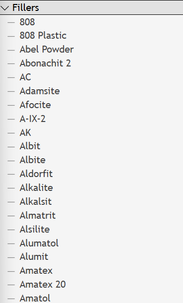
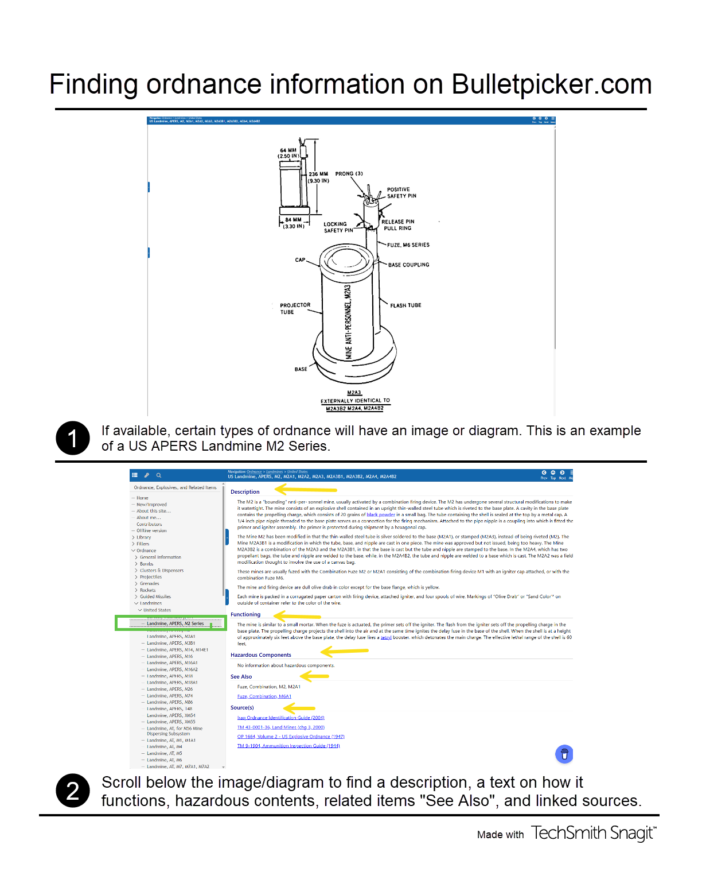
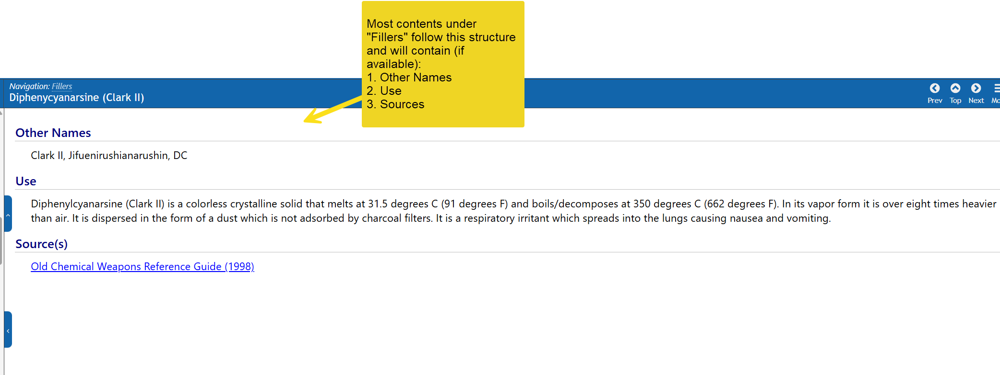
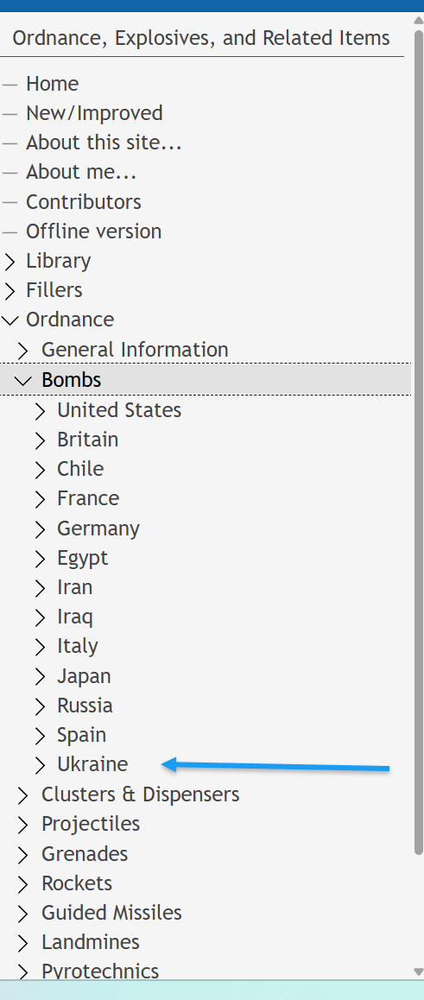
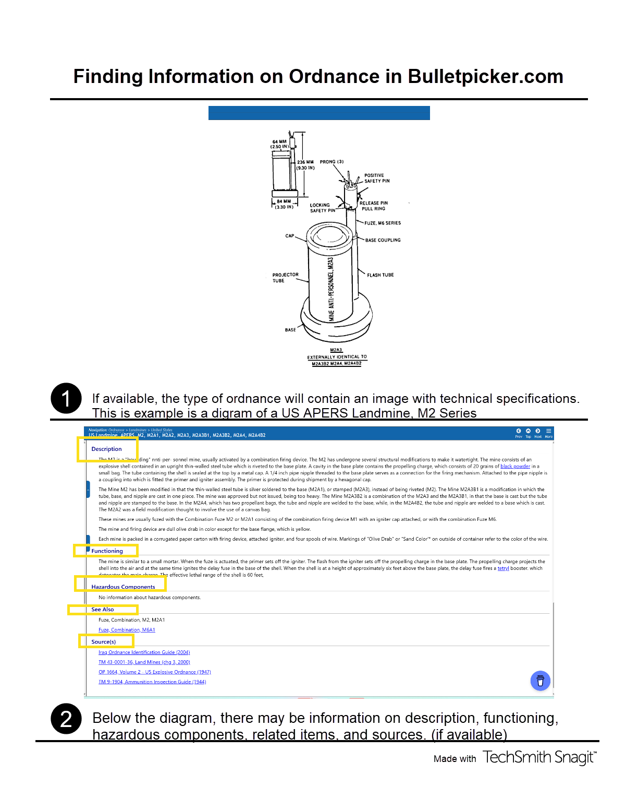

# Bulletpicker.com

## URL

[https://www.bulletpicker.com/index.html](https://www.bulletpicker.com/index.html)

## Description

[Bulletpicker ](https://www.bulletpicker.com/index.html)is a repository full of a variety of ammunition guidebooks and manuals from several different armed forces. The database is searchable, and each item of ordnance has its dedicated page, the majority with images, schematics, and a description. Each entry links to the source of the information.


**NOTE:** This website contains information about ordnance, explosives, and related items for educational and reference purposes only. The content should not be used for: (1) attempting self-guided disposal of explosive devices; (2) manufacturing explosive devices or components; (3) handling unexploded ordnance without proper training; (4) any illegal activities involving explosive materials.


According to the tool provider, Bulletpicker contains [“ordnance-related technical manuals, generally from the World Wars, Vietnam, and more recent conflicts.”](https://buymeacoffee.com/bulletpicker)

The tool provider also says that its purpose is data-sharing between [these sectors](https://buymeacoffee.com/bulletpicker): Explosive Ordnance Disposal (EOD), Public Safety Bomb Technician (PSBT), and commercial UXO (Unexploded Ordnance) and is accessed by a [wide range of users](https://buymeacoffee.com/bulletpicker): personnel from government agencies, historians, archaeologists, forensic experts, and others working in related fields.

[The provider mentions](https://buymeacoffee.com/bulletpicker) that the platform has:

* Technical info on \~4,000 ordnance and related items
* Access to 1,300+ publications in PDF format
* A downloadable version for offline use in remote areas or those operating in places with limited connectivity which is available for download[ here.](https://www.bulletpicker.com/offline-version.html)

According to the tool website, these technical manuals are [public domain and include copyright-expired books](https://www.bulletpicker.com/_about.html) scanned as PDF.

### Key Areas&#x20;

The contents are organized into the following categories, accessible through the navigation menu on the left side of the page.&#x20;

1.[ Library](https://www.bulletpicker.com/_library.html) - This section is a collection of manuals from different armed forces (including historical manuals).

2\. [Fillers](https://www.bulletpicker.com/_explosives.html) - this section contains resources on various fillers, defined as the ["energetic material (propellants, explosives, or pyrotechnic mixes)"](https://www.denix.osd.mil/uxo/explosives-safety/faqs/#faq-1) contained inside military munitions. These are the explosive materials packed inside an ordnance and are the substances that do the job of creating the explosion. Contents are organized in alphabetical order by name of the explosive agent.&#x20;

<figure><figcaption>
Users can locate the navigation panel to the left of the website. This is a sample of llst of fillers available on the website organized in alphabetical order. 
</figcaption></figure>

3\. [Ordnance](https://www.bulletpicker.com/_ord.html) - This section contains a list of various weapon systems, along with a brief introduction to each system. If you are new to the subject matter, it is recommended to start by exploring the “General Information” tab before moving on to more technical sections.&#x20;

Each type of ordnance has a subcategory organized by country.&#x20;

**For example:**&#x20;

_Ordnance → Bombs → Ukraine_&#x20;

<figure><figcaption>
Researchers interested in a praticular kind of ordnance can first navigate to the type of ordnance (Bombs, Clusters, etc) followed by the country it may belong to as seen in this screenshot (Image Credit: Bulletpicker.com) 
</figcaption></figure>

<figure><figcaption>
(Click to enlarge) This is a quick guide we created for navigating information on various ordinances listed on the website. Note that not all types of ordnance have information on each of these categories. Some do not have images, and some do not have information on how they function or information on hazardous content. 
</figcaption></figure>

4\. [Fuzes](https://www.bulletpicker.com/_fuze.html) -  According to this [Wikipedia article](https://en.wikipedia.org/wiki/Fuze), a fuze is a “device with explosive components designed to initiate the main charge” and determines when the explosion happens. This section of the website lists various types of fuzes which are categorized by country. Some types contain a short description, an image, a short description of its function, hazardous components, if any, - for example [here](https://www.bulletpicker.com/adapter-booster_-m102a1.html). Also note that sometimes items will contain just a diagram and no real-life photo, or just a real-life photo with no diagram. Sometimes, these items contain both.&#x20;

The content is organized by type of ordnance in which the fuze is used in, and then followed by a subcategory organized by country.&#x20;

**For example:**

_Fuzes → Bombs, Clusters and Dispensers → France_&#x20;


NOTE: When researching ordnance, explosives, and related items using Bulletpicker, it is essential to remember that the content is not for identification or instructional purposes and does not take the place of a qualified specialist. Users are responsible for verifying information with other official references.


### Basic Identification of Ammunition in Ukraine

The website includes a copy of the 2024 guide to Basic Identification of Ammunition in Ukraine, in both [English and Ukrainian.](https://ukr.bulletpicker.com/id-guides.html)&#x20;

### Use cases

Based on the content, Bulletpicker.com could be used for:

* Historical Research: Accessing information on older ordnance, such as “[Allied and Enemy Explosives (1946)](https://www.bulletpicker.com/pdf/Allied-and-Enemy-Explosives.pdf)” or "[Current British Land Service Fuzes (1962)](https://www.bulletpicker.com/pdf/Current-British-Land-Service-Fuzes.pdf)”. It can be a valuable archive for technical manuals from old and recent conflicts.
* General Knowledge: Learning about different types of explosives, chemical agents, and related items. Because the website has an extensive categorical organization, it allows users to develop a comprehensive knowledge of weapons systems, their technical specifications, and other identifying characteristics across multiple countries and time frames.
* Technical Reference (with caveats): Although the site explicitly states that it is not for identification or instruction by unqualified individuals, trained specialists may use it as one reference point among others. For those with foundational knowledge or have professional qualifications, this tool may be useful because it provides data such as:
  * Chemical composition of a filler
  * [Ballistic properties](https://www.bulletpicker.com/landmine_-apers_-m2a4.html) (how the weapon behaves as it travels in space)
  * [Manufacturing markings](https://www.bulletpicker.com/rocket_-57mm-heat_frag_-s-5kpb.html) and [Cross-sectional diagrams](https://www.bulletpicker.com/rocket-motor_-68mm_-model-f1.html)
  * Precise measurements&#x20;

According to the tool provider, Bulletpicker contains [“ordnance-related technical manuals, generally from the World Wars, Vietnam, and more recent conflicts.”](https://buymeacoffee.com/bulletpicker)

[The tool provider also says that its purpose is data-sharing between these sectors: Explosive Ordnance Disposal (EOD), Public Safety Bomb Technician (PSBT), and commercial UXO (Unexploded Ordnance) and is accessed by a wide range of users:  personnel from government agencies, historians, archaeologists, forensic experts, and others working in related fields.](https://buymeacoffee.com/bulletpicker)

In the same source above, the provider mentions that the platform has:

* Technical info on \~4,000 ordnance and related items
* Access to 1,300+ publications in PDF format
* A downloadable version for offline use in remote areas or those operating in places with limited connectivity is available [here. ](https://www.bulletpicker.com/offline-version.html)
* Some items have accompanying images, and information on hazardous components.&#x20;

According to the tool,[ these technical manuals are public domain and include copyright-expired books scanned as PDF.  ](https://www.bulletpicker.com/_about.html)

### Key Areas&#x20;


TIP: Because the website contains a vast repository of resources, users can use the search function on the top left for keywords.


The contents are organized into the following categories, accessible through the navigation menu on the left side of the page.&#x20;

1.[ Library](https://www.bulletpicker.com/_library.html) - This section is a collection of manuals from different armed forces (including historical manuals)&#x20;

2\. [Fillers](https://www.bulletpicker.com/_explosives.html) - this section contains resources on various fillers, defined as the[ "energetic material (propellants, explosives, or pyrotechnic mixes)" contained inside military munitions.](https://www.denix.osd.mil/uxo/explosives-safety/faqs/#faq-1) These are the explosive materials packed inside an ordnance and are the substances that do the job of creating the explosion. Contents are organized in alphabetical order by name of the explosive agent and contain technical information.&#x20;

<figure><figcaption>
Information (if available) on fillers are organized as follows: Other Names, Use, Sources. (Image credit: Bulletpicker.com) 
</figcaption></figure>

3\. [Ordnance](https://www.bulletpicker.com/_ord.html) - This section contains a list of various weapon systems, along with a brief introduction to each system. If you are new to the subject matter, it is recommended to start by exploring the “General Information” tab before moving on to more technical sections.&#x20;

Each type of ordnance has a subcategory organized by country.&#x20;

**For example:**&#x20;

Users interested in resources related to Ukrainian ordnance can follow the steps below:  &#x20;

_Ordnance → Bombs → Ukraine_&#x20;

<figure><figcaption>
This is the navigation pane of the website, located to the left. This shows a sample navigation for a user interested in researching Ukrainian ordnance. Note that the contents are mainly those found in the public domain. 
</figcaption></figure>

<figure><figcaption>
This is a quick guide we created for navigating information on various ordinances listed on the website. Note that not all types of ordnance have information on each of these categories. Some do not have images, and some do not have information on how they function or information on hazardous content. Also note that sometimes items will contain just a diagram and no real-life photo, or just a real-life photo with no diagram. Sometimes, these items contain both. This example can be found on: <a href="https://www.bulletpicker.com/landmine_-apers_-m2a4.html">https://www.bulletpicker.com/landmine_-apers_-m2a4.html</a> 
</figcaption></figure>

Information on ballistic properties ([how weapons behave as they are launched](https://en.wikipedia.org/wiki/Ballistics)) can be found under "description" or "functioning." &#x20;

4\. [Fuzes](https://www.bulletpicker.com/_fuze.html) -  According to [this](https://en.wikipedia.org/wiki/Fuze), a fuze is a “device with explosive components designed to initiate the main charge” and determines when the explosion happens. This section of the website lists various types of fuzes and is categorized by country. [Some types contain a short description, an image, a short description of its function, and hazardous components, if any. ](https://www.bulletpicker.com/adapter-booster_-m102a1.html)

The content is organized by type of ordnance in which the fuze is used, and then followed by a subcategory organized by country.&#x20;

**For example:**

_Fuzes → Bombs, Clusters and Dispensers → France_&#x20;


WARNING: When researching ordnance, explosives, and related items using Bulletpicker, it is essential to remember that the content is not for identification or instructional purposes and does not take the place of a qualified specialist. Users are responsible for verifying information with other official references.


### Basic Identification of Ammunition in Ukraine

The website includes a copy of the 2024 guide to Basic Identification of Ammunition in Ukraine, in both [English and Ukrainian.](https://ukr.bulletpicker.com/id-guides.html)&#x20;

## Use cases

Based on the content, Bulletpicker.com could be used for:

* **Historical Research:** Accessing information on older ordnance, such as “[Allied and Enemy Explosives (1946)](https://www.bulletpicker.com/pdf/Allied-and-Enemy-Explosives.pdf)” or "[Current British Land Service Fuzes (1962)](https://www.bulletpicker.com/pdf/Current-British-Land-Service-Fuzes.pdf)”. It can be a valuable archive for technical manuals from old and recent conflicts.&#x20;
* **General Knowledge:** Learning about different types of explosives, chemical agents, and related items. Because the website has an extensive categorical organization, it allows users to develop a comprehensive knowledge of weapons systems, their technical specifications, and other identifying characteristics across multiple countries and time frames.&#x20;
* **Technical Reference (with caveats):** Although the site explicitly states that it is not for identification or instruction by unqualified individuals, trained specialists may use it as one reference point among others. For those with foundational knowledge or who have professional qualifications,  this tool may be helpful because it provides data such as:
  * Hazardous components, if available&#x20;
  * Chemical composition of a filler
  * Ballistic properties&#x20;
  * [Manufacturing markings](https://www.bulletpicker.com/rocket_-57mm-heat_frag_-s-5kpb.html) and [Cross-sectional diagrams](https://www.bulletpicker.com/rocket-motor_-68mm_-model-f1.html)
  * Precise measurements&#x20;

## Cost

* [x] Free
* [ ] Partially Free
* [ ] Paid

## Level of difficulty

<table><thead><tr><th data-type="rating" data-max="5"></th></tr></thead><tbody><tr><td>2</td></tr></tbody></table>

Based on the disclaimers and the technical nature of the subject matter (Ordnance, Explosives), navigating and understanding the information on Bulletpicker.com might require some prior knowledge or a careful approach. Beginner users without a background in this area should exercise extreme caution and know the site's limitations.

## Requirements

* A modern web browser with JavaScript enabled
* PDF Reader

## Limitations

[**The tool’s homepage explicitly states several limitations:**](https://www.bulletpicker.com/index.html)

* The content is not for Demining, Unexploded Ordnance (UXO), or  Explosive Ordnance Disposal (EOD) information.
* Not designed to teach EOD/UXO technicians or deminers.
* Not designed to identify UXO or ordnance.
* Content is not for identification or instructional purposes for unqualified individuals.
* Does not replace qualified specialists.
* Users are responsible for verifying content with other official references.
* Bulletpicker, LLC is not associated with the DoD or the US Government.
* Bulletpicker, LLC does not handle classified Government documents or data.
* Proximity to UXO is always dangerous and should be avoided; only trained personnel should handle it.

Based on our review, here are additional limitations:

1. Foundational knowledge required&#x20;

The content of Bulletpicker.com is intended for those with a foundational background on military weapons systems. Beginner users will not find introductory content. It is not designed for beginner users, and assumes they possess foundational knowledge of ordnance terminology and identification.&#x20;

2. Content Variability:&#x20;

Information depth and organization vary across the different sections of the website, possibly due to the reliance on public domain materials and sources with expired copyrights. This creates noticeable inconsistencies in coverage.

For example, [the Ordnance/Bombs subcategory ](https://www.bulletpicker.com/_bombs.html)includes resources for 13 countries, while the [“Clusters and Dispensers” subcategory](https://www.bulletpicker.com/_clusters.html) covers eight countries plus an “unknown” category.&#x20;

It is unclear whether this coverage limitation stems from data availability constraints or reflects the actual global distribution of ordnance manufacturing capabilities. In other words,  is this because these are the only resources publicly available, or is this the list of countries known to produce such types of devices? &#x20;

Another example is that not all items will contain an image or diagram.&#x20;

Users have to be aware that some information may not be available due to security and confidentiality reasons.&#x20;

3. Searching:&#x20;

Many of the resources are PDF documents or images that require opening, which can be time consuming, however, the search and index help to mitigate that.

If the researcher has limited foundational knowledge on the subject matter, this may not be the first resource to use for weapons identification. Users may need to know some technical terms to use the search function effectively and find what they want.&#x20;

Overall, this website is an extremely valuable resource. Users, however, should be mindful of some limitations.&#x20;

[**The tool’s homepage explicitly states several limitations:**](https://www.bulletpicker.com/index.html)

* The content is not for Demining, Unexploded Ordnance (UXO), or  Explosive Ordnance Disposal (EOD) information.
* Not designed to teach EOD/UXO technicians or deminers.
* Not designed to identify UXO or ordnance.
* Content is not for identification or instructional purposes for unqualified individuals.
* Does not replace qualified specialists.
* Users are responsible for verifying content with other official references.
* Bulletpicker, LLC is not associated with the DoD or the US Government.
* Bulletpicker, LLC does not handle classified Government documents or data.
* Proximity to UXO is always dangerous and should be avoided; only trained personnel should handle it.

Based on our review, here are additional limitations:

1. Foundational knowledge required&#x20;

The content of Bulletpicker.com is intended for those with a foundational background on military weapons systems. Beginner users will not find introductory content and assume they possess foundational knowledge of ordnance terminology.&#x20;

2. Content Variability:&#x20;

Information depth and organization vary across the different sections of the website, possibly due to the reliance on public domain materials and sources with expired copyrights. This creates noticeable inconsistencies in coverage.

For example, [the Ordnance/Bombs subcategory ](https://www.bulletpicker.com/_bombs.html)includes resources for 13 countries, while the [“Clusters and Dispensers” subcategory](https://www.bulletpicker.com/_clusters.html) covers eight countries plus an “unknown” category.&#x20;

It is unclear whether this coverage limitation stems from data availability constraints or reflects the actual global distribution of ordnance manufacturing capabilities. In other words,  is this because these are the only resources publicly available, or is this the list of countries known to produce such types of devices? &#x20;

Another limitation is that not all items will contain an image or diagram (if that interests the researcher).

Users must be aware that some information may just not be available for security and confidentiality reasons.

3. Navigation:

Many of the resources are PDF documents or images that require opening, which can be time-consuming; however, the search and index help to mitigate that.

## Ethical Considerations

Given the sensitive nature of the information (ordnance and explosives), users should consider the ethical implications of how they use this information. It should not be used for any illegal or harmful activities. Respecting the disclaimers and limitations of the site is imperative.&#x20;

Given the sensitive nature of the information (ordnance and explosives), users should consider the ethical implications of how they use this information. It should not be used for any illegal or harmful activities. Respecting the disclaimers and limitations of the site is crucial

## Guide

None at the moment.

## Tool provider

According to the website, Bulletpicker.com is provided by an unnamed ["retired project manager for the Department of Defense"](https://www.bulletpicker.com/_me.html) and several [contributors](https://www.bulletpicker.com/contributors.html).

## Advertising Trackers

* [ ] This tool has not been checked for advertising trackers yet.
* [ ] This tool uses tracking cookies. Use with caution.
* [x] This tool does not appear to use tracking cookies.

| Page maintainer                         |
| --------------------------------------- |
| 
Afton 

(Previously: Andro)
 |
|                                         |
