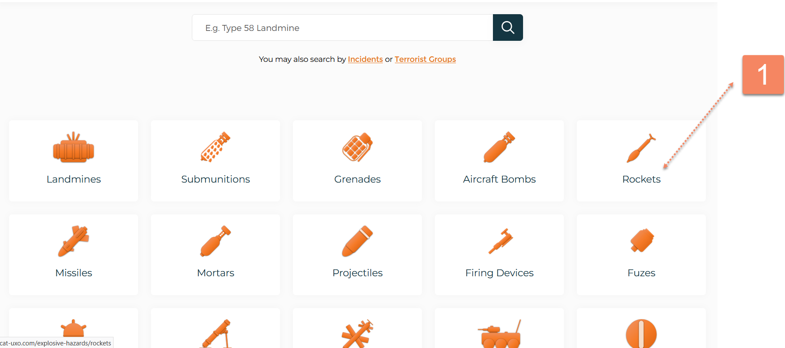
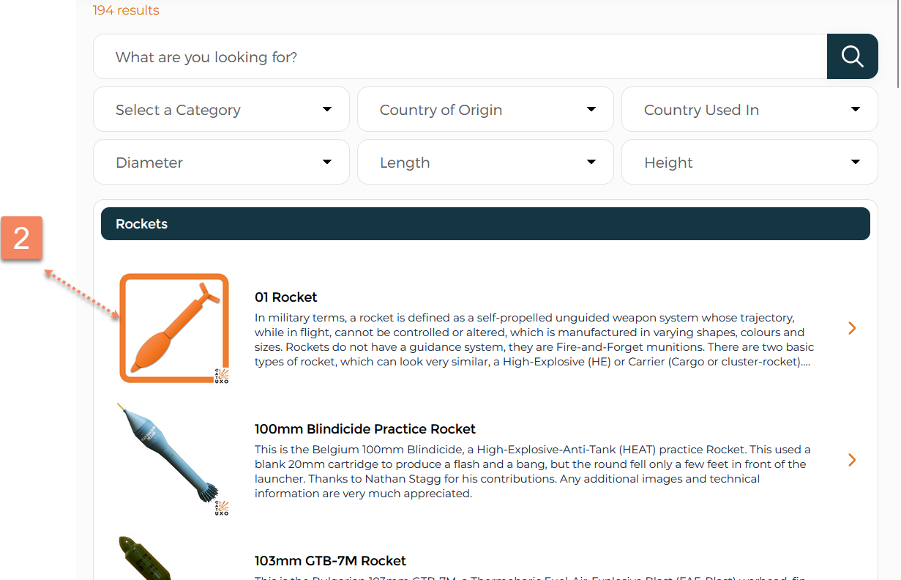
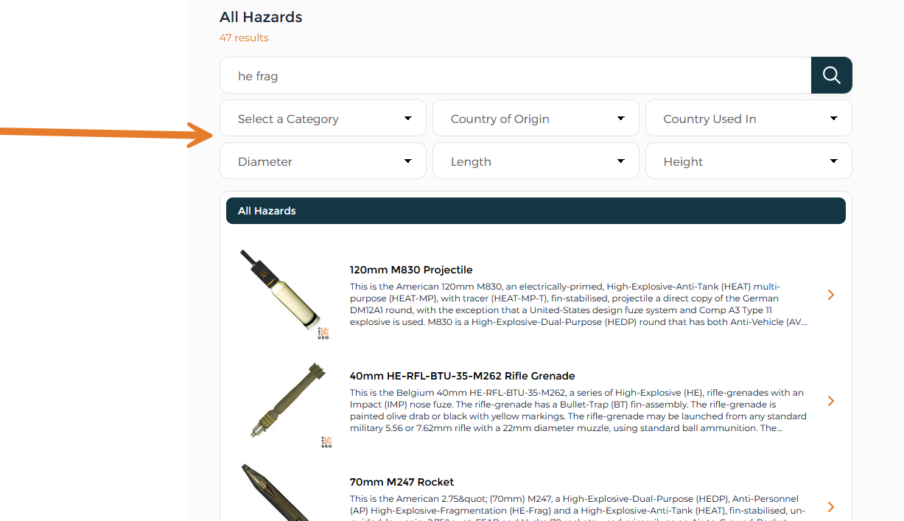

# CAT-UXO

## URL



## Description


Disclaimer: This website contains information about ordnance, explosives, and related items for educational and reference purposes only. The content should not be used for: (1) attempting self-guided disposal of explosive devices; (2) manufacturing explosive devices or components; (3) handling unexploded ordnance without proper training; (4) any illegal activities involving explosive materials.


CAT-UXO (Collective Awareness to Unexploded Ordnance) is a repository of explosive ordnance (EO) information that is both a web-based platform and a mobile application. It is a [collective awareness platform](https://cat-uxo.com/about) for unexploded ordnance (UXO) and explosive hazards.

The database is designed to help explosive ordnance disposal (EOD) professionals ("[EOD operators, Military, Police, NGOs, divers, dog handlers, medics, and mine risk managers](https://cat-uxo.com/about)") identify dangerous munitions they might encounter in the field. However, the information provided by CAT-UXO can be repurposed for open-source investigations.

Based on our examination, CAT-UXO has 16 categories of EO, an additional related category for IED (Improvised Explosive Device) Incidents and a separate [category ](#user-content-fn-1)[^1]for [Terrorist Groups](https://cat-uxo.com/explosive-hazards/terrorist-groups). It has categorized hundreds of unique models of EO from various countries.

**EO TYPES COVERED BY THE TOOL:** Landmines, Submunitions, Grenades, Aircraft Bombs, Rockets, Missiles, Mortars, Projectiles, Firing Devices, Fuzes, Naval Devices, [SALW](https://www.nato.int/cps/en/natohq/topics_52142.htm), [UCAV](https://en.wikipedia.org/wiki/Unmanned_combat_aerial_vehicle), [AFV](https://en.wikipedia.org/wiki/Armoured_fighting_vehicle), Miscellaneous, IEDs, IED Incidents, Terrorist Groups

<figure><figcaption>
Search categories for EO on the landing page of the tool.
</figcaption></figure>

According to the tool provider, the data comes from:

1. [“Varying open source information and individuals.”](https://cat-uxo.com/terms-conditions)
2. [Gathered via social media](https://cat-uxo.com/about)
3. [Paid member contributors](https://cat-uxo.com/sign-up). Supporting CAT-UXO via paid membership allows members to contribute technical information on existing EO or contribute a new hazard to the online database.

For each unique model, the database provides images of the EO and a detailed description.

**Some of the practical applications of this tool for open-source researchers are:**

1. **Visual Aids/ Visual Matching:** Open-source researchers verifying conflict-related imagery can use the repository to check if any physical characteristics match or if they are similar.
2. **Applicable technical specifications:** Open-source researchers can find useful specific technical information (i.e. dimensions, colors, documented markings) to verify munitions identified in news reports or on social media platforms.

### EO TYPES AND EXPLAINERS

CAT-UXO groups its information according to 16 EO Types. It also provides introductory information for some of these EO types geared toward beginner users. However, this information is not easy to find on the user interface. To find this information, click on EO Type and then click on the top results with the EO icon:



**Click on the EO Type**

On the landing page, click on the icon of the EO type you are searching for.

<figure><figcaption></figcaption></figure>



**Click on the first result**

If available for that category, click on the first result, with the icon identical to the EO type of icon. For example, you can see that the rocket icon looks the same as on the results page.

<figure><figcaption></figcaption></figure>



As of now, only these types of EO have introductory information, mostly sourced from Wikipedia: [Landmines](https://cat-uxo.com/explosive-hazards/landmines/01-landmine); [Submunitions](https://cat-uxo.com/explosive-hazards/submunitions/01-submunition); Grenade ([Hand Grenade](https://cat-uxo.com/explosive-hazards/grenades/01-hand-grenade) and [Projected Grenade](https://cat-uxo.com/explosive-hazards/grenades/02-projected-grenade)); [Rocket](https://cat-uxo.com/explosive-hazards/rockets/01-rocket); [Fuze](https://cat-uxo.com/explosive-hazards/fuzes/01-fuze) ([Delay Fuze](https://cat-uxo.com/explosive-hazards/fuzes/03-delay-fuze), [Pibd](https://cat-uxo.com/explosive-hazards/fuzes/04-pibd), [(AWAF) All-Ways Acting Fuze](https://cat-uxo.com/explosive-hazards/fuzes/05-awaf), [Firing Pin](https://cat-uxo.com/explosive-hazards/fuzes/06-firing-pin)).

### SEARCHING FOR EO

#### _SEARCH BAR AND SEARCH QUERY_

<figure><figcaption>
On the landing page of the tool, users can find the search bar and the various EO types for ease of search.
</figcaption></figure>

To get the best results, it is helpful to know how the search bar works. The search functionality is versatile. It operates on keyword-based retrieval, matching search queries against indexed fields.

It also handles logical combinations of attributes, such as “Chinese fuze” or “81mm mortar,” as well as exact model designations such as “type 58 landmine.” It returns results when keywords appear in either the description or title. Partial words (i.e. “frag” for fragmentation) will also return results.

The system also seems to search the description for physical characteristics (also known as identifiers) if available. "Identifiers" can refer to distinctive markings (manufacturer stamps, lot numbers), number or arrangement of holes or attachment points, grooves or bands on the casing, tail shape, or colors.&#x20;

Example: Searching for an identifier such as "Yellow band" generated results of EO types containing that physical feature&#x20;


**TIPS FOR SEARCHING:**&#x20;

1. **Terminology matters:** Based on our own tests, the database appears to mostly index content using standardized military/technical naming conventions rather than casual language variations.&#x20;

Example: “anti-tank” ([the common EO term referring to a purpose or function of ordnance)](https://www.smallarmssurvey.org/sites/default/files/resources/SAS-Research-Note-16.pdf) returns more results than “anti tank” without the hyphen since it’s more likely to appear in formal descriptions.

2. **Foreign Language Search:** Based on our tests, it can search using the Cyrillic alphabet if the characters appear in the title or description.


#### DROP-DOWN FILTERING OPTIONS

The interface also uses GUI-driven filtering without Boolean operators. This allows users to refine searches further using a dropdown filtering menu rather than advanced search syntax.

<figure><figcaption>
Search results can be further refined by more filtering options, as seen above the search results. Once a user has entered the results page for the initial query, a filtering option becomes available.
</figcaption></figure>

An additional list of filtering options can be found in the expandables below.

List of additional "Category" filter <mark style="color:orange;">(CLICK TO EXPAND)</mark>

AFV - Armoured Personnel Carrier

AFV - Landmine Clearance

AFV - Main Battle Tank (MBT)

AFV - Multiple Launch Rocket System (MLRS)

AFV - Self-Propelled Anti-Aircraft Gun (SPAAG)

AFV - Self-Propelled Artillery (SPA)

AFV - Towed Artillery

Aircraft Bomb

Aircraft Bomb - Bomblet

Aircraft Bomb - Chemical

Aircraft Bomb - Cluster/Dispenser

Aircraft Bomb - Concrete Piercing (CP)

Aircraft Bomb - Fragmentation

Aircraft Bomb - General Purpose (GP)

Aircraft Bomb - Guided Bomb Unit (GBU)

Aircraft Bomb - High Capacity

Aircraft Bomb - Incendiary

Aircraft Bomb - Practice

Aircraft Bomb - Signal/Illuminating

Firing Device - Anti-Disturbance

Firing Device - Breakwire

Firing Device - Combination

Firing Device - Concussion

Firing Device - Pressure

Firing Device - Pressure Release

Firing Device - Pull

Firing Device - Seismic

Firing Device - Tension Release

Firing Device - Time

Fuze - Aircraft Bomb

Fuze - Depth Charge

Fuze - Grenade Hand

Fuze - Grenade Projected

Fuze - Grenade Rifle

Fuze - Info

Fuze - Landmine

Fuze - Mortar

Fuze - Projectile

Fuze - Rocket

Fuze - Seamine

Fuze - Submunition

Grenade - Hand

Grenade - Projected

Grenade - Rifle

IED

IED - Animal Borne IED (ABIED)

IED - Concealment

IED - Explosive

IED - Improvised Landmine

IED - Incendiary

IED - Main Charge

IED - Postal

IED - Projected

IED - Suicide

IED - Switch

IED - Vehicle Borne IED (VBIED)

Landmine - Anti-Helicopter (AH)

Landmine - Anti-Personnel (AP) Blast

Landmine - Anti-Personnel (AP) Bounding

Landmine - Anti-Personnel (AP) Directional

Landmine - Anti-Personnel (AP) Fragmentation

Landmine - Anti-Vehicle (AV) Blast

Landmine - Anti-Vehicle (AV) Off-Route

Landmine - Anti-Vehicle (AV) Shaped Charge

Landmine - Chemical

Landmine - Clearance Device

Landmine - Delivery Device

Landmine - Improvised Landmine (ILM)

Landmine - Signal Flare

Misc - Accessories

Misc - Decoy

Misc - Demolition Charge

Missile - Air to Air (AAM)

Missile - Air to Surface (ASM)

Missile - Anti-Ship (AShM)

Missile - Anti-Tank (ATGM)

Missile - MANPADS

Missile - Surface to Air (SAM)

Missile - Surface to Surface (SSM)

Mortar - Carrier

Projectile - High Explosive

Projectile - SAA

Projectile -Solid Shot

Projectile - TP, Practice, Training

Rocket - Air to Air

Rocket - Air to Ground

Rocket -Ground to Air

Rocket - Ground to Ground

SALW - Assault Rifle

SALW - ATGM

SALW - Grenade Launcher

SALW - Light Machine Gun (LMG)

SALW - Machine Gun

SALW - MANPADS

SALW - Mortar

SALW - Pistol

SALW - Recoiless Rifle

SALW - Rifle

SALW - Rocket Launcher

SALW - Shotgun

SALW - Submachine gun

Submunition - Anti-Personnel (AP)

Submunition - Anti-Runway (Cratering)

Submunition - Anti-Vehicle (AV)

Submunition - Chemical

Submunition - Dual Purpose (DP)

Submunition - Incendiary

Submunition - Other

UCAV - Loitering Suicide

UCAV - Munition

UCAV - Platform

UCAV - Suicide

Unknown

List of "Country of Origin" filter varies based on the type of  explosive hazard <mark style="color:orange;">(CLICK TO EXPAND)</mark>

_Click on each type of EO, then navigate to the filtering section._&#x20;

Afghanistan, Albania, Argentina, Armenia, Australia, Austria, Azerbaijan, Belgium, Bosnia and Herzegovina, Brazil, Bulgaria, Canada, Chile, China, Christmas Island, Colombia, Congo (DRC), Croatia, Cuba, Czech Republic, Denmark, Egypt, Estonia, Finland, France, Germany, Greece, Hungary, India, Iran, Iraq, Ireland, Israel, Italy, Japan, Lebanon, Montenegro, Myanmar, Netherlands, North Korea, Norway, Pakistan, Peru, Philippines, Poland, Portugal, Romania, Russia, Saudi Arabia, Serbia, Singapore, Slovakia, Slovenia, South Africa, South Korea, Spain, Sri Lanka, Sweden, Switzerland, Syria, Taiwan, Thailand, Turkey, Ukraine, United Arab Emirates, United Kingdom, United States of America, Unknown, Various, Vietnam, Yemen, Yugoslavia, Zimbabwe

**Misc categories:** Unknown, Various

List of "Country Used In" filter varies based on the type of explosive hazard <mark style="color:orange;">(CLICK TO EXPAND)</mark>

_Click on each type of EO, then click on the drop-down menu._  &#x20;

Afghanistan, Albania, Algeria, Angola, Argentina, Armenia, Australia, Austria, Azerbaijan, Bahrain, Bangladesh, Barbados, Belarus, Belgium, Belize, Benin, Bermuda, Bhutan, Bolivia, Bosnia and Herzegovina, Botswana, Brazil, Brunei Darussalam, Bulgaria, Burkina Faso, Burundi, Cambodia, Cameroon, Canada, Cape Verde, Central African Republic, Chad, Chechnya, Chile, China, Colombia, Congo (DRC), Costa Rica, Croatia, Cuba, Cyprus, Czech Republic, Denmark, Djibouti, Ecuador, Egypt, El Salvador, Eritrea, Estonia, Ethiopia, Falkland Island, Finland, France, Gambia, Georgia, Germany, Ghana, Greece, Grenada, Guatemala, Guinea-Bissau, Honduras, Hong Kong, Hungary, Iceland, India, Indonesia, Iran, Iraq, Ireland, Israel, Italy, Ivory Coast, Jamaica, Japan, Jordan, Kazakhstan, Kenya, Kosovo, Kurdistan, Kuwait, Kyrgyzstan, Laos, Latvia, Lebanon, Liberia, Libya, Lithuania, Luxembourg, Macedonia, Madagascar, Malawi, Malaysia, Mali, Malta, Mauritania, Mexico, Moldova, Monaco, Mongolia, Morocco, Mozambique, Myanmar, Namibia, Nepal, Netherlands, New Zealand, Nicaragua, Niger, Nigeria, North Korea, Norway, Oman, Pakistan, Panama, Papua New Guinea, Paraguay, Peru, Philippines, Poland, Portugal, Qatar, Romania, Russia, Rwanda, Saudi Arabia, Senegal, Serbia, Sierra Leone, Singapore, Slovakia, Slovenia, Somalia, South Africa, South Korea, South Sudan, Spain, Sri Lanka, Sudan, Sweden, Switzerland, Syria, Taiwan, Tajikistan, Tanzania, Thailand, Tunisia, Turkey, Turkmenistan, Uganda, Ukraine, United Arab Emirates, United Kingdom, United States of America, Unknown, Uruguay, Uzbekistan, Various, Venezuela, Vietnam, Western Sahara, Yemen, Yugoslavia, Zambia, Zimbabwe

**Misc categories:** Various, Unknown&#x20;

"Diameter" filter varies based on the type of explosive hazard <mark style="color:orange;">(CLICK TO EXPAND)</mark>

_Click on each type of EO, then click on the drop-down menu._  &#x20;

Input options: From 5.56 mm to 1,700 mm

"Length" filter varies based on the type of explosive hazard <mark style="color:orange;">(CLICK TO EXPAND)</mark>

_Click on each type of EO, then click on the drop-down menu._  &#x20;

Input options: From 0.87 mm to 72,500 mm

"Height" filter varies based on the type of explosive hazard <mark style="color:orange;">(CLICK TO EXPAND)</mark>

_Click on each type of EO, then click on the drop-down menu._&#x20;

Input options: 7 mm to 4,000 mm

## Cost

* [ ] Free
* [x] Partially Free
* [ ] Paid

Info on paid membership can be found here: [https://cat-uxo.com/sign-up](https://cat-uxo.com/sign-up)


You cannot sign up for a free account. Signing up for an account requires payment.


The version used for this test is both the public/free version and a paid version.

Important main differences between the public and paid account, are as follows:

| Images                         | One image of the EO | Multiple images                                                                                                                               |
| ------------------------------ | ------------------- | --------------------------------------------------------------------------------------------------------------------------------------------- |
| Description                    | Basic description   | Basic description + More technical information (i.e., diameter, length, fill, all-up weight (AUW), propellant, fill, fuze, function, warhead) |
| Introduction/Explainers        | Basic description   | Basic description + additional slideshow of information                                                                                       |
| Additional Member Contribution | Non accessible      | Accessible (helpful for images sourced in social media and in conflict zones)                                                                 |
| Associated EO                  | Accessible          | Accessible                                                                                                                                    |

## Level of difficulty

<table><thead><tr><th data-type="rating" data-max="5"></th></tr></thead><tbody><tr><td>2</td></tr></tbody></table>

User interface difficulty is level 2 as searching and filtering are mostly intuitive

## Requirements

Payment and login required for paid version. Technical subject matter knowledge may be helpful when using the tool.

## Limitations

Note on Accuracy:

1. The [Terms and Conditions state](https://cat-uxo.com/terms-conditions): "The information contained within this website is obtained from varying open-source information and individuals. The information is no way exhaustive or considered fully accurate and therefore qualified EOD trained persons should always adhere to authorised employers Standard Operating Procedures (SOPs) when working with explosive hazards." It is advisable to combine this tool with other similar tools to verify information.
2. Navigation inefficiency - The search bar functionality is limited to the landing page and search results page, and does not appear on other pages. This might disrupt research workflows when working on time-sensitive research.
3. Limited multilingual support - Insufficient foreign names or markings and local terminology for international search matching. This may be critical for those working with Soviet, Chinese, or any locally-manufactured ordnance with local designations.
4. Restricted filtering options - No filters for color, shape, and other potentially useful physical features, which may be helpful if beginners do not have a background in ordnance.
5. Images of intact EO vs. Remnants of EO – The site has limited images of EO on the battlefield or that are shown in fragments. Open-source investigators who look at social media to determine types of EO used in conflict are usually confronted with pieces of EO fragments or partial images. They are most likely seeing EO partially buried or obscured in conflict zones. It is helpful to filter based on what can be observed in this limited context, such as color, shape, and markings. However, to mitigate this, paid users can sometimes access additional information from contributors/other paid members, which may include social media images from conflict zones or images that show EO in partial form.
6. No offline functionality - Absence of an offline version creates challenges for field users with limited connectivity (unlike, for example, [Bulletpicker.com](https://bellingcat.gitbook.io/toolkit/more/all-tools/bulletpicker.com))
7. It's unclear what quality requirements CAT-UXO has for contributors or how they review information before adding it to the database.
8. Possible Gaps in Country Coverage and Documentation - At the time of the current update, the tool covers about 71 manufacturing countries and approximately 165 countries where the EO are/were used. The tool has collated information from a representative list of conflict zones. However, it is possible that not all countries are equally documented. Some countries have more data than others.&#x20;

## Ethical Considerations

* Users must use this weapon information responsibly and legally. Follow all site warnings and restrictions.
* There are liability and safety considerations. [The Terms and Conditions state that it does not teach or endorse EOD practices](https://cat-uxo.com/terms-conditions)
* [Sponsored by commercial EOD entities.](https://cat-uxo.com/advertisement)

## Guide

No guides available at the moment.

Use cases:

1. Carlos Gonzales, Mike Yambo, and Jackline Macharia, "[Kenyan Weapons Linked to Sudan's Civil War](https://www.bellingcat.com/news/2025/06/15/kenya-weapons-sudan-civil-war-conflict-khartoum-omdurman-munitions-amm)," Bellingcat, June 15, 2025.
2. Waters, Nick. "[Investigating War Crimes: Banned and Restricted Weapons.](https://app.gitbook.com/u/3aNONh26PSPQngxI26whadEBSbz2)" Global Investigative Journalism Network, 2023.

## Tool provider

Collective Awareness to Unexploded Ordnance (CAT-UXO), UK

## Advertising Trackers

* [ ] This tool has not been checked for advertising trackers yet.
* [x] This tool uses tracking cookies. Use with caution.
* [ ] This tool does not appear to use tracking cookies.

| Page maintainer |
| --------------- |
| Afton           |

[^1]: List of active and inactive Terrorist groups and explosive hazards associated with them.
