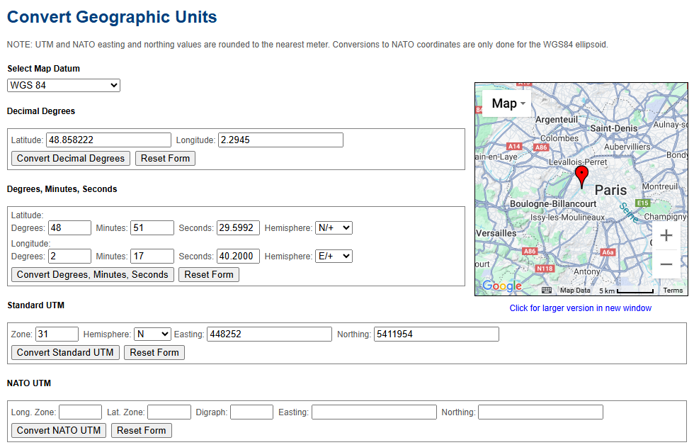

# Convert Geographic Units

## URL

[http://rcn.montana.edu/resources/Converter.aspx](http://rcn.montana.edu/resources/Converter.aspx)

## Description

Montana State University's Convert Geographic Units tool converts latitude and longitude coordinates to various alternative coordinate systems.

**Features:**

* **Map Datum:** Supports WGS84, NAD83, WGS72, etc.
* **Decimal Degrees:** Convert from and to latitude and longitude decimal degrees.
* **Degrees, Minutes, Seconds (DMS):** Convert to and from DMS latitude and longitude for Northern and Southern Hemisphere coordinates.
* **Standard UTM:** Convert to and from Zone Easting and Northing for Northern and Southern Hemisphere coordinates.
* **NATO UTM:** Convert to and from latitude zone and longitude zone, digraph, Easting and Northing.
* **Basic Interactive Google Map:** Zoom, map/satellite options & labels option.

This tool can be used by researchers to translate coordinates between formats so geolocated claims, EXIF GPS dumps or witness-reported DMS coordinates can be placed precisely onto satellite imagery or map grids. The datum selector can also be used to ensure the coordinate system matches the map or imagery used. In addition, for investigations involving military activity or NATO reporting, the tool’s NATO/UTM outputs let researchers generate standard grid references for cross-checking logs, manifests, or witness reports.

For example, select the WGS 84 datum and enter the Decimal Degrees for the Eiffel Tower (48.858222, 2.2945) to convert them into Degrees Minutes Seconds (DMS) or Standard UTM coordinates.

<figure><figcaption></figcaption></figure>

## Cost

* [x] Free
* [ ] Partially Free
* [ ] Paid

## Level of difficulty

<table><thead><tr><th data-type="rating" data-max="5"></th></tr></thead><tbody><tr><td>2</td></tr></tbody></table>

## Requirements

* **Web Access:** Any modern web browser.

## Limitations

* **UTM and NATO**: UTM and NATO easting and northing values are rounded to the nearest meter. Conversions to NATO coordinates are only done for the WGS84 ellipsoid.

## Ethical Considerations

N/A

## Guides and articles

* _Earth’s Coordinate System | Intergovernmental Committee on Surveying and Mapping_ (no date). Available at: [https://www.icsm.gov.au/education/fundamentals-mapping/earths-coordinate-system](https://www.icsm.gov.au/education/fundamentals-mapping/earths-coordinate-system) (Accessed: 28 August 2025).
* ‘Geographic coordinate system’ (2024) _Wikipedia_. Available at: [https://en.wikipedia.org/w/index.php?title=Geographic\_coordinate\_system\&oldid=1239962932](https://en.wikipedia.org/w/index.php?title=Geographic_coordinate_system\&oldid=1239962932) (Accessed: 28 August 2025).
* _Understanding Latitude and Longitude_ (no date). Available at: [https://journeynorth.org/tm/LongitudeIntro.html](https://journeynorth.org/tm/LongitudeIntro.html) (Accessed: 28 August 2025).

## Tool provider

Montana State University [https://www.montana.edu/](https://www.montana.edu/) - United States

## Advertising Trackers

* [ ] This tool has not been checked for advertising trackers yet.
* [x] This tool uses tracking cookies. Use with caution.
* [ ] This tool does not appear to use tracking cookies.

| Page maintainer                 |
| ------------------------------- |
| Freya. Reviewer Sophie Tedling; |
