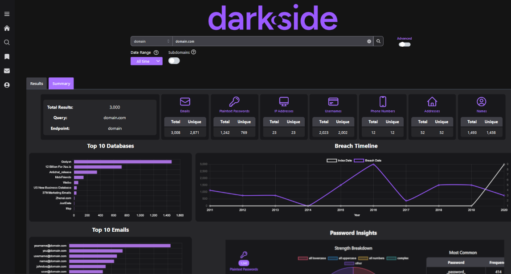

# Darkside

## URL

[https://www.district4labs.com/](https://www.district4labs.com/)

## Description

Darkside is a search engine of leaked data collected over many years. These leaks come from many sources, including large hacks/data breaches, scraped data, and marketing lists.

The data in each leak varies, but can include:

* Full Name
* Email addresses
* Usernames/social media IDs
* IP Address
* Social Security Number
* Passport number
* Date of birth
* Passwords (often plaintext but sometimes hashed)
* Phone number
* Family info
* Travel history
* Employment Information
* License plate numbers
* Financial & Demographic Information
* Crypto Wallet Addresses
* Drivers License Numbers
* Credit Card and Bank Account Numbers

The app functions through an online user interface, where a researcher can search via an email address, phone number, name, domain name, password, and many other options.

<figure><figcaption></figcaption></figure>

## Cost

* [ ] Free
* [ ] Partially Free
* [x] Paid

No public pricing information is available, [contact their sales team](https://www.district4labs.com/#email-form) for information

## Level of difficulty

<table><thead><tr><th data-type="rating" data-max="5"></th></tr></thead><tbody><tr><td>1</td></tr></tbody></table>

## Limitations

Not all data breaches are released/sold. If a data breach is kept private, Darkside cannot obtain it and it cannot be searched. Some passwords are not yet decrypted and only the hashed version of the password can be viewed.

## Ethical Considerations

Consider the ethical and legal implications of analysing and using leaked user data in your research. Carefully consider and decide whether to use this data in keeping with the nature and purpose of your work. Do the ends justify the means? Also consider potential legal regulations in your country and industry.

Darkside collects and indexes dataset that contains extreme amounts of personal information — not only phone numbers and addresses, but also information like account passwords, confidential government ID numbers and credit card info. Because of this, it is a tool that can easily be misused. It is imperative that researchers using Darkside maintain a strong journalistic justification for searching info in Darkside. Only investigations in the public interest should access material from Darkside. Credentials like passwords and confidential ID numbers should never be used to access other information, but they can be useful for verifying target identity and cross-referencing data.

Darkside is also used by police and law enforcement agencies, which may be an issue for an investigator or investigative organization.

## Tool provider

[District 4 Labs](https://www.linkedin.com/company/district4labs/) is the company that creates Darkside. Their CEO is [Matteo Tomasini](https://www.linkedin.com/in/matteo-tomasini-30498912/).

## Similar tools

There are several other tools that can be used for searching leaked databases. The two most similar ones are DeHashed and [IntelX.io](https://intelx.iohttps/bellingcat.gitbook.io/toolkit/more/all-tools/intelx.io).

IntelX has a free tier and free academic access, but does not support searching on as many attributes as Darkside. For example, you cannot search by password.

[DeHashed](https://bellingcat.gitbook.io/toolkit/more/all-tools/dehashed) provides a similar product to Darkside, but the ownership/control structure of the company that creates it is less transparent.

## Advertising Trackers

* [x] This tool has not been checked for advertising trackers yet.
* [ ] This tool uses tracking cookies. Use with caution.
* [ ] This tool does not appear to use tracking cookies.

| Page maintainer           |
| ------------------------- |
| Bellingcat volunteer team |
|                           |
