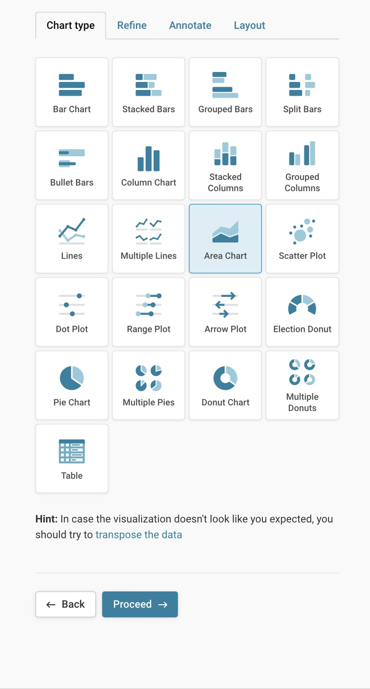

# Datawrapper

## URL



## Description

The purpose of the tool is to help users convert raw data into interactive and visually appealing graphics without requiring advanced technical skills. According to a Datawrapper co-founder:  &#x20;

"\[[t\]he idea is that you have a two-minute interaction with the tool](https://www.icij.org/inside-icij/2018/08/nine-essential-tools-from-icijs-data-journalism-and-programming-experts/)”. Its target users are primarily journalists, researchers, and data analysts who would like to communicate data insights effectively. The International Consortium of Investigative Journalism [said that](https://www.icij.org/inside-icij/2018/08/nine-essential-tools-from-icijs-data-journalism-and-programming-experts/) Datawrapper, as "an open source tool for anyone who wants to create a chart or map from their data, came out of the knowledge that expecting every journalist to know code is unrealistic."

### How it works

Datawrapper is particularly helpful during the analysis and presentation stage of digital open-source investigations. It supports three categories of visualizations: **Chart, Map, and Table**. Note that the charts, maps, and tables generated are, by default, interactive. They will respond to the user’s mouse hovering over the various data on display. &#x20;


TIP: It is helpful to check the[ Datawrapper Academy](https://academy.datawrapper.de/) website or its blog prior to beginning a project. It covers straightforward descriptions of various chart, map, and table types. This is useful for determining which kind of data and how many data points you need for a particular type of visualization.



NOTE: Prepare your data. Ensure that your data is organized, complete and refined prior to adding the data on the interface.


### CHART

Charts can turn complex data into visual representations that are easier to interpret. It simplifies information by distilling large amounts of data, making it easier to grasp key trends, patterns, and outliers without having to wade through raw data. It can also reveal relationships between variables.&#x20;

If using Datawrapper to create a chart, users have four main steps to complete. They (1) upload their data, (2) double-check that data is displayed correctly, (3) visualize, and, finally, (4) publish/download or embed the final product.&#x20;

Log in and proceed to the Dashboard. Click “Create New” and select “Chart”.

#### _**Upload Data**_

Users can upload data in four ways:&#x20;

1. Copy and paste an already existing data table into the empty field to the right.&#x20;
2. Upload an XLS/CSV file (typically one used in MS Excel)
3. Connect to Google Sheets by inputting a link. &#x20;
4. Enter a URL link to an external CSV file.

#### _**Check Data**_

Datawrapper includes this step to allow users to verify the accuracy of their uploaded data and ensure that the tool displays the information as intended. Users should carefully check that all rows and columns are present, verify that each cell contains the correct value, confirm that there is no missing data, and make sure that the categories are correctly represented.

Sample Steps for Checking Your Data <mark style="color:green;">(CLICK TO EXPAND)</mark>

Suppose you’re using Datawrapper to create a chart showing the number of armed conflict incidents reported in various countries over the past year. After uploading your data, Datawrapper prompts you to review it.

1\. **Check Rows and Columns:** Ensure that your dataset includes all the countries you want to analyze and that each country has data for all relevant time periods or types of incidents. For instance, verify that rows are present for countries like “Country X,” “Country Y,” and “Country Z,” and columns are included for different types of incidents, such as “Military Engagements,” “Civilian Attacks,” and “Terrorist Incidents.”

2\. **Verify Cell Values:** Double-check that each cell displays accurate incident counts or details. For example, if “Country X” should have recorded 200 military engagements in the past year, ensure that this number appears correctly in the corresponding cell.

3\. **Look for Missing Data:** Check for any gaps in the data. If “Country Y” is missing data for “Civilian Attacks,” confirm whether this is due to a data reporting issue or if the data is genuinely unavailable. Ensure that this omission is intentional and not an error. Missing data should be addressed or noted appropriately.

4\. **Confirm Category Accuracy:** Ensure that the categories are accurately labeled. For instance, make sure that the column headers correctly represent types of armed conflict incidents and are not mistakenly labeled with unrelated categories. Also, confirm that the row headers accurately list the countries and not the types of incidents.

#### _**Visualize**_

This section lets users customize their chart to the most minute features, allowing the audience to understand the data effectively. **Click on the different tabs below to see a representative list of features that can be customized.**&#x20;

<figure><figcaption>
This image shows the list of charts that users can customize for their data. After uploading and checking your data, proceed to the "Visualize" step. The first customization step is selecting a chart type.
</figcaption></figure>



Users have about 20 types of charts to choose from based on their needs. If unsure, the web interface has hints to help users determine which chart may work well for their type of data source.&#x20;

They are bar charts, stacked bars, grouped bars, split bars, bullet bars, column chart, stacked column, grouped columns, lines, multiple lines, area chart, scatter plot, dot plot, range plot, arrow plot, election donut, pie chart, multiple pies, donut chart, multiple donuts.&#x20;



The refine tab allows users to customize the details of your chart. This includes customizing the text, date format, and grid on the horizontal axis. As well as the formatting of the values on your chart (whether dates or currency, etc). Users can customize the opacity, colors and sort the data (smallest first, largest first, etc).



This tab is critical for providing context on the information users are conveying. It includes the Title, Description, Notes, and, most importantly, the Data Source and links to the Data source, if available.



The final step on the visualization tab is Layout customization.  The key features are: (1) Availability to produce output in different languages;

(2) Users can also customize the footer section of the chart. This includes links to data source download, image download options, shareable link, and social media share buttons. Sharing findings, and data sources are especially useful for open-source investigators, since investigations and methodology needs to be replicable to be reliable.&#x20;




TIP on the "Annotate" tab: The “Notes” section can be useful for explaining limitations to data sources, margin of errors, or other caveats about the data that should be transparent to readers.



NOTE on the "Layout" tab: Output locale language does not translate content users input but translates the built-in features of the tool itself (see Limitations Section).


#### _**Publish/Embed**_

The final step is to publish the chart. This step is particularly important if users plan to embed it in websites or blogs or share the visualization on social media platforms. Visualizations are private by default unless users publish them. &#x20;


NOTE: Datawrapper does not share visualizations publicly, even after publishing. It becomes visible only if users forward the URL to other individuals or embed it in their websites.&#x20;

Any changes made to the chart will not be visible to the audience until you "republish" the chart.&#x20;


Users can also export or duplicate the visualization. Users can export in PNG (image) format. This is a static and non-interactive version that users can download for printing or integration in reports.


TIP: Once published, any changes to formatting or editing will not be reflected. Users will have to republish their visualization after making any changes. Go to the publish section, and click “Republish.” &#x20;


Users will end up with something that looks like this (Area Chart):&#x20;


This is a sample “Area Chart” generated from Datawrapper using a sample dataset provided by the tool. It has been published on Datawrapper and embedded in this toolkit description using a URL. This is an interactive chart, and readers can hover over details on the chart to see more information. This chart is also created with an output language in Amharic. It translates built-in features into Amharic, but the data inputted manually in English remains in English. (NOTE: The chart and data are for demonstration purposes only)


### **MAP**

The map feature in Datawrapper is especially beneficial for open-source investigations, particularly when visualizing geolocated or verified incidents.&#x20;

These maps can visually represent complex data, making understanding and communicating findings easier. Investigators can use these maps to track and display various types of information, such as geographic distributions, locations of events, or the spread of certain phenomena over time. The interactive aspect allows viewers to engage with the data, zoom in on specific areas, and access detailed information, which is crucial for transparency and thorough analysis in investigations.

The types of maps you can produce are: **Choropleth map, Symbol map, and Locator map.**&#x20;

<figure><figcaption>
These are the map options users have in Datawrapper. Note the description in each type informs users about which maps may communicate their data in the most suitable way. (Image source: <a href="https://www.datawrapper.de/maps">https://www.datawrapper.de/maps</a>) 
</figcaption></figure>

### _**Choropleth map**_

&#x20;A type of thematic map in which areas (such as countries, states, or regions) are shaded or patterned in proportion to the value of a specific variable. The purpose of a choropleth map is to visually represent the distribution of a variable across different geographic areas.

Potential open-source use case for choropleth map (CLICK TO EXPAND)

Imagine you have a map of your country, and you want to show where people have the most and least access to something, like internet speeds.&#x20;

A choropleth map is like a color-coded version of this map. Each area on the map, such as states or counties, gets a different color based on how high or low the internet speeds are there. For example:

Dark Purple - might mean super fast internet speeds.

Light orange - might mean average speeds.

Yellow -  might mean slow speeds.

So, when you look at the map, you can easily see which areas have the best internet speeds and which ones don’t. The colors help you quickly understand and compare the data across different regions.

\

#### **Select your map**

This step allows users to select what kind of base map is needed for data visualization. The Datawrapper list of maps contains a vast selection. The types of maps available are: World maps, regional maps, and country maps. As an added benefit, some countries offer different subtypes as well. For instance,  Argentina also includes a map divided by departments, by electoral districts, or by provinces. It also provides a city-specific map subtype, such as the Argentina - Buenos Aires Metropolitan Area.&#x20;


TIP: Users can also upload their own maps. However, this is a slightly advanced feature, and you may consult [this guide.](https://academy.datawrapper.de/article/145-how-to-upload-your-own-map)


**Add your data**

_**Step 1 - Upload:**_ There are four ways to add your data:&#x20;

1. Fill in the automatically generated table (located on the right of the screen):&#x20;

This section is automatically prefilled with two columns: Column A for the name of the Country or/Territory and Column B for the values. You can enter the values manually in Column B based on your dataset.&#x20;

2. Upload a file: CSV or Excel (located to the left) &#x20;
3. Copy and paste data (located to the left)&#x20;
4. Connect a remote data set: input a link to external data (i.e., data from NASA) or connect to Google Sheets.&#x20;


NOTE: The pre-made table seems to depend on the kind of map you select in the previous step. If you choose a World Map for your data, it will populate Column A with a list of countries in that map. If you choose a map of Asia, it will fill Column A with a list of countries for that continent.


_**Step 2 - Match:**_ To use the map, your data needs to have information like country names, short names, and codes. In this step, choose the preferred naming convention for countries. In addition, make sure you have all the columns and rows you need to display your data.&#x20;

<figure><figcaption>
In this image, the user is creating a map showing the top 10 countries with the fastest internet speed.  The user chooses a world map. A CSV file is then uploaded. The table is automatically populated with a list of countries. Under the "Match" Tab,  we make sure that Column A corresponds to the name of the Country/Territory, and Column B corresponds to the values -- in this case the "median download speed" of the internet in each country. Notice that this will automatically use the first row for labels (we selected this by ticking the box on the top left)  (NOTE: The data on this image is for demonstration purposes only) (Image source:<a href="https://www.datawrapper.de/maps">https://www.datawrapper.de</a>).
</figcaption></figure>


NOTE: If the user does not use the rest of the countries/locations on the list, they will be grayed out in the map.


#### Visualize&#x20;

Just like in the CHART section above, the Visualize tab lets users customize their map to the most minute features, allowing the audience to understand the data effectively. Click on the different tabs below to see a representative list of features that can be customized.



The refine tab allows users to customize the details of the map. This includes:

* &#x20;Customizing the colors to represent different values;
* &#x20;Decide whether you want the legend on display and how it looks.
* Making the map zoomable or not, and the location of the zoom button;
* Map appearance: whether you want a full map or a partial map on display, the size in pixels, and map alignment;
* Appearance of region borders (or not).



Like above, this tab is critical for providing context on the information users are conveying. It includes the Title, Description, Notes, and, most importantly, the Data Source and links to the Data source, if available.

\
TIP: The “Notes” section can be useful for explaining limitations to data sources, margin of errors or other caveats that should be transparent to readers.&#x20;



Similarly, the final tab under “Visualize”  is Layout customization.  The key features are:&#x20;

* Availability to produce output in different languages;
* &#x20;Customize the footer section of the chart to include links to data source download, image download options;
* Ability to include a shareable link and social media share buttons;



Below is a sample interactive symbol map to demonstrate what the final product may look like:


This is an example of an interactive choropleth map using data from Ookla on internet speeds by country in 2023 (via [Wikipedia)](https://en.wikipedia.org/wiki/List_of_sovereign_states_by_Internet_connection_speeds#Fixed_broadband). Users can hover over each detail to see more information. Darker colors represent faster speeds, and lighter colors represent slightly slower speeds (NOTE: This map and data are for demonstration purposes only).


[Datawrapper now enhances choropleth maps by allowing the addition of patterns to color layers,](https://blog.datawrapper.de/pattern-overlay-in-choropleth-maps/) making it possible to represent categories alongside numerical data. This new feature helps reveal more nuanced regional patterns and tells a richer story beyond a single data point.

### _**Symbol map**_

A symbol map, sometimes called a point map or dot map, is a type of thematic map used in data analysis to represent data points or values across geographic areas using symbols. Instead of shading regions like in a choropleth map, a symbol map uses symbols, such as dots, icons, or shapes, to show the location and magnitude of a variable.&#x20;

<strong>Key Features of Symbol Maps</strong> (CLICK TO EXPAND)

1. Symbols Represent Data: Each symbol on the map represents a specific quantity or value. For instance, a dot might represent a certain number of people, a business, or an event.
2. Size and Color: The size and color of the symbols can vary to convey different magnitudes or categories. Larger or differently colored symbols can indicate higher values or different categories.
3. Geographic Context: Symbols are placed on the map according to their geographic locations. This helps visualize how data points are distributed across different regions.

Comparing Values: Symbol maps allow users to see patterns, trends, and distributions of the data across different areas. They are useful for understanding spatial relationships and concentrations.

Potential open-source use cases of symbol map (CLICK TO EXPAND)

Tracking the outbreak of armed clashes in a region or disease outbreaks:

_Armed clashes in a region:_ Symbol maps can visualize and analyze the distribution and frequency of armed clashes across various regions in a country over a specified period of time.

_Disease Outbreaks:_ If tracking a disease outbreak, symbols could represent the number of reported cases in various locations, helping to visualize areas with higher or lower case numbers.

&#x20;


**NOTE #1:** **Prepare your data (do not skip this step)**: Whether you are using your own data or using data from an external source, it is important to make sure the data has all the information required by Datawrapper. For symbol maps, “[Datawrapper](https://academy.datawrapper.de/article/114-how-to-create-a-symbol-map-in-datawrapper) will **need**  **(1) addresses/place names or (2) latitudes/longitudes** to know where you want your points to be.” Users should be as specific as possible.&#x20;

Example of specificity of **addresses/place names** as provided by the [tool](https://academy.datawrapper.de/article/193-symbol-location-accuracy-using-addresses-place-names):&#x20;

* Neighborhood: Williamsburg, Brooklyn, New York
* City: New York City, New York
* Zip Code: 11212, Kings County, New York
* County: Kings County, New York
* State/Land: New York State, USA

**NOTE #2:** **Use latitude/longitude coordinates for better precision**. According to the tool, uploading latitudes and longitudes ensures accurate mapping because city names can be ambiguous or duplicated. For instance, the name "Vancouver" could refer to cities in different locations, like Vancouver, Canada, or Vancouver, Washington, U.S.. Geocoders, including Datawrapper, might default to the most prominent city with that name unless precise coordinates are provided. By using latitudes and longitudes, you ensure that the exact locations are mapped correctly, avoiding confusion from similar or differently named places.


The steps for creating a symbol map are very similar to those for the choropleth map (See above). There is a slight difference in the “Visualize” section of symbol maps. Click on each tab below to see the different features.&#x20;



* Customize symbols of your choice and their size.
* Users can also customize the colors and choose the column they want to be highlighted on the map. For example, if looking at incidents of armed clashes in Burkina Faso, a user might want to highlight how many of those are targeting civilians. In this case, select the column “civilian targeting”. &#x20;
* Customize map features: by making the map zoomable or by including an “inset map” to provide context on the location for those who are not familiar with it.



Just like in charts, this section is critical for providing context on your data. It includes putting a Title, Description, Notes, and, most importantly, the Data Source and links to the Data source, if available.

\
TIP: The “Notes” section can be useful for explaining limitations to data sources, margin of errors or other caveats that should be transparent to readers.&#x20;



Similarly, the final tab is Layout customization.  The key features are:&#x20;

* Availability to produce output in different languages&#x20;
* &#x20;Customize the footer section of the chart to include links to data source download, image download options
* Ability to include a shareable link and social media share buttons&#x20;



Below is a sample symbol map. After doing the steps outlined above, the symbol map should look something like this:


This is a sample interactive symbol map generated through Datawrapper. We first went to[ ACLED](https://bellingcat.gitbook.io/toolkit/more/all-tools/acled) to download our data, which we then uploaded as a CSV file to the tool. We have chosen “spikes” as a symbol to demonstrate the number of armed clashes during a short timeframe in Burkina Faso. We have customized the look of the map to provide more info to a reader who may be unfamiliar with the region. We have included visible regional boundaries and an inset map (a world map to show where Burkina Faso is relative to the rest of the world). We have also included a zoom option and social media share options. More importantly, we have annotated it so that we provide a title, description, and data source for the readers. (NOTE: The map is for demonstration purposes only)


Datawrapper now supports arrow maps, also known as swing or hedgehog maps. These maps are valuable tools for visualizing directional changes in data. NOTE: This map type is useful when users have to analyze **two opposing data sets**. They can show "swings" between these two opposing categories, such as shifts in political party support or geographic increases and decreases in metrics like population or housing prices. Arrow maps are especially useful for election coverage. Steps on how to use them are available [here.](https://blog.datawrapper.de/arrow-maps/)​

### _Locator map_

A locator map is a small map that shows the location of a specific area within a larger context. It's often used to orient viewers and provide a geographical perspective. According to[ the tool provider](https://academy.datawrapper.de/article/161-how-to-create-a-locator-map), “They are a great choice if you want to show where something is located or happened.”

Possible open-source use case for locator maps (CLICK TO EXPAND)

Locator maps can be useful tools for open-source investigators. They provide visual context for data, helping to: &#x20;

* [Visualize Geographic Scope](https://www.aktek.io/blog/using-location-intelligence-in-open-source-investigations): Understand the spread of events or information across a region.
* Identify Patterns: Recognize trends or clusters in data distribution.
* [Corroborate Information:](https://www.aktek.io/blog/using-location-intelligence-in-open-source-investigations) Compare different datasets to verify accuracy and completeness.
* [Communicate Findings ](https://www.aktek.io/blog/using-location-intelligence-in-open-source-investigations)(especially geolocated incidents in conflicts or violent protests): convey complex information to audiences through visual storytelling.

By placing data in a geographic context, investigators can gain deeper insights and uncover hidden connections.  &#x20;

For example: [An article ](https://www.bbc.com/news/world-middle-east-60691503)showing demolitions and evictions in Jeddah, Saudi Arabia, may benefit from showing the different locations of demolished buildings in the neighborhood. &#x20;

Below are the main steps for creating locator maps:

#### **Data Preparation**

* Identify locations: Determine the specific locations you want to highlight on your map.
* Gather coordinates: Collect the latitude and longitude coordinates for each location. You can use tools like Google Maps to obtain this information.
* Prepare data: Organize your location data into a CSV or Excel file with columns for latitude, longitude, and location name (optional).

**Create a New Map**

* Log in to your Datawrapper account or create a new one.
* Click on "Start Creating" and then select "New Map."
* Choose the "Locator Map" option.

**Add Markers**

Markers are [“the symbols, lines, areas, and/or text that you add on top of the map.”](https://academy.datawrapper.de/article/161-how-to-create-a-locator-map)&#x20;


NOTE: Every marker's position is fixed to the map's position; if you move the map view, the markers will move along with it.&#x20;


* &#x20;Click on the "Add Markers" button.
*   You have two options:

    (1) Manual input: Enter the latitude and longitude coordinates for each location directly into the fields.

    (2) Upload CSV: If you prepared your data in a CSV, upload it here. Datawrapper will automatically populate the map with markers based on the latitude and longitude columns.
* Customize marker appearance (color, size, icon) as needed.

**Design Your Map**

* Base map: Choose an appropriate base map from the available options. Consider the style and level of detail required for your map.
  * Users can now use a ["globe projection" type of locator map. ](https://www.datawrapper.de/blog/new-globe-projection-locator-maps)This is especially usefiul for:&#x20;
    * **Large regions showing accurate relative sizes** - Countries appear in their true proportions rather than distorted
    * **Global routes** - Flight paths and shipping lanes that span continents look natural following Earth's curvature.&#x20;
* Zoom level: Adjust the zoom level to focus on the desired area while providing enough context.
* Map style: Customize the map appearance with colors, fonts, and other design elements to match your branding or preferences.


TIP: Users can adjust the zoom level, rotation, tilt, and height of the map. Decreasing the tilt can show mountains if the location has dramatic terrain.


**Add Annotations**

* Labels: Add labels to your markers by clicking on them and entering the location name.
* Pop-ups: Create informative pop-ups for each marker by adding additional details such as descriptions, images, or links.
* Legend/“Map Key”: Include a legend to explain the meaning of different marker types or colors if necessary.

**Publish and Embed**

* Once you're satisfied with your map, click on "Publish."
* Choose the desired embed code format (HTML, iframe, etc.) to integrate the map into your website or other platforms.

NOTE: Locator maps can be exported in GeoJSON format


This is a sample locator map generated in Datawrapper. It shows the locations of various museums one might visit in the city. By highlighting these places with “markers” in red, the reader can see where they are in relation to the rest of the city (NOTE: This map is for demonstration purposes only).


### TABLE

Tables are highly versatile data visualization tools, allowing for the inclusion of text, numbers, images, and charts within each cell. This structured approach makes it easier to communicate complex information effectively.

**Prepare Your Data**

* Organize Your Data: Ensure your data is well-organized in a spreadsheet or CSV file. Each column should have a header, and each row should represent a different data point.
* Check Data Types: Ensure your data is correctly typed (e.g., numerical, text). Datawrapper will automatically recognize these types, which helps format the table correctly.

**Start a New Visualization**

* Click on "Create a New Chart.": After logging in, you’ll be taken to the dashboard. Click on the "Create a New Chart" button.
* Select "Table": Datawrapper offers several chart types, but for this tutorial, select "Table" from the list of options.

**Table Creation**

1. Choose the "Table" chart type.
2. Customize your table:

* Add a title and description.
* Adjust column widths and formatting.
* Use color coding or highlighting for emphasis.

**Data Visualization**&#x20;

* Integrate charts: Add small charts (sparklines) within table cells for visual representation of data trends.
* Highlight key information: Use conditional formatting to draw attention to specific data points.

**Publishing and Sharing:**

1. Choose a publishing option (embed, share link, download).
2. Customize the appearance of your table (theme, colors, fonts).
3. Publish your table and share it with your audience.

Additional Tips (CLICK TO EXPAND)

* Keep it simple: Prioritize clarity and readability.
* Label clearly: Ensure column headers are descriptive and easy to understand.
* Use whitespace: Enhance readability by adding space between columns and rows.
* Mobile-friendly: Design your table to be responsive for different screen sizes.

### COLLABORATION AND TEAMS&#x20;

Datawrapper offers team features, enabling multiple users to work together on visualizations. This is particularly useful for investigative teams, allowing for shared insights and efficient workflows. It is also especially useful for collaboration within one organization and in instances where a team from one organization partners with a team from another organization. &#x20;

Detailed instructions on creating and managing Teams in Datawrapper can be found [here](https://academy.datawrapper.de/article/209-how-to-create-a-team) and[ here](https://academy.datawrapper.de/article/217-what-are-teams).  However, below is a summary of those steps and some important caveats. &#x20;


NOTE #1: According to the tool provider, if you create a team, you will automatically be the team owner, and every member of a team can use the features of the team owner's pricing plan. For example, if you bought a custom plan with two custom design themes, and you create a team, everybody in your team will be able to create charts with these two themes, use the PDF export, and use all other custom features.

NOTE #2: Even as a “team owner,” members you have invited have the ability to edit the visualizations. Every member can edit, publish, or embed any visualization in a team folder.


**Click between tabs to see the steps:**



1. Log in to your Datawrapper account.
2. Click on the menu icon (☰) and select "My Teams."
3. Click on the "Create team" button.
4. Give your team a name and invite members.



Before creating a new chart, map, or table on Datawrapper, ensure you're working in the correct team. Check the top right corner to see which team is currently selected (with a checkmark).

[https://academy.datawrapper.de/article/214-how-to-select-the-active-team-and-what-that-means](https://academy.datawrapper.de/article/214-how-to-select-the-active-team-and-what-that-means)



1. Organization: Create folders within your team to keep visualizations organized.
2. Collaboration: Share visualizations and collaborate with team members in real-time.
3. Team Settings: Customize team settings, including default folders, notification preferences, and embed code options.




NOTE: Collaboration in Teams[ is live](https://blog.datawrapper.de/introducing-live-collaboration/). This means all members can access the edits and visualizations simultaneously. Users can see when colleagues are editing, and they can see yours. The edits are associated with an icon showing the account info/picture of the team member.


If you work with a team or with a Teams account, Datawrapper's visualization archive is a central hub for all your team's visualizations. It includes features like folders, team-wide search, and custom fields to streamline management, whether you're solo or part of a large team. [Recent updates have enhanced the archive, making it more intuitive, practical, and faster. ](https://blog.datawrapper.de/visualization-archive-updates/)This new feature appears to be available to all accounts, not just the paid tiers. \

### POWERPOINT INTEGRATION

Datawrapper recently [added an integration into ](https://blog.datawrapper.de/create-data-visualizations-in-powerpoint/)PowerPoint. In sum, the features are:

* **New Add-In for PowerPoint:** Datawrapper released a free add-in for PowerPoint, available on Microsoft AppSource.
* **Access & Edit Visualizations:** Access, embed, and edit all your Datawrapper visualizations directly within PowerPoint.
* **Private Visualizations:** Visualizations remain private by default, with no need to publish them online.
* **Real-Time Updates:** Stay connected to live data sources and update visualizations in one click before presentations.
* **Cross-Platform Adaptability:** Visualizations created in PowerPoint can be used interactively on websites, as PNGs on social media, or in PDFs and print reports.
* **Interactive Visualizations:** A separate add-in enables fully interactive features like zoomable maps, hover tooltips, and sortable tables. Learn more in the Datawrapper Academy.

After testing this, we learned that the format differs slightly from the web version. The menu and editing options seem limited compared to the web interface. It may also take more time to familiarize yourself with the PowerPoint interface. Depending on the computing capability of your device, the visualizations in PowerPoint tend to lag sometimes when a feature in the visualization is being edited.&#x20;

Summary of key features that may be helpful for beginner open-source researchers (CLICK TO EXPAND)

1. **Platform:** Datawrapper is a web-based tool accessible from any device with internet access.&#x20;
2. **Integration:** Supports integration with various data sources and formats for data import.&#x20;
3. **Collaboration:** users can set up teams to collaborate on a project.&#x20;
4. The **Free version** has unlimited visualizations and a lot of powerful features.&#x20;
5. **Customization:** It provides options for customizing the look and feel of visualizations to match user preferences
6. **Export Options:** Allows users to export visualizations in static format such as in PNG, PDF, or have an interactive graph in HTML that users can forward to social media, or embed in websites.
7. **Easy User Interface:** Datawrapper features a straightforward interface, drop down menu and integrated hints and explanation for users.&#x20;
8. **Support**: Offers well-written tutorials and support resources through their [Datawrapper Academy](https://academy.datawrapper.de/) or through their [training materials](https://www.datawrapper.de/training-materials).&#x20;

## Cost

* [ ] Free
* [x] Partially Free
* [ ] Paid

NOTE: Even the free version includes robust features and can perform most data visualization tasks very well. The information on the pricing is available at: [https://www.datawrapper.de/pricing](https://www.datawrapper.de/pricing)

## Level of difficulty

<table><thead><tr><th data-type="rating" data-max="5"></th></tr></thead><tbody><tr><td>2</td></tr></tbody></table>

For charts and tables, the difficulty is level 2 out of 5.&#x20;

For maps, the difficulty level can increase from 2 to 3 out of 5.&#x20;

The difficulty level also increases as your dataset gets more complicated. The difficulty level also depends on the level of customization users want in order to communicate their data in these visualizations. Each visualization type has many features that are not obvious to beginners.&#x20;

## Requirements

1. Create a user account.
2. Internet connection and a modern browser;
3. Desktop device;
4. An organized external dataset;
5. Users may need a subscription to access extra features. The free version, however, is more than enough for many users.

## Limitations

**1. Charts:**

* _**Data Skills:**_ Creating clear charts might require some knowledge of Excel formulas and data formatting. Uploading incomplete data can lead to unexpected results. Datawrapper has a list of troubleshooting issues that seem to be related to how CSV files are formatted prior to uploading them, for instance, on [how to prevent Excel from changing numbers into dates](https://academy.datawrapper.de/article/89-prevent-excel-from-changing-numbers-into-dates), or [on receiving the message "undefined" when uploading a CSV](https://academy.datawrapper.de/article/109-undefined-what-it-means-and-what-to-do).&#x20;
* _**Missing Data:**_ Line charts might show gaps if your data has missing values. This isn't always a bad thing, but it's important to understand why the gaps appear.
  * Patchy data in line charts sometimes appears if the dataset is missing values. Sometimes it is because there is no data available  (in which case, Datawrapper does not want to mislead by filling in a connection between one data point and another). Sometimes it is because of [problems formatting the data](https://academy.datawrapper.de/article/321-patchy-data).&#x20;

**2. Maps:**

* _**Geocoding Knowledge:**_ You'll need a basic understanding of geocoding, which is the process of converting addresses to map locations.
* _**Geocoding Accuracy:**_ Datawrapper's geocoder [isn't perfect](https://academy.datawrapper.de/article/193-symbol-location-accuracy-using-addresses-place-names). Some locations might be misplaced. Knowing the exact coordinates of a place can help avoid errors.
* _**Base Map Issues:**_ Datawrapper might have trouble displaying certain base maps if the data format is unusual.
  * Datawrapper [mentions that](https://academy.datawrapper.de/article/220-my-choropleth-symbol-maps-doesnt-load) “if there is a slash in one of the country descriptions, e.g. "Bosnia/Herzegovina", it might cause Datawrapper to not parse the data properly. If you get rid of the slash and write 'Bosnia and Herzegovina', the data will load properly.”&#x20;
*   _**Map Zoom Levels:**_ Setting map zoom levels correctly is crucial. If not done right, labels might disappear when zooming in or out, confusing viewers.

    * Some map features and their functions are not immediately obvious to the user. For example, errors appear when making the map zoomable. Map labels sometimes do not appear at all.&#x20;
    * When you embed a map, it starts at a zoomed-out view. This is okay for a general overview, but it can be difficult to see details. Zooming in lets you explore specific areas.
    * If you don't set it up right, important information like city names or labels might disappear when you zoom in or out. This can be confusing for people trying to understand your map.
    * Datawrapper explains that "you will find that the map labels don't show up before you either zoom in or set the minimum zoom for labels to 1.” To avoid this, you need to make sure the labels are visible[ by setting them to 1](https://academy.datawrapper.de/article/238-my-map-labels-dont-show-u), no matter how much people zoom in or out.

* Copy-Pasting and CSV Import Errors\
  A significant limitation of the map feature arises during the data import process, particularly when copying and pasting data such as a list of locations and their respective coordinates. Based on our tests, there are instances where some values are successfully copied into the platform, while others are either omitted or altered unintentionally. Names of the locations are also sometimes missing from the list or rearranged in a different order. This inconsistency can introduce errors in the dataset and compromise the reliability of the final visualization.
*   Potential Data Alignment Issues\
    The irregularity in data transfer can lead to misaligned rows or columns, especially when working with large datasets. This may require additional manual verification to ensure that all data points are correctly mapped to their respective geographies.

    We found that employing data in smaller batches may be a more reliable approach. For extensive datasets, consider pasting or importing the data in smaller batches to detect errors more quickly and amend any errors immediately.

**3. General:**

* _**Data Preparation:**_ Data needs to be well-organized and clean for Datawrapper to work effectively. This might require some data analysis skills or a good understanding of your data and its purpose. Uploading incomplete data can lead to delays and errors.&#x20;
  * Prepping and organizing data requires some background in data analysis or, alternatively, a good understanding of your data and what you want to highlight. This is particularly an issue because Datawrapper can take time to load data and is prone to formatting errors. According to this [article](https://www.analyticodigital.com/blog/top-data-visualization-tools-a-comparative-analysis), “Training staff and extracting meaningful insights post-visualization are additional hurdles.”&#x20;
* _**Data Limits:**_ Datawrapper [works best with smaller datasets](https://academy.datawrapper.de/article/310-max-size-for-data-upload). Uploading very large datasets can lead to slow loading times and lag.&#x20;
* _**Updates:**_ You can't update visualizations once published. However, you can update the data each time you open the chart and republish.
* _**Translations:**_ Datawrapper can translate the built-in features of the tool, but not the content you manually enter (like the chart title). This can be confusing for viewers in different languages.
  * However, it translates the built-in features of the tool itself. For example, the chart's title is usually put in manually by the user. If this title is in English, it will not be translated once users choose an output locale in a different language. Measurements (miles/kilometers), names of countries, distance, and date formatting are all part of the tool and will, therefore, be translated if specified in the output locale.&#x20;
* _**Privacy:**_ For the free account, even if you cancel your subscription or delete your account, your visualizations will [remain online](https://www.datawrapper.de/pricing) (see also [here](https://www.datawrapper.de/faq#what-happens-to-my-visualizations-when-i-cancel-my-plan-or-close-my-account)).
* _**Single Sign-On:**_ Free and custom plans don't offer a central login system for managing user access.

For a more complete list of limitations, see:

* [https://academy.datawrapper.de/category/83-troubleshooting?sort=custom](https://academy.datawrapper.de/category/83-troubleshooting?sort=custom)

## Ethical Considerations

The primary ethical consideration about data visualizations is the possibility that information can be misleading, no matter how good it looks:[“Some are misleading by mistake, some are misleading on purpose.”](https://www.dataspire.org/blog/5-tips-to-be-aware-of-how-charts-lie-book-review) This[ article ](https://medium.com/nightingale/constructing-a-career-in-data-visualization-the-how-18ad4900c120)discusses the possibility that charts can be misleading and that data interpretation has some general pitfalls.

<a href="https://www.dataspire.org/blog/5-tips-to-be-aware-of-how-charts-lie-book-review">Some examples </a>of common pitfalls (CLICK TO EXPAND)

**Cherry-picking Data:** Selecting only data points that support a particular narrative while omitting others. &#x20;

**Outliers:** Emphasizing or downplaying outliers to influence perception.

**Visual tricks such as “Chartjunk,”** which refer to excessive clutter or unnecessary elements that can distract from the main message.

**Misleading Visual Elements:** Using colors, shapes, or sizes that can alter perception.

\
However, to mitigate this, practice is key. "This practice of constantly interrogating your data with a careful skepticism is likely the most important aspect of working with data," writes [Will Chase](https://medium.com/nightingale/constructing-a-career-in-data-visualization-the-how-18ad4900c120).

## Guides and articles

_**Bellingcat Research**_

This tool was used in a Bellingcat investigation: ["What Meta's Ad Library Shows About Harris and Trump's Campaigns on Facebook and Instagram."](https://www.bellingcat.com/resources/2024/11/04/us-presidential-election-trump-harris-meta-ads/) By Pooja Chaudhuri and Melissa Zhu&#x20;

_**Datawrapper guides**_

Datawrapper Academy: [https://academy.datawrapper.de/](https://academy.datawrapper.de/) &#x20;

Datawrapper Training Slides: [https://www.datawrapper.de/training-materials](https://www.datawrapper.de/training-materials)

How to create teams and other guides related to working in collaboration: [https://academy.datawrapper.de/category/210-teams](https://academy.datawrapper.de/category/210-teams)

_**Guides from other sources**_&#x20;

Video Tutorial: [Datawrapper Training](https://www.youtube.com/watch?v=adUpZXL4Ja0\&list=PLjm9uN3XhRuFDb_8bhO5t_XiTOzXeGAMo). By Adam Robert Marton, University of Maryland's Philip Merrill College of Journalism.

Guide from The Guardian: [https://www.theguardian.com/global-development-professionals-network/2014/aug/28/interactive-infographics-development-data](https://www.theguardian.com/global-development-professionals-network/2014/aug/28/interactive-infographics-development-data)&#x20;

_**Guides about Misleading Charts and Graphs:**_&#x20;

University of Pittsburgh [https://hsls.libguides.com/c.php?g=1333609\&p=9828731#:\~:text=Data%20can%20be%20manipulated%20by,can%20be%20displayed%20by%20selecting](https://hsls.libguides.com/c.php?g=1333609\&p=9828731)&#x20;

Nightingale, Journal of Data Visualization Society[https://medium.com/nightingale/constructing-a-career-in-data-visualization-the-how-18ad4900c120](https://medium.com/nightingale/constructing-a-career-in-data-visualization-the-how-18ad4900c120)&#x20;

Dataspire.Org [https://www.dataspire.org/blog/5-tips-to-be-aware-of-how-charts-lie-book-review#:\~:text=WHAT%20CAN%20WE%20BE%20AWARE,by%20suggesting%20misleading%20patterns](https://www.dataspire.org/blog/5-tips-to-be-aware-of-how-charts-lie-book-review)

## Tool provider

Datawrapper, Germany&#x20;

## Advertising Trackers

* [x] This tool has not been checked for advertising trackers yet.
* [ ] This tool uses tracking cookies. Use with caution.
* [ ] This tool does not appear to use tracking cookies.

| Page maintainer |
| --------------- |
| Afton           |
|                 |
