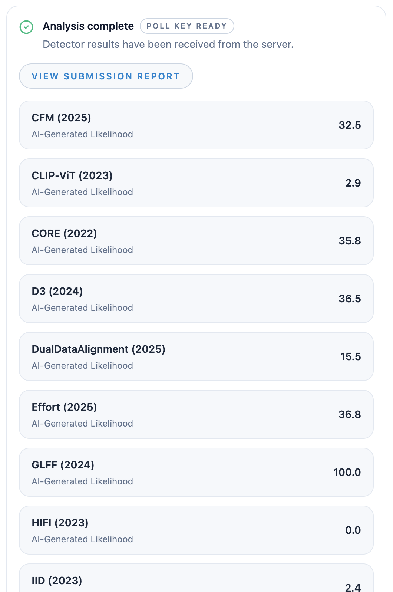
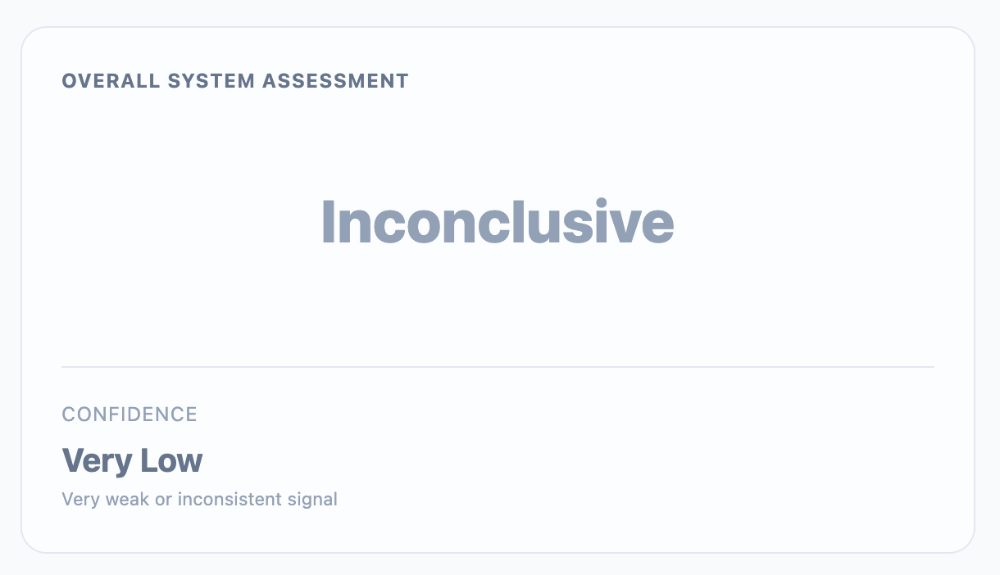

# DeepFake-O-Meter

## URL

[https://zinc.cse.buffalo.edu/ubmdfl/deep-o-meter/](https://zinc.cse.buffalo.edu/ubmdfl/deep-o-meter/)

## Description

A simple drag-and-drop online tool, DeepFake-O-Meter allows users to upload photo or video content to check for potential deepfakes: digital images that have been convincingly generated or altered to portray people saying or doing things that did not occur.

Users can upload material in any of the following formats:

**Images:** JPG, PNG, BMP and TIFF\
**Video:** MP4, AVI, MOV\
**Audio:** WAV, MP3

After submitting the material for analysis, users will be asked to confirm whether they know it is AI-generated, and whether they want to share data with DeepFake-O-Meter. Once those selections are made, the tool will begin its analysis, using a variety of AI detectors. It will also provide an estimated wait time for the analysis.

There is dramatic variance among the different detection models. Sample analysis conducted on screenshots of imagery from the site ThisPersonDoesNotExist.com, a random AI face generator, took under two minutes and resulted in ratings ranging from 0% certainty of artificial content to 100% for a single image, with many in between.

<figure><figcaption></figcaption></figure>

To view an overall assessment, users can click on "View Submission Report". This will provide a rating of overall confidence in whether the supplied content is genuine or artificially generated, by aggregating ratings from the various AI detectors. It will also provide a measure of confidence in that assessment.

<figure><figcaption></figcaption></figure>

While tools like DeepFake-O-Meter are designed to help combat the growing tide of visual misinformation and disinformation online, providing open-source researchers with a quick and simple method for attempting to verify or debunk content, such tools are notoriously unreliable (see Limitations section below).

### Use Cases

* [The Reuters Institute](https://reutersinstitute.politics.ox.ac.uk/news/truth-casualty-how-indian-fact-checkers-debunked-false-claims-during-india-pakistan-crisis) describes how an Indian fact-checking site used DeepFake-O-Meter to investigate audio clips falsely attributed to Prime Minister Narendra Modi and other government officials.
* [AFP Fact Check](https://factcheck.afp.com/doc.afp.com.89RJ49E) used DeepFake-O-Meter to help debunk a video purporting to show a Bangladeshi woman pleading for help.
* [Forbes](https://www.forbes.com/sites/emmawoollacott/2026/04/21/theres-no-such-thing-as-brain-honey/) referenced Deep Fake-O-Meter in an article debunking online advertisements for a product claiming to cure Alzheimer's disease.

## Cost

* [x] Free
* [ ] Partially Free
* [ ] Paid

## Level of difficulty

<table><thead><tr><th data-type="rating" data-max="5"></th></tr></thead><tbody><tr><td>2</td></tr></tbody></table>

## Requirements

You must register using a valid email address in order to use the site.

## Limitations

* **Accuracy:** AI detectors are notoriously unreliable, often providing mixed or uncertain results; running the same image through DeepFake-O-Meter more than once may result in different ratings. DeepFake-O-Meter acknowledges that its authenticity scores "reflect statistical similarity to training data patterns and do not constitute definitive proof of authenticity or manipulation", noting that the results should be "interpreted in conjunction with contextual and investigative analysis".
* **File size:** Larger files may cause the system to time out, which could be an issue for lengthy or high-resolution videos.
* **Processing times:** These may fluctuate dramatically depending on file size, with larger videos taking more time to analyze than smaller images. Before starting an analysis, users have the option to exclude detection models with longer processing times, thereby speeding up the overall process.
* **Video formats:** The tool may not support all video formats, thus requiring users to convert videos to a compatible format before submission.

## Ethical Considerations

* **Privacy:** Users must consider the privacy implications of submitting personal or sensitive videos or images to an online service for deepfake detection.
* **Bias and fairness:** The algorithms powering DeepFake-O-Meter might be subject to biases in their training data. This could potentially result in unequal performance across different demographics, such as gender or ethnicity.

## Guides and articles

* [Developer resources](https://github.com/yuezunli/deepfake-o-meter) on Github
* [Tutorial](https://www.youtube.com/watch?v=Om4-bE9a61I) by project director Siwei Lyu
* [Reuters Institute article](https://reutersinstitute.politics.ox.ac.uk/news/spotting-deepfakes-year-elections-how-ai-detection-tools-work-and-where-they-fail) on how AI detection tools work and where they fail

## Tool provider

The UB Media Forensics Lab, based at the University at Buffalo in New York, describes itself as a team of researchers and engineers "dedicated to advancing synthetic media detection". Contact information for the project team is [available here](https://zinc.cse.buffalo.edu/ubmdfl/deep-o-meter/contact).

## Similar tools

[AmIReal](https://seintpl.github.io/AmIReal/): This GAN detector can be used to help determine whether faces were generated by ThisPersonDoesNotExist.com.

[InVID](https://bellingcat.gitbook.io/toolkit/more/all-tools/invid): This toolkit, which supports the verification of images and videos, includes restricted functionality enabling users to assess the probability that a video contains AI-manipulated faces.

## Advertising Trackers

* [x] This tool has not been checked for advertising trackers yet.
* [ ] This tool uses tracking cookies. Use with caution.
* [ ] This tool does not appear to use tracking cookies.

| Page maintainer           |
| ------------------------- |
| Bellingcat volunteer team |
| August 2026               |

