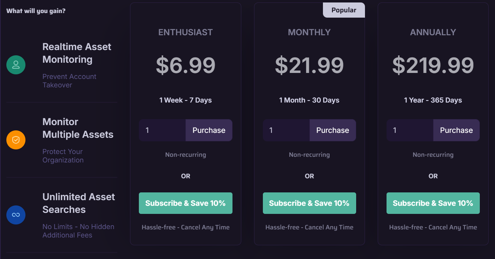

# DeHashed

URL

[https://dehashed.com/](https://dehashed.com/)

## Description

DeHashed has compiled a searchable database of leaked personal information and sensitive data, and launched its web domain registration search tool in April 2025.&#x20;

The platform now operates across four service lines:

* **Search:** DeHashed's original offering, Search allows users to search through billions of records, including names, email addresses, usernames, IP addresses, physical addresses, phone numbers, vehicle identification numbers, and web domains.&#x20;
* **Monitoring**: Its new Monitor function alerts users in the event that their personal data, such as email addresses, is leaked. The free subscription allows for 10 monitor tasks.
* **API**: Users can integrate the Dehashed API into their own applications.
* **WHOIS**: The newly-launched WHOIS database allows users to search through web domain registration information, including historical data.

DeHashed is ostensibly designed for individuals and companies to detect and monitor data breaches in real time, but its **Search** and **WHOIS** offerings also be effectively used for open source research.&#x20;

You can search by domain or field, increase or decrease the number of results displayed, use wildcard characters, run regex searches (a form of advanced searching that looks for specific patterns) and mix operators (e.g. email and username together).

DeHashed publishes a detailed search guide [here](https://app.dehashed.com/documentation/search-guide), explaining how to search by field, use wildcard characters, or search a specific data origin. The platform also published a list of its data sources [here](https://dehashed.com/data-wells), and has a FAQ page [here](https://app.dehashed.com/documentation/faq).

### Using Search for Open Source Investigations

For example, you can use DeHashed to help search for someone who is trying to conceal their identity.&#x20;

You can start by running an email address through DeHashed to identify accounts your subject maintains, along with the passwords associated with those accounts (do not try to log in to any person's account, this is unethical!). You can then go back to the DeHashed search engine and run a new search for that password, which may identify a whole new set of accounts and email addresses that use the same password. That way, you might be able to find out whether your subject is operating under an alias name or email address, all the while using and recycling the same passwords.&#x20;

You might also find IP addresses and location-specific accounts that can help you start spotting patterns and clues as to your subject's location or activities. &#x20;

Pay attention to their usernames and passwords. Do they contain numbers that could represent dates of birth? Or the name of the city they live in?&#x20;

Record any relevant results and data points as you go to map out a subject's online footprint. How many usernames, email addresses, IP addresses are they linked to?  What do these tell us about their online activities, interestes, location etc.?

#### Step-by-step guide on how to use Search

The search engine is extremely simple to use and user-friendly. You can run a keyword search either by field or across all fields:

<figure><figcaption>
Screenshot 1. Search interface.
</figcaption></figure>

If you search by, say, email address, you will get a list of various data points associated with that email, including names and passwords. You can then run more searches against, for example, the names and passwords you identified during your original search with a view to finding more accounts and generating fresh research leads.&#x20;

<figure><figcaption>
Screenshot 2. You need a paid subscription to view results.
</figcaption></figure>

It is free to search if you set up an account with just an email and password, but **you need a paid subscription to actually view the results**. See below for pricing information. &#x20;

### Using WHOIS for Open Source Investigations

WHOIS databases can help you understand who is behind a website. There are two main contexts/ways you can approach this:

1. Run a search against a domain name to find out more information about the identities of the individuals or companies that have registered a website.&#x20;
2. Run a search against an individual or organisation to find out if they run any websites. &#x20;

#### Step-by-step guide on how to use WHOIS

Search by domain name, keyword, IP address or other domain-related information. The different categories are in the screenshot below, and the search engine will prompt you with the type of information you need to enter for each category.

There are two main ways you can search:

* The name of the domain (website) by using the WHOIS tab to find out current registration information, or the WHOIS History tab to retrieve information regarding previous owners or changes in ownership over the past ten years;
* Any information you might have about the owner, ranging from name and physical address to their email address and phone number, by using Reverse WHOIS.

<figure><figcaption>
Screenshot 3. WHOIS interface.
</figcaption></figure>

You will need to purchase credits to run a search.

## Cost

* [ ] Free
* [ ] Partially Free
* [x] Paid

You can use Search for free, but you need to purchase a subscription to view the results.&#x20;

<figure><figcaption>
Screenshot 4. Search pricing.
</figcaption></figure>

To use WHOIS, you need to buy credits.&#x20;

<figure><figcaption>
Screenshot 5. WHOIS pricing.
</figcaption></figure>

The current pricing information for each one of its four offerings can be found [here](https://app.dehashed.com/subscriptions) (click 'Purchase').&#x20;

## Level of difficulty

<table><thead><tr><th data-type="rating" data-max="5"></th></tr></thead><tbody><tr><td>2</td></tr></tbody></table>

## Requirements

You have to create an account to run searches. This is relatively easy and requires only an email address and password.&#x20;

## Limitations

DeHashed aggregates leaked data and is not a comprehensive repository of every email address, username etc. in existence. If you can't find a data point in DeHashed, it doesn't mean that it doesn't exist.&#x20;

## Ethical Considerations

Consider the ethical and legal implications of analysing and using leaked user data in your research. Carefully consider and decide whether to use this data in keeping with the nature and purpose of your work. Does the end justify the means? Also consider potential legal regulations in your country and industry.

## Guides and articles

The following YouTube [tutorial ](https://www.youtube.com/watch?v=UeI7wEdLPn8)demonstrates how to use DeHashed creatively to generate new research leads. NB: the tutorial uses the old version of the platform, but the research tips are still valid.

## Tool provider

Not so clear. The website's privacy policy suggests that DeHashed is registered to an address in Las Vegas, Nevada.

## Advertising Trackers

* [x] This tool has not been checked for advertising trackers yet.
* [ ] This tool uses tracking cookies. Use with caution.
* [ ] This tool does not appear to use tracking cookies.

| Page maintainer |
| --------------- |
| Ana             |
|                 |
