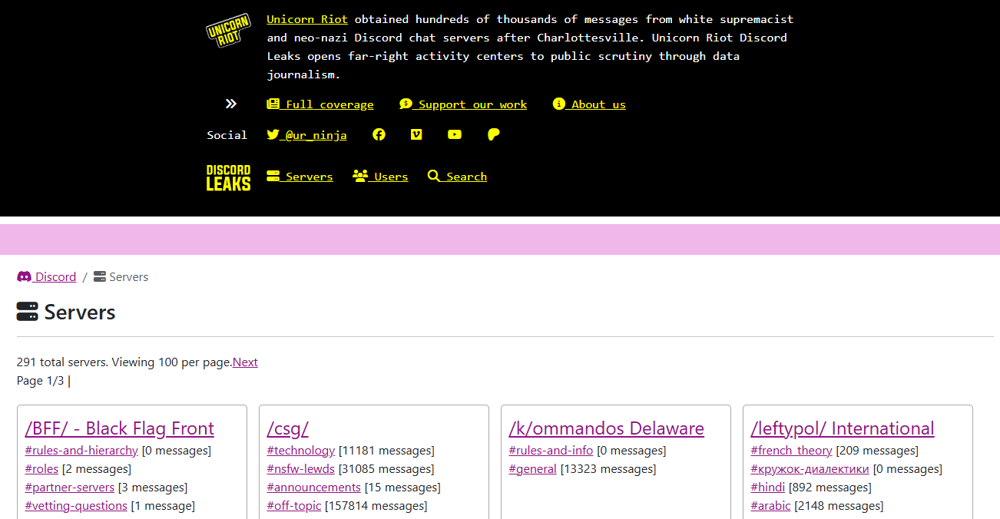

# DiscordLeaks

## URL

[https://discordleaks.unicornriot.ninja/](https://discordleaks.unicornriot.ninja/)\
(last accessed Jan 31. 2026)

## Description

**DiscordLeaks** is a Unicorn Riot–run web app for searching and browsing leaked chat logs from extremist communities. It exposes message archives (usernames, timestamps, channel context and, where available, attachments) across multiple platforms—primarily **Discord**, with additional corpora for **Rocket.Chat** and **Skype**—to support accountability journalism and research. Typical workflows include pivoting from a server to channels to users, running keyword queries, and using the **Advanced Search** date filters to constrain results. The database is static archival material; Unicorn Riot cautions that logs are published “as‑is” and external links may be risky.


Follow the site’s safety advice (use Tor/VPN, JS/privacy controls) when opening external links.


– [**Discord corpus**](https://discordleaks.unicornriot.ninja/discord/server/) — Server index shows **291 total servers** (100/page). \[as of 2025‑10‑31]\
– [**User index**](https://discordleaks.unicornriot.ninja/discord/users) — **175,620 total users** (100/page). \[as of 2025‑10‑31]\
– **Keyword search** and **Advanced Search** with **From/To** date filters.\
– [**Rocket.Chat corpus**](https://unicornriot.ninja/2022/patriot-front-fascist-leak-exposes-nationwide-racist-campaigns/) — includes **Patriot Front** leak; UR notes **55,249 Rocket.Chat messages** hosted with attachments and “Vault” downloads.\
– [**Skype corpus**](https://discordleaks.unicornriot.ninja/skype/) — browsable conversations and user listings.

<figure><figcaption></figcaption></figure>

Purpose, Methodology, and Scope

**Purpose and Scope:** _DiscordLeaks_ is an online database created by the media collective **Unicorn Riot** to publish leaked chat logs from private Discord servers used by white supremacists and far-right groups. ([unicornriot.ninja](https://unicornriot.ninja/far-right-investigations-desk/), [discordleaks.unicornriot.ninja](https://discordleaks.unicornriot.ninja)) Unicorn Riot’s mission is to expose the hidden organizing and communications of these groups as a form of public-interest journalism​([unicornriot.ninja](https://unicornriot.ninja/far-right-investigations-desk/)).

Since the 2017 Charlottesville “Unite the Right” rally, Unicorn Riot has **obtained hundreds of thousands of Discord messages** from dozens of extremist servers and made them accessible to journalists and researchers​([discordleaks.unicornriot.ninja](https://discordleaks.unicornriot.ninja)).\
As of recent reports, the DiscordLeaks archive hosts **millions of chat posts from over 80 Discord servers** tied to racist and far-right activities (​[unicornriot.ninja](https://unicornriot.ninja/far-right-investigations-desk/)​[unicornriot.ninja](https://unicornriot.ninja/far-right-investigations-desk/)). This initiative is part of Unicorn Riot’s broader “Far-Right Investigations” project aimed at shining light on extremist networks while they believed they were speaking in private​([unicornriot.ninja](https://unicornriot.ninja/far-right-investigations-desk/),​[unicornriot.ninja](https://unicornriot.ninja/far-right-investigations-desk/)).

**Methodology:** Unicorn Riot journalists collected these chat logs in the course of investigating hate groups, often by **infiltrating or monitoring private Discord servers** with the help of anonymous sources. ([unicornriot.ninja](https://unicornriot.ninja/2017/charlottesville-violence-planned-discord-servers-unicorn-riot-reports/)​[github.com](./))

For example, on the eve of the Charlottesville rally (Aug 2017), an informant provided Unicorn Riot with access to Discord planning chats, which the journalists then downloaded as evidence of organized violence​([unicornriot.ninja](https://unicornriot.ninja/2017/charlottesville-violence-planned-discord-servers-unicorn-riot-reports/),​[unicornriot.ninja](https://unicornriot.ninja/2017/charlottesville-violence-planned-discord-servers-unicorn-riot-reports/)). The leaked Discord data is processed by Unicorn Riot’s team—**personal information of targets of harassment is redacted** for safety—and then uploaded in batches to the public _DiscordLeaks_ web app​([unicornriot.ninja](https://unicornriot.ninja/2017/charlottesville-violence-planned-discord-servers-unicorn-riot-reports/)). All software for the DiscordLeaks platform was developed by Unicorn Riot and volunteer engineers, enabling full-text search and cross-referencing across the leaked chats​([unicornriot.ninja](https://unicornriot.ninja/far-right-investigations-desk/),​[unicornriot.ninja](https://unicornriot.ninja/far-right-investigations-desk/)).\
The platform also hosts logs from other chat services (like Rocket. Chat and Skype) that Unicorn Riot obtained during related investigations​([unicornriot.ninja](https://unicornriot.ninja/far-right-investigations-desk/)). Unicorn Riot emphasizes that making these primary source materials public enhances understanding of far-right tactics while supporting data journalism efforts​([unicornriot.ninja](https://unicornriot.ninja/far-right-investigations-desk/),​[unicornriot.ninja](https://unicornriot.ninja/far-right-investigations-desk/)).

**Limitations Acknowledged:** Unicorn Riot notes that DiscordLeaks is _not an exhaustive record_ of all extremist chatter, only what their team could access ([github.com](./)). The archive is limited to the servers and time frames captured; some chats may be missing if servers were deleted or not fully logged​([github.com](./)). Content from the leaks is published “as-is” – **Unicorn Riot does not alter messages** beyond necessary redactions, so errors or misinformation by the original users remain in the logs​([github.com](./)). The DiscordLeaks site itself issues a **disclaimer about external links**, warning that Unicorn Riot hasn’t vetted any URLs inside the chats (which could be malicious), and advises readers to use caution and anonymity tools when browsing the leaked messages ([discordleaks.unicornriot.ninja](https://discordleaks.unicornriot.ninja/discord/user/79759)). In terms of editorial limits, Unicorn Riot has stated they withhold or censor certain details to protect individuals targeted by hate (for instance, they removed identifying info of people whom extremists discussed harming)​([unicornriot.ninja](https://unicornriot.ninja/2017/charlottesville-violence-planned-discord-servers-unicorn-riot-reports/)).

Overall, Unicorn Riot presents DiscordLeaks as a research tool but cautions that it represents only a snapshot of specific communities and may contain unverified claims or propaganda posted by those users​ ([github.com](./)).

## Key Use Cases and Features:

1. Browsing Leaked Chat Logs
   * Users can navigate individual servers, channels, or participants within the archive.
   * Logs span multiple platforms (Discord, Rocket. Chat, Skype), with Discord being the primary focus.
2. Searching and Filtering
   * The site provides search capabilities for specific usernames, keywords, or phrases.
   * Basic and advanced search modes help narrow down results by date range or server.
3. Investigation of Far-Right Networks
   * The logs often reveal organizational details, ideological discussions, and event planning.
   * Researchers and journalists can identify patterns and connections between groups or individuals.
4. Public Access to Primary Source Material
   * Allows open scrutiny of communications that have historically been private.
   * Encourages transparency about hate-speech activities and extremist discourse.

### When/Why a Researcher or Journalist Might Use DiscordLeaks:

1. Documenting Extremist Organizing:
   * Example: A journalist investigating a local protest or rally might discover planning details in the leaked chat logs.
   * Outcome: Gaining insight into the coordination, participants, and strategies of hate or extremist groups.
2. Tracking Cross-Platform Activities:
   * Example: A researcher might compare chat discussions on Discord with related user accounts on other social platforms.
   * Outcome: Revealing how certain narratives or calls to action propagate across platforms.
3. Verifying Claims or Rumors:
   * Example: A public figure is rumored to have participated in a far-right server chat. A search might confirm or disprove it.
   * Outcome: Fact-checking direct quotes or involvement in extremist communications.
4. Studying Group Dynamics and Radicalization:
   * Example: An academic researcher could analyze the text content of logs to see how extremist language evolves over time.
   * Outcome: Identifying shifts in rhetoric, recruitment strategies, or new ideological trends.

### What DiscordLeaks Shows

* Server and Channel Logs:
  * Usernames, messages, timestamps, and attachments (where applicable).
  * Topic-specific channels, such as organizing events, sharing propaganda, or casual conversation.
* Cross-References of Activity:
  * The ability to track a specific user across multiple messages or servers.
  * Potential references to external resources, websites, or memes shared within the community.
* Data from Other Platforms:
  * Beyond Discord, archives from Rocket. Chat or Skype channels are also available, depending on what Unicorn Riot reporters collected.

### Search and Browsing

* Basic Browsing:
  * **Servers**: Navigate to [https://discordleaks.unicornriot.ninja/discord/server/](https://discordleaks.unicornriot.ninja/discord/server/) and select a server of interest.
  * **Channels**: Within a server, browse channels to view sequential chat logs.
  * **Users**: Go to https://discordleaks.unicornriot.ninja/discord/users and select a user to view their contributions.
* **Basic Search:**
  * Navigate to https://discordleaks.unicornriot.ninja/discord/search.
  * Enter search terms.
  * Choose to search a single server or all servers.
* **Advanced Search:**
  * Select “Advanced Search” to refine queries further.
  * Specify a server (optional).
  * Enter date parameters (optional).
  * Click the “Search” button to view filtered results.

Investigations and Research Using DiscordLeaks as a Source

*   **Legal Evidence:** The leaked Discord chats have been used in court proceedings against white supremacists. Notably, attorneys in the[ _Sines v. Kessler_](https://en.wikipedia.org/wiki/Sines_v._Kessler) civil lawsuit (filed by victims of the Charlottesville violence) submitted Unicorn Riot’s Discord logs as evidence of planners’ intent​

    ([unicornriot.ninja](https://unicornriot.ninja/far-right-investigations-desk/)). Observers pointed out that discussions in the chats (e.g. about weapons and running over protesters) bolstered claims that the rally organizers conspired to commit violence (​[cjr.org](https://www.cjr.org/united_states_project/charlottesville-alt-right-unicorn-riot.php)). Prosecutors in the criminal case against the Charlottesville car attacker, as well as other civil suits, also reviewed the DiscordLeak logs for relevant communications​([cjr.org](https://www.cjr.org/united_states_project/charlottesville-alt-right-unicorn-riot.php)). In these ways, Unicorn Riot’s published leaks have directly informed investigations and accountability efforts after far-right violence.
*   **Investigative Journalism:** Many news outlets have **cited DiscordLeaks to expose extremist activities**. For example, _ProPublica_ tapped the Charlottesville Discord chat dump to report how white supremacists joked about vehicular attacks weeks before[ Heather Heyer](https://de.wikipedia.org/wiki/Heather_Heyer) was killed; while doing so, ProPublica independently verified the identities of at least two users from the leak to confirm the authenticity of the conversations​

    ([propublica.org](https://www.propublica.org/article/white-supremacists-joked-about-using-cars-to-run-over-opponents-before-charlottesville),​ [propublica.org](https://www.propublica.org/article/white-supremacists-joked-about-using-cars-to-run-over-opponents-before-charlottesville)).\
    \&#xNAN;_HuffPost_ journalists used Unicorn Riot’s Discord chats to identify **members of hate groups embedded in institutions** – in 2019 HuffPost revealed 11 U.S. military service members as participants in[ Identity Evropa](https://app.gitbook.com/s/syFo2CguDc8O5VWEVXJP/categories)’s Discord server, after cross-referencing the leaked messages (​[vice.com](https://www.vice.com/en/article/unicorn-riot-outed-a-white-nationalist-in-the-national-guard-but-theyre-not-kicking-him-out/), ​[vice.com](https://www.vice.com/en/article/unicorn-riot-outed-a-white-nationalist-in-the-national-guard-but-theyre-not-kicking-him-out/)). Similarly, local reporters have used DiscordLeaks to link extremists to real-world actions; for instance, chat evidence from the leaks helped journalists document how [Patriot Front](https://en.wikipedia.org/wiki/Patriot_Front) members coordinated vandalism and propaganda campaigns nationwide​ ([vice.com](https://www.vice.com/en/article/patriot-front-leaked-chats-porn-habits/), ​[vice.com](https://www.vice.com/en/article/patriot-front-leaked-chats-porn-habits/)).
*   **Academic and Analytical Research:** Scholars and extremism researchers have incorporated the DiscordLeaks dataset into their studies. A 2020 study on far-right online radicalization noted that researchers leveraged _Unicorn Riot’s Discord data from 129 different Discord servers_ to compile narratives of “redpilling” (radicalization) in those communities​

    ([osf.io](https://osf.io/vwnp4/download/)).\
    The large corpus of leaked chats provides rich text for content analysis – for example, researchers have analyzed the language and memes in Identity Evropa’s Discord conversations to understand recruitment and group dynamics​([unicornriot.ninja](https://unicornriot.ninja/2019/neo-nazi-hipsters-identity-evropa-exposed-in-discord-chat-leak/)). Think tanks have also cited DiscordLeaks; for instance, the [**Hedayah** extremism research center](https://hedayah.com/) referenced Unicorn Riot’s Discord archive in discussions of how white supremacists communicate and plan online (​[hedayah.com](https://hedayah.com/app/uploads/2021/09/2021APR1_FINAL_NewZealand_Country-Report.pdf)).
* **Investigative collectives** like _Bellingcat_ have directly mined the data to map networks: Bellingcat’s researchers reported that Unicorn Riot’s archive contained over **760,000 Discord messages (Feb 2017–Mar 2018)** from far-right groups, which they analyzed to track how fascist activists attempted to influence police and community events (​[bellingcat.com](https://www.bellingcat.com/news/americas/2018/08/17/fascist-activists-spent-last-year-trying-win-police/)).

## Cost

* [x] Free
* [ ] Partially Free
* [ ] Paid

## Level of difficulty

<table><thead><tr><th data-type="rating" data-max="5"></th></tr></thead><tbody><tr><td>2</td></tr></tbody></table>

* Beginner-Friendly (Web Browser Usage)
  * Basic searching or browsing chat logs is straightforward; it requires only a browser.
* Moderate for In-Depth Research
  * Large-scale text analysis, cross-referencing multiple users or servers, and systematic data collection may require more advanced skills.

## Requirements

* A modern web browser.
* Stable internet connection.

## Limitations

* Partial Coverage: This is not a comprehensive archive of all Discord servers, or even all far-right servers. It only includes servers that Unicorn Riot’s team had access to.
* Potential Data Gaps: Some servers or channels might have been deleted or not fully logged, leading to incomplete archives.
* Relevance: The data can be most useful to those who already know the group, channel, or user they’re investigating.
* Unverified Accuracy: Logs are presented as-is. Names, time stamps, or content may be incomplete or contain disinformation.

## Ethical Considerations

* Infiltration and Privacy: The content originates from private servers that were accessed through journalistic or infiltration methods. Though published publicly, it may include sensitive or personal information.
* Content Sensitivity: Chat logs may contain hate speech, extremist rhetoric, or graphic content. Users should proceed with caution.
* Legal and Ethical Use: Verify the context and consider potential legal implications if referencing this material in publications or research. Always handle personal data responsibly.

## Tool provider

[Unicorn Riot](https://unicornriot.ninja/about-unicorn-riot/), based in the United States, is a decentralized, educational non-profit media organization.

## Advertising Trackers

* [x] This tool has not yet been checked for advertising trackers.
* [ ] This tool uses tracking cookies. Use with caution.
* [ ] This tool does not appear to use tracking cookies.

| Page maintainer |
| --------------- |
| Martin Sona     |
