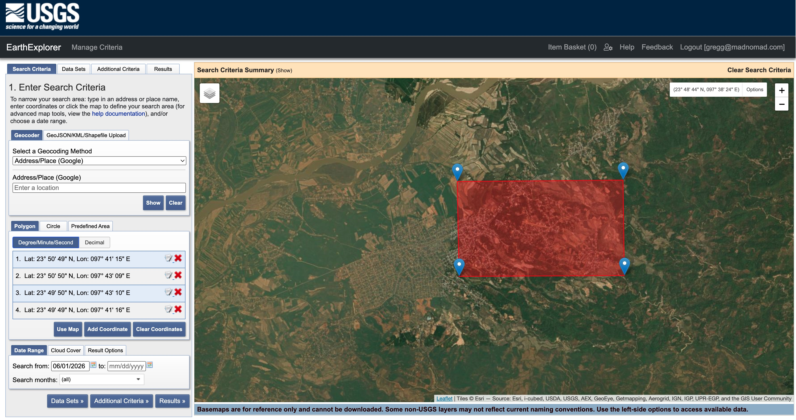
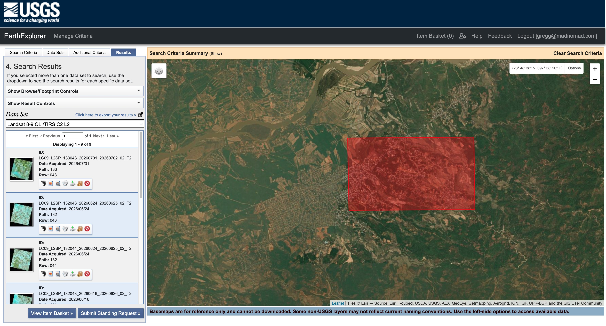
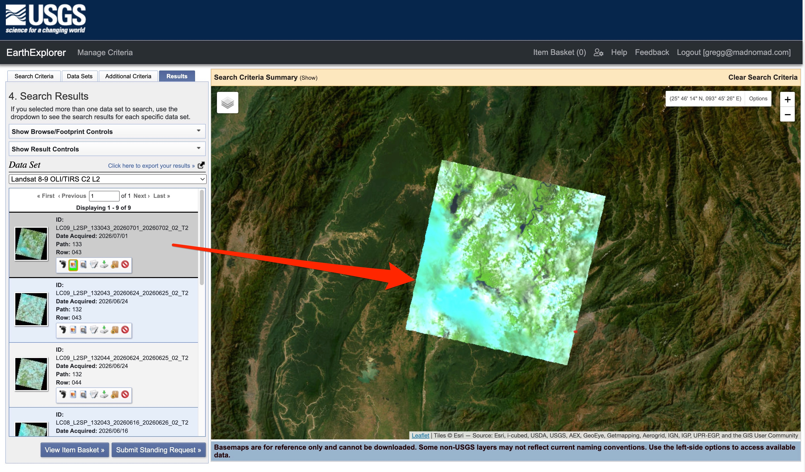
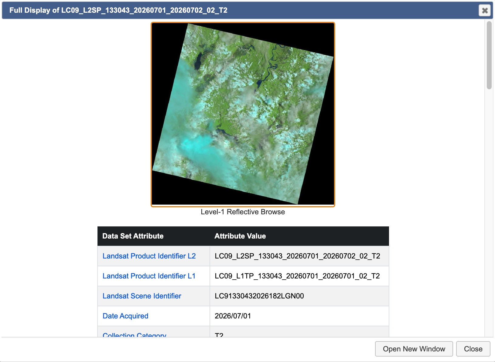

# Earth Explorer

## URL

[https://earthexplorer.usgs.gov/](https://earthexplorer.usgs.gov/)

## Description

EarthExplorer is an archive portal for searching and downloading satellite, aerial, elevation, and other geospatial data.

It is especially valuable when you need original scenes, acquisition dates, and a reproducible data trail.

Datasets include:

* Imagery from orbiting satellites
* Images taken from aircraft or drones
* Digital elevation models (DEMs) and terrain height information
* Land cover (vegetation), hydrography (rivers, lakes), cartographic products (digitized maps, boundary data)

## Features

EarthExplorer includes an interactive map interface for defining areas of interest, textual filtering criteria for date range, cloud cover, sensor type, and resolution. You can browse previews of individual scenes with full metadata.

<figure><figcaption>
EarthExplorer screenshot showing search criteria. In this case, a polygon has been drawn to specify a search location. A date range has also been specified.
</figcaption></figure>

<figure><figcaption>
EarthExplorer screenshot showing the results of the query shown in the previous screenshot above, after also having specified a dataset (in this case, Landsat 8-9 OLI/TIRS Collection 2 Level-2).
</figcaption></figure>

After querying and getting results you can:

* Download the original scene file (e.g., [GeoTIFF, JPEG, SAFE format](https://www.earthdata.nasa.gov/learn/earth-observation-data-basics/data-formats)) with no processing applied
* See the exact acquisition date and time
* Access metadata including:
  * Sensor type ([Landsat 8 OLI](https://www.earthdata.nasa.gov/data/instruments/oli), [NAIP aerial](https://naip-usdaonline.hub.arcgis.com/), etc.)
  * Resolution (30 m, 60 cm)
  * Geographic projection (the coordinate reference system used to align imagery with other GIS[^1] data)
  * Cloud cover percentage
  * Processing level ([Level-1, Level-2](https://www.earthdata.nasa.gov/learn/earth-observation-data-basics/data-processing-levels))
* Export query results (KML, CSV) showing what you searched for
* Create a documented trail that you can:
  * Cite in a report, article, or legal filing
  * Reproduce by showing someone exactly how to find the same scene
  * Verify independently by re-running the search

<figure><figcaption>
EarthExplorer screenshot showing geographic projection for a search results item.
</figcaption></figure>

<figure><figcaption>
EarthExplorer screenshot showing metadata for a search results item.
</figcaption></figure>

### Why this matters for open source research

In open-source investigations, you often need to:

* Prove a claim (e.g., "This military base was built in 2021")
* Document changes over time with specific dates
* Reproduce your methodology so others can verify it

EarthExplorer gives you the source data with full metadata, which is what can make your open source research work credible and verifiable.

## Datasets

EarthExplorer offers over 50 datasets presented in 20 categories.

Some example use cases for open source research are outlined in the table below.

### Open Source Research Use Cases & Corresponding Datasets

<table><thead><tr><th width="277.3494873046875" valign="top">Open Source Research Task</th><th width="162.2265625" valign="top">Best Dataset</th><th valign="top">Why</th></tr></thead><tbody><tr><td valign="top">Geolocation of a photo or video</td><td valign="top"><strong>NAIP</strong> → then <strong>OrbView-3</strong> if pre-2008</td><td valign="top">
NAIP gives 30–60 cm aerial detail for matching roads, buildings, vehicles;

OrbView-3 is the only sub-meter satellite option (2003–2007)
</td></tr><tr><td valign="top">Verifying facility / building claims</td><td valign="top"><strong>NAIP</strong> (current), <strong>Landsat Legacy</strong> (historical)</td><td valign="top">Compare current NAIP against historical Landsat to show when structures appeared/changed</td></tr><tr><td valign="top">Tracking military / infrastructure activity</td><td valign="top"><strong>Landsat 8-9 C2 L2</strong>, <strong>MODIS</strong></td><td valign="top">Medium res but 30-year history; detect new roads, pads, camps; MODIS for frequent (daily) updates</td></tr><tr><td valign="top">Natural disaster / conflict zone documentation</td><td valign="top"><strong>Landsat 8-9 C2 L2</strong>, <strong>ASTER</strong></td><td valign="top">Global coverage, 30 m resolution, natural color imagery; ASTER for thermal/DEM analysis of damage</td></tr><tr><td valign="top">Mining / resource extraction investigation</td><td valign="top"><strong>Landsat 8-9 C2 L2</strong>, <strong>NLCD</strong></td><td valign="top">Track pit expansion, waste piles, vegetation loss; NLCD for land-cover change quantification</td></tr><tr><td valign="top">Border / fence / wall construction monitoring</td><td valign="top"><strong>NAIP</strong> (US), <strong>Landsat 8-9</strong> (global)</td><td valign="top">High-res NAIP for fence details within US; Landsat for international borders</td></tr></tbody></table>

<table><thead><tr><th width="277.3494873046875" valign="top">Open Source Research Task</th><th width="162.2265625" valign="top">Best Dataset</th><th valign="top">Why</th></tr></thead><tbody><tr><td valign="top">Geolocation of a photo/video</td><td valign="top"><strong>NAIP</strong> → then <strong>OrbView-3</strong> if pre-2008</td><td valign="top">
NAIP gives 30–60 cm aerial detail for matching roads, buildings, vehicles;

OrbView-3 is the only sub-meter satellite option (2003–2007)
</td></tr><tr><td valign="top">Verifying facility/building claims</td><td valign="top"><strong>NAIP</strong> (current), <strong>Landsat Legacy</strong> (historical)</td><td valign="top">Compare current NAIP against historical Landsat to show when structures appeared/changed</td></tr><tr><td valign="top">Tracking military/infrastructure activity</td><td valign="top"><strong>Landsat 8-9 C2 L2</strong>, <strong>MODIS</strong></td><td valign="top">Medium res but 30-year history; detect new roads, pads, camps; MODIS for frequent (daily) updates</td></tr><tr><td valign="top">Natural disaster / conflict zone documentation</td><td valign="top"><strong>Landsat 8-9 C2 L2</strong>, <strong>ASTER</strong></td><td valign="top">Global coverage, 30 m resolution, natural color imagery; ASTER for thermal/DEM analysis of damage</td></tr><tr><td valign="top">Mining / resource extraction investigation</td><td valign="top"><strong>Landsat 8-9 C2 L2</strong>, <strong>NLCD</strong></td><td valign="top">Track pit expansion, waste piles, vegetation loss; NLCD for land-cover change quantification</td></tr><tr><td valign="top">Border / fence / wall construction monitoring</td><td valign="top"><strong>NAIP</strong> (US), <strong>Landsat 8-9</strong> (global)</td><td valign="top">High-res NAIP for fence details within US; Landsat for international borders</td></tr></tbody></table>

<table><thead><tr><th width="113.9976806640625" valign="top">Dataset</th><th width="120.43115234375" valign="top">Type</th><th width="120.8966064453125" valign="top">Resolution</th><th width="128.857177734375" valign="top">Coverage</th><th valign="top">Notes</th></tr></thead><tbody><tr><td valign="top"><strong>NAIP</strong></td><td valign="top">Aerial imagery</td><td valign="top">30–60 cm</td><td valign="top">Contiguous 48 US states</td><td valign="top">Primary geolocation tool for US sites. Match roads, buildings, cars, trees, shadows. Seasonal (growing season)</td></tr><tr><td valign="top"><strong>HRO</strong></td><td valign="top">Aerial imagery</td><td valign="top">1 m or finer</td><td valign="top">Partial US</td><td valign="top">Higher-quality orthorectified photos where available; better for precise measurements</td></tr><tr><td valign="top"><strong>OrbView-3</strong></td><td valign="top">Commercial satellite</td><td valign="top">1 m</td><td valign="top">Global</td><td valign="top">Only sub-meter satellite option in EarthExplorer; historical (2003–2007); useful for pre-2008 conflict documentation</td></tr><tr><td valign="top"><strong>IKONOS-2</strong></td><td valign="top">Commercial satellite</td><td valign="top">~1 m</td><td valign="top">Global</td><td valign="top">Another early-2000s high-res satellite; overlap with OrbView period</td></tr><tr><td valign="top"><strong>DOQ</strong></td><td valign="top">Aerial orthophoto</td><td valign="top">~1 m</td><td valign="top">Older US coverage</td><td valign="top">1990s–early 2000s historical US aerials; gap-filler before NAIP</td></tr></tbody></table>

<table><thead><tr><th width="113.9976806640625" valign="top">Dataset</th><th width="120.43115234375" valign="top">Type</th><th width="121.0770263671875" valign="top">Resolution</th><th width="128.857177734375" valign="top">Time Span</th><th valign="top">Notes</th></tr></thead><tbody><tr><td valign="top"><strong>Landsat 8-9 C2 L2</strong></td><td valign="top">Satellite</td><td valign="top">30 m</td><td valign="top">2013–present</td><td valign="top">Best global sat for open source research in EarthExplorer. Natural color, 30-year archive, frequently updated</td></tr><tr><td valign="top"><strong>Landsat Legacy</strong></td><td valign="top">Satellite</td><td valign="top">30–80 m</td><td valign="top">1972–2003</td><td valign="top">Historical baseline for long-term change (e.g., Syria since 2000, Chechnya, Kosovo)</td></tr><tr><td valign="top"><strong>MODIS / eMODIS</strong></td><td valign="top">Satellite</td><td valign="top">250 m – 1 km</td><td valign="top">2000–present</td><td valign="top">Near-daily coverage; detect fires, floods, RapidChange zones; low res but fast</td></tr><tr><td valign="top"><strong>ASTER</strong></td><td valign="top">Satellite</td><td valign="top">15 m (pan), 30 m</td><td valign="top">2000–present</td><td valign="top">Thermal analysis (burn sites, explosives), DEM for terrain; limited US coverage</td></tr><tr><td valign="top"><strong>SPOT</strong></td><td valign="top">Commercial satellite</td><td valign="top">10–20 m</td><td valign="top">1980s–present</td><td valign="top">Medium-res global; European source; useful for land cover, vegetation trends</td></tr></tbody></table>

<table><thead><tr><th width="113.9976806640625" valign="top">Dataset</th><th width="120.43115234375" valign="top">Type</th><th width="121.0770263671875" valign="top">Resolution</th><th valign="top">Notes</th></tr></thead><tbody><tr><td valign="top"><strong>SRTM 1 Arc-Second Global</strong></td><td valign="top">DEM</td><td valign="top">~30 m</td><td valign="top">Terrain analysis for military positions, line-of-sight, sniper sight lines, vehicle routes</td></tr><tr><td valign="top"><strong>IFsar Alaska</strong></td><td valign="top">DEM</td><td valign="top">2 m</td><td valign="top">Alaska-specific high-res elevation (if investigating Arctic)</td></tr></tbody></table>

<table><thead><tr><th width="113.9976806640625" valign="top">Dataset</th><th width="120.43115234375" valign="top">Type</th><th width="121.0770263671875" valign="top">Resolution</th><th valign="top">Notes</th></tr></thead><tbody><tr><td valign="top"><strong>Annual NLCD</strong></td><td valign="top">Land cover</td><td valign="top">30 m</td><td valign="top">Track deforestation, oil/gas pads, illegal mining, camp construction in US</td></tr><tr><td valign="top"><strong>VegDRI / QuickDRI</strong></td><td valign="top">Vegetation stress</td><td valign="top">~250 m</td><td valign="top">Drought monitoring, agricultural fraud, food security in conflict zones</td></tr></tbody></table>

<table><thead><tr><th width="122.8489990234375" valign="top">Dataset</th><th width="120.43115234375" valign="top">Type</th><th width="121.0770263671875" valign="top">Resolution</th><th width="119.1243896484375" valign="top">Time Span</th><th>Notes</th></tr></thead><tbody><tr><td valign="top"><strong>Declassified 1–3</strong></td><td valign="top">Declassified military sat</td><td valign="top">Varies (some high-res)</td><td valign="top">1960s–1980s</td><td>Spy satellite imagery (Corona, Big Bird); Cold War sites, Soviet facilities</td></tr><tr><td valign="top"><strong>Landsat Legacy</strong></td><td valign="top">Satellite</td><td valign="top">30–80 m</td><td valign="top">1972–2003</td><td>Pre-2003 baseline for long-term studies (e.g., Syria, North Korea)</td></tr></tbody></table>

## Cost

* [ ] Free
* [x] Partially Free
* [ ] Paid

- Most data is free and in the public domain (Landsat, NAIP, SRTM, MODIS, etc.).
- Select datasets have fees/use restrictions (indicated within EarthExplorer during search) but this is rare.

## Level of difficulty

<table><thead><tr><th data-type="rating" data-max="5"></th></tr></thead><tbody><tr><td>2</td></tr></tbody></table>

## Requirements

EarthExplorer is web-based and will run in any modern browser on any OS. An internet connection is required.

A free account is required to download data (ERS registration at [ers.cr.usgs.gov](https://ers.cr.usgs.gov/)). Registration requires filling out two forms, each with most fields requiring entry.

1. Usage Questionnaire: Six questions about your work sector, how remotely sensed data fits in with your work, and how you will use the data.
2. Contact Information: Name, address, email address, telephone are all required.

To complete the registration, you must respond to a message sent to the email address you provided.

## Limitations

* **No high-resolution global imagery:** Only sub-meter resolution (30–60 cm) is NAIP, which is US-only. For international high-res, you need paid services (e.g. Maxar, Planet).
* **Landsat is 30 m:** Too low for vehicle/person-level identification; good for infrastructure only
* **100-result limit:** Maximum 100 records per search; need to narrow by Country/Feature Class to avoid hitting this cap.
* **OrbView-3 is historical (2003–2007):** Not useful for current conflict documentation
* **Seasonal NAIP (growing season only):** Winter photos may not be available.
* **Sentinel-2 removed:** USGS [stopped distributing Sentinel-2](https://www.usgs.gov/centers/eros/science/usgs-eros-archive-sentinel-2-comparison-sentinel-2-and-landsat) data through EarthExplorer as of 19 Nov 2022. Use Copernicus Data Space Ecosystem instead.
* **No API access:** Manual interface only; can't automate bulk queries programmatically.

## Ethical Considerations

### Specific to EarthExplorer

Upon login to EarthExplorer, note that the USGS warns that:

> All agency computer systems may be monitored for all lawful purposes, including but not limited to, ensuring that use is authorized, for management of the system, to facilitate protection against unauthorized access, and to verify security procedures, survivability and operational security.

Further, the USGS states that:

> Any information on this computer system may be examined, recorded, copied and used for authorized purposes at any time. All information, including personal information, placed or sent over this system may be monitored, and users of this system are reminded that such monitoring does occur. Therefore, there should be no expectation of privacy with respect to use of this system.

### **Remote sensing technologies in general**

**Privacy Concerns:** Remote sensing technologies can capture detailed images from space or high altitude, potentially compromising individual privacy. Researchers must balance the public interest with the rights to privacy.

**Accuracy and Misinterpretation:** Ensuring the accurate representation of data is critical. Misinterpretation of remote sensing data can lead to misinformation, shaping public opinion based on incorrect premises. Each dataset may have different standards for accuracy.

## Similar Tools

[Copernicus Data Space Ecosystem](https://dataspace.copernicus.eu/): Copernicus is centered on Sentinel/Copernicus data rather than USGS archives.

[NASA Earthdata Search](https://search.earthdata.nasa.gov/): Designed around scientific datasets and research workflows, not just browsing imagery archives. Good for finding, filtering, and working with NASA Earth science data at scale.

[EOS Data Analytics LandViewer](https://eos.com/products/landviewer/): More of a web viewer/analytics product than a raw archive browser. Useful for quick visualization and analysis.

**Commercial Alternatives**

[Sentinel Hub](https://www.sentinel-hub.com/): Primarily a processing and visualization service for satellite data, not a classic archive browser. Better for using imagery than for browsing archives.

[Planet](https://www.planet.com/): Commercial high-revisit imagery provider, not a public archive search tool. Paid and license-restricted; not a free public archive portal.

[Vantor (formerly Maxar)](https://vantor.com/): Commercial high-resolution imagery provider. Paid and license-restricted; not a free public archive portal.

Note that, unlike EarthExplorer and similar remote-sensing portals, many consumer map services expose only rendered tiles and limited attribution/date information, so they usually do not provide the original file, full acquisition metadata, or a strong evidentiary provenance trail.

For investigative work, Google Maps/Bing Maps (for example) are often best treated as reference views unless you can independently document the imagery source and date through the platform’s own metadata or another archive. If you need evidentiary rigor, the stronger approach is to work from datasets that expose scene-level metadata.

## Guides

[https://www.usgs.gov/centers/eros/science/earthexplorer-help-index](https://www.usgs.gov/centers/eros/science/earthexplorer-help-index)

[https://youtu.be/lkbzQunkT\_s?si=8rxsZ0I2xPuAxyqN](https://youtu.be/lkbzQunkT_s?si=8rxsZ0I2xPuAxyqN)

## Tool provider

[U.S. Geological Survey (USGS](https://www.usgs.gov/)), an agency of the United States Department of the Interior.

## Advertising Trackers

* [x] This tool has not been checked for advertising trackers yet.
* [ ] This tool uses tracking cookies. Use with caution.
* [ ] This tool does not appear to use tracking cookies.

| Page maintainer                                           |
| --------------------------------------------------------- |
| Bellingcat Volunteer Team. Last updated in June/July 2026 |
|                                                           |

[^1]: Geographic Information System
