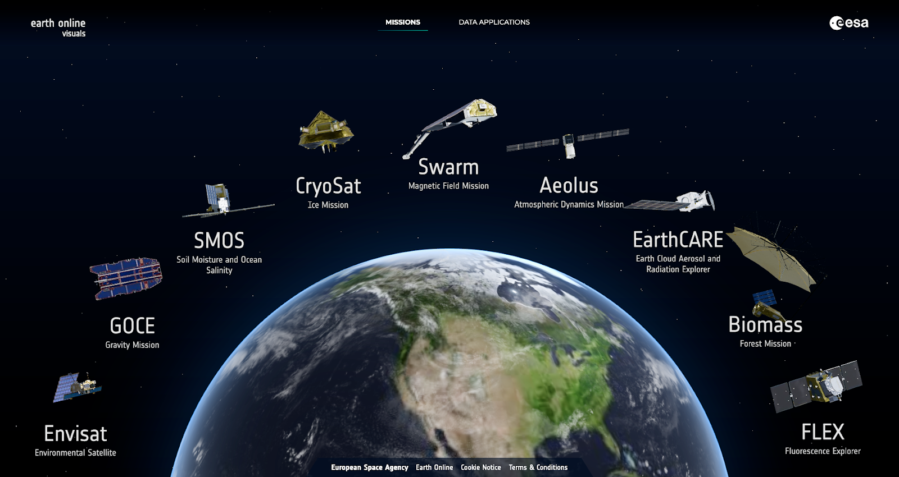
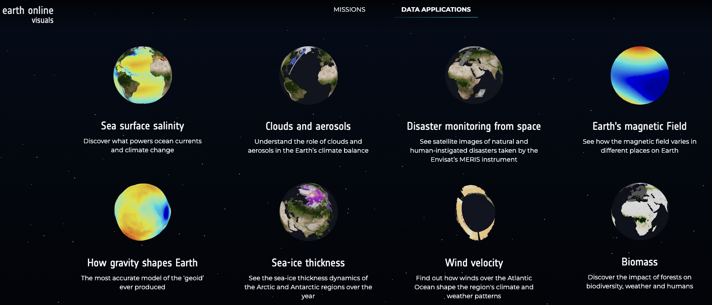

# The European Space Agency (ESA) - Earth Online

## URL

[https://earth.esa.int/eogateway/tools](https://earth.esa.int/eogateway/tools)

## Description

The European Space Agency's Earth Online (ESA-EO) is a portal dedicated to providing a wealth of information on ESA's Earth observation activities and datasets. It serves as a comprehensive platform for Earth science and environmental monitoring. Users can retrieve up-to-date satellite imagery, open data from specific Earth observation missions, and a range of tools for analysis and interpretation of raw environmental data. Earth Online also shines when it comes to news, visuals and infographics plus detailed mission information and 3D models of the satellites, making it a useful resource for anyone looking to understand the planet's dynamics and changes.

ESA’s EO universe holds something for everyone. It's not only for experts - there’s enough to explore if you’re new to the field.

<figure><figcaption>
<a href="https://visuals.earth.esa.int/">https://visuals.earth.esa.int/</a>
</figcaption></figure>


ESA’s Earth Observation ecosystem is evolving from a collection of isolated, specialised tools toward integrated, cloud-based platforms that combine workflows of data discovery, access, processing and analysis in one single environment.


The main components of the ESA Earth Observation platform are:

1. **Mission documentation** and data feeding into:
2. Cloudplatforms **Copernicus Data Space Ecosystem (CDSE)** and **Multi-Mission Algorithm and Analysis Platform (MAAP)**
3. **Sentinel Application Platform (SNAP)** and other standalone (mostly mission-specific) tools
4. Tool documentation, learning and community knowledge exchange


_European Space Agency_ vs _Copernicus_ - ESA is an intergovernmental European space agency and implementing partner for EU space programmes, and a key-partner in Copernicus. Copernicus is the EU programme providing open satellite data and operational services. ESA designs and operates the satellites that generate the data, both for the EU Copernicus programme and for ESA’s own (research-focused) missions.

_ESA Earth Online (ESA EO)_ vs _Copernicus Data Space Ecosystem (CDSE) -_ The data platforms overlap. The core of (cloud-based) CDSE consists of the Sentinel Data. ESA EO links to CDSE but also offers ESA mission-specific data and tools, plus all mission documentation.

_Copernicus Browser_ vs _Copernicus Data Space Ecosystem_ - The Copernicus Browser is the main visual exploration tool within the Copernicus Data Space Ecosystem and has its own [tool description](https://bellingcat.gitbook.io/toolkit/more/all-tools/sentinal-hub-playground) in the Bellingcat Toolguide. They use the same Sentinel data, but CDSE serves different users with advanced features as cloud-based processing, access via API’s and support for batch analysis. The browser remains the main web-based visual interface for exploring imagery, while CDSE enables more complex and automated workflows.

_SNAP_ vs _CDSE_ - Both make use of the same Copernicus Sentinel data. The difference lies in the workflow: SNAP is designed for local download and processing, while the Data Space Ecosystem enables cloud-based access and analysis without requiring local storage.


<figure><figcaption></figcaption></figure>

### Missions

ESA EO offers detailed information on the [mission](https://earth.esa.int/eogateway/missions) programmes and separate missions:

* Earth Explorers: dedicated to specific domains, as the cryosphere, athmosphere etc. See [visuals](https://visuals.earth.esa.int/)
* Heritage Missions: data from over 45 missions, dating back to 1977
* Third Party Missions: by other space agencies or commercial providers, sometimes restricted access
* Copernicus Sentinel Missions (also in CDSE)

All mission pages link to extensive mission documentation, datasets and notebooks, research environment or webservices. Data from older, inactive missions is included in the platform to be reused in different contexts. The available datasets can also be filtered by domain and scientific instruments. ESA data and tools may gradually be integrated in one of the cloudplatforms mentioned below.

### Copernicus Data Space Ecosystem

The [CDSE](./#url) provides wide range of data and services from the Copernicus Sentinel missions and some complementary data. The user-friendly Copernicus browser (see [Bellingcat toolguide](https://bellingcat.gitbook.io/toolkit/more/all-tools/sentinal-hub-playground)) is a part of the wider ecosystem. The cloud-based data and processing platform provides data and documentation, with advanced features that include cloud computing, integrated jupyter notebooks, APIs, batch operations, and building workflows with openEO.

[Sentinel Online](https://sentinels.copernicus.eu/web/success-stories/europe-s-eye-on-earth-with-sentinel-satellites-and-earth-observation-data) is the ESA/Copernicus Sentinal reference site for a broad audience, with interactive views (Sentivista), visual explainers (Sentinel Succes Stories) and technical satellite documentation (SentiWiki). Feeling lost? The [Copernicus AI assistant](https://ask.copernicus.eu/) (in beta) may lead you to the right sources.

### **Multi-Mission Algorithm and Analysis Platform (MAAP)**

Where CDSE is more focused on browsing, processing and analysing, [ESA MAAP](https://earth.esa.int/eogateway/tools/esa-maap) is oriented toward scientific collaboration, with more focus on computing and advanced research and experimental workflows. The ESA Exploring Earth Catalogue and Thematic Exploitation Platforms (TEPs), previously separate entities in the EO platform and useful in OSINT research, are moving to MAAP.

### SNAP

[Sentinel Application Platform (SNAP)](https://step.esa.int/main/download/snap-download/) is a desktop software application for analysing and processing Sentinel data. It contains the same Sentinel data as the CDSE and they are often used together. SNAP is available as a local download and designed for working with raw and semi-processed data. A strong point is its radar (SAR) analysis. SNAP has a GUI and can be used without any technical coding skills, but does require some technical understanding of satellite data. The STEP platform (Science Toolbox Exploitation Platform) offers help in the form of practical guides and [tutorials](https://step.esa.int/main/doc/tutorials/) and an active [user community forum](https://forum.step.esa.int/).

### Tools per user need

| User need                                                                     | Task/Platform                                                                                                                                                                                                                                                                                                                                             | Skill level    |
| ----------------------------------------------------------------------------- | --------------------------------------------------------------------------------------------------------------------------------------------------------------------------------------------------------------------------------------------------------------------------------------------------------------------------------------------------------- | -------------- |
| Orientation in Earth Observation, mission and satellite goals                 | ESA EO [3D Visuals](https://visuals.earth.esa.int/), news, [infographics](https://earth.esa.int/eogateway/search?category=learn-and-discover\&learn_and_discover_type=infographics); Sentinel Online [visuals](https://app.gitbook.com/o/WQpOq5ZFue4N6m65QCJq/s/hjQAe2P6VxZKdrvIAqJ1/)                                                                    | Easy           |
| Read about research outcomes and use cases                                    | ESA EO [Learn\&Discover ](https://earth.esa.int/eogateway/learn)interactive stories, ESA [data applications](https://visuals.earth.esa.int/data), Sentinel online [succes stories](https://sentinels.copernicus.eu/web/success-stories), Sentivista [data applications](https://sentivista.copernicus.eu/data)                                            | Easy           |
| View and compare satellite images                                             | [Copernicus Browser](https://browser.dataspace.copernicus.eu/)                                                                                                                                                                                                                                                                                            | Easy           |
| Explore mission metadata, datasets                                            | ESA Earth Online [Missions, Tools](https://earth.esa.int/eogateway/tools)                                                                                                                                                                                                                                                                                 | Easy           |
| Advanced radar or optical analysis                                            | [SNAP](https://earth.esa.int/eogateway/tools/snap)                                                                                                                                                                                                                                                                                                        | Medium         |
| Bulk cloud processing or batch analysis                                       | [Copernicus Data Space Ecosystem](https://dataspace.copernicus.eu/) (CDSE)                                                                                                                                                                                                                                                                                | Medium         |
| Advanced (scientific) research, experimental workflows                        | [MAAP](https://earth.esa.int/eogateway/tools/esa-maap)                                                                                                                                                                                                                                                                                                    | Advanced       |
| Learn workflows, methods (mainly: SNAP)                                       | [STEP ](https://step.esa.int/main/)(tutorials)                                                                                                                                                                                                                                                                                                            | Easy to Medium |
| Follow online courses about Earth Observation domains, satellites, techniques | [EO college](https://eo-college.org/esa-eo-training-academy/) ESA EO Training Academy (some past courses are free, also without login); [GDA (Global Development Assistance) Knowledge Hub](https://knowledge-hub-gda.esa.int/). See also: [MOOCS](https://eo4society.esa.int/training-education/massive-open-online-courses-moocs/) (also for beginners) | Advanced       |

### Use Cases for European Space Agency's Earth Online

The European Space Agency's Earth Online portal offers a broad array of use cases. Individual tools can be used for multiple use cases. Some of these use cases focus on environment monitoring (tracking changes in climate, land use, and natural habitats over time) others could be used for monitoring more human focused activity. Use cases for both the [Copernicus Data Space Ecosystem (CDSE)](https://dataspace.copernicus.eu/) and specific tools include:

* **(Environmental) changes over time:** To analyse environmental shift or urban growth over decades, combine satellite imagery from third party mission [Landsat](https://earth.esa.int/eogateway/missions/landsat) (NASA/USGS, since 1972), [ERS-1/ERS-2](https://earth.esa.int/eogateway/missions/ers) (SAR, 1990s), [Envisat ](https://earth.esa.int/eogateway/missions/envisat)(2002-2012) and more recent [Sentinel ](https://sentinels.copernicus.eu/)data (since 2014).
* **Maritime and vessel detection:** [Sentinel-1](https://sentinels.copernicus.eu/web/sentinel/copernicus/sentinel-1); SAR (radar) imagery detection enables identifying dark vessels or movements without AIS; [Sentinel-2](https://sentinels.copernicus.eu/web/sentinel/copernicus/sentinel-2) for optical data. [Φsat-2/Phisat-2](https://earth.esa.int/eogateway/missions/phisat-2) uses AI for cloud filtering and vessel detection.
* **Water**: [SMOS](https://www.esa.int/Applications/Observing_the_Earth/FutureEO/SMOS) (Soil Moisture and Ocean Salinity): Monitor threats by soil moisture, drought, salinity and fresh water availability.
* **Ice**: [CryoSat-2](https://earth.esa.int/eogateway/missions/cryosat) data and tools for analyzing ice thickness, changes in sea levels.
* **Agricultural Analysis:** Assisting in the monitoring of crop health, forecasting yields, and managing agricultural resources. For instance the [IRS-P5 (Cartosat-1) Sample Data](https://earth.esa.int/eogateway/missions/irs-p5/sample-data) provides high resolution 2.5 m resolution crop inventory and monitoring agricultural productivity.
* **Deforestation, carbon:** [SMOS](https://www.esa.int/Applications/Observing_the_Earth/FutureEO/SMOS) or [Biomass](https://www.esa.int/Applications/Observing_the_Earth/FutureEO/Biomass) for monitoring vegetation and carbon. The [BIOMASS Product Algorithm Laboratory (BioPAL)](https://www.biopal.org/) tool offers processing scripts and Jupyter Notebooks for monitoring Above Ground Biomass, Forest Height and Forest Disturbance.
* **Oceanography and Marine Sciences:** Supporting the study of ocean currents, sea surface temperatures, and marine ecosystems. Tools like the [Cryo2ice tool](https://cs2eo.org/cryo2ice) can monitor ocean ice cover which can impact shipping routes (limited to data between February 2021 up to 2022) and the [Ocean and Coastal Topography Thematic Data Product (TDP)](https://earth.esa.int/eogateway/catalog/tdp-for-ocean-and-coastal-topography) dataset which contains improved sea surface height anomaly data. The screenshot below shows the [Cryo2ice tool](https://cs2eo.org/cryo2ice) with a search for Arctic sea ice 2022-02-06:

<figure><figcaption>
Screenshot of the Cryo2ice Arctic sea ice 2022-02-06 09:24
</figcaption></figure>

* **The atmosphere:** The [Atmosphere Virtual Lab (AVL)](https://atmospherictoolbox.org/media/usecases/Usecase_5_aeolus.html) tool provides [Jupyter Notebooks](https://jupyter.org/) that can be used to analyze and visualize atmospheric earth observation data and the [GHGSat archive](https://earth.esa.int/eogateway/catalog/ghgsat-archive-and-tasking) contains data that monitors greenhouse gas emissions (currently CH4, but eventually CO2).
* **Human Activity:** The [Urban Thematic Exploitation Platform](https://urban-tep.eu/) tool requires registration but provides data and visualisation of the Global Urban Footprint and population density. The [Geohazards TEP](https://geohazards-tep.eu/) is a glacier and landslide monitoring tool that has data processed over the eastern Alps Ground Motion Service.
* **Disaster Monitoring:** Earth Online provides a number of tools that can be used for disaster monitoring, like the [SMOS Tropical Cyclone Wind Radii Fixes](https://earth.esa.int/eogateway/catalog/smos-tropical-cyclone-wind-radii-fixes-wrf) (Registration required) and provides Near Real Time tropical cyclones forecasts. Within the [CDSE](https://dataspace.copernicus.eu/): [Sentinel-1](https://sentinels.copernicus.eu/web/sentinel/copernicus/sentinel-1) (SAR) for floods, [Sentinel-2](https://sentinels.copernicus.eu/web/sentinel/copernicus/sentinel-2) (optical) for fires, landslides.

These use cases highlight the versatility of the Earth Online portal in supporting a wide range of scientific research, educational, and applied environmental management activities.


Complement ESA raw data with thematic platforms such as [Global Forest Watch](https://bellingcat.gitbook.io/toolkit/more/all-tools/global-forest-watch) (deforestation), [Aqueduct](https://www.wri.org/applications/aqueduct/water-risk-atlas/#/?advanced=false\&basemap=hydro\&indicator=w_awr_def_tot_cat\&lat=30\&lng=-80\&mapMode=view\&month=1\&opacity=0.5\&ponderation=DEF\&predefined=false\&projection=absolute\&scenario=optimistic\&scope=baseline\&threshold\&timeScale=annual\&year=baseline\&zoom=3) (water stress, flood risks), [Global Fishing Watch](https://bellingcat.gitbook.io/toolkit/more/all-tools/global-fishing-watch-map) (fishing activity) or [Deep Sea Mining Watch](https://www.deepseaminingwatch.msi.ucsb.edu/) (seabed mining); those tools can be used to find patterns or hot spots. Then use the ESA Earth Online data and tools for raw satellite imagery to verify or analyse changes over time.


## Cost

* [x] Free
* [ ] Partially Free
* [ ] Paid

## Level of difficulty

<table><thead><tr><th data-type="rating" data-max="5"></th></tr></thead><tbody><tr><td>4</td></tr></tbody></table>

## Requirements

* [**EO Sign-In**](https://eoiam-idp.eo.esa.int/): the majority of tools and platforms use one and the same SSO (single sign on) account. Registering is free and only requires an email adress and basic profile information, and is open to independent journalists and researchers. Documentation and local installed tools (such as SNAP) are accessible without login. Some of the advanced tools (MAAP) may need an additional request to access workspaces.
* **Cloud access** does not require more than a modern web browser and a solid connection. Locally installed tools will need sufficient memory and storage for processing the generally very large Earth Observation files. See the individual tools for further details.
* **Advanced skills:** Some of the tools require Jupyter Notebook and Python programming experience or higher level expertise in methodology, remote sensing and satellite imagery.

## Limitations

* **Data Availability**: While ESA's Earth Online offers extensive datasets, certain historical data or high-resolution imagery may not be readily available due to the limitations of past missions, data retention policies or registration requirements.
* **Update Frequency**: The update intervals for some datasets may not meet the needs of users requiring real-time or near-real-time information. Different datasets will have different update frequency. Some older or sample datasets may not be up to date. See the individual dataset's documentation.
* **Tool Functionality**: Older tools may not be maintained and working.

## Guide

<figure><figcaption></figcaption></figure>

See the specific tools for documentation and guides. The [ESA EO platform](https://earth.esa.int/eogateway/tools) directs to all platforms and tools. Filters for the different tool types (Analysis, Processing and Visualisation) can be applied, but note that most of those steps are now combined in growing cloud platforms.

The Copernicus Data Space Ecosystem offers introductory videos and tutorials on [Youtube](https://www.youtube.com/@copernicusdataspaceecosystem/videos).

## Tool provider

European Space Agency [https://www.esa.int/](https://www.esa.int/)

## Advertising Trackers

* [x] This tool has not been checked for advertising trackers yet.
* [ ] This tool uses tracking cookies. Use with caution.
* [ ] This tool does not appear to use tracking cookies.

| Page maintainer                     |
| ----------------------------------- |
| Bellingcat Volunteer Team / Lavache |
|                                     |
