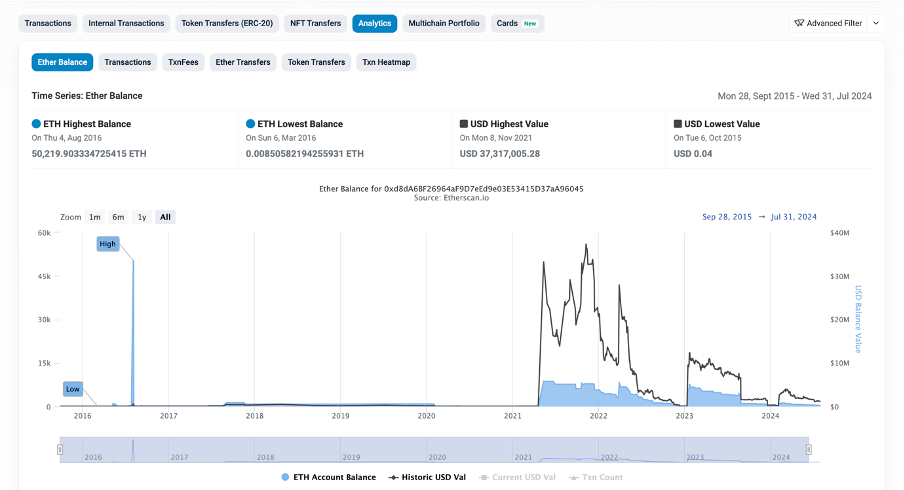

# Etherscan

## URL

[https://etherscan.io/](https://etherscan.io/)

## Description

Ethereum is a blockchain-based network with its native cryptocurrency Ether (ETH) currently being the second-largest cryptocurrency in terms of value. Open source researchers can use Etherscan to look up data on the Ethereum blockchain, for instance addresses, transactions, smart [contract addresses](https://ethereum.org/en/smart-contracts/) and more.

### **Addresses**

By typing in any Ether address in the search bar, researchers get amongst other information an overview of the current balance of the wallet’s assets in Ether and USD, the dates when the first and the last transactions were sent and an overview of all transactions.

<figure><figcaption>
The <a href="https://etherscan.io/address/0xd8da6bf26964af9d7eed9e03e53415d37aa96045">Ethereum address</a> of Ethereum co-founder Vitalik Buterin according to <a href="https://www.forbes.com/sites/ninabambysheva/2021/05/12/vitalik-buterin-moves-13-billion-worth-of-ether-but-where/">Forbes</a>.
</figcaption></figure>

### **Ethereum usernames**

Since the Ether address is long and not very user-friendly, there are services (like [Ethereum name service](https://ens.domains/)) that allow users to buy a username ending with .eth. If someone has such a username, researchers do not necessarily need to know the Ether address but can simply search for this name on Etherscan.&#x20;

Some Ethereum fans use their .eth username on other social media platforms which can be helpful in terms of tracing digital footprints during open source investigations. Ethereum co-founder Vitalik Buterin, for instance, uses his username vitalik.eth for his [X account](https://x.com/VitalikButerin). A search for this name on Etherscan brings up the associated Ether address:

<figure><figcaption></figcaption></figure>

### **Search Etherscan via Google**

Since 2023 [Google](https://x.com/nalin/status/1656753830862942208) displays the ETH balance (via Etherscan) directly on top of the search results if someone searches for an Ether address:

<figure><figcaption></figcaption></figure>

However, our own tests showed that this does not always work. Sometimes the result comes back with an empty info box:

<figure><figcaption></figcaption></figure>

It is also possible to search for a [username](https://cryptoslate.com/google-adding-ethereum-name-service-data-into-search-results-through-etherscan/) but during our own tests in July 2024, this method seemed to be even less reliable.

## Cost

* [x] Free
* [ ] Partially Free
* [ ] Paid

## Level of difficulty

<table><thead><tr><th data-type="rating" data-max="5"></th></tr></thead><tbody><tr><td>2</td></tr></tbody></table>

The tool is easy to use but beginners might need some time to learn how to interpret the information it provides.

## Requirements

No requirements.&#x20;

Open source researchers who sign up with an e-mail address can use some additional features like creating a watchlist of addresses and receiving e-mail notifications if transactions from or to those addresses occur.

## Limitations

\[\[The limitations of each tool should be described. This is important for researchers if they want to decide whether they should invest the time to learn how to use a new tool.]]

## Ethical Considerations

\[\[The ethical considerations of each tool should be described.]]

## Guide

\[\[Link to a guide on this tool]]

## Tool provider

Block Solutions, Malaysia

## Advertising Trackers

* [ ] This tool has not been checked for advertising trackers yet.
* [x] This tool uses tracking cookies. Use with caution.
* [ ] This tool does not appear to use tracking cookies.

| Page maintainer         |
| ----------------------- |
| Johanna Wild/Bellingcat |
|                         |
