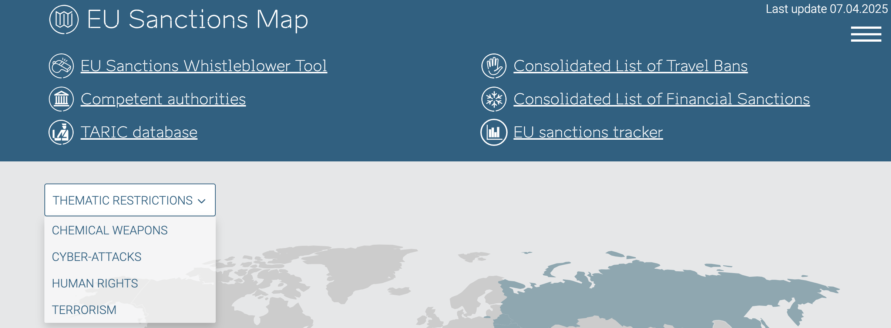
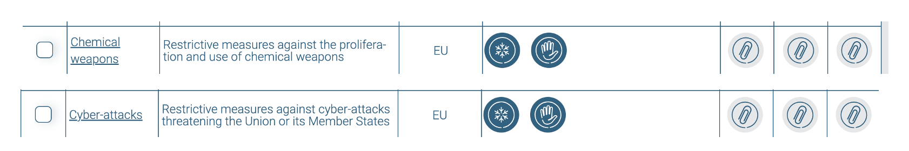
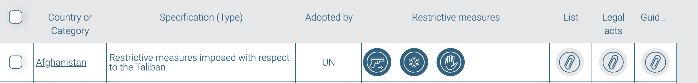
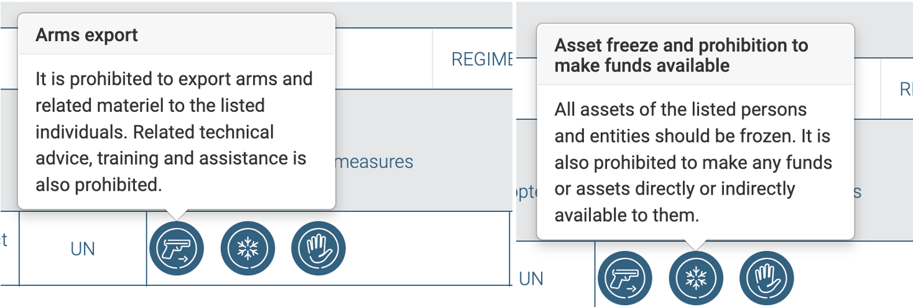
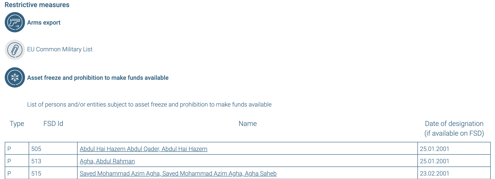
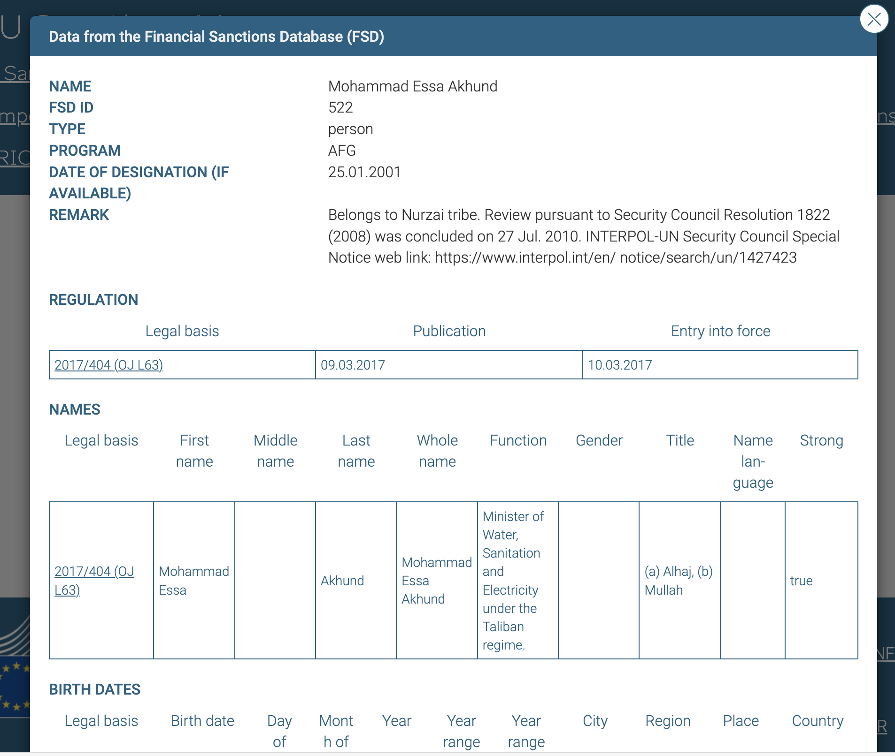
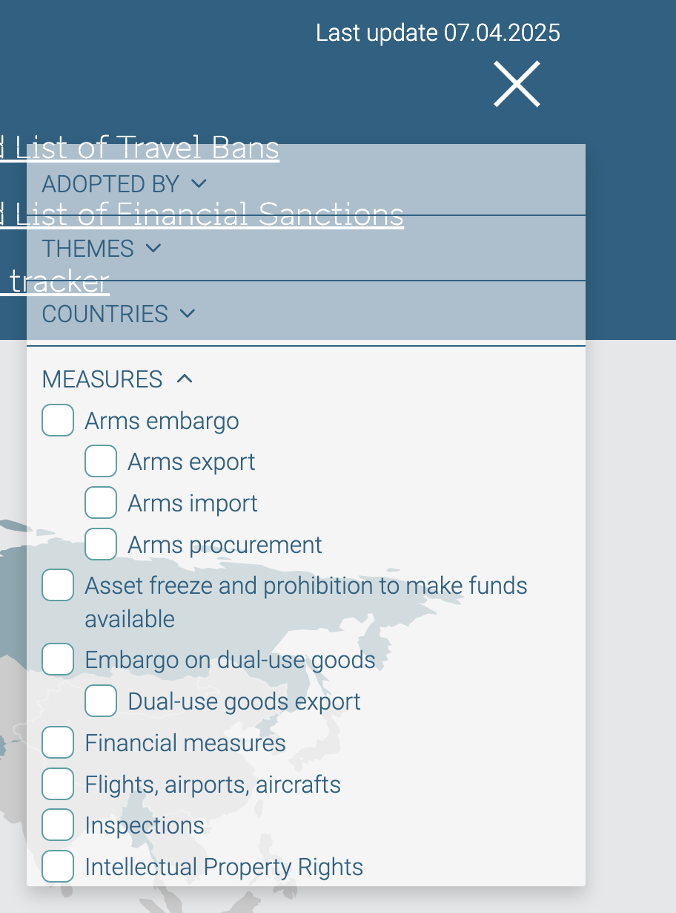

# EU Sanctions Map

## URL

[https://www.sanctionsmap.eu/](https://www.sanctionsmap.eu/)

## Description

The European Union uses sanctions as a tool under the Common Foreign and Security Policy ([CFSP](https://fpi.ec.europa.eu/what-we-do/common-foreign-and-security-policy_en)). The EU implements all sanctions adopted by the United Nations Security Council and these are automatically[ transposed into EU law](https://www.eeas.europa.eu/eeas/sanctions-eu-adoption_en). The EU also applies additional measures to complement and reinforce UN sanctions, and adopts its own sanctions as the Union sees fit. This tool covers both EU and UN Sanctions on individuals, entities and countries.

**Search the EU Sanctions Map**

The tool offers multiple search options and filters, including by theme.

* **Thematic restriction topics** include terrorism, human rights, cyber-attacks and chemical weapons. At the top of the page there is a drop down menu for those. To see the full information, scroll down to the alphabetized list and click on the specific topic or click on the small text that says "Info" at the bottom of the pop-up window to get to the details.

<figure><figcaption>
View of the drop-down menu on thematic sanctions
</figcaption></figure>

<figure><figcaption>
Front page list view of the thematic sanctions
</figcaption></figure>

* **Country-level sanctions and restrictions** - the tool has an alphabetized list of countries against which some sort of sanctions or restrictions have been imposed. Each entry on the front page provides basic information on the restrictive measures, little icons depicting the sanctions and three  separate sub-pages with detailed information.

<figure><figcaption>
View of the alphabetized list with the first contry on it
</figcaption></figure>

<figure><figcaption>
Clicking on each of the icons displays the specific type of sanction.
</figcaption></figure>

Clicking on the List paperclip icon will take you to the lists of persons, entities and items sanctioned in a specific country. These lists are broken down by type of restriction/sanction providing the names of persons and entities. Each listed entity is hyperlinked and when clicked opens a pop-up window with even more information.

<figure><figcaption>
A partial view of the Lists subpage for Afghanistan with type of sanction, names of sanctioned people/entities and when these sanctions  entered into force.
</figcaption></figure>

<figure><figcaption>
A pop-up window with details on a sanctioned individual from Afghanistan.
</figcaption></figure>

* **Using the search bar** - here you can type any name of an entity/individual/country to see if there are any sanctions against them. The search works with Cyrillic and Latin script, but does not work with Arabic or Chinese for example. Such names are all transliterated in Latin script, so be mindful of variations of the names (e.g. Mohamed/ Mohammad/ Muhammad or Akund/Akhund).
* **The more useful dropdown menu** at the top of the page - this is a quick way to filter the information. Filters include which governing body adopted the sanctions, the themes, the countries and the most useful option - filter by type of sanction.

<figure><figcaption>
View of the top right corner filters on the website
</figcaption></figure>

* Clicking on a country on the map - this will open a pop-up window with the type of sanctions imposed on this country. The additional information is accessible by clicking the small text that says "Info" at the bottom of the pop-up.

**What information can you find in the EU Sanctions Map?**



* Full name - including name variations
* Date of Birth - not always available
* Place of birth - not always available
* Citizenship
* A job title - usually those are government officials, high level executives in companies or heads of some paramilitary organization
* Function - what this person's activities were - a member of a council, a decision maker, etc.
* The date this person was sanctioned
* Link to the official legal act with which the sanction was imposed
* FSD ID - Assigned ID number in the Financial Sanctions Database of the EU



* Name - including in Cyrillic&#x20;
* Country of origin
* The date this entity was sanctioned
* Link to the official legal act with which the sanction was imposed
* FSD ID - Assigned ID number in the Financial Sanctions Database of the EU



* Sanctions adopted by either EU or UN or both&#x20;
* Description on why sanctions were imposed
* The date this country was sanctioned, the expiration date of the sanctions and date of last legal update
* A full list of sanctions and their types imposed on the people and entities from that country
* List of overall sactions (e.g. asset freeze, prohibition to satisfy claims, arms embargo)
* Legal acts with links to the official documents
* Official documents on EU guidelines and best practices on restrictive measures



* Legal acts with links to the official European Council and other EU administration documents, including the type, title and number of each document.&#x20;
* Legal acts with links to the official European Council and other EU administration documents, including the type, title and number of each document. These documents provide the full details on each sanction and are good resource if you need to cite official sources and the legal basis.
* These documents are hosted on the EUR-Lex website in PDF and HTML formats and are translated (usually, but not always) in all the official languages of the European Union.



**Other provided resources**

At the top of the page there is a list of additional resources, pertaining to or somehow relevant to the sanctions. These resources link out to different EU-wide websites. Each of the resources serves a specific purpose and can be used separately or as part of your research.

1. [EU Sanctions Whistleblower Tool](https://eusanctions.integrityline.com/frontpage) - can be used to report violations of sanctions. It allows to anonymously submit a report and also provides additional resources on what can be reported.
2. Competent Auhtorities - a list of the authorities in each EU Member State that deal with the sanctions. Each country links out to the specific website for that country.
3. [TARIC Database](https://ec.europa.eu/taxation_customs/dds2/taric/taric_consultation.jsp?Lang=en) - an EU-wide customs tariff database that allows searching by goods code, origin and destination
4. Consolidated List of Travel Bans - a downloadable file with a list of persons subject, under EU sanctions, to travel restrictions. The file is regularly updated and offers a subscription to an email alert when a new version is added.
5. [Consolidated List of Financial Sanctions](https://data.europa.eu/data/datasets/consolidated-list-of-persons-groups-and-entities-subject-to-eu-financial-sanctions?locale=en) - a list of persons, groups and entities subject to EU financial sanctions
6. [EU Sanctions Tracker](https://data.europa.eu/apps/eusanctionstracker/) - A website geared more towards statitcists and data overtime. It has interactive overall charts, but also charts for each sanctioned country, entity or individual. It also provides the same information as the EU Sanctions Map but in a more interactive form. It also allows for data to be downloaded in a CSV format to be used later in custom-made charts.&#x20;

## Cost

* [x] Free
* [ ] Partially Free
* [ ] Paid

## Level of difficulty

<table><thead><tr><th data-type="rating" data-max="5"></th></tr></thead><tbody><tr><td>2</td></tr></tbody></table>

## Requirements

Internet connection

## Limitations

Our research shows that this resource only provides information on sanctioned entities. It does not provide information on politically exposed persons (PEPs).&#x20;

EU Sanctions Mao does not have an API integration feature, so downloading data in bulk might be more difficult.

This tool only contains the names of persons and entities sanctioned by the EU and the UN, and does not provide sanctions imposed by other countries.

## Ethical Considerations

Personally Identifiable Information (PII) is sometimes visible in the entries for individuals. Although the information comes from an official source, PII should be used and shared with caution.

## Guides and articles

EU Sanctions Map's [guidelines for users](https://www.sanctionsmap.eu/files/8kzts1vz52axv4yr8fjj0tpfg/help-e.pdf)

Thomson Reuters Practical Law - [Did you know? EU Sanctions Map for up to date information on restrictive measures](https://uk.practicallaw.thomsonreuters.com/w-038-9469?transitionType=Default\&contextData=%28sc.Default%29)

Estonian Ministry of Foreign Affairs - [The EU Sanctions Map - simple, comprehensive and user-friendly](https://www.youtube.com/watch?v=QzXwivh6MJg)

## Tool provider

The European Commission (EC)

## Similar tools

There are various tools for researching sanctions on the web. Bellingcat's Online Investigation Toolkit also has descriptions and guides on [SanctionsExplorer](https://bellingcat.gitbook.io/toolkit/more/all-tools/sanctionsexplorer), [OpenSanctions](https://bellingcat.gitbook.io/toolkit/more/all-tools/opensanctions) and [OCCRP Aleph](https://bellingcat.gitbook.io/toolkit/more/all-tools/occrp-aleph). Although they serve the same purpose, there are some major differences among them:

<figure><figcaption></figcaption></figure>

## Advertising Trackers

* [ ] This tool has not been checked for advertising trackers yet.
* [x] This tool uses tracking cookies. Use with caution.
* [ ] This tool does not appear to use tracking cookies.

| Page maintainer |
| --------------- |
| LPetrova        |
