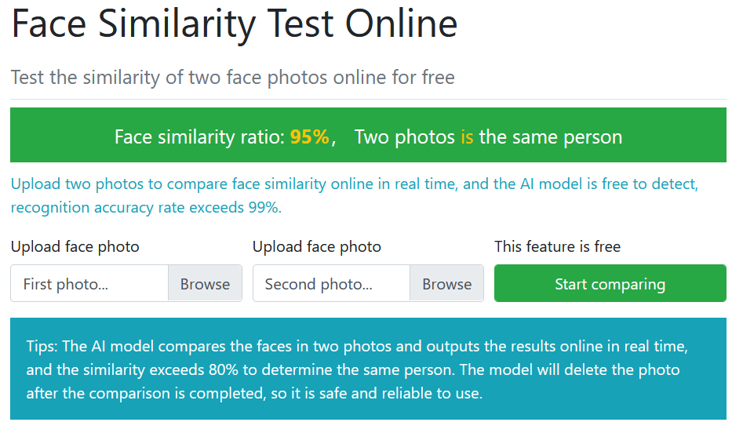

# Face Comparison by ToolPie

## URL

[https://facecomparison.toolpie.com/](https://facecomparison.toolpie.com/)

## Description

**Toolpie's Facial Comparison** page allows visitors to upload two separate face images to the page. The AI matches the two images, and within seconds tells you if it thinks the two images are of the same person (over 80% match) or not. After [uploading the two images using the buttons provided](https://facecomparison.toolpie.com/), the images are not shown on the page; the user only sees a "facial recognition ratio" with a percentage, and then a clunky, "Two photos is the same person" or "Two photos is not the same person".&#x20;

[The website states](https://facecomparison.toolpie.com/), "The model will delete the photo after the comparison is completed, so it is safe and reliable to use," however there does not seem to be any other documentation or explanation as to what data is used to train the model or if the images uploaded further assist in training the model.&#x20;

While facial comparison algorithms can work quickly and provide helpful information when comparing two faces, tools like Toolpie's Facial Comparison need double checking as well as human review before using their results in an investigation. They can, however, be helpful when a researcher is uncertain if two images are of the same person, and need a starting point to work from.&#x20;

Toolpie's Facial Recognition tool provides open source researchers with a quick way to assess if their initial assessment of two facial images merits further review. The tool seems to work well in some but not all instances regardless of age (say, if the pictures were taken years apart), as well as with facial hair (beards, goatees, etc) and hair colour changes, but does not work well if any major elements (eyes, nose or mouth) are covered, such as with sunglasses or a mask. This makes Toolpie's Facial Recognition tool useful for researchers looking into cold cases or comparing images from social media accounts.&#x20;

**How to Use Face Recognition by Toolpie**

<figure><figcaption></figcaption></figure>

Upload two separate photos to the "Upload face photo" sections, then click on "Start comparing". It should only take a few seconds to get a response back, which should look similar to the screenshot above.&#x20;

In this example, two known photos of a missing person were used, and the results came back at a 95% match that it was them. Ten different photos of the same missing person were used to test the site; all returned a 90% or higher match. Then ten photos of different people were used, some who had similar facial features to the missing person. All returned, "Two photos is not a match", with the percentages varying between 13 and 65%.&#x20;

## Cost

* [x] Free
* [ ] Partially Free
* [ ] Paid

There is no cost for the tool, nor is there any sign up required.&#x20;

## Level of difficulty

<table><thead><tr><th data-type="rating" data-max="5"></th></tr></thead><tbody><tr><td>1</td></tr></tbody></table>

## Requirements

Internet access and a web browser to view the results, as well as two images in digital form to upload for comparison.&#x20;

## Limitations

* Does not provide any reasoning or explanation as to how the AI comes to the conclusion around the similarity or dissimilarity of the images.&#x20;
* Does not provide any output, including the images themselves, other than the ratio percentage and ensuing yes/no (over 80% match gives a yes, under gives a no).&#x20;
* [The website states the tool exceeds 99% accuracy](https://facecomparison.toolpie.com/), which means the tool cannot be correct 100% of the time and will need secondary verification. There is no way for researchers to know if this percentage is accurate.&#x20;

## Ethical Considerations

* It is not clear what software powers Toolpie's facial comparison matching tool, nor what the "face similarity ratio" means.&#x20;
* It is unknown how, when and where the data was compiled to train the dataset, which also means it's impossible to determine bias or whether the data collection met GDPR or other privacy law requirements.&#x20;
* Toolpie does not have any privacy details outlined on their website, although two of their tool pages ([Face Comparison](https://facecomparison.toolpie.com/), [Encrypt & Decrypt Text](https://encrypt.toolpie.com/)) mention that user data is not stored on the website for privacy reasons.&#x20;
* There is no mention of what happens to the pictures uploaded to the website. For instance, does the tool provider know or have access to what it is I am researching?&#x20;

Wang, Woo, Zhou and Fo (2024) in their paper, [Beyond surveillance: privacy, ethics, and regulations in face recognition technology](https://doi.org/10.3389/fdata.2024.1337465) provides an analysis of international regulatory frameworks and ethical considerations for facial recognition technology, examining global privacy laws and surveillance contexts.&#x20;

## Tool provider

Tool provider unknown. No information provided beyond [https://www.toolpie.com/](https://www.toolpie.com/).

## Similar tools

[VisageHub](https://www.visagehub.com/compare): Similar to Toolpie's Facial Recognition tool, in that it's a free and simple drag-and-drop upload of two images for comparison. VisageHub also offers detailed explanation as to why the algorithm determined similarity (such as giving match percentages for each part of the face), and an odd breakdown as to what constitutes a match (over 50% means it's a definite match\*). However, VisageHub has a detailed [privacy policy](https://www.visagehub.com/privacy-policy) which might concern some open source researchers.&#x20;

[Amazon Rekognition](https://aws.amazon.com/rekognition/): Rekognition offers a multitude of machine learning tools to its users, including a facial comparison tool that's mostly hidden away unless you know it's available. Technically a paid tool, in that users must sign up to AWS to receive access and a free year of service, before being billed for data relative to the closest AWS server to them. (The amount varies, but was in the $0.01 USD per million searches range for most instances. See the [Amazon Rekognition Pricing](https://aws.amazon.com/rekognition/pricing) page for more information). For most open source researchers, Rekognition might feel like using a Zamboni when a shovel would work, but it is exceptionally powerful with a high level of accuracy, and offers API access to boot. Yet the [privacy and data regulations over at AWS](https://aws.amazon.com/compliance/data-privacy-faq/) might give researchers pause, although you can apply to have your inputs removed for training purposes.&#x20;

## Advertising Trackers

* [x] This tool has not been checked for advertising trackers yet.
* [ ] This tool uses tracking cookies. Use with caution.
* [ ] This tool does not appear to use tracking cookies.

| Page maintainer |
| --------------- |
| Bonny Albo      |
|                 |
