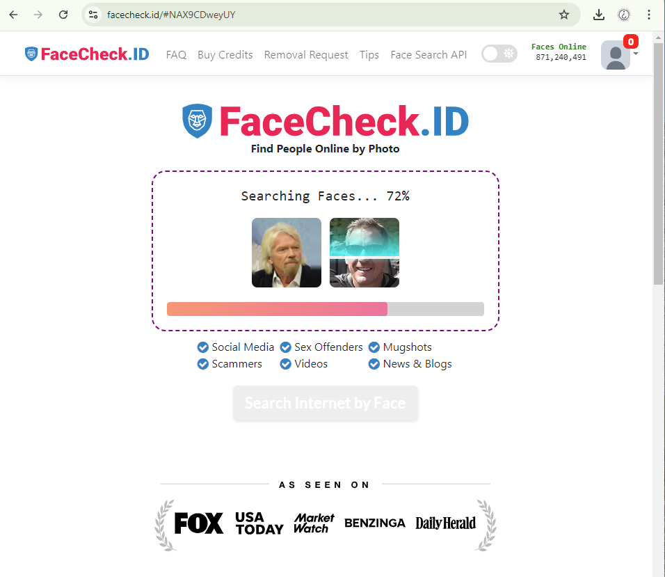

# FaceCheck.ID

## URL

[https://facecheck.id/](https://facecheck.id/)

## Description

Reverse image searching for people is not a reliable research method on its own but it can be used as one of several steps during an open source investigation. Save photographs of the individual you are researching, ideally high-resolution images that clearly show their face, and run these through tools like FaceCheck.ID to potentially find more photographs of the same individual.&#x20;

It is important to keep in mind that you should never solely rely on facial recognition tools to identify the same person across several photos (since two people might just look very similar). You also need other pieces of evidence to be able to draw correct conclusions.

### Step-by-step guide

Simply drag and drop the image in the search engine. Once the search is complete, FaceCheck.ID will generate a report. Each photograph it has identified has a certainty score between 0 and 100. The higher the score the higher the likelihood that the two faces might be the same according to FaceCheck.ID. The search report is [deleted ](https://facecheck.id/Face-Search/FAQ)after 24 hours, according to the FAQ page of FaceCheck.ID. That said, you can create a permanent link for future reference by clicking on the link below the report.

<figure><figcaption>
Screenshot 1. Drag and drop an image on the website's home page to search. 
</figcaption></figure>

## Cost

* [ ] Free
* [ ] Partially Free
* [x] Paid

FaceCheck.ID will allow you to search for free, but you will have to [buy ](https://facecheck.id/buy)credits to view the results. It is important to note you can only pay with crypto currencies.

## &#x20;Level of difficulty

<table><thead><tr><th data-type="rating" data-max="5"></th></tr></thead><tbody><tr><td>1</td></tr></tbody></table>

## Requirements

You need to buy credits via crypto currency.

## Limitations

Like other reverse facial recognition search engines, FaceCheck.ID will not provide you with a full name, email address and other confirmed pieces of personal identification data. You will need to comb through the results to determine whether a) the images identified by FaceCheck.ID are of your subject, and b) analyse the information on each web page that features the photos to determine information like usernames, possible location etc.&#x20;

## Ethical Considerations

FaceCheck.ID does not clearly list its sources, [its website only states](https://facecheck.id/Face-Search/Privacy) that the tool compares uploaded photos with photos "from public, readily available web pages such as public news websites and blogs."

Ethical considerations include privacy concerns, copyright infringement, and possible proliferation of misinformation. Make sure you analyse the search results critically and cross-reference these with other sources of information to ensure your findings are accurate. Do not use copyright images without permission.&#x20;

Josephine Lulamae reflects on ethical questions around the use of facial recognition tools in the AlgorithmWatch article: [War Crimes OSINT, Harassment, Doxxing Police and Protesters: Face Recognition for Everyone](https://algorithmwatch.org/en/face-recognition-for-everyone/) (2022).

## Guides and articles

Read the guide on the FaceCheck.ID [website](https://facecheck.id/Face-Search-Effective-Face-Lookup). The following is also a really useful comparison between PimEyes and FaceCheck.ID:

* 'FaceCheck ID: Ultimate Review and PimEyes Comparison', 11 September 2023, [_SoftGist_ ](https://softgist.com/facecheck-id-review)(accessed on 30 September 2024).

## Tool provider

The FaceCheck.ID website states it was created by Sentient Labs in Belize.

## Advertising Trackers

* [x] This tool has not been checked for advertising trackers yet.
* [ ] This tool uses tracking cookies. Use with caution.
* [ ] This tool does not appear to use tracking cookies.

| Page maintainer |
| --------------- |
| Ana             |
|                 |
