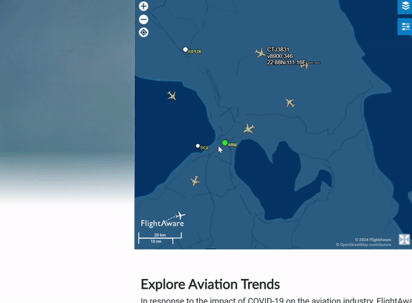
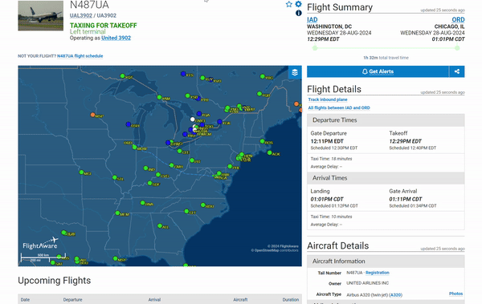

# FlightAware

## URL

[http://flightaware.com/](http://flightaware.com/)

## Description

FlightAware is a global aviation tracking service that collects real-time flight information, including flight paths, statuses, and historical data. It works by gathering data from various sources, such [as air traffic control systems, commercial data providers, and its network of ADS-B (Automatic Dependent Surveillance-Broadcast) receivers](https://www.flightaware.com/about/faq/#data). Key features include live flight tracking, airport information, aircraft information, and alerts for delays or cancellations.


TIP: Finding plane information requires a multi-source approach. Check more than one flight-tracking website when doing research “since one might have more information than the others”, as Giancarlo Fiorella wrote in his [Beginner's guide to flight tracking](https://www.bellingcat.com/resources/how-tos/2019/10/15/a-beginners-guide-to-flight-tracking/). Another tip by[ OCCRP](https://www.occrp.org/en/project/russian-asset-tracker/faq-what-is-plane-tracking) is to start your investigation with a Google search to see what you can find about a plane of interest.



NOTE: FlightAware is useful for tracking the following types of flights (see a list of flight types in the filtering options box on the right hand side above the [live map](https://www.flightaware.com/live/map)): [commercial flights](#user-content-fn-1)[^1], [business flights](#user-content-fn-2)[^2], [cargo flights](#user-content-fn-3)[^3], [general aviation flights](#user-content-fn-4)[^4], and MEDEVAC[^5]. However, take note that it honors requests to remove any aircraft if the owner asks for it as pointed out in this [planespotting guide by GIJN](https://gijn.org/resource/planespotting-an-updated-guide-to-tracking-aircraft-around-the-world/).


When used for open-source investigations, flight-tracking websites like FlightAware can assist in:

* [Supporting real-time news analysis](https://www.bellingcat.com/resources/how-tos/2019/10/15/a-beginners-guide-to-flight-tracking/), such as [Yevgeny Prigozhin’s plane crash](https://www.flightradar24.com/blog/russian-legacy-600-crashes-near-tver/)
* [Monitoring the movement of private jets as potential illicit assets](https://www.occrp.org/en/project/russian-asset-tracker/faq-what-is-plane-tracking)
* [Probing/scrutinizing transit/travel patterns](https://www.theguardian.com/world/2022/aug/03/flight-trackers-flightradar24-ads-b-exchange) of high-profile individuals (see examples [here](https://www.occrp.org/en/investigation/the-chefs-global-footprints), and [here](https://www.nytimes.com/interactive/2022/06/17/world/europe/russia-private-jets.html?auth=login-google1tap\&login=google1tap))
* FlightAware can also be used for geolocation and verification (an example will be provided below)

### Key Features

### SEARCH TAB

Depending on what information a researcher already has, he/she can go to the main search tab. One can enter [**a flight number, tail number, airport, city**](https://pilotinstitute.com/tail-number-vs-call-sign-vs-flight-number/) (See detailed description below).

### LIVE MAP

In the tool’s [landing page](https://www.flightaware.com/), below the search bar, users can see a live tracking map which claims to show real-time traffic worldwide. Refer to the table below to see how users can get information on the live map:

_**Search by aircraft: Hover or click on any aircraft**_

**Hovering over an aircraft will give a quick overview of:**

* aircraft call sign
* its altitude
* its route using airport codes (i.e. MNL - AUH - meaning from Manila International Airport (MNL) to Abu Dhabi International Airport (AUH) )
* estimated landing time
* speed

<figure><figcaption>
This is a view of the live map of FlightAware, found on the landing page of the tool. Search an area or region of interest and hover over an aircraft to find details. In this case, we are looking at a United Airlines flight 195, Call sign UAL:195, on a Boeing 772, flying at around 38000 ft, at the speed of 519 mph. The aircraft came from Munich International Airport and arrived at San Francisco International Airport. Clicking on this aircraft, by contrast, will provide more details on a separate page (NOTE that the site may only show estimates for speed and altitude).
</figcaption></figure>

**Clicking on an aircraft :** This will take you to a dedicated page for that flight with all the necessary flight information and aircraft information (as described below).

**Clicking on an airport (represented by dots and a three-letter airport code):** This will take the user to the airport page where users can find [incoming and outgoing flights](https://www.flightaware.com/about/faq/#vicinityAirport) to and from the airport:

* GREEN - outgoing commercial flights
* BLUE - incoming commercial flights
* WHITE - flights passing through the airspace with different airport destinations and different airports of departure

In addition, users can flip through the different tabs for weather information, maps and diagrams.

**Filter Live Map Flights:** On the live map, users can also filter all worldwide flights according to _**Altitude, Speed, Flight Type, and Aircraft Type**_ by clicking on the icon to the right, underneath the layers map. \\

<figure><figcaption>
This shows how to get to the airport page from the live map. Click on an airport code. In this case, we chose MNL (Manila International Airport). We can also flip through the tabs for more information about this airport.
</figcaption></figure>

### VIEWING RESULTS

FlightAware will display a list of matching flight/s. The information available is grouped into two main sections: Flight information and Aircraft Information. In addition, a live map with the flight in question is available at the lower left of the webpage.

<figure><figcaption>
Here is a sample flight on our search results. Clicking on this particular flight will give users as much information as possible. If any detail is missing, it will indicate whether users must subscribe to get that info.
</figcaption></figure>

| Flight Details                                                                                                                                                                                                                                                                                                                                                                                                                                                                                                                                                                                                                                                                           | Aircraft Details                                                                                                                                                                                                                                                                                                                                                                                                                                                       |
| ---------------------------------------------------------------------------------------------------------------------------------------------------------------------------------------------------------------------------------------------------------------------------------------------------------------------------------------------------------------------------------------------------------------------------------------------------------------------------------------------------------------------------------------------------------------------------------------------------------------------------------------------------------------------------------------- | ---------------------------------------------------------------------------------------------------------------------------------------------------------------------------------------------------------------------------------------------------------------------------------------------------------------------------------------------------------------------------------------------------------------------------------------------------------------------- |
| <ul><li>Call sign/Flight number</li><li>Airline</li><li>Creating flight alerts - <strong>which is helpful for OSINV monitoring</strong></li><li>Departure and arrival airports</li><li>Scheduled departure and arrival times</li><li>Flight status (delayed, on time, canceled)</li></ul>
On the live map to the left, users can follow the flight route. A <strong>solid line</strong> refers to the plane's real-time path, and a <strong>dashed line</strong> indicates the planned route. <strong>If users see both,</strong> this means the aircraft deviated from its planned route for many reasons, such as weather, shortcuts, traffic, and other factors.

  
 | <ul><li>Aircraft type</li><li>Registration and Tail Number (if using a paid subscription and if available)</li><li>Speed</li><li>Altitude</li><li>Distance</li><li>And photos of the aircraft type</li></ul>
(NOTE: The aircraft photos displayed may not be specific to the exact flight you're viewing. For instance, if you're looking at a Boeing 737-800 flight, you might see photos of other Boeing 737-800 aircraft from different airlines.)

 
 |
|                                                                                                                                                                                                                                                                                                                                                                                                                                                                                                                                                                                                                                                                                          |                                                                                                                                                                                                                                                                                                                                                                                                                                                                        |

### PHOTOS

FlightAware also offers a photo gallery, organized by aircraft type. There are two ways to search for photos.

**Community Page**

First, click on the URL, hover over the “Community” link on the top right, and then click on the Photos section. Browse through the gallery or filter by **aircraft, airport, airline, and date**. More importantly, if you have a tail number or registration number available, you can input this on the Search bar at the bottom right to see if there is a match.

**Aircraft Details Page**

When you click on a particular flight, the full, detailed page will load (See the image in the “Viewing Results” section above) and navigate to the bottom right of the page.

### **KML OF FLIGHT LOG FOR CERTAIN GEOLOCATION TASKS**

Lastly, for flights that have already landed or are completed, FlightAware allows users to download a KML file of the flight log. This will contain all the coordinates of its flight path, altitude, and other information that helps users visualize it. To do this, click on the flight page of a flight in question, click on “View track log”. Then navigate to the upper left corner of the page and click the “+ Google Earth” icon, as shown below.


NOTE: Remember that historical information is limited for the free account, so flight log information may not always be available.


<figure><figcaption>
Downloading a KML of the flight log requires two steps. First, click "View Track Log" under Flight Details as shown in the top window. This will then load another window (bottom of the image), and users can click on the Google Earth icon on the top left.
</figcaption></figure>

<figure><figcaption>
This is a KML file for flight KLM 995, from Amsterdam to London. After downloading the file, open Google Earth Pro and import the KML file, and the result should look something like this from a bird's eye view.
</figcaption></figure>

<figure><figcaption>
This shows The Hague, a city along the KLM 995 flight path, in 3D view on Google Earth Pro, at almost street level. To do this, the user can import the KML file on Google Earth and zoom in on a city of interest.
</figcaption></figure>

This can be helpful for specific geolocation tasks, especially for images with contrails or airplanes in the background. If there is flight information in a geolocation task, KML files overlaid on Google Earth Pro can help plot the course location and narrow down the search area based on the flight path.

Here is an example of a [geolocation by Nixintel](https://nixintel.info/osint/using-flight-tracking-for-geolocation-quiztime-30th-october-2019/) using a flight log KML file overlaid over Google Earth Pro, in addition to using the[ Suncalc tool](https://bellingcat.gitbook.io/toolkit/more/all-tools/suncalc).

<figure><figcaption>
(Source: Nixintel, Steven Harris, <a href="https://nixintel.info/osint/using-flight-tracking-for-geolocation-quiztime-30th-october-2019/">https://nixintel.info/osint/using-flight-tracking-for-geolocation-quiztime-30th-october-2019/</a>) This is an example of a flight KML file used as a layer on Google Earth Pro. On the left is the source image for geolocation, while on the right is a screenshot of the Google Earth Pro in 3D Street View, with the flight path visible in the sky. The author uses the diagonal trajectory of the flight path on the right to match the trajectory of the aircraft contrail (diagonal line in the sky) on the left photo. The KML file assisted in narrowing down whether the location of the source image is north or south of the flight path.
</figcaption></figure>

### Use case

First, flight-tracking websites like FlightAware not only assist with geolocation but also help create flight databases for countries with issues that require continuous monitoring. For instance, Bellingcat has created an open-source flight database for [Kazakhstan](https://www.bellingcat.com/resources/2022/01/08/launching-an-open-source-flight-database-for-kazakhstan-in-wake-of-protests/) and [Venezuela](https://www.bellingcat.com/resources/case-studies/2021/03/11/launching-an-open-source-aircraft-database-for-venezuela/).

Second, investigators who monitor aircraft, [such as those at OCCRP,](https://www.occrp.org/en/project/russian-asset-tracker/faq-what-is-plane-tracking) focus on two key tasks:

1. Determining which planes are owned or regularly utilized by individuals of interest.
2. Following their flight histories or pinpointing their current whereabouts.

However, as pointed out in OCCRP's [Plane Tracking FAQ](https://www.occrp.org/en/project/russian-asset-tracker/faq-what-is-plane-tracking), figuring out who really owns a plane is often the more challenging part because people often hide ownership through shell companies and other methods to keep it secret. But because flight tracking is mostly publicly available, the second option can be a useful method for receiving clues to fill the information.

See this website: [https://dictatoralert.org/](https://dictatoralert.org/). It is a project that monitors the flight paths of authoritarian regimes' aircraft and alerts people on Twitter when these planes land in major European cities.

### Identifiers and Where to Find Them on FlightAware

When doing flight tracking for investigations, it is essential to know what data to look for and which information can potentially provide leads in an investigation. However, note that not all information may be immediately available on one flight tracking website. Expand each identifier below to see what it is, why it is important and where to find it in the tool.

<strong>CALL SIGN: What is it? Why is it important? </strong><mark style="color:green;"><strong>(CLICK TO EXPAND)</strong></mark>

**What is it?**[ Call signs are used to identify specific flights/flight routes and for communication and identification in air traffic control.](https://skybrary.aero/articles/aircraft-call-sign) They are unique identifiers of an aircraft. They help differentiate each aircraft in the sky from one another. According to this Bellingcat[ guide](https://www.bellingcat.com/resources/how-tos/2019/10/15/a-beginners-guide-to-flight-tracking/), private aircraft often use their registration number as their call sign. In contrast, commercial flights usually have call signs based on their specific routes.

According to this GIJN[ guide](https://gijn.org/resource/planespotting-an-updated-guide-to-tracking-aircraft-around-the-world/), “The call sign is more or less whatever the pilot decided to enter for that flight.” Commercial flights, on the other hand, will be the flight number or close to it, like DAL307 for Delta Airlines flight 307 from Honolulu to Minneapolis.

_Call signs also often vary with each flight, and occasionally, they may change even while in the air. For instance, an aircraft might have different call signs throughout the day if it completes several trips,_ [_Bellingcat explains_](https://www.bellingcat.com/resources/how-tos/2019/10/15/a-beginners-guide-to-flight-tracking/)_._

**Why is it important?:** Call signs are helpful when monitoring routes and flight paths and identifying potential deviations or anomalies. It can tell you what the flight path of an aircraft is, its intended destination, and where it passed by.

**Where can you find the call sign on FlightAware?**

The call sign is usually located primarily in two places. If looking at the flight map (left image), hover over the airplane you are interested in, and the flight and aircraft information appears. The call sign is highlighted with a yellow box. If looking at the flight data page (right image), the call sign is immediately to the right of the airliner’s logo (highlighted in the red square).

<figure><figcaption>
There are two places where users can find the call sign within the tool. One is through the live map on the landing page (left), and the other is through the specific flight page of the aircraft of interest (right).
</figcaption></figure>

REGISTRATION NUMBER/ TAIL NUMBER/ / N-NUMBER: What is it? Why is it important? <mark style="color:green;">(CLICK TO EXPAND)</mark>

**What is it?** This number appears near [the tail of every aircraft (para. 6 of this guide). ](https://www.bellingcat.com/resources/how-tos/2019/10/15/a-beginners-guide-to-flight-tracking/)This is sometimes called a [“Tail Number” or, in the United States, an “N-Number”. ](https://www.bellingcat.com/resources/how-tos/2019/10/15/a-beginners-guide-to-flight-tracking/)It is a unique number that tells you which country the aircraft [was registered](https://www.occrp.org/en/project/russian-asset-tracker/faq-what-is-plane-tracking). This [guide](https://www.bellingcat.com/resources/how-tos/2019/10/15/a-beginners-guide-to-flight-tracking/) specifies that an aircraft's registration is similar to a car's license plate, assigned when registered in a specific country. This registration reflects the jurisdiction of the aircraft according to this [list](https://en.wikipedia.org/wiki/List_of_aircraft_registration_prefixes).

**Why is it important?** If available, registration information can be helpful for finding clues about the ownership of the aircraft. However, there are a few caveats:

1: [The registered owner is rarely the actual UBO ](https://www.occrp.org/en/project/russian-asset-tracker/faq-what-is-plane-tracking)(Ultimate Beneficial Owner - the person who profits or benefits from a corporate entity). It is rarely an individual but a company, trust, or charter/leasing company. In these cases, use additional sources to make the link.

2: Aircraft registration can change, [especially when sold to a new owner.](https://www.bellingcat.com/resources/how-tos/2019/10/15/a-beginners-guide-to-flight-tracking/)

**Where can you find the registration number on FlightAware?**

The registration number can be found on the flight summary page, if available. And in the aircraft details section, as shown below. Clicking on the “Registration” link will take you to a separate page with more detailed registration information, registration history, and transfer of ownership.

<figure><figcaption>
This is an example of an aircraft whose registration information is available under a free account. You can look at the Flight Summary section of the page for the registration number or click the “Registration” link in the bottom right to take you to a page with a more detailed description.
</figcaption></figure>


NOTE #1: Based on our tests, this registration information seems only available for most commercial airlines, some MEDEVAC flights, some general aviation flights, and some cargo flights.

NOTE #2: According to the [tool](https://www.flightaware.com/resources/registration/ZSTMB), “FlightAware is currently only able to display limited information for aircraft that is not identified with a United States “N-Number” (e.g., N123AB)”


<strong>HEX CODE/ MODE-S CODE/ ICAO CODE: What is it? Why is it important? </strong><mark style="color:green;"><strong>(CLICK TO EXPAND)</strong></mark>

**What is it?** A hex code is a unique ICAO (International Civil Aviation Organization) six-digit hexadecimal number assigned to an aircraft's transponder. This code serves as a digital identifier or a unique “digital fingerprint”, allowing air traffic control and flight tracking systems to distinguish one aircraft from another[ (See p.3-4 of this document)](https://elearning.aljazeera.net/en/journalism-magazine/osint-tracking-ships-planes-and-weapons). When the plane is registered, it gets a unique electronic code[ called a hex code](https://www.occrp.org/en/project/russian-asset-tracker/faq-what-is-plane-tracking). This hex code is associated with the plane’s ADS-B (Automatic Dependent Surveillance-Broadcast)[ transponder](https://www.flightradar24.com/blog/videos/how-does-ads-b-work/), which broadcasts unencrypted data about the plane’s position, altitude, and speed. If the N-number is the physical identifier like a car license plate, the hex code is its digital counterpart. &#x20;

According to [this](https://www.peter2000.co.uk/aviation/misc/ICAO_Annex_10_Volume_III.pdf), ICAO assigns each country a [block range of hex codes](https://blog.flightaware.com/201707-icao-and-idents-and-squawks-oh-my). [For example, Malaysia is assigned the range 750000 to 750FFF, and the US is assigned the range 00000 to AFFFFF. ](https://theaviationist.com/2020/09/29/yes-u-s-rc-135s-have-used-bogus-hex-codes-to-transmit-a-false-identity-but-its-not-to-fool-china-or-other-enemies/)So in theory, if the flight tracking website sees a hex code in this range, it will identify the aircraft as coming from that country, and, as in FlightAware, [displays the flag from that country](https://blog.flightaware.com/201707-icao-and-idents-and-squawks-oh-my). &#x20;

**Why it may be important?**&#x20;

**Connection to Country of Registration:** Hex codes can sometimes be necessary to find leads about which country a plane is registered in. [Hex codes are closely associated with a plane’s registratio](https://gijn.org/stories/icarus-flights-the-powerful-new-flight-tracking-tool/)n. Therefore, it may sometimes be possible to determine ownership if that information is available.&#x20;

**Vulnerability to Manipulation:** According to[ OCCRP's FAQ](https://www.occrp.org/en/project/russian-asset-tracker/faq-what-is-plane-tracking), “most flight tracking websites link the transponder codes to registration numbers to make sense of tracking data,” especially since aircraft do not usually broadcast registration numbers over their ADS-B transponder. [However, onboard transponders can be reprogrammed according to this article.](https://theaviationist.com/2020/09/29/yes-u-s-rc-135s-have-used-bogus-hex-codes-to-transmit-a-false-identity-but-its-not-to-fool-china-or-other-enemies/) A junk hex code can then broadcast unreliable and misleading data to flight tracking sites.&#x20;

**Some Military Logistics Aircraft With No Tail Numbers:** In some cases, military aircraft such as the [US Air Mobility Command removed tail numbers for OPSEC.](https://theaviationist.com/2023/03/04/u-s-air-mobility-command-removes-tail-numbers-and-unit-markings-from-aircraft-for-opsec/) The hex code can come in handy when analyzing movements from this type of aircraft. &#x20;

\

**Where can you find the hex code on FlightAware?**

On FlightAware, the hex code is referred to as **“Mode S Code”**

What’s required: Users can find the hex code on FlightAware if they have registration information or the tail number. Search for an aircraft of interest and click on the Registration link as shown above. On the registration page, find the “Mode S Code” at the bottom of the left column.

<figure><figcaption>
This is a sample registration page for a United Airlines flight. The purple box emphasizes the hex code for this tool.
</figcaption></figure>


NOTE: This website responds to [take-down requests](https://gijn.org/resource/planespotting-an-updated-guide-to-tracking-aircraft-around-the-world/) for specific aircraft for privacy reasons. But if available, registration info, hex code, and tail number can be obtained with a paid tier subscription. (Users may need to look at other flight tracking websites such as Radarbox to get some of this information)


SERIAL NUMBER/ MANUFACTURER SERIAL NUMBER (MSN): What is it? Why is it important? <mark style="color:green;">(CLICK TO EXPAND)</mark>

**Definition:** A serial number is a unique code given to an aircraft by the manufacturer to identify it from other planes. It's like a fingerprint for that specific aircraft designated at the time of manufacture or [similar to a car’s VIN (vehicle Identification Number).](https://www.bellingcat.com/resources/how-tos/2019/10/15/a-beginners-guide-to-flight-tracking/) Serial numbers never change, unlike call signs and registration numbers. It is mandated by law (See [here](https://www.ecfr.gov/current/title-14/chapter-I/subchapter-C/part-45), Section 14.13) to collectively ensure that aircraft can be monitored, maintained, and operated safely throughout their service life.

**When to use serial numbers for open-source investigations:**[ OCCRP](https://www.occrp.org/en/project/russian-asset-tracker/faq-what-is-plane-tracking) states that “If you’re trying to track a plane over multiple years and ownership changes, you’ll need to know the manufacturer’s serial number.” Because an aircraft’s serial numbers don’t change, you can follow its journey. This makes it helpful in tracking a plane over time between [owners, registrations, and nations](https://elearning.aljazeera.net/en/journalism-magazine/osint-tracking-ships-planes-and-weapons).

**Where can you find the MSN/Serial Number on FlightAware?**

This tool uses the term "Serial Number" instead of MSN. The serial number can be found on the registration page of the aircraft. Navigate to the page as shown above (See section for registration/tail number). Find the right column under “Aircraft Summary.” The serial number is found on the fourth line.

<figure><figcaption>
Locating the serial number on FlightAware is the same as finding the registration and hex code. The details are in the left column under "Aircraft Summary." Note again that some aircraft may require a paid subscription to the tool to get this information.
</figcaption></figure>

## Cost

* [ ] Free
* [x] Partially Free
* [ ] Paid

Information on pricing can be found [here](https://www.flightaware.com/commercial/premium/).

The different paid tiers are:

| Features\*                                                                                            | Enterprise WX | Enterprise | Premium + | Basic    |
| ----------------------------------------------------------------------------------------------------- | ------------- | ---------- | --------- | -------- |
| Alerts                                                                                                | unlimited     | unlimited  | unlimited | 5        |
| Saved Aircraft                                                                                        | unlimited     | unlimited  | unlimited | 5        |
| Past flight activity                                                                                  | 8 months      | 8 months   | 5 months  | 3 months |
| Aircraft statistics (view of aircraft’s trips, routes by month or year)                               | available     | available  | -         | -        |
| \*_Not an exhaustive list of features but lists features that may be useful for open-source research_ |               |            |           |          |
|                                                                                                       |               |            |           |          |

## Level of difficulty

<table><thead><tr><th data-type="rating" data-max="5"></th></tr></thead><tbody><tr><td>3</td></tr></tbody></table>

## Requirements

1. Create an user account using an email account or via an already existing Google account or Apple account.
2. Paid subscription, if interested in historical flights and more flights with tail number and registration information (at the moment, not all aircraft have these identifiers available with a free account).

## Limitations

#### Filtering and Categorization

* **Limited Filtering:** FlightAware does not allow to filter flights based on specific categories on the live map, making it difficult to focus on particular aircraft or routes.
* **Insufficient Categories:** The available flight categories are limited, especially regarding military aircraft, which can hinder investigations into military aviation activities. Although, in theory, one can find a military aircraft on the live map and through the search bar, or by knowing ahead of time which call signs may be related to military or government aircraft. However, if this is a consideration for researchers, websites like[ flightradar24.com](https://www.flightradar24.com/blog/an-all-new-way-to-filter-flights-on-flightradar24-com/) may be able to help users by filtering for various categories including ["Military and Government"](https://www.flightradar24.com/blog/an-all-new-way-to-filter-flights-on-flightradar24-com/).

#### Visual Representation

* **Visual crowding:** The density of flight icons on the live map can sometimes hinder the ability to easily identify and track specific aircraft. The live map may experience visual crowding due to the number of flight icons, potentially making it difficult to focus on individual aircraft.
* **Unrepresentative Icons:** The icons used on the live map may not precisely reflect the actual aircraft types, leading to potential delays in accessing or retrieving data you are interested in. In contrast to websites like flightradar24, different icons show different aircraft types at first glance. Navigating through this amount of information may be an issue for some researchers.
* **Photo Matching** - If photos are used for verification, matching can be a slightly longer process on FlightAware. Aircraft photos refer to similar aircraft types (Boeing 777 or Airbus A380, etc) instead of the exact airplane in the air that the user is currently tracking. To find the right aircraft in the gallery, users need to know the tail number from a different source and put it in the search bar. It may save researchers time by going to flightradar24 or ADS-B Exchange and other sites to do a photo match since the photo on its flight page corresponds to the actual aircraft of interest instead of a type.

#### Data Limitations

* **Limited Historical Data:** As mentioned above, the “Basic” FlightAware subscription provides access to a limited amount of historical flight data, which can be insufficient for in-depth analysis or investigations requiring long time frames.
* **No Playback Option:** The live map does not offer a playback option, preventing users from reviewing past flight activity. Playback options can be helpful when researchers only have vague leads about a flight (for example, I know there was a flight 7 days ago in Rio de Janeiro Santos Dumont airport”. It is often helpful to monitor that airport and do playback for flights within a specific time frame.)
* **Data Blocks:** Due to screen real estate limitations and the vast amount of flight data, not all information can be displayed on the live map, leading to data blocks or omissions. The search bar is the way to find flight information on FlightAware.

#### Privacy and Data Restrictions

* **Take-Down Requests:** As mentioned above, FlightAware may comply with take-down requests from aircraft owners seeking to protect their privacy, resulting in the removal of flight data. Hence, not all registration information is available. Flightradar24 and ADS-B Exchange [have a more open approach](https://www.bellingcat.com/resources/how-tos/2019/10/15/a-beginners-guide-to-flight-tracking/) and will contain more registration information than FlightAware.
* **Limited Registration Data:** As mentioned above, under Identifiers and Registration numbers, FlightAware primarily displays US registration numbers for aircraft, limiting its ability to track international flights or planes with non-US registrations.

## Ethical Considerations

**Privacy vs. Transparency:**

The ethical dilemma here revolves around the conflict between public transparency and individual privacy. Make careful determinations about how to publish research that involves tracking patterns of individuals. This [case](https://amp.cnn.com/cnn/2024/02/06/tech/taylor-swift-private-jet-tracker/index.html), for example, highlights the tension between the right to information and the potential consequences of exposing individuals to danger.

**Context matters:**

Consider the purpose behind using flight tracking data when publishing.

**Respect Copyright:**

Flight tracking websites often have terms of service regarding data usage. Ensure you're using the information ethically and within the website's guidelines (FlightAware [Terms and Conditions](https://www.flightaware.com/about/termsofuse/)).

## Comparison with Other Flight Tracking Tools

Based on our tests, below is a comparison of some of the features of different flight tracking tools.&#x20;

| Feature                           | FlightAware                                                                                                                                                                                                                                                                                                                                                             | Flightradar24                                                                                                                                                                                                                                                                                                                                                           |
| --------------------------------- | ----------------------------------------------------------------------------------------------------------------------------------------------------------------------------------------------------------------------------------------------------------------------------------------------------------------------------------------------------------------------- | ----------------------------------------------------------------------------------------------------------------------------------------------------------------------------------------------------------------------------------------------------------------------------------------------------------------------------------------------------------------------- |
| Data Sources                      | 
• ADS-B receiver network (terrestrial) • Air traffic control systems in 45+ countries• Aireon global space-based ADS-B• Datalink (satellite/VHF)• Commercial data providers• Flight schedules from airlines• FAA data feeds (for US airspace)

<a href="https://www.flightaware.com/about/datasources/">https://www.flightaware.com/about/datasources/</a> 
 | 
• ADS-B receiver network (terrestrial)• MLAT (multilateration)• Satellite-based ADS-B• Radar data• North American/Australian radar data• Open Glider Network (OGN)• FLARM for gliders/small aircraft• Airline and airport schedules

<a href="https://www.flightaware.com/about/datasources/">https://www.flightaware.com/about/datasources/</a>

 
 |
| Filtering by Aircraft Categories  | 
Commercial, business, cargo, general aviation, MEDEVAC

 

(See list of flight types under <a href="https://www.flightaware.com/live/map">live map</a> and filtering options) 
                                                                                                                                                                      | 
More extensive: Passenger, cargo, military/government, business jets, general aviation, helicopter, lighter-than-air, gliders, drones, ground vehicles, other

 

(See list of flight types under <a href="https://www.flightradar24.com/51.50,-0.12/6">live map</a>, and click the filter icon) 
                                                   |
| Filtering Capabilities            | Limited filtering options; difficult to focus on particular aircraft or routes                                                                                                                                                                                                                                                                                          | Advanced custom filters by aircraft type (ICAO code), airport, country, and route combinations                                                                                                                                                                                                                                                                          |
| Historical Data                   | [Basic: 3 months; Premium: 5 months; Enterprise: 8 months; Enterprise WX: 8 months](https://www.flightaware.com/commercial/premium/#subscriptions)                                                                                                                                                                                                                      | 
<a href="https://www.flightradar24.com/premium/?change=true">7 days for the Free plan</a>; <a href="https://www.flightradar24.com/premium/?change=true">90 days for Silver plan, 365 days for Gold plan, 3 years for Business plan</a>; includes playback feature for historical analysis

 
                                                             |
| Export Options                    | KML files for flight logs                                                                                                                                                                                                                                                                                                                                               | Both KML and CSV export options                                                                                                                                                                                                                                                                                                                                         |
| Aircraft Photos                   | Shows similar aircraft types (e.g., any Boeing 777)                                                                                                                                                                                                                                                                                                                     | Integrates with JetPhotos to show the exact aircraft being tracked                                                                                                                                                                                                                                                                                                      |
| Military Aircraft                 | Limited tracking capabilities for military/government aircraft                                                                                                                                                                                                                                                                                                          | Dedicated military and government category filter                                                                                                                                                                                                                                                                                                                       |
| Playback Feature                  | No playback option for reviewing past flight activity                                                                                                                                                                                                                                                                                                                   | Robust playback feature for historical analysis                                                                                                                                                                                                                                                                                                                         |
| Visualization                     | Can experience visual crowding; icons may not reflect actual aircraft types                                                                                                                                                                                                                                                                                             | More customizable visualization with widgets for weather, statistics, and personalized tracking                                                                                                                                                                                                                                                                         |
| Privacy/Blocked Data              | 
<a href="https://gijn.org/resource/planespotting-an-updated-guide-to-tracking-aircraft-around-the-world/">Complete removal of aircraft upon owner request</a>

  
                                                                                                                                                                                     | Partial obscuring of flight information (may hide registration but show aircraft type, or show origin but block destination) or [complete removal upon request](https://support.fr24.com/support/solutions/articles/3000117426-why-is-some-aircraft-information-limited-or-not-visible-)                                                                                |
| Ownership Information             | Primarily displays US registration numbers                                                                                                                                                                                                                                                                                                                              | Broader international registration coverage                                                                                                                                                                                                                                                                                                                             |
| Map Customization                 | Limited customization options                                                                                                                                                                                                                                                                                                                                           | Highly customizable map layers and widgets                                                                                                                                                                                                                                                                                                                              |
| UI Learning Curve                 | Moderate (★★★)                                                                                                                                                                                                                                                                                                                                                          | Moderate (★★★)                                                                                                                                                                                                                                                                                                                                                          |
| Cost Structure                    | 
Basic (Free), Premium, Enterprise, Enterprise WX

 

(https://www.flightaware.com/commercial/premium/#subscriptions )
                                                                                                                                                                                                                               | 
Basic (Free), Silver, Gold, Business

 

(<a href="https://www.flightradar24.com/premium/?change=true">https://www.flightradar24.com/premium/?change=true</a>) 
                                                                                                                                                                                     |

## Guides and articles

**Bellingcat Guide:**

Fiorella, Giancarlo, (2019, October 15). A beginner's guide to flight tracking. Bellingcat.[ https://www.bellingcat.com/resources/how-tos/2019/10/15/a-beginners-guide-to-flight-tracking/](https://www.bellingcat.com/resources/how-tos/2019/10/15/a-beginners-guide-to-flight-tracking/)

**GIJN Guide:**

Global Investigative Journalism Network. (n.d.). Planespotting: An updated guide to tracking aircraft around the world.[ https://gijn.org/resource/planespotting-an-updated-guide-to-tracking-aircraft-around-the-world/](https://gijn.org/resource/planespotting-an-updated-guide-to-tracking-aircraft-around-the-world/)

Global Investigative Journalism Conference 2023, (2023, October 7). Video on Plane and Ship Tracking, [https://youtu.be/zPU\_FLVBi6E](https://youtu.be/zPU_FLVBi6E)

**OCCRP Guide:**

Organized Crime and Corruption Reporting Project. "FAQ: What Is Plane Tracking?" Russian Asset Tracker. Accessed August 30, 2024.[ https://www.occrp.org/en/project/russian-asset-tracker/faq-what-is-plane-tracking#](https://www.occrp.org/en/project/russian-asset-tracker/faq-what-is-plane-tracking).

**Al Jazeera Guide:**

OSINT: Tracking Ships, Planes and Weapons [https://elearning.aljazeera.net/en/journalism-magazine/osint-tracking-ships-planes-and-weapons](https://elearning.aljazeera.net/en/journalism-magazine/osint-tracking-ships-planes-and-weapons)

**Full list of country identifiers here:** [https://en.wikipedia.org/wiki/List\_of\_aircraft\_registration\_prefixes](https://en.wikipedia.org/wiki/List_of_aircraft_registration_prefixes)

**Some lists of public registries:** [AeroTransport,](https://aerotransport.org/) [CH Aviation](https://www.ch-aviation.com/), [Airframes](http://www.airframes.org/), [RZJets](https://rzjets.net/aircraft/) and [spotters](http://spotters.net.ua/), [PlaneLogger](https://www.planelogger.com/)

**Photos:** [Planespotters.net](https://www.planespotters.net/), [Jetphotos.com](https://www.jetphotos.com/)

**Twitter hashtags:** [#aviation](https://twitter.com/hashtag/aviation?src=hashtag_click), [#avgeek](https://twitter.com/hashtag/avgeek?src=hashtag_click), [#planespotting](https://twitter.com/hashtag/planespotting?src=hashtag_click), [#flight](https://twitter.com/hashtag/flight?src=hashtag_click), and [#MilAvGeek](https://twitter.com/hashtag/MilAvGeek?src=hashtag_click).

## Tool provider

Collins Aerospace, USA

## Advertising Trackers

* [ ] This tool has not been checked for advertising trackers yet.
* [x] This tool uses tracking cookies. Use with caution.
* [ ] This tool does not appear to use tracking cookies.

| Page maintainer |
| --------------- |
| Afton           |
|                 |

[^1]: "scheduled, passenger-carrying airline flights." (According to FlightAware's landing page, under "Current Traffic" pie

    graph)

[^2]: "private, corporate travel, including all turbine aircraft." (According to FlightAware's landing page, under "Current Traffic" pie

    graph)

    \\

[^3]: "flights dedicated to transporting cargo rather than passengers" (According to FlightAware's landing page, under "Current Traffic" pie graph)

[^4]: "flights include private, hobbyist-type flights, excluding all turbine aircraft” (According to FlightAware's landing page, under "Current Traffic" pie graph)

[^5]: Medical Evacuation flights - "flight that a sick or injured person takes when they require medical care during transportation to or from a medical facility" [https://www.airambulanceworldwide.com/what-is-a-medevac-flight-what-does-medevac-stand-for/](https://www.airambulanceworldwide.com/what-is-a-medevac-flight-what-does-medevac-stand-for/)
