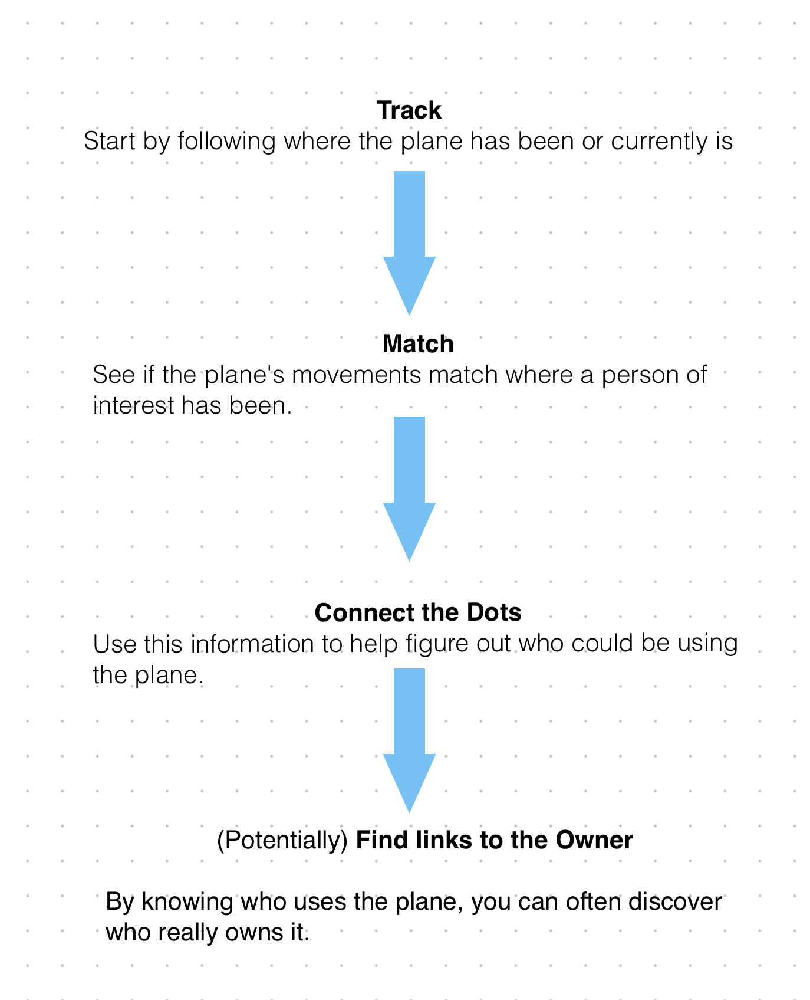

# FlightAware

## URL

http://flightaware.com/

## Description

FlightAware is a global aviation tracking service that collects real-time flight information, including flight paths, statuses, and historical data.[ It works by gathering data from various sources, such as air traffic control systems, commercial data providers, and its network of ADS-B (Automatic Dependent Surveillance-Broadcast) receivers.](http://www.flightaware.com/about/faq/#data) Key features include live flight tracking, airport information, aircraft information, and alerts for delays or cancellations. Because FlightAware has multiple data sources for its flights, it tends to have better coverage in regions such as South America and Africa (See this [guide](https://gijn.org/resource/planespotting-an-updated-guide-to-tracking-aircraft-around-the-world/) under “Other Tracking Sources”).


NOTE: FlightAware is useful if tracking the following types of flights  (See list of flight types under [live map](https://www.flightaware.com/live/map) and filtering options):  [commercial flights](#user-content-fn-1)[^1], [business flights](#user-content-fn-2)[^2], [cargo flights](#user-content-fn-3)[^3], [general aviation flights](#user-content-fn-4)[^4] and MEDEVAC. [However, take note that it honors requests to remove any aircraft if the owner asks for it. ](https://gijn.org/resource/planespotting-an-updated-guide-to-tracking-aircraft-around-the-world/)



TIP: Check more than one flight-tracking website when doing research,[ “since one might have more information than the others.”](https://www.bellingcat.com/resources/how-tos/2019/10/15/a-beginners-guide-to-flight-tracking/)


When used for open-source investigations, flight-tracking websites like FlightAware can assist in:&#x20;

* [Not only does it support real-time analysis, but it also contributes to entirely new narratives](https://www.bellingcat.com/resources/how-tos/2019/10/15/a-beginners-guide-to-flight-tracking/)&#x20;
* [Monitor the movement of illegal goods](https://elearning.aljazeera.net/en/journalism-magazine/osint-tracking-ships-planes-and-weapons) (see also [here](https://www.occrp.org/en/project/russian-asset-tracker/faq-what-is-plane-tracking))&#x20;
* [Probe/scrutinize transit/travel patterns](https://www.theguardian.com/world/2022/aug/03/flight-trackers-flightradar24-ads-b-exchange) (see also [here](https://www.occrp.org/en/investigation/the-chefs-global-footprints))
* FlightAware can also be used for geolocation and verification (see example below)

### Key Features

### SEARCH TAB

Depending on what information a researcher already has, he/she can go to the main search tab. One can enter **a flight number, tail number, airport, city**&#x20;

### LIVE MAP

In the tool’s landing page, below the search bar, users can see a live tracking map. [It claims to show real-time traffic worldwide](https://www.flightaware.com/). Refer to the table below to see how users can get information on the live map:

_**Search by aircraft: Hover or click on any aircraft**_

**Hovering will give a quick overview of**&#x20;

* aircraft call sign
* its altitude
* Its route using airport codes (i.e. MNL - AUH - meaning from Manila International Airport to Abu Dhabi International Airport)
* estimated landing time&#x20;
* speed&#x20;

<figure><figcaption>
This is a view of the live map of FlightAware, found on the landing page of the tool. Search an area or region of interest and hover over aircraft to find details. In this case, we are looking at a United Airlines flight 195, Call sign UAL:195, on a Boeing 772, flying at around 38000 ft, at the speed of 519 mph. The aircraft came from Munich International Airport and arrived at San Francisco International Airport. Clicking on this aircraft, by contrast, will provide more details on a separate page.
</figcaption></figure>

**Clicking on an aircraft :** This will take you to a dedicated page for that flight with all the necessary flight information and aircraft information (as described below)

**Clicking on an airport (represented by dots and a three-letter airport code):** This will take the user to the airport page. T[he users can find incoming and outgoing flights to and from the airport:](https://www.flightaware.com/about/faq/#vicinityAirport)

* GREEN - outgoing commercial flights
* BLUE - incoming commercial flights&#x20;
* WHITE - flights passing through the airspace with different airport destinations and different airports of departure

In addition, users can flip through the different tabs for weather information, maps and diagrams.

**Filter Live Map Flights:** On the live map, users can also filter all worldwide flights according to _**Altitude, Speed, Flight Type, and Aircraft Type**_ by clicking on the icon to the right, underneath the layers map. \

<figure><figcaption>
This shows how to get to the airport page from the live map. Click on an airport code. In this case, we chose MNL (Manila International Airport). We can also flip through the tabs for more information about this airport.
</figcaption></figure>

### &#x20;VIEWING RESULTS

FlightAware will display a list of matching flight/s. The information available is grouped into two main sections: Flight information and Aircraft Information. In addition, a live map with the flight in question is available at the lower left of the webpage.&#x20;

<figure><figcaption>
Here is a sample flight on our search results. Clicking on this particular flight will give users as much information as possible. If any detail is missing, it will indicate whether users must subscribe to get that info.  
</figcaption></figure>

\

| Flight Details                                                                                                                                                                                                                                                                                                                                                                                                                                                                                                                                                                                                                                                                             | Aircraft Details                                                                                                                                                                                                                                                                                                                                                                                                                                                          |
| ------------------------------------------------------------------------------------------------------------------------------------------------------------------------------------------------------------------------------------------------------------------------------------------------------------------------------------------------------------------------------------------------------------------------------------------------------------------------------------------------------------------------------------------------------------------------------------------------------------------------------------------------------------------------------------------ | ------------------------------------------------------------------------------------------------------------------------------------------------------------------------------------------------------------------------------------------------------------------------------------------------------------------------------------------------------------------------------------------------------------------------------------------------------------------------- |
| <ul><li>Call sign/Flight number</li><li>Airline</li><li>Creating flight alerts - <strong>which is helpful for OSINV monitoring</strong></li><li>Departure and arrival airports</li><li>Scheduled departure and arrival times</li><li>Flight status (delayed, on time, canceled)</li></ul>
On the live map to the left, users can follow the flight route. A <strong>solid line</strong> refers to the plane's real-time path, and a <strong>dashed line</strong> indicates the planned route. I<strong>f users see both,</strong> this means the aircraft deviated from its planned route for many reasons, such as weather, shortcuts, traffic, and other factors.  

  
 | <ul><li>Aircraft type</li><li>Registration and Tail Number (if using a paid subscription and if available)</li><li>Speed</li><li>Altitude</li><li>Distance </li><li>And photos of the aircraft type </li></ul>
(NOTE: The aircraft photos displayed may not be specific to the exact flight you're viewing. For instance, if you're looking at a Boeing 737-800 flight, you might see photos of other Boeing 737-800 aircraft from different airlines.) 

 
 |
|                                                                                                                                                                                                                                                                                                                                                                                                                                                                                                                                                                                                                                                                                            |                                                                                                                                                                                                                                                                                                                                                                                                                                                                           |

### PHOTOS&#x20;

FlightAware also has a photo gallery available based on aircraft type.  There are two ways to search for photos.&#x20;

**Community Page**&#x20;

First, click on the URL, hover over the “Community” link on the top right, and then click on the Photos section. Browse through the gallery or filter according to Aircraft, Airport, Airline, and Date. More importantly, if you have a tail number or registration number available, you can input this on the Search bar at the bottom right to see if there is a match.&#x20;

**Aircraft Details Page**

When clicking on a particular flight, the full detailed page will load (See image under “Viewing Results” section above) and navigate to the bottom right of the page.&#x20;

### **KML FILE OF FLIGHT LOG  FOR CERTAIN GEOLOCATION TASKS**

Lastly, for flights that have already landed or are completed, FlightAware allows users to download a KML file of the flight log. This will contain all the coordinates of its flight path, the altitude, and other information that helps users visualize. To do this, click on the flight page of a flight in question, click on “View track log”. Then navigate to the upper left corner of the page and click “+ Google Earth” icon, as shown below.&#x20;


NOTE: Remember that historical information is limited for the free account, so flight log information may not always be available.


<figure><figcaption>
Downloading a KML of the flight log requires two steps. First, click "View Track Log" under Flight Details as shown in the top window. This will then load another window (bottom of the image), and users can click on the Google Earth icon on the top left.   
</figcaption></figure>

<figure><figcaption>
This is a KML file for flight KLM 995, from Amsterdam to London. After downloading the file, open Google Earth Pro and import the KML file, and the result should look something like this from a bird's eye view. 
</figcaption></figure>

<figure><figcaption>
This shows The Hague, a city along the KLM 995 flight path, in 3D view on Google Earth Pro, at almost street level. To do this, the user can import the KML file on Google Earth and zoom in on a city of interest. 
</figcaption></figure>

This can be helpful for specific geolocation tasks, especially for images with contrails or airplanes in the background. If there is flight information in a geolocation task, KML files overlaid on Google Earth Pro can help plot the course location and narrow down the search area based on the flight path.

Here is an example of [geolocation by Nixinte](https://nixintel.info/osint/using-flight-tracking-for-geolocation-quiztime-30th-october-2019/)l using a flight log KML file overlaid over Google Earth Pro, in addition to using the[ Suncalc tool](https://bellingcat.gitbook.io/toolkit/more/all-tools/suncalc). &#x20;

<figure><figcaption>
(Source: Nixintel, Steven Harris, <a href="https://nixintel.info/osint/using-flight-tracking-for-geolocation-quiztime-30th-october-2019/">https://nixintel.info/osint/using-flight-tracking-for-geolocation-quiztime-30th-october-2019/</a>) This is an example of a flight KML file used as a layer on Google Earth Pro. On the left is the source image for geolocation, while on the right is a screenshot of the Google Earth Pro in 3D Street View, with the flight path visible in the sky. The author uses the diagonal trajectory of the flight path on the right to match the trajectory of the aircraft contrail (diagonal line in the sky) on the left photo. The KML file assisted in narrowing down whether the location of the source image is north or south of the flight path.
</figcaption></figure>

### Use case

First, flight-tracking websites like FlightAware not only assist in geolocation but also help create flight databases for countries with issues that require continuous monitoring. For instance, Bellingcat has created an open-source flight database for [Kazakhstan](https://www.bellingcat.com/resources/2022/01/08/launching-an-open-source-flight-database-for-kazakhstan-in-wake-of-protests/) and [Venezuela](https://www.bellingcat.com/resources/case-studies/2021/03/11/launching-an-open-source-aircraft-database-for-venezuela/).&#x20;

Second, Investigators, [such as those at OCCRP,](https://www.occrp.org/en/project/russian-asset-tracker/faq-what-is-plane-tracking) for example, who monitor aircraft, focus on two key tasks:

1. Determining which planes are owned or regularly utilized by individuals of interest
2. Following their flight histories or pinpointing their current whereabouts

However, [figuring out who really owns a plane is often the more challenging part because people often hide ownership through shell companies and other methods to keep it secret.](https://www.occrp.org/en/project/russian-asset-tracker/faq-what-is-plane-tracking) But because flight tracking is mostly publicly available, [#2 can be a useful method for filling the information gap and can provide clues: ](https://www.occrp.org/en/project/russian-asset-tracker/faq-what-is-plane-tracking)

<figure><figcaption>
According to OCCRP, flight tracking can be used to match other leads about a person's movements (obtained either from social media or other sources) with flight-tracking patterns to help researchers connect the dots. This image shows sample steps a researcher can take to match flight data to the movements of persons of interest. 
</figcaption></figure>

### Identifiers and Where to Find Them on FlightAware

When doing flight tracking for investigations, it is essential to know what data to look for and which information can potentially provide leads in an investigation. However, note that not all information may be immediately available on one flight tracking website. Expand each identifier below to see what it is, why it is important and where to find it in the tool.

CALL SIGN

**Definition:** Call signs are used for communication and identification in air traffic control. [They are unique identifiers of an aircraft](https://elearning.aljazeera.net/en/journalism-magazine/osint-tracking-ships-planes-and-weapons). It helps differentiate each aircraft in the skies from one another. According to this [guide](https://www.bellingcat.com/resources/how-tos/2019/10/15/a-beginners-guide-to-flight-tracking/), private aircraft often use their registration number as their call sign. In contrast, commercial flights usually have call signs based on their specific routes. [Call signs also often vary with each flight, and occasionally, they may change even while in the air. For instance, an aircraft might have different call signs throughout the day if it completes several trips](https://www.bellingcat.com/resources/how-tos/2019/10/15/a-beginners-guide-to-flight-tracking/)&#x20;

**When to use call signs for open-source investigations:** Call signs are helpful when monitoring routes and flight paths and identifying potential deviations or anomalies. It can tell you what the flight path of an aircraft is, its intended destination, and where it passed by.&#x20;

**Where can you find the call sign on FlightAware?** &#x20;

The call sign is usually located primarily in two places. If looking at the flight map (left image), hover over the airplane you are interested in, and the flight and aircraft information appears. The call sign is highlighted with a yellow box. If looking at the flight data page (right image), the call sign is immediately to the right of the airliner’s logo (highlighted in red square)

<figure><figcaption>
Two places where users can find the call sign within the tool. One is through the live map on the landing page (left), and the other is through the specific flight page of the aircraft of interest (right).
</figcaption></figure>

REGISTRATION NUMBER/ TAIL NUMBER/ / N-NUMBER 

**Definition:** This number appears near [the tail of every aircraft. ](https://elearning.aljazeera.net/en/journalism-magazine/osint-tracking-ships-planes-and-weapons)This is sometimes called a [“Tail Number” or, in the United States, an “N-Number”. ](https://www.bellingcat.com/resources/how-tos/2019/10/15/a-beginners-guide-to-flight-tracking/)[It is a unique number that tells you which country the aircraft was registered. ](https://www.occrp.org/en/project/russian-asset-tracker/faq-what-is-plane-tracking)This [guide specifies that an aircraft's registration is similar to a car's license plate, assigned when registered in a specific country.](https://www.bellingcat.com/resources/how-tos/2019/10/15/a-beginners-guide-to-flight-tracking/) This registration reflects the jurisdiction of the aircraft according to this [list](https://en.wikipedia.org/wiki/List\_of\_aircraft\_registration\_prefixes).&#x20;

**When to use call signs for open-source investigations:** If available, registration information can be helpful in finding clues about ownership of the aircraft. However, there are a few caveats:&#x20;

&#x20;_**1:**_  [_**The registered owner is rarely the actual UBO**_ ](https://www.occrp.org/en/project/russian-asset-tracker/faq-what-is-plane-tracking)_**(Ultimate Beneficial Owner - the person who profits or benefits from a corporate entity). It is rarely an individual but a company, trust, or charter/leasing company. In these cases, use additional sources to make the link.**_&#x20;

&#x20;_**2: Aircraft registration can change,**_ [_**especially when sold to a new owner.**_](https://www.bellingcat.com/resources/how-tos/2019/10/15/a-beginners-guide-to-flight-tracking/)\

**Where can you find the registration number on FlightAware?**

The registration number can be found on the flight summary page, if available. And in the aircraft details section, as shown below. Clicking on the “Registration” link will take you to a separate page with more detailed registration information, registration history, and transfer of ownership.&#x20;

<figure><figcaption>
This is an example of an aircraft whose registration information is available under a free account. You can look at the Flight Summary section of the page for the registration number or click the “Registration” link in the bottom right to take you to a page with a more detailed description.
</figcaption></figure>

<strong>HEX CODE</strong>

**Definition:** A hex code is a unique ICAO (International Civil Aviation Organization) six-digit hexadecimal number assigned to [an aircraft's transponder. This code serves as a digital identifier, allowing air traffic control and flight tracking systems to distinguish one aircraft from another (p.4).](https://elearning.aljazeera.net/en/journalism-magazine/osint-tracking-ships-planes-and-weapons) [When the plane is registered, it gets a unique code called a hex code. ](https://www.occrp.org/en/project/russian-asset-tracker/faq-what-is-plane-tracking)This hex code is associated with the plane’s ADS-B (Automatic Dependent Surveillance-Broadcast) [transponder](https://www.airservicesaustralia.com/about-us/projects/ads-b/how-ads-b-works/), which broadcasts unencrypted data about the plane’s position, altitude, and speed.&#x20;

**When to use hex codes for open-source investigations:** Hex codes are closely associated with a plane’s registration. Therefore, it is possible to determine ownership if that information is available. According to[ this](https://www.occrp.org/en/project/russian-asset-tracker/faq-what-is-plane-tracking), “most flight tracking websites link the transponder codes to registration numbers to make sense of tracking data,” especially since aircraft do not usually broadcast registration numbers over their ADS-B transponder.&#x20;

**Where can you find the hex code on FlightAware?**

On FlightAware, the hex code is referred to as **“Mode S Code”**

What’s required: Users can find the hex code on FlightAware if they have registration information or tail number available. Search for an aircraft of interest and click on the Registration link as shown above. On the registration page, find the “Mode S Code” at the bottom of the left column.&#x20;

<figure><figcaption>
This is a sample registration page for a United Airlines flight. The purple box emphasizes the hex code for this tool. 
</figcaption></figure>


NOTE: This website responds to [take-down requests](https://gijn.org/resource/planespotting-an-updated-guide-to-tracking-aircraft-around-the-world/) for specific aircraft for privacy reasons. But if available, registration info, hex code, and tail number can be obtained with a paid tier subscription. (Users may need to look at other flight tracking websites such as Radarbox to get some of this information)


SERIAL NUMBER/ MANUFACTURER SERIAL NUMBER (MSN)

**Definition:** A serial number is a unique code given to an aircraft by the manufacturer to identify it from other planes. It's like a fingerprint for that specific aircraft designated at the time of manufacture or [similar to a car’s VIN (vehicle Identification Number).](https://www.bellingcat.com/resources/how-tos/2019/10/15/a-beginners-guide-to-flight-tracking/) Serial numbers never change, unlike call signs and registration numbers. It is mandated by law (See [here](https://www.ecfr.gov/current/title-14/chapter-I/subchapter-C/part-45), Section 14.13) to collectively ensure that aircraft can be monitored, maintained, and operated safely throughout their service life.

**When to use serial numbers for open-source investigations:**[ OCCRP](https://www.occrp.org/en/project/russian-asset-tracker/faq-what-is-plane-tracking) states that “If you’re trying to track a plane over multiple years and ownership changes, you’ll need to know the manufacturer’s serial number.” Because an aircraft’s serial numbers don’t change, you can follow its journey.[ This makes it helpful in tracking a plane over time between owners, registrations, and nations.](https://elearning.aljazeera.net/en/journalism-magazine/osint-tracking-ships-planes-and-weapons)

## Cost

* [ ] Free
* [x] Partially Free
* [ ] Paid

\[\[Pricing or subscription information, if relevant.]]

## Level of difficulty

<table><thead><tr><th data-type="rating" data-max="5"></th></tr></thead><tbody><tr><td>3</td></tr></tbody></table>

## Requirements

\[\[Information on the requirement for using a tool, for instance, API key, e-mail address etc.]]

## Limitations

\[\[The limitations of each tool should be described. This is important for researchers if they want to decide whether they should invest the time to learn how to use a new tool.]]

## Ethical Considerations

\[\[The ethical considerations of each tool should be described.]]

## Guides and articles

\[\[Link to guides on this tool and to articles on research that was done with the help of this tool]]

## Tool provider

\[\[Name the tool provider (and potentially info on them)]]

## Advertising Trackers

* [x] This tool has not been checked for advertising trackers yet.
* [ ] This tool uses tracking cookies. Use with caution.
* [ ] This tool does not appear to use tracking cookies.

| Page maintainer |
| --------------- |
| Afton           |
|                 |

[^1]: "scheduled, passenger-carrying airline flights." (According to FlightAware's landing page, under "Current Traffic" pie&#x20;

    graph)

[^2]: "private, corporate travel, including all turbine aircraft." (According to FlightAware's landing page, under "Current Traffic" pie

    graph)

    \

[^3]: "flights dedicated to transporting cargo rather than passengers" (According to FlightAware's landing page, under "Current Traffic" pie graph)

[^4]: "flights include private, hobbyist-type flights, excluding all turbine aircraft” (According to FlightAware's landing page, under "Current Traffic" pie graph)
