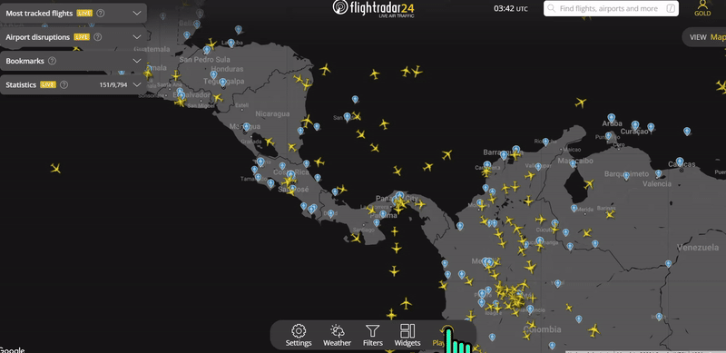

# Flightradar24

## URL

[https://www.flightradar24.com
](https://www.flightradar24.com)

## Description

Flightradar24 is a real-time global flight tracking service. It provides detailed information about aircraft position, flight number, and sometimes flight origin and destination. It also includes details on the type of aircraft. It provides both real-time flight tracking and historical flight information.

Flightradar24 data can be used for open-source investigations, including but not limited to:

* support real-time news analysis, such as in the case of [Yevgeny Prigozhin’s plane crash](https://www.flightradar24.com/blog/russian-legacy-600-crashes-near-tver/);
* monitor the movement of [private jets ](https://www.occrp.org/en/project/russian-asset-tracker/faq-what-is-plane-tracking)as potential illicit assets;
* probe/scrutinize transit/travel patterns of [high-profile individuals](https://www.theguardian.com/world/2022/aug/03/flight-trackers-flightradar24-ads-b-exchange) (see examples [here](https://www.occrp.org/en/investigation/the-chefs-global-footprints), and [here](https://www.nytimes.com/interactive/2022/06/17/world/europe/russia-private-jets.html?auth=login-google1tap\&login=google1tap));
* Flightradar24 can also be used for geolocation and verification (an example will be provided below).


TIP: Finding plane information requires a multi-source approach. Check more than one flight-tracking website when doing research “since one might have more information than the others,” according to[ this Bellingcat guide](https://www.bellingcat.com/resources/how-tos/2019/10/15/a-beginners-guide-to-flight-tracking/) to flight tracking. [OCCRP](https://www.occrp.org/en/project/russian-asset-tracker/faq-what-is-plane-tracking) recommends starting your investigation with an initial data gathering or a Google search to see everything you can find about a plane of interest (see paragraph 6 under “[How do I find out who owns a plane and where it’s going?](https://www.occrp.org/en/project/russian-asset-tracker/faq-what-is-plane-tracking#how-do-i-find-out-who-owns-a-plane-or-where-its-going)").


Flightradar24‘s flight information comes from several data sources. One category of data called “positional data” triangulates the aircraft's position in the sky. This includes sources[ such as ADS-B, MLAT, satellite, and radar data.](https://www.flightradar24.com/how-it-works) In addition to positional data, Flightradar24 also uses flight status and flight schedule data from [airports and airlines](https://www.flightradar24.com/how-it-works). The platform uses data through the[ Open Glider Network (OGN)](https://www.flightradar24.com/how-it-works#flarm) and many more for drones, gliders, and small aircraft.&#x20;

According to the tool’s filter website, it tracks about 12 aircraft categories. They are: Passenger, Cargo, Military and government, Business jets, General aviation, Helicopter, lighter-than-air, Gliders, Drones, Ground vehicles, "Other", and Non-categorized. &#x20;

<figure><figcaption>
IMAGE 1: This clip shows how users can filter for aircraft on the tool. Access the filter at the bottom of the live map. If unsure, each category has helpful descriptions when hovering over the question mark icon to the right. Users can combine different filters by enabling some categories and disabling others — allowing for more granularity in search results. 
</figcaption></figure>

## But First, Identifiers and Where to Find Them


TIP: Note that not all identifiers may be immediately available on one flight tracking website. Cross-check with other platforms.


### CALL SIGNS

**Where can I find the call sign on Flightradar24?**

_**For live flights:**_&#x20;

Depending on your settings, call signs can be seen when you hover your cursor over a plane of interest in the live map. The combination of numbers and letters that appear is usually the call sign. Users can find additional details when clicking on the aircraft.

<figure><figcaption>
IMAGE 2: This box on the left shows all the identifiers on an aircraft of interest flying in real-time on Flightradar's live map, if available. The call sign is visible in yellow font on the top of the image. The other identifiers that are labeled are aircraft type, serial number, flight route, ICAO code, and more.
</figcaption></figure>

_**For completed/historical flights:**_

1. Determine the aircraft by either flight number, flight route, or other identifiers, if known.&#x20;
2. Go to the search bar and enter the search term. This will lead users to a list of past and future-scheduled flights.
3. Select the date and time of interest, and click on the icon “PLAY” on the far right. This will take you to the details and stats associated with that particular flight.
4. Scroll down until you see the following image below.

<figure><figcaption>
IMAGE 3: This image guides users on where to find identifiers for flights already completed. Follow the four steps shown above to see the call sign.
</figcaption></figure>

### REGISTRATION NUMBER / TAIL NUMBER

**Where can I find the registration number on Flightradar24?**

_**For live flights**_

Just like call signs, registration information is available by clicking on an aircraft of interest on the live map. This will provide a detailed window to the left, showing additional information. The registration number can be found just below the aircraft type.

_**For historical flights**_

Follow the same steps shown above for searching call signs for historical flights. Begin with entering the flight in question on the search bar. The registration is located on the far right, just below the aircraft type and the aircraft photo. \

### HEX CODE/ ICAO CODE

**Where can I find the hex code on Flightradar24?**

On Flightradar24, the hex code is referred to as either “ICAO 24-Bit Address” or “”Mode-S”.  And you can find it in several places depending on where you are accessing the aircraft information on the website.&#x20;

_**For live flights**_&#x20;

Users can search the live map for the aircraft of interest. Hover and click over that aircraft, and an information box will appear on the left. Scroll further down to and find “ICAO 24-Bit  Address”.&#x20;

<figure><figcaption>
Searching for a hex code on a live flight can be done by clicking on an aircraft on the Live Map. Navigate on the information box to the left and scroll down to the ICAO 24-BIT Address. This is the hex code for a Southwest flight with call sign SWA509.
</figcaption></figure>

_**For historical flights**_

1. If available, use the registration number to search for the flight of interest in the search bar. This will lead users to a list of past and future-scheduled flights.
2. Click the choice under “aircraft”. This will take you to a separate page containing the flight history of the aircraft of interest.&#x20;
3. Look for the word “Mode-S” to get the hex code (Refer to the image below)

<figure><figcaption>
This is a sample passenger aircraft. For demonstration purposes, we look at the 2 step process of finding the hex code. In the left image, users can search for the aircraft using the registration number (if known). Click on the search result under "Aircraft". This will take users to an information page containing additional details. The hex code is labeled as "Mode-S" on the upper right as highlighted in green.  
</figcaption></figure>

### SERIAL NUMBER/ MSN

SERIAL NUMBER/ MANUFACTURER SERIAL NUMBER (MSN): What is it? Why is it important?  [CLICK TO EXPAND]

**Definition:** A serial number is a unique code given to an aircraft by the manufacturer to identify it from other planes. It's like a fingerprint for that specific aircraft designated at the time of manufacture or[ similar to a car’s VIN (vehicle Identification Number).](https://www.bellingcat.com/resources/how-tos/2019/10/15/a-beginners-guide-to-flight-tracking/) Serial numbers never change, unlike call signs and registration numbers. It is mandated by law (see[ here](https://www.ecfr.gov/current/title-14/chapter-I/subchapter-C/part-45), section 14.13) to collectively ensure that aircraft can be monitored, maintained, and operated safely throughout their service life.

**When to use serial numbers for open source investigations:**[ OCCRP](https://www.occrp.org/en/project/russian-asset-tracker/faq-what-is-plane-tracking) states that “If you’re trying to track a plane over multiple years and ownership changes, you’ll need to know the manufacturer’s serial number.” Because an aircraft’s serial numbers don’t change, you can follow its journey. This makes it helpful in tracking a plane over time between[ owners, registrations, and nations](https://elearning.aljazeera.net/en/journalism-magazine/osint-tracking-ships-planes-and-weapons).

**Where can I find the MSN/Serial Number on Flightradar24?**

_**For live flights**_

Just like call signs, registration information is available by clicking on an aircraft of interest on the live map. This will provide a detailed window to the left, showing additional information. Scroll further; the serial number is below the registration information (see IMAGE 2 above).

_**For historical flights**_

Follow the same steps as shown above for searching for call signs for historical flights. Begin with entering the flight in question in the search bar. The serial number is located on the gray box, far right, just below the registration information (see IMAGE 3 above).

### Key Features

#### Live Map and Immediately Accessible Flight Filters

Flightradar24’s landing page prominently features its Live Map, providing users with immediate access to the real-time aircraft status in the air. The flight filter settings are accessible from the main page, allowing users to customize their view and quickly find relevant information.&#x20;

The Live Map on Flightradar24 is also customizable, allowing users to add widgets for quick access to important information. These widgets can display data such as weather conditions, statistics (e.g., the number of data sources feeding flight information), and the most tracked live flights. Additionally, users can create personalized widgets to bookmark and monitor specific aircraft, flights, airports, or locations of interest. Open source investigators can use those features to track relevant flight data, monitor specific patterns, and quickly access real-time information critical for their analysis.

Map Layers and Aeronautical Charts

Users can customize the map layers on Flightradar24's Live Map, allowing for the overlay of various data sets.&#x20;

#### Advanced Search&#x20;

The search bar is immediately accessible on the tool's landing page. Flightradar24’s search function has features designed to help users quickly find information on a platform that contains a lot of information. Note that search results usually show both live flights and flights that are completed or recently scheduled. Here is an overview of the search feature, which includes input and output (this list is not exhaustive).


NOTE: Based on our own tests, the search bar takes most of the input explained below, except for Serial Number.&#x20;




**INPUT:** &#x20;

The search is designed to run several keyword variations. Users can enter the ICAO Airport Code and the IATA Airport Code. Users can enter two airport codes separated by a dash.&#x20;

**Example:** “AMS - LHR” to refer to the flight route from Amsterdam Schipol to Heathrow Airport

**OUTPUT:**&#x20;

This search will show all the live flights as well as recent and scheduled flights&#x20;

**INPUT:**  &#x20;

If the airport code is unknown, simply type the location or the airport name.&#x20;

**Example:** “London”&#x20;

**OUTPUT:**&#x20;

Putting a location or airport name will provide a list of possible airport locations.&#x20;

\




This is a straightforward search in which the users can type the airplane.&#x20;

**INPUT:** Type the name of the airline.&#x20;

**Example:** Iberia&#x20;

**OUTPUT:** This will provide a list of airlines that match your query. However, users need to click the arrow down to expand the search. This will provide several options including all the live flights by the airline of interest.&#x20;



Click on this option to search for airports by country&#x20;

**INPUT:** Choose the country of interest from the list automatically provided by the search feature.

**Example:** Afghanistan

**OUTPUT:** This will show a list of 11 airports in Afghanistan.&#x20;

**Example:** Kabul International Airport, Kandahar Airport, Herat International Airport etc.

TIP: Click on the “down” arrow on each search result to expand more menu options. The expanded search has the option to show users the airport on the live map and a list of flights arriving, departing and on the ground, and many more.&#x20;



This feature is for showing flights near the user’s location. The user must enable it’s location and give the tool permission to access its location.&#x20;




For a more detailed guide to its search features, refer to: [https://www.flightradar24.com/blog/new-flightradar24-search/](https://www.flightradar24.com/blog/new-flightradar24-search/)

#### Custom Filters

In addition to filtering by aircraft category, users can create their own custom filters tailored to their research purpose. Flightradar24 improved its filtering system by enabling five additional parameters.&#x20;

OPEN each tab to get more detailed information on how to create custom filters.&#x20;



Flightradar24 has enhanced its aircraft filtering capabilities. You can now precisely filter flights by their exact ICAO code.&#x20;

**For example:** Searching for "A320" will only display Airbus A320 models.&#x20;

To view a family of aircraft, use a wildcard symbol.&#x20;

**For example:**  "B737\*" will show all Boeing 737 variants. Additionally, you can filter for multiple aircraft types by separating them with commas.&#x20;

This refined filtering system allows for more accurate and tailored flight tracking.



Users can input the airport code or airport name.&#x20;

In addition, users can now search for flights to or from entire countries on Flightradar24. Just type in the country name, like "Venezuela" or "Colombia," to see all flights to or from that country. Users can further filter by inbound, outbound flights, or both.



This powerful feature can isolate flights between two airports or between two countries. Or between three countries and four airports. Users can see the flow of traffic in one direction and can easily flip the direction if needed.&#x20;

**Examples:**

1. From: United Kingdom To: United States
2. From: United Kingdom To: JFK, EWR&#x20;

<figure><figcaption>
Clicking the arrows will reverse the direction of the air traffic of your search results
</figcaption></figure>

**Examples:**&#x20;

1. From: United States To: United Kingdom
2. From: JFK, EWR To: United Kingdom



#### Jetphotos Database&#x20;

Another helpful feature in this tool is its photo database through Jetphotos. Users can view flight information. Our own tests showed that Jetphotos feeds the platform with a photo of the exact aircraft that users are tracking on Flightradar24.&#x20;

Flightradar24 incorporates Jetphotos images into its platform. When viewing an aircraft's details on Flightradar24, users often see photos sourced from Jetphotos. This integration provides a visual representation of the tracked aircraft, enhancing the user experience. Jetphotos links back to Flightradar24 for detailed tracking data about photographed aircraft.

More importantly, the photos shown are those of the actual plane being tracked live in the sky and not a similar aircraft type. This is especially helpful if researchers are interested in making a visual match to the information they have.&#x20;

**Example:** If a user is tracking an aircraft with registration/tail number OO-TMS, users can find that exact photo on Jetphoto’s database by using the registration number/tail number as the search term.&#x20;

Jetphotos and Flightradar24 are distinct platforms with complementary purposes, but they share a close relationship due to their focus on aviation and[ mutual ownership](https://www.jetphotos.com/about.php).&#x20;

#### Playback

Flightradar24's playback feature is like a time machine for aviation. Flightradar24's playback feature allows users to rewind time and analyze historical flight data. This tool can be invaluable for investigative purposes, as it enables researchers to:&#x20;

(a) Investigate Past Events: Examine air traffic patterns during specific incidents or events.\
(b) Verify/Cross-Check Claims: Cross-reference historical flight data with other information to confirm or refute claims.                                                                                                                                                               (c) Seeing Trends: Study trends by analyzing past flight patterns.

The playback feature is available on the live map (landing page) and users can see the replay of many flights simultaneously. It is also available for individual flights.&#x20;

<figure><figcaption>
Users can access the playback on the live map by clicking “playback” on the menu located in the the bottom center of the live map.
</figcaption></figure>


TIP: Add a filter or your own custom filter and use the playback feature for a more granular search. For example: Use the business jet category filter and hit the playback button to see a replay of all business jets travelling in specific area during a specific time frame


&#x20;For individual flights, the playback feature is accessible by first searching the flight of interest. And then scrolling through the past scheduled flights. Select the time and date of interest and click on “Play” (the farthest icon to the right).

#### KML and CSV File of Flight Log&#x20;

For flights that have already landed, Flightradar24 allows users to download a KML file of the flight log. This will contain all the coordinates of its flight path, the altitude, and other information that helps users visualize flight information. This raw data can then be imported on [Google Earth](https://bellingcat.gitbook.io/toolkit/more/all-tools/google-earth-pro) or ArcGIS Earth.&#x20;

In addition, users can also download a .CSV containing raw flight data for analysis.&#x20;

1. To do this, enter the known flight info on the search bar and click on the flight number/call sign/route.&#x20;
2. Scroll down and click on “Flight Info”
3. You will be taken to a different page containing the flight log. Scroll down to the list of recentlly scheduled flights, choose the date and time of interest.&#x20;
4. Navigate to the right where you have the option to download the data inKML or CSV format or do a playback.&#x20;

Using a KML file of a flight log overlaid over Google Earth Pro can sometimes help with geolocation tasks. See this [example](https://nixintel.info/osint/using-flight-tracking-for-geolocation-quiztime-30th-october-2019/) by Nixintel for a demonstration of this use case.&#x20;

<figure><figcaption>
Following the steps outlined above, the users will be taken to the flight log of the aircraft in question. Download the raw data on the area shown in purple.
</figcaption></figure>

## Use cases

Flight tracking websites like Flightradar24 can be valuable resources for investigative journalism and open-source research:

1\. Database Creation:

* This data can be used to create open-source flight databases for countries requiring continuous monitoring.
* Example: Bellingcat's databases for [Kazakhstan](https://www.bellingcat.com/resources/2022/01/08/launching-an-open-source-flight-database-for-kazakhstan-in-wake-of-protests/) and [Venezuela](https://www.bellingcat.com/resources/case-studies/2021/03/11/launching-an-open-source-aircraft-database-for-venezuela/).

2\. Monitoring Authoritarian Regimes:

* Tools like [Dictator Alert](https://dictatoralert.org/) specialize in monitoring the flight paths of authoritarian regimes' aircraft.
* They can alert the public when these planes land in specific locations (e.g., Twitter/X alerts for major European cities).

3\. Investigating Aircraft Ownership and Movement:

* Investigators like those at [OCCRP use flight tracking for two key tasks](https://www.occrp.org/en/project/russian-asset-tracker/faq-what-is-plane-tracking):
  * Identification: Determine which planes are owned or regularly used by individuals of interest.
  * Tracking: Follow flight histories or pinpoint the current whereabouts of these aircraft.

Challenges and Workarounds:

* Ownership Obfuscation: Figuring out real ownership can be [difficult due to shell companies and other secrecy methods](https://www.occrp.org/en/project/russian-asset-tracker/faq-what-is-plane-tracking#what-is-plane-tracking).
* Flight tracking as a tool to generate leads: According to [OOCRP's FAQ](https://www.occrp.org/en/project/russian-asset-tracker/faq-what-is-plane-tracking), while ownership is sometimes hidden, flight tracking data is largely publicly available, and monitoring aircraft movements can sometimes provide valuable clues to fill in the gaps of an investigation.

## Cost

* [ ] Free
* [x] Partially Free
* [ ] Paid

The tiered paid accounts are: Basic Free, Silver, Gold, Business, the price and feature differences are found here: [https://www.flightradar24.com/premium](https://www.flightradar24.com/premium)&#x20;

The version tested for this toolkit description is the Gold Subscription.&#x20;

## Level of difficulty

<table><thead><tr><th data-type="rating" data-max="5"></th></tr></thead><tbody><tr><td>3</td></tr></tbody></table>

While the tool is straightforward to use, the difficulty rating is based on the additional time it may take for beginner users to familiarize themselves with aviation related terms and concepts. The platform also contains a plethora of data, and finding which information is important may require additional time. &#x20;

## Requirements

1. Modern web browser
2. Registered account (e-mail address)

## Limitations

1. **Coverage: Not Everywhere, Every Time**

Flightradar24 is a great tool for tracking flights, but it's important to know it doesn't see everything, everywhere. Here's what can affect coverage:

* Aircraft Equipment: Not all planes have compatible transponders, the devices that talk to Flightradar24. So, [some planes simply won't show up](https://www.flightradar24.com/how-it-works#coverage).
* Altitude and Terrain: Planes flying high or in areas with lots of mountains [might be harder to pick up](https://www.flightradar24.com/how-it-works#coverage).
* Location: Flightradar24 [is working to improve coverage in some areas](https://support.fr24.com/support/solutions/articles/3000119387-planes-are-only-visible-after-departing-or-suddenly-disappear-when-landing), especially around major airports in Africa (Chad, Congo, Egypt, etc) or countries like China, Iran, Iraq, and Libya.

2. **Map Gaps**

Flightradar24's coverage is[ limited by several factors](https://www.flightradar24.com/blog/gaps-in-the-map-where-aircraft-arent-found-on-flightradar24/). Geopolitical tensions, like the Ukraine conflict, can lead to airspace closures, affecting flight routes. Geographical factors, such as high altitudes in Tibet, also restrict flight paths. Not all aircraft have the necessary equipment for tracking, and some regions have limited coverage. Additionally, airlines prioritize safety and efficiency, sometimes opting for longer routes to avoid risky areas.&#x20;

3. **Blocking / “take down requests”**

Flightradar24 [honors take-down requests](https://www.flightradar24.com/how-it-works#blocking) from operators or owners. According to [their website](https://support.fr24.com/support/solutions/articles/3000117426-why-is-some-aircraft-information-limited-or-not-visible-): “Information about a small number of flights may be limited or blocked based on requests from owners or operators via third-party services…”.  This also means that high-profile aircraft in the military and government categories will not be visible.&#x20;

Based on our own tests, some of the instances where blocking might potentially happen are as follows. There are instances where:

1. Aircraft Identity is hidden: The specific aircraft model and registration number might be obscured, showing only the general aircraft type (e.g., Boeing 737).
2. Flight Path is partially hidden: The origin and registration number might be visible, but the destination or specific route may be blocked.
3. Sometimes, the platform puts N/A instead of providing information.

4\. **Some Limitations on  Filter Combinations:**

While combining filters may sometimes be helpful, there are some combinations that provide results that are confusing. It is important to note that combining these two filters has some limitations. Based on our tests, combining the filter “military and governments” plus a custom airport filter for “Venezuela” and “Colombia” gave mixed results. Instead of filtering for only military/government aircraft in those countries, the results included passenger flights, private/small aircraft, and possibly others.&#x20;

To isolate a specific category of aircraft within a location of interest, it is recommended to zoom in instead on the area of interest, then apply a specific aircraft filter. We were able to tailor the search results by zooming in on Venezuela and Colombia and applying the “military and government” filter subsequently. The results seem to show only one category of aircraft within a specific geographic region.  &#x20;

5\. **Accuracy of estimates**&#x20;

Flightradar24 can estimate the position of aircraft that are out of coverage for a limited time. This is done by using various parameters, but the accuracy can decrease for flights that fly over longer distances (the position can be shown [up to 200 km or 110 miles off](https://www.flightradar24.com/how-it-works#estimations)). The estimated positions are visually represented by a black trail on the map.

5\. **Incorrect flight route**

Flightradar24 uses flight schedules to determine the route an aircraft is taking. However, this can sometimes lead to inaccuracies. For example, if a[ flight is delayed or changes its route](https://support.fr24.com/support/solutions/articles/3000115504-why-is-the-route-information-incorrect-), the displayed path might not match the actual flight path. Additionally, errors in flight schedules or incorrect or old call signs can also cause route information to be incorrect. Other causes are: [Database errors](https://support.fr24.com/support/solutions/articles/3000115504-why-is-the-route-information-incorrect-) - which is when there is an error in one of the scheduling databases Flightradar24 depends on. In addition, significant flight delays can cause it to be matched with the wrong schedule.

## Ethical Considerations

**Privacy vs. Transparency:**

The ethical dilemma here revolves around the conflict between public transparency and individual privacy. Make careful determinations about how to publish research that involves tracking patterns of individuals. This[ case](https://amp.cnn.com/cnn/2024/02/06/tech/taylor-swift-private-jet-tracker/index.html), for example, highlights the tension between the right to information and the potential consequences of exposing individuals to danger.

**Context matters:**

Consider the purpose behind using flight tracking data when publishing.

**Respect Copyright:**

Flight tracking websites often have terms of service regarding data usage. Ensure you're using the information ethically and within the website's guidelines

## Guide

Bellingcat Guide:

Fiorella, Giancarlo, (2019, October 15). [A beginner's guide to flight tracking](https://www.bellingcat.com/resources/how-tos/2019/10/15/a-beginners-guide-to-flight-tracking/), Bellingcat.&#x20;

RC and Fiorella, Giancarlo (2021, March 11). [Flying High: The US Connection to Venezuela’s ‘Narco-Planes’](https://www.bellingcat.com/news/2021/03/11/flying-high-the-us-connection-to-venezuelas-narco-planes/), Bellingcat.

GIJN Guide:

Global Investigative Journalism Network. (n.d.). [Planespotting: An updated guide to tracking aircraft around the world](https://gijn.org/resource/planespotting-an-updated-guide-to-tracking-aircraft-around-the-world/).

Global Investigative Journalism Conference 2023, (2023, October 7). Video on [Plane and Ship Tracking](https://www.youtube.com/watch?v=zPU_FLVBi6E\&feature=youtu.be).

OCCRP Guide:

Organized Crime and Corruption Reporting Project (2022, May 21). ["FAQ: What Is Plane Tracking?"](https://www.occrp.org/en/project/russian-asset-tracker/faq-what-is-plane-tracking) Russian Asset Tracker.&#x20;

IATA (International Air Transport Association) [website](https://www.iata.org/en/publications/directories/code-search/) which can help researchers decipher airline codes on particular call signs.

Nixintel (2019, October 30). [Using Flight Tracking for Geolocation](https://nixintel.info/osint/using-flight-tracking-for-geolocation-quiztime-30th-october-2019/). [https://nixintel.info/osint/using-flight-tracking-for-geolocation-quiztime-30th-october-2019/](https://nixintel.info/osint/using-flight-tracking-for-geolocation-quiztime-30th-october-2019/)

Benjamin Strick. [OSINT at Home #18](https://www.youtube.com/watch?v=8eJk0zij1iM) (Youtube video).

Benjamin Strick. Who Made The Man in The Desert? [https://x.com/BenDoBrown/status/1836392661365785018](https://x.com/BenDoBrown/status/1836392661365785018) or [https://t.co/UHPVTFQJsa](https://t.co/UHPVTFQJsa)&#x20;

Al Jazeera Guide:[ OSINT: Tracking Ships, Planes and Weapons](https://elearning.aljazeera.net/en/journalism-magazine/osint-tracking-ships-planes-and-weapons).&#x20;

Full list of country identifiers:[ https://en.wikipedia.org/wiki/List\_of\_aircraft\_registration\_prefixes](https://en.wikipedia.org/wiki/List_of_aircraft_registration_prefixes)

Some lists of public registries:[ AeroTransport,](https://aerotransport.org/)[ CH Aviation](https://www.ch-aviation.com/),[ Airframes](http://www.airframes.org/),[ RZJets](https://rzjets.net/aircraft/) and[ spotters](http://spotters.net.ua/),[ PlaneLogger](https://www.planelogger.com/), [LAAS Corporate Aircraft Register](https://www.laasdata.com/corpjet/corpjets-cayman-islands-icao-vp-c.php)

Photos:[ Planespotters.net](https://www.planespotters.net/),[ Jetphotos.com](https://www.jetphotos.com/)

Twitter hashtags:[ #aviation](https://twitter.com/hashtag/aviation?src=hashtag_click),[ #avgeek](https://twitter.com/hashtag/avgeek?src=hashtag_click),[ #planespotting](https://twitter.com/hashtag/planespotting?src=hashtag_click),[ #flight](https://twitter.com/hashtag/flight?src=hashtag_click), and[ #MilAvGeek](https://twitter.com/hashtag/MilAvGeek?src=hashtag_click).

This tool is often used with: [Google Earth Pro](https://bellingcat.gitbook.io/toolkit/more/all-tools/google-earth-pro), [Suncalc](https://bellingcat.gitbook.io/toolkit/more/all-tools/suncalc), social media accounts of known flight enthusiasts and professionals. This tool is also used in conjunction with ADS-B Exchange, [FlightAware](https://bellingcat.gitbook.io/toolkit/more/all-tools/flightaware), Planes.live, JetPhotos, Airframes. &#x20;

## Tool provider

Flightradar24 AB, Sweden&#x20;

## Advertising Trackers

* [ ] This tool has not been checked for advertising trackers yet.
* [x] This tool uses tracking cookies. Use with caution.
* [ ] This tool does not appear to use tracking cookies.

| Page maintainer |
| --------------- |
| Afton           |
|                 |

