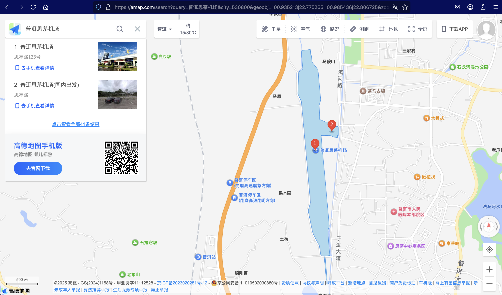
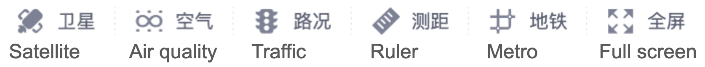
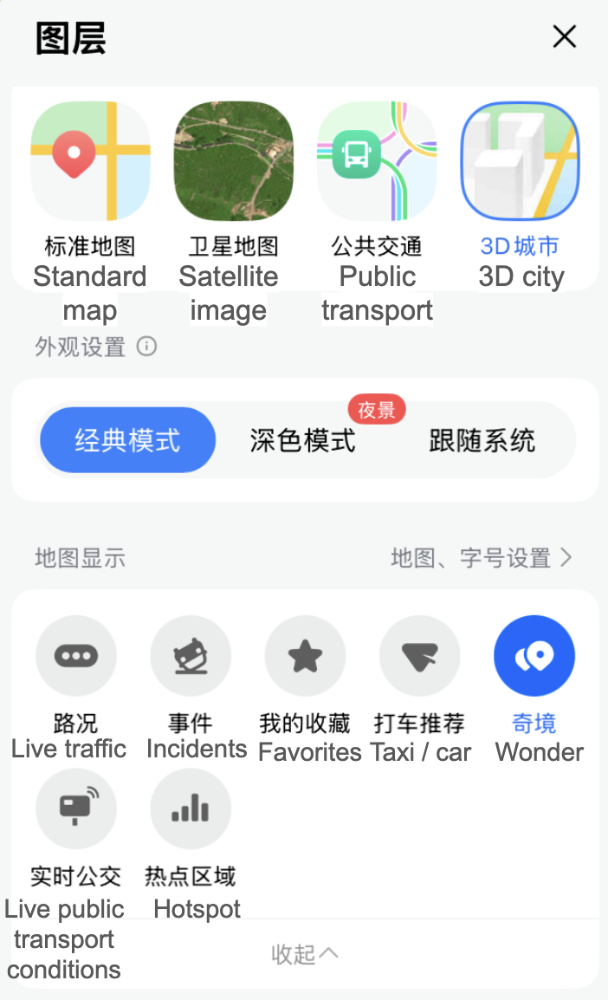
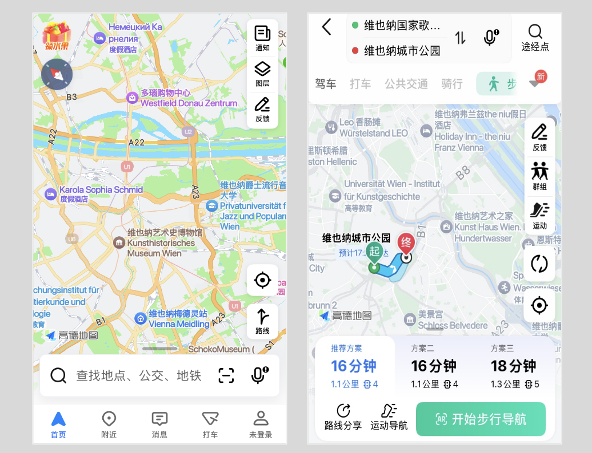
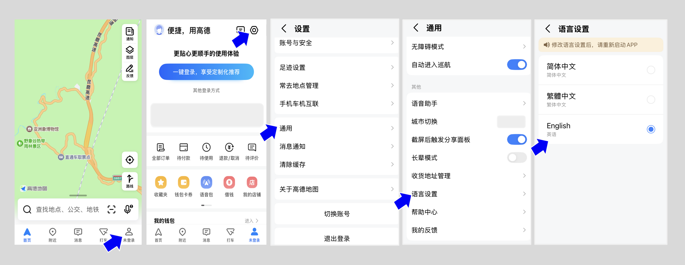

# Gaode Maps

## URL

Main site: [www.amap.com](./#url), or [www.gaode.com](./#url)

API docs: [lbs.amap.com/api](https://lbs.amap.com/api)

## Description

Gaode Maps offers maps, satellite imagery, directions (for driving, public transport, and walking), and real-time augmented reality navigation for driving. It is available via the web browser or as a mobile application. (The app was previously known as AutoNavi, and is currently named AMap outside China.) A few highlights:&#x20;

* **Global data**: Maps, directions and recommended transport data are available globally, though the data are most detailed for China. &#x20;
* **Mobile app "AMap Global" available in English**: The English mobile app offers basic functions including map search, satellite imagery and directions in China. (Other functionalities may be limited.)
* Notably, **Gaode Maps** **does not offer street view**.&#x20;

AMap is a data provider to Apple Maps. The Apple Maps app automatically switches to using AMap data when the device is in China (e.g., when global iPhone users travel from overseas to mainland China).&#x20;

In many Android phone models sold in China, Gaode Maps is pre-installed instead of Google Maps.&#x20;

Unless specified, all functions described on this page can be accessed without registering for an account.&#x20;

#### Basic search

After searching in [Pinyin ](https://en.wikipedia.org/wiki/Pinyin)or Chinese characters, select the layer or function.

<figure><figcaption>
Web browser view > after searching for a specific location (example: Pu'er Simao Airport, Yunnan)
</figcaption></figure>

Select layers - English annotations

Here are the layers and functions, annotated in English. Your view may be different depending on your country.&#x20;

<figure><figcaption>
Web browser view - select layer or function
</figcaption></figure>

<figure><figcaption>
Mobile view > select layer or function
</figcaption></figure>

On the web browser view, a reference number is shown at the bottom left, e.g., GS(2025)1234. The year refers to the year when the map was approved for publication by China's State Bureau of Surveying and Mapping.&#x20;

### No street view available

Gaode Maps does not offer street view (the function was removed several years ago), making the tool less directly useful for geolocation.&#x20;

The "wonder" 奇境 function (aerial photos in select locations)

In the mobile app, a function called 奇境 (translates as "wonder", pinyin: _qijing_) is available for select locations, usually scenic places such as parks and tourist sites. The function allows users to view the location during different times of day, weather conditions, or seasons.

<figure><figcaption>
Example: When the user moves the slider at the bottom, they can view the location during different times of the day.
</figcaption></figure>

### Worldwide coverage

The app provides global data for over 200 countries, including street maps, route navigation (driving, public transportation, or walking) and business locations. Here's an example:

<figure><figcaption>
Using AMap to explore locations outside of China. Left: Map in Vienna, Austria. Right: Walking route planning.
</figcaption></figure>

Business owners from any country could add their locations and information onto AMap (for instance, to attract Chinese travellers who may visit their countries).&#x20;

### Getting coordinates

Within AMap, if you search for a specific location, the coordinates are shown in the URL, in longitude-latitude format.&#x20;

For background: China uses a coordinate system called [GCJ-02](https://en.wikipedia.org/wiki/Restrictions_on_geographic_data_in_China#GCJ-02) (colloquially known as Mars coordinates), whereas the rest of the world uses [WGS-84](https://en.wikipedia.org/wiki/World_Geodetic_System) (Earth coordinates). Using an encryption algorithm, GCJ-02 applies random offsets to the latitude and longitude of locations. Obfuscating the geographic data is for [national security purposes](https://en.wikipedia.org/wiki/Restrictions_on_geographic_data_in_China).&#x20;

If you use Google Maps, the coordinates you obtain for China are in the GCJ-02 system. You could copy the coordinates from Google Maps (in latitude-longitude format) and use them as a search term in AMap.

### 3D maps

API documentation for [3D map](https://lbs.amap.com/demo/javascript-api/example/3d/map3d) and [3D model](https://lbs.amap.com/demo/javascript-api/example/3d/3d-model) are available. (Enter coordinates in the code template to see the 3D map of the location you're searching for.)&#x20;

### User generated reviews

User-generated reviews are available in the mobile app only (without account login).&#x20;

### Using AMap in English (mobile app only)

The English version is only available in the mobile app. In your app store, search "AMap Global", download and install.&#x20;

Functions not available in the English mobile app:&#x20;

* Map data from outside of China
* User-generated reviews and photos originally posted in Chinese

If you downloaded the app (Gaode Maps) in Chinese, and need to change the language to English

<figure><figcaption></figcaption></figure>

1. Select the user icon (indicated by the blue arrow).&#x20;
2. Select the settings icon.&#x20;
3. Scroll to the bottom, select General 通用.
4. Select Language Settings 语言设置.&#x20;
5. Select English. A pop-up message will ask you to re-start the app for the language to be updated.&#x20;

## Similar tools

Although Gaode Maps (AMap) does not provide street view, its satellite imagery, user-generated reviews and photos, and global data may be useful to open-source research. Researchers can cross-reference the location in the 3 apps to get different information or images.&#x20;

## Cost

* [x] Free
* [ ] Partially Free
* [ ] Paid

## Level of difficulty

<table><thead><tr><th data-type="rating" data-max="5"></th></tr></thead><tbody><tr><td>1</td></tr></tbody></table>

## Requirements

* **Web:** any modern web browser
* **Mobile:** iOS or Android (or HarmonyOS). Globally available. User accounts can be set up with international phone numbers.&#x20;
* **API:** Email address, phone number, and a payment method

## Limitations

* **No street view**
* **Geographical Restrictions**: The most detailed map coverage and most extensive functions (e.g., searching for nearby services and facilities) are only available in China.&#x20;
* **Access Speed**: International users will experience slower access speeds or need a Chinese IP address to access certain APIs.
* **Language Barrier**: The user interface of the web version is only available in Chinese.

## Ethical Considerations

* See the Bellingcat toolkit's [About Maps and Satellites](https://bellingcat.gitbook.io/toolkit/more/all-tools/about-maps-and-satellites) page for some general caveats when working with maps and satellite imagery including a general discussion on censorship and content control.
* **Privacy Concerns**: Like many mapping services, Gaode Maps gathers user data, raising concerns about user privacy. (An [April 2021 notice from the Cyberspace Administration of China](./#url) named all leading Chinese mapping tools among 33 apps for extensively collecting user data, beyond what is relevant to their service provision.)

## Tool provider

Alibaba Group [https://www.alibabagroup.com](https://www.alibabagroup.com/en-US/) - China

## Advertising Trackers

* [x] This tool has not been checked for advertising trackers yet.
* [ ] This tool uses tracking cookies. Use with caution.
* [ ] This tool does not appear to use tracking cookies.

| Page maintainer           |
| ------------------------- |
| Bellingcat Volunteer Team |
|                           |
