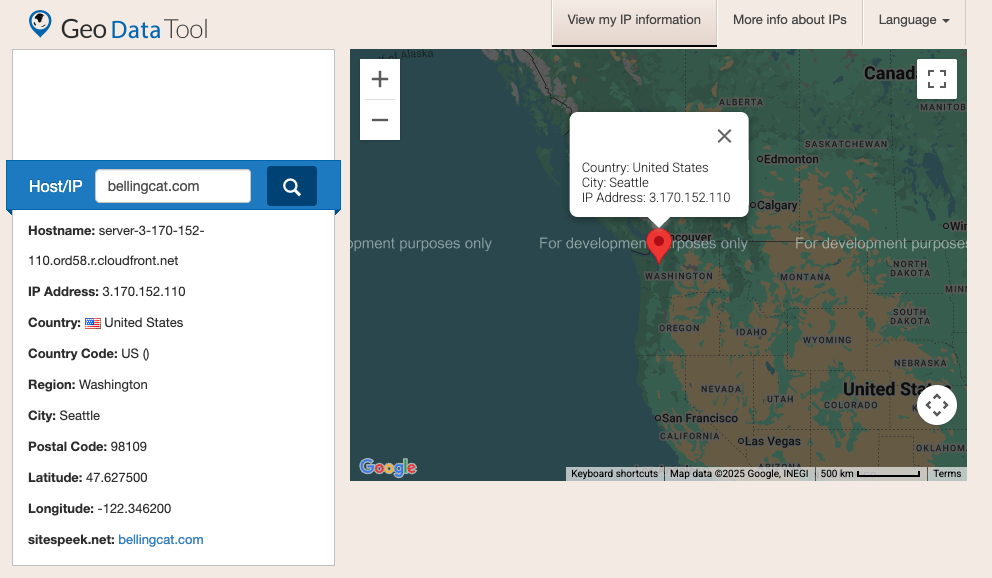

# Geo Data Tool

## URL

[https://www.geodatatool.com/](https://www.geodatatool.com/)

## Description

GeoDataTool is an IP geolocation service that allows users to identify the geographical location and other technical information associated with IP addresses. The tool provides details such as country, region, city, organization, and server location.

For investigations, this tool serves several purposes:

* **Tracking digital footprints**: Verify the claimed locations of sources, subjects, or online entities
* **Cybersecurity investigations**: Analyze the origins of cyberattacks, spam, or malicious activities
* **Fact-checking**: Verify location claims in digital communications or social media posts

To use GeoDataTool, you will simply need to input the IP address, or domain name, you wish to geo locate. Note that if you input the domain name, the tool will automatically resolve its IP address, which can be useful, as you may not necessarily know the IP address of a domain.

Let's take the domain bellingcat.com as an example and see what we can find:

_(GeoDataTool querry result for bellingcat.com)_

* **Hostname**: _server-3-174-207-31.qro51.r.cloudfront.net_ appears to be a CloudFront hostname. A few quick searches will identify that Cloudfront is Amazon's [Content Delivery Network](http://en.wikipedia.org/wiki/Content_delivery_network) (CDN) service. In addition, the 'ord58' refers to CloudFront's [CDN Edge server](https://en.wikipedia.org/wiki/Content_delivery_network) location code. "ORD" typically refers to Chicago, Illinois, and "58" would be a specific edge server identifier. Depending on the type of IP address and the hostname that is associated to it, you may find such geographical codes associated to it, which can help further pinpoint the location associated to an IP address. More information on this in the next section.
* **IP Address:** if you are searching from a domain, this is the IP address of the server hosting the domain you look up.
* **Country/County code:** this shows which country the server is physically located in. The server hosting bellingcat.com is in the United States.
* **Region/City/Postal code:** similar information on the server hosting bellingcat.com.
* **Latitude/Longitude:** these are GPS coordinates that pinpoint the exact location on the map.

**Why the hostname location and IP address location may be different?**

If you have read through the information presented above, there is a notable discrepancy in the information that GeoDataTool.com returns: the hostname points to a location in Chicago, Illinois, whereas all other IP location information are returning Seattle, Washington. How is this possible? This discrepancy highlights an important distinction between network infrastructure and IP geolocation databases.

The hostname is obtained through a process called [reverse DNS lookup](https://en.wikipedia.org/wiki/Reverse_DNS_lookup), where the tool queries the IP address to find its associated hostname. When you enter 'bellingcat.com' into GeoDataTool, it first finds the IP address assigned to the domain bellingcat.com (3.170.152.110), then performs a reverse lookup on that IP. This reverse lookup uses a [PTR (pointer) record](https://www.cloudflare.com/learning/dns/dns-records/dns-ptr-record/) that maps the IP back to a hostname.

In this case, Amazon CloudFront has configured their PTR record for this IP to point to server-3-170-152-110.**ord58**.r.cloudfront.net, which based on the 'ord58' code is located in Chicago. This hostname comes directly from Cloudfront's DNS configuration, making it an authoritative information from the IP address owner itself, and therefore can be considered a reliable location information.

On the other hand, the geolocation data showing Seattle likely comes from third-party databases that attempt to map IP addresses to physical locations based on registration records and historical data. These databases often show where an IP was originally administratively registered rather than where it's actually being used.

This explains why the hostname's location code ('ord58' for Chicago) is likely more accurate for indicating where the server for that IP address is actually located.\

## Cost

* [x] Free
* [ ] Partially Free
* [ ] Paid

\[\[Pricing or subscription information, if relevant.]]

## Level of difficulty

<table><thead><tr><th data-type="rating" data-max="5"></th></tr></thead><tbody><tr><td>1</td></tr></tbody></table>

The tool typically requires only entering an IP address or domain to get location information, however to fully understand the results provided, it is preferred to have networking knowledge.&#x20;

## Requirements

No specific requirements, except having access to an IP address or domain name.

## Limitations

IP geolocations are often not precise, as was shown with the hostname/IP location mismatch. In addition, many IP addresses are dynamically assigned, making long-term tracking difficult. It is also important to note that an IP address will point to a server location, and not to an actual person or entity.

## Ethical Considerations

There are no specific ethical considerations for this tool.

## Guides and articles

If you are not familiar with basic networking concepts, we advise that you read through Geodatatool's information page on IP addresses: [https://www.geodatatool.com/en/ip\_info](https://www.geodatatool.com/en/ip_info)

## Tool provider

There isn't much public information available about the specific individual or organization providing GeoDataTool. The "wiroos.com" displayed on the tool's user interface suggests it may be part of a larger web services operation.

## Similar tools

There are quite a few similar tools providing the same IP location capabilities:

* [https://ip-geolocation.whoisxmlapi.com/](https://ip-geolocation.whoisxmlapi.com/)
* [https://ipgeolocation.io/](https://ipgeolocation.io/)
* [https://www.geolocation.com/](https://www.geolocation.com/)

If you are looking for a Reverse DNS lookup tool specifically, you may use MXToolbox: [https://mxtoolbox.com/ReverseLookup.aspx](https://mxtoolbox.com/ReverseLookup.aspx)

## Advertising Trackers

* [x] This tool has not been checked for advertising trackers yet.
* [ ] This tool uses tracking cookies. Use with caution.
* [ ] This tool does not appear to use tracking cookies.

| Page maintainer           |
| ------------------------- |
| Bellingcat volunteer team |
|                           |
