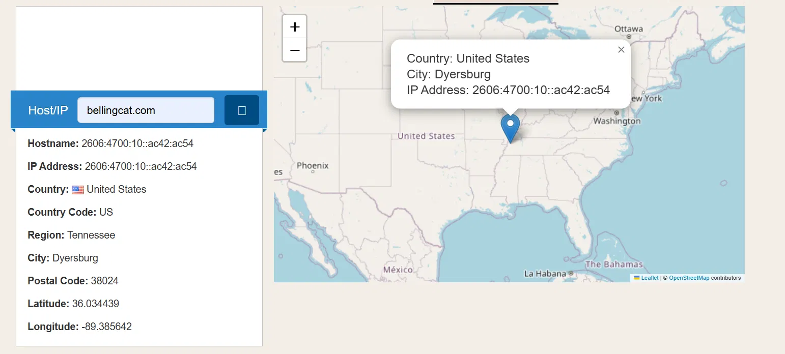

# Geo Data Tool

## URL

[https://www.geodatatool.com/](https://www.geodatatool.com/)

## Description

GeoDataTool is an IP geolocation service that allows users to identify the geographical location and other technical information associated to an IP address. The tool provides details such as country, region, city, organization, and server location.

For researchers, it is important to note that GeoDataTool will not enable you to precisely geolocate a person or an end-user's device such as their smartphone or laptop.

Due to how [IP addresses are assigned](https://en.wikipedia.org/wiki/IP_address#IP_address_assignment), GeoDataTool will only allow you to obtain an approximate location of the network point to which your target IP address is assigned (a home router, a data center server, or any other [network point](https://en.wikipedia.org/wiki/Networking_hardware)).

Whether or not this network point actually corresponds to the location of your target can vary greatly.

Therefore, before using GeoDataTool, it is important for you to understand how the IP address you are investigating relates to your target:

* if you are investigating a website's IP address, chances are the IP address you have corresponds to the location of a server managed by a hosting service (Amazon Web Services, Microsoft Azure, Tencent, etc). It is therefore not an indication of where the company, organization or person operating the website is located.
* if you are investigating an end-user device's IP address, there is a possibility that your target is using a [VPN server or similar proxy](https://en.wikipedia.org/wiki/VPN_service), which will provide the location of the VPN/proxy server, and not the actual device's location. In the case they are not using a VPN/proxy, their device may also be assigned a dynamic IP address, which means the IP address will be assigned to a different network point overtime.

Once you are more familiar with the limitations of using IP addresses for geolocation, GeoDataTool may still be useful to gain some insights:

* Does the IP address I am researching remain at the same location over time? If so, it is likely a static IP address, which might hint to location information about my target.
* Is the hostname the IP address is pointing to under a specific name? If so, it is possible this IP address is associated with a particular hosting provider or company. Is there any notable information about this company I can infer, such as a country/region of operation?
* How do the information found above contrast with the claimed or perceived location of the target of my researches? 

With these limitations in mind, to use GeoDataTool, you will simply need to input the IP address or domain name you wish to locate.&#x20;

GeoDataTool accepts both IPv4 and IPv6 addresses. If you are unfamiliar with IPv6, note that these addresses are much longer and use hexadecimal characters separated by colons. For example, an IPv4 address might look like `203.0.113.42`, while an IPv6 address could look like `2001:db8:85a3::8a2e:370:7334`.

Note that if you input the domain name, the tool will automatically resolve its IP address, which can be useful as you may not necessarily know the IP address of a domain.

Let's take the domain bellingcat.com as an example:

<figure><figcaption></figcaption></figure>

_(GeoDataTool query result for bellingcat.com, on 19/06/2026)_

* **Hostname:** `2606:4700:10::ac42:ac54`
* **IP Address:** `2606:4700:10::ac42:ac54.` The address GeoDataTool resolved for this domain. Note this may be a CDN/proxy IP rather than the domain's origin server (see below).
* **Country/Country code:** this shows which country the server is physically located in. The server hosting bellingcat.com is in the United States.
* **Region/City/Postal code:** similar information on the server hosting bellingcat.com.
* **Latitude/Longitude:** these are GPS coordinates that pinpoint the exact location on the map.

**What does it mean when the hostname is the same as the IP address?**

When you enter a domain into GeoDataTool, the tool first resolves it to an IP address, then performs a **reverse DNS lookup** on that IP address. It queries for a **PTR (pointer) record** that maps the address back to a hostname. In this case, no such record exists (or none was returned), so the tool simply displays the IP address again in the hostname field.

This tells you something useful: the organization operating this IP address hasn't configured a descriptive reverse DNS entry for it. This is common for large, multi-tenant CDN/proxy networks, where a single IP serves traffic for many unrelated customer websites at once, so there's no one specific name to assign it.

Because the hostname gives you no clue here, identifying who actually operates this IP requires an extra step: a **WHOIS/RDAP lookup directly on the IP address** . Doing this for `2606:4700:10::ac42:ac54` shows it belongs to the block `2606:4700::/32`, registered to **Cloudflare, Inc.** (AS13335) as confirmed on [Cloudflare's published IP ranges page](https://www.cloudflare.com/ips/).

**What would it have meant if the hostname were different?**

If the hostname field instead returned something like `server-x-x-x-x.ord58.r.cloudfront.net`, that would tell you two things directly, without needing a separate WHOIS lookup:

1. **The provider** : a hostname pattern like `*.cloudfront.net` immediately identifies Amazon CloudFront as the CDN in use, the same way `*.fastly.net` would point to Fastly or `*.akamaiedge.net` to Akamai.
2. **A possible edge location hint** : some providers encode an internal location code into the hostname itself (CloudFront's `ord58` segment, for example, refers to a Chicago-based edge server, using the same three-letter codes as airport IATA codes). This can sometimes be a more specific clue about where that particular server is physically located than the geolocation database fields above it, since it comes directly from the provider's own infrastructure naming rather than a third-party IP-to-location database.

In short: a populated, provider-specific hostname can hand you the answer for free. A hostname that just mirrors the IP (as in this case) means you have to do that identification work yourself with a separate WHOIS/RDAP lookup.

**A note on re-querying:** if you look up bellingcat.com again later, don't be surprised if you get a _different_ Cloudflare IPv6 address than the one shown here. This is because the same domain can be served from different addresses within its range over time. Interestingly, when this address was queried at a separate point, GeoDataTool returned `2606:4700:10::6814:1ec0` instead :  a different exact address but within the same `2606:4700:10::` block, and resolving to the same city (Dyersburg, TN) and identical coordinates. This suggests the underlying geolocation database assigns location at the level of the IP block rather than the individual address.&#x20;

_The practical takeaway for researchers:_ treat the city/coordinates as describing "where this slice of Cloudflare's network is mapped to," not "where bellingcat.com's true origin server sits". If a high level of precision matters for your research, re-query at different times and note the timestamp and exact address each time.

## Cost

* [x] Free
* [ ] Partially Free
* [ ] Paid

## Level of difficulty

<table><thead><tr><th data-type="rating" data-max="5"></th></tr></thead><tbody><tr><td>1</td></tr></tbody></table>

The tool typically requires only entering an IP address or domain to get location information, however to fully understand the results provided, it is preferred to have networking knowledge.

## Requirements

No specific requirements.

## Limitations

GeoDataTool will provide you with location information on an IP address, however this **location is an estimation**, and rarely corresponds to the actual physical location of the target of your research (a person, an organization, a website).

One of the [IP geolocation industry leader](https://support.maxmind.com/knowledge-base/articles/maxmind-geolocation-accuracy) estimates as of the time of this writing that:

_'\[...] our GeoIP products can identify users at the country level with 99.8% accuracy. For IPs located within the U.S., we estimate around an 80% accuracy at the state/region level, and a 66% accuracy for cities (within a 50km radius of that city).'_

A related limitation applies to the **hostname field:** GeoDataTool obtains this through a reverse DNS lookup (a PTR record), but not every IP address has one configured. When no PTR record exists, the tool will simply display the IP address again in place of a hostname. (See the worked example above for how to identify the provider when this happens).

_Overall, it is important to understand the limitations of IP address geolocation, both due to methodologies used to geolocate them, as well as how IP addresses change assignment and ownership over time._

For more in-depths analysis on IP geolocation methodologies and accuracy, here are a few sources:

* IP Geolocation databases: Unreliable?, by Ingmar Poese, Mohamed Ali Kaafar, Benoit Donnet, Bamba Gueye and Steve Uhlig (2011): [https://www.researchgate.net/publication/220195017\_IP\_Geolocation\_databases\_Unreliable](https://www.researchgate.net/publication/220195017_IP_Geolocation_databases_Unreliable)
* A deep dive into the accuracy of IP Geolocation Databases and its impact on online advertising, by Patricia Callejo, Marco Gramaglia, Ruben Cuevas, and Angel Cuevas (2022): [https://arxiv.org/pdf/2109.13665](https://arxiv.org/pdf/2109.13665)
* IAB Workshop on IP Address Geolocation, workshop material and contributions (2025): [https://datatracker.ietf.org/group/ipgeows/about/](https://datatracker.ietf.org/group/ipgeows/about/)

## Ethical Considerations

**Publishing IP addresses:**

Publishing IP addresses publicly—whether in security reports, blog posts, or forums—carries the risk of false identification. Should an IP address change ownership, because it is a dynamic IP address, or because it is a static IP address now leased to a different entity, records linking that IP to harmful activity can lead to undeserved suspicion, blacklisting, or harassment.

It is important to understand and relay the context associated to the IP address you are publishing: timestamps and clear documentation of when an IP was associated with specific activity will avoid viewers incorrectly assuming current association with past behavior.

**IP addresses as personally identifiable information (PII):**

In case an IP address enables you to identify a person—whether through geolocation or association—it is important to note that it becomes personally identifiable information (PII). Depending on the scope of your research, this may have significant legal and ethical implications. The IP address itself, along with any derived data such as approximate location, ISP information, or connection details, will become subject to [data protection regulations](https://en.wikipedia.org/wiki/Privacy_law).

## Guides and articles

If you are not familiar with basic networking concepts, we advise that you read through Geodatatool's information page on IP addresses: [https://www.geodatatool.com/en/ip\_info](https://www.geodatatool.com/en/ip_info)

## Tool provider

Historical (cached) WHOIS records show a sibling tool in the same family (geoiptool.com, which shares the wiroos.com branding and nameservers `kiu.wiroos.com.ar` / `lanark.wiroos.com`). They list a registrant named Matias Botbol, "WIROOS internet hosting," based in Buenos Aires, Argentina.&#x20;

GeoDataTool might therefore be part of a small Argentine-run network of IP/geolocation utility sites (wiroos.com, geoiptool.com, showmyip.com, spyber.com appear linked).&#x20;

An important caveat : it's drawn from a historical/cached WHOIS record for a related domain, not geodatatool.com's own current WHOIS, since that one is privacy-shielded via Cloudflare.&#x20;

## Similar tools

There are many IP geolocation services, depending on how often and at what scale you need them. Examples:

* Maxmind [https://www.maxmind.com/](https://www.maxmind.com/) - for businesses or organizations, comprehensive suite of IP geolocation services, including purchasing complete GeoIP databases.
* IPgeolocation [https://ipgeolocation.io/pricing.html](https://ipgeolocation.io/pricing.html) - for smaller businesses, provides access to a Free tier API enabling up to 1K requests per day.
* WhoisXMLAPI [https://ip-geolocation.whoisxmlapi.com/](https://ip-geolocation.whoisxmlapi.com/) - hybrid solution, offers free single IP geolocation, or provides access to a paid API.

## Glossary&#x20;

Add Glossary if relevant / needed.&#x20;

## Advertising Trackers

* [x] This tool has not been checked for advertising trackers yet.
* [ ] This tool uses tracking cookies. Use with caution.
* [ ] This tool does not appear to use tracking cookies.

| Page maintainer                                                        |
| ---------------------------------------------------------------------- |
| Bellingcat volunteer team. Updated by Nadia Enesco Mollá in June 2026. |
