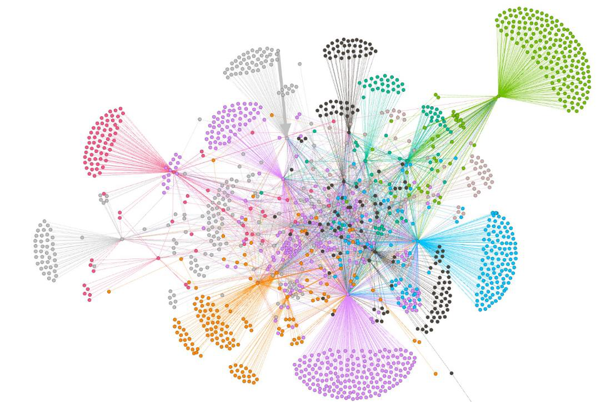

# Gephi

## URL

[https://gephi.org](https://gephi.org)

## Description

Gephi is a free, open-source tool for network visualization and analysis, widely used to explore and represent relationships in large datasets, such as social networks, links between documents, or web structures. Gephi allows users to create customizable network graphs, analyze metrics (like centrality and clustering), and identify patterns within complex datasets. The tool supports importing various data formats (CSV, GEXF) and offers plugins for advanced functionality. It can be used in journalism and open source research to visually analyze and reveal hidden connections in data, such as by examining online misinformation networks.

Gephi has the ability to create [detailed](https://www.youtube.com/watch?v=GXtbL8avpik), interactive, and [visually compelling ](https://gephi.wordpress.com/2018/11/01/is-gephi-obsolete-situation-and-perspectives/)network graphs. This visual appeal helps to highlight complex relationships within data, making it easier for journalists to uncover hidden links between entities like individuals, companies, or groups. This capability can be particularly valuable for investigative stories where clear visual representation of connections can be crucial for audience understanding.

<figure><figcaption>
Visualization of a network of Telegram actors. (by J.Weißer, M.Engel, C.Jelonek, M. Hallbach, 2024, used with permission)
</figcaption></figure>

### Core Social Network Analysis Metrics

Gephi includes built-in support for computing **key metrics** that help identify important nodes in a network. Three core metrics commonly used are **degree centrality**, **betweenness centrality**, and **closeness centrality:**

* [**Degree Centrality**](https://cambridge-intelligence.com/keylines-faqs-social-network-analysis/) measures how many direct connections (edges) a node has. A node with a high degree centrality has **many links to others**, making it well-connected. It’s essentially a count of immediate neighbors.&#x20;
  * _What it indicates:_ Nodes with higher degree centrality can be influencers or hubs that directly reach many others.&#x20;
  * _Example:_ In a Twitter network, a user with connections to many others (through follows or mentions) would have high degree centrality.&#x20;
* [**Betweenness Centrality**](https://cambridge-intelligence.com/keylines-faqs-social-network-analysis/) measures how often a node lies on the **shortest paths between other nodes**​. In other words, a node with high betweenness centrality is a critical **broker or bridge** in the network.&#x20;
  * _What it indicates:_ Such nodes connect different clusters or sections of the graph; they may not have the most connections, but they control information or resource flow by being on the paths that link others. A higher betweenness means a greater brokerage role. They act as gatekeepers or intermediaries.&#x20;
  * _Example:_ In a criminal network, a person who links two otherwise separate groups (even with only a few connections themselves) likely has high betweenness – remove that person and the network might fragment.&#x20;
*   [**Closeness Centrality**](https://cambridge-intelligence.com/keylines-faqs-social-network-analysis/)**:** Measures how “close” a node is to all others in the network, typically defined as the **reciprocal of the total distance** from that node to all other nodes. A node with high closeness centrality can reach all others _quickly_ (in few hops on average).

    * _What it indicates:_ This can identify nodes that are centrally positioned overall (not in a geographical sense, but in network topology). Such nodes could quickly disseminate information to the entire network.&#x20;
    * _Example:_ In a social network, someone at the “center” of the friend-of-friend graph (even if they aren’t connected to everyone directly) will have a high closeness score, meaning they are on average a short distance from anyone in the network.

Further important concepts and metrics available in Gephi

### **Core Concepts**

* **Weighted vs. Unweighted Metrics:** Many of these measures (degree, clustering coefficient, path length, centralities) can be computed in both unweighted (treating all edges equally) and weighted modes (if your edges have an associated weight).
* **Directed vs. Undirected Graphs:** For directed graphs (e.g., Twitter follow networks), some metrics like in-degree/out-degree, PageRank, and HITS become crucial. In undirected graphs (e.g., co-appearance networks), you only have a single “degree” measure.
* **Plugins & Experimental Metrics:** Gephi’s plugin repository may offer additional statistical measures or variants (for example, advanced community detection algorithms, [Hierarchical Edge Bundling](https://gephi.wordpress.com/tag/edge-bundling/), [timeline-based metrics](https://gephi.org/plugins/#/plugin/eventgraphlayout), or [new centrality formulas](https://gephi.org/plugins/#/plugin/bridge-gephi-plugin)). Be sure to check the Gephi Plugin Center if you need specialized metrics.

### Graph-Level Metrics

1. **Average Degree**
   * **What it is:** The mean number of connections (edges) each node has.
   * **Why it matters:** It quickly shows how well-connected the network is on average.
2. **Network Diameter**
   * **What it is:** The longest shortest path in the network (i.e., the greatest distance between any two nodes when traversing via the shortest route).
   * **Why it matters:** The diameter indicates how “spread out” or “deep” the network is; a large diameter suggests that it takes many hops to travel from some nodes to others.
3. **Graph Density**
   * **What it is:** The ratio of actual edges in the graph to the maximum possible edges if every node were connected to every other node.
   * **Why it matters:** Reveals how close the graph is to being fully connected (1.0 = complete graph).
4. **Connected Components**
   * **What it is:** Identifies distinct sub-networks (components) in the graph where each node is reachable from any other node within the same component.
   * **Why it matters:** Shows whether the network is all in one piece or if it breaks into multiple isolated clusters.
5. **Average Path Length**
   * **What it is:** The mean number of steps along the shortest paths between all pairs of nodes.
   * **Why it matters:** It gives a sense of how easily (in how many hops) information or influence can spread across the network.
6. **Average Clustering Coefficient**
   * **What it is:** A measure of how often nodes form tightly knit groups (where neighbors of a node are also neighbors with each other). Gephi can calculate both global (average) and node-level clustering.
   * **Why it matters:** High clustering indicates the presence of local “communities” or “cliques” in the network.
7. **Modularity (Community Detection)**
   * **What it is:** A method that partitions the network into modules (clusters) where nodes within the same cluster have more connections to each other than to other clusters. Gephi computes a modularity score and assigns each node a “community” label.
   * **Why it matters:** It helps reveal sub-communities or tightly connected groups and is useful for identifying fractions, interest groups, or hidden structures.

***

### Node-Level Metrics

8. **Degree** / **Weighted Degree**
   * **What it is:** The count of direct connections each node has. In weighted graphs, edges can have a “weight,” and Weighted Degree sums those edge weights.
   * **Why it matters:** Nodes with higher degree may be more influential or have more direct relationships.
9. **Degree Distribution**
   * **What it is:** Shows how degrees (numbers of connections) are distributed across all nodes. Although not a single numeric metric, Gephi can compute and plot a distribution chart.
   * **Why it matters:** Helps identify whether a few nodes dominate in connectivity (e.g., a power-law distribution) or if most nodes have similar degree.
10. **Betweenness Centrality**
    * **What it is:** Counts how often a node lies on the shortest paths between other nodes.
    * **Why it matters:** Captures “broker” or “bridge” nodes that can control information flow across different parts of the network.
11. **Closeness Centrality** / **Harmonic Closeness**
    * **What it is:** Measures how close a node is to all others (based on the sum of shortest path distances). “Harmonic closeness” is a variant that handles disconnected graphs more gracefully.
    * **Why it matters:** A higher closeness value means the node can reach the rest of the network more quickly (in fewer hops).
12. **Eigenvector Centrality**
    * **What it is:** Measures a node’s influence based not just on its connections but also on the importance of the nodes it connects to.
    * **Why it matters:** A node connected to other high-scoring (influential) nodes will have a higher eigenvector centrality, reflecting second-order influence.
13. **PageRank**
    * **What it is:** A well-known algorithm used initially by Google Search to rank web pages. It assigns higher scores to nodes with inbound links from other high-scoring nodes.
    * **Why it matters:** Useful for directed networks (e.g., Twitter mention/follow graphs), where it identifies nodes with influential incoming connections.
14. **HITS (Hubs & Authorities)**
    * **What it is:** The Hyperlink-Induced Topic Search algorithm calculates two scores per node: a **Hub** score (links to many good authorities) and an **Authority** score (linked from many good hubs).
    * **Why it matters:** In a directed graph (like web links), hubs are nodes pointing to strong authorities, while authorities are nodes receiving links from good hubs. Helps identify specialized roles in the network.
15. **Eccentricity**
    * **What it is:** The greatest distance from a node to any other node in the same component. In other words, how far is the furthest node?
    * **Why it matters:** Nodes with lower eccentricity can be seen as more “centrally” located (they’re never too far from anyone). This is another perspective on centrality, complementing closeness or betweenness.

After running the statistical analysis functions, results can be used to visually style the graph (e.g., sizing nodes by centrality values). In sum, Gephi visualizes networks and quantifies network structure with built-in measures of centrality (degree, betweenness, closeness, etc.), which can be helpful for investigative analysis.

### Gephi in Investigative Journalism

Social network analysis has been used to investigate [political ](https://www.cambridge.org/core/journals/ps-political-science-and-politics/article/social-network-analysis-in-the-study-of-terrorism-and-political-violence/6F15C96DA798447F89564011202F2E75)[influence ](https://dl.acm.org/doi/abs/10.1145/1557019.1557108)through[ campaign contributions](https://www.researchgate.net/profile/Shaun-Bowler/publication/282516425_Donor_Motivations_in_the_California_State_Legislature_A_Social_Network_Analysis_of_Campaign_Contributions/links/5ef9614f299bf18816eff08e/Donor-Motivations-in-the-California-State-Legislature-A-Social-Network-Analysis-of-Campaign-Contributions.pdf), [social media manipulation](https://www.mdpi.com/1660-4601/19/24/16376) (e.g., [election](https://www.sciencedirect.com/science/article/pii/S0747563222000243) [interference](https://www.rand.org/content/dam/rand/pubs/research_reports/RRA700/RRA704-2/RAND_RRA704-2.pdf) via [coordinated](https://link.springer.com/article/10.1007/s13278-021-00815-2) [accounts](https://ojs.aaai.org/index.php/ICWSM/article/view/18075)), and even [tracking ](https://www.atlantis-press.com/proceedings/ic-magestic-21/125970037)of [criminal ](https://link.springer.com/chapter/10.1007/978-3-319-04147-6_6)or [extremist ](https://academic.oup.com/isr/article-abstract/18/2/214/2572500)networks. Gephi's network analysis features allow journalists to trace these relationships systematically. Noteworthy examples of the use of Gephi in high-profile cases include:

* **Panama Papers**: The ICIJ’s _Panama Papers_ investigation (2016) involved analyzing a massive trove of offshore financial records. Reporters used network analysis tools, including **Gephi** to [visualize and explore the web of offshore entities and connections](https://panamapapers.org/data-mining-techniques). By converting people and companies into “nodes” and their relationships (e.g., directorships or client links) into “edges,” Gephi helped journalists **uncover hidden connections** in the data. This case is [cited](https://gijn.org/stories/power-social-network-analysis-investigative-journalism/) how graph visualization enabled the team to trace complex ownership networks and find key intermediaries in the offshore schemes. (Note: ICIJ also used graph databases like [Neo4j and a web interface](https://panamapapers.org/data-mining-techniques), but Gephi was used for certain analyses and producing visualization graphics.)
* **9/11 Terrorist Network Analysis:** Shortly after the 2001 attacks, analyst Valdis Krebs [mapped the connections between the hijackers and associates](https://www.aclu.org/sites/default/files/field_document/ACLURM002810.pdf) to show how they were interlinked. Krebs’s paper _“Mapping Networks of Terrorist Cells”_ (2002) demonstrated that even though no single terrorist was connected to all others, there were focal points (connectors) in the network​. This analysis pre-dated Gephi (Krebs used available SNA tools of the time), but it’s precisely the kind of investigation Gephi excels at today. Modern journalists and researchers have replicated such network mapping using Gephi to illustrate terrorist cell structures and identify key influencers. Brant Houston (Univ. of Illinois journalism professor) [points to Krebs’s 9/11 network mapping](https://gijn.org/stories/power-social-network-analysis-investigative-journalism/) as a tutorial example for anyone learning social network analysis. (Note: although Gephi itself wasn’t used in 2002, later analysts could easily perform similar analyses with Gephi’s tools.)
* [**They Rule Project**](https://www.theyrule.net/): _They Rule_ (2004–2005) is an investigative data visualization project by artist Josh On, which mapped the interlocking directorates of major U.S. corporations. It provided an interactive web interface for exploring how corporate board members overlap between companies, revealing tight networks of corporate governance. While _They Rule_ wasn’t built with Gephi (it was a custom web app), it’s been [cited in the same breath](https://gijn.org/stories/power-social-network-analysis-investigative-journalism/) as network journalism examples for its visualization of power networks. The project showed, for instance,[ that 87 of the top 100 US companies shared board directors](https://gijn.org/stories/power-social-network-analysis-investigative-journalism/), concentrating power within a small elite. An investigative journalist could use Gephi to achieve a similar analysis by importing board membership data and visualizing those connections. So while not a Gephi case per se, it’s a relevant example of network visualization in journalism.

## Cost

* [x] Free
* [ ] Partially Free
* [ ] Paid

## Level of difficulty

<table><thead><tr><th data-type="rating" data-max="5"></th></tr></thead><tbody><tr><td>3</td></tr></tbody></table>

## Learning Curve

Due to its extensive features, Gephi has a moderate learning curve. Still, beginners can start with basic tutorials and sample datasets to understand the interface and critical functions like layouts, filters, and metrics. A good strategy is to focus on one feature at a time: experiment with layouts to arrange nodes, use filters to simplify complex networks, and apply basic metrics like centrality to interpret relationships. As they become comfortable, users can explore plugins and advanced features like time-based visualizations for more tailored analyses.

Gephi has an **active user community** that can provide help and share tips. The primary hub in recent years has been the [**Gephi Facebook Group**](https://www.facebook.com/groups/gephi/), which serves as the main place to ask questions and get support​. This Facebook group effectively replaced the older official forum. (The legacy [**Gephi Forum**](https://forum-gephi.org/) exists, but as of 2018–2019 it saw declining activity and new questions are directed to the Facebook ​forum.) Additionally, Gephi’s developers and power users monitor the [**GitHub issue tracker**](https://github.com/gephi/gephi/issues)**.**&#x20;

## Requirements

No account is needed, but Java installation is required.

## Limitations

Gephi can be run most modern computers, but computing requirements [increase with graph size](https://gephi.org/users/requirements/). It can be less intuitive for beginners, and certain advanced functions may require plugins or scripting knowledge.

## Ethical Considerations

Using Gephi to visualize networks from **sensitive or personal data** requires ethical handling, particularly regarding privacy and consent, and careful interpretation to avoid misrepresenting the connections shown.

**Data integrity is crucial** for users of Gephi, as the accuracy and reliability of network visualizations depend directly on the quality of input data. For investigative journalism, any insights or patterns revealed through Gephi's analysis are only as trustworthy as the data provided. Poor data quality — such as incomplete records, unverified sources, or outdated information — can lead to misleading visualizations that misrepresent relationships or inflate the importance of specific network nodes. To ensure meaningful results, Gephi users must verify data sources, validate accuracy, and cross-check information before visualizing it. Maintaining high data integrity not only strengthens the credibility of the analysis but also allows for responsible storytelling, helping to prevent the spread of misinformation and ensuring that network insights are grounded in factual, well-vetted data.

## Guides

#### Complete Beginners

Levallois, C. (2017, January 20). _Simple Gephi Project from A to Z_. [https://seinecle.github.io/gephi-tutorials/generated-html/simple-project-from-a-to-z-en.html](https://seinecle.github.io/gephi-tutorials/generated-html/simple-project-from-a-to-z-en.html)

#### General / Advanced / Multi-Language

Levallois, C. (2024, November 27). _Gephi Tutorials_. [https://seinecle.github.io/gephi-tutorials/](https://seinecle.github.io/gephi-tutorials/)

Grandjean, M. (2024). _Gephi_. Retrieved November 30, 2024, from [https://www.martingrandjean.ch/gephi/](https://www.martingrandjean.ch/gephi/) \
(Tutorials incl 30 Gephi examples)

#### Videos

Martin Grandjean. (2022, September 21). _GEPHI - Introduction to Network Analysis and Visualization (Tutorial)_ \[Video recording]. [https://www.youtube.com/watch?v=GXtbL8avpik](https://www.youtube.com/watch?v=GXtbL8avpik)

#### Journalism-Specific

Global Investigative Journalism Network (Director). (2023, September 30). _GIJC23—Using Social Network Analysis for Investigations_ \[Video recording]. [https://www.youtube.com/watch?v=-D8E8JY86b4](https://www.youtube.com/watch?v=-D8E8JY86b4)

#### Books

Cherven, K. (2015). _Mastering Gephi Network Visualization_. Packt Pub Ltd.

_Gephi Cookbook | Cloud & Networking | Print_. (n.d.). Packt. Retrieved November 10, 2024, from [https://www.packtpub.com/en-us/product/gephi-cookbook-9781783987405?type=print](https://www.packtpub.com/en-us/product/gephi-cookbook-9781783987405?type=print)

Barabási, A.-L. (2016). _Network Science_. [http://networksciencebook.com/](http://networksciencebook.com/) \
(this is EXCELLENT!)

#### Open Datasets&#x20;

_Datasets_. GitHub. Retrieved November 30, 2024, from [https://github.com/gephi/gephi/wiki/Datasets](https://github.com/gephi/gephi/wiki/Datasets)

_ASNR - Animal Network Data_. Retrieved November 30, 2024, from [https://bansallab.github.io/asnr/data.html](https://bansallab.github.io/asnr/data.html) \
(ASNR aims to assemble and provide a comprehensive index of real-world animal interaction data sets across all taxa. Only high-value peer-reviewed data.)

### Comparison with similar software

* [**NodeXL**](https://nodexl.com/): _NodeXL_ is an add-in for Microsoft Excel that provides network analysis and visualization within a spreadsheet interface. It is **Windows-only** (as it hooks into Excel) and comes in a free “NodeXL Basic” version and a paid Pro version.[ It allows users to import edge lists into Excel and generates graphs from those tables](https://en.wikipedia.org/wiki/NodeXL). This approach makes it simple to edit data (you can leverage Excel formulas, etc. for node attributes). The toolkit entry likely noted NodeXL’s ease of use; indeed, Brant Houston explained that NodeXL is **integrated with Excel, making it very simple for beginners** who are comfortable with spreadsheets​. It’s suitable for **quick, small to medium-sized network analysis**; however, it may struggle with large graphs. Also, advanced visualization customizations and real-time manipulation are more limited than those of Gephi. NodeXL offers a more gentle learning curve and even has built-in data importers for social media (in the Pro version) but lacks the visual polish and plugin extensibility of Gephi. (One might use NodeXL to **gather or preprocess data** and then use Gephi to fine-tune the visualization​, [as some workflows suggest](https://www.fromthelabbench.com/from-the-lab-bench-science-blog/mapping-a-social-network).)
* [**Palladio** ](https://hdlab.stanford.edu/palladio/)is a **web-based network visualization tool** developed at Stanford’s Humanities + Design lab. It runs entirely in the browser – no installation required – and is geared towards historians and humanists for exploring complex historical datasets. Palladio is described as a [_“simple but powerful exploratory data visualization tool”_](https://matthewlincoln.net/mapping-knoedler-palladio/) that focuses on ease of use. You can upload spreadsheet data (nodes and links) and interactively create network views, maps, and timelines. It’s great for quickly visualizing a dataset and finding patterns without coding. However, Palladio has **notable limitations:** since it’s in-browser and meant for lightweight use, it can become **slow or unstable with very large datasets**. It also [hasn't seen active development in a few years](https://github.com/humanitiesplusdesign/palladio) but still works in digital humanities classrooms for introducing network analysis before moving to more comprehensive tools. Compared to Gephi, Palladio is **less feature-rich** – it doesn’t compute advanced network metrics or offer extensive styling options.
* [**PyVis**](https://pypi.org/project/pyvis/): is a **Python library for interactive network visualization**. It allows you to generate network graphs in Python and output them as an HTML page (using the JavaScript library vis.js under the hood). Essentially, PyVis is a wrapper that brings the interactivity of vis.js to Python users, so you can script the creation of a network visualization and then view it in a web browser. PyVis is **not a GUI tool** – it requires writing Python code. It works well with [Jupyter notebooks](https://jupyter.org/): you can create a Network object, add nodes/edges, and then display an interactive network within the notebook or export it to an HTML file. The result is a web-based visualization where you can pan, zoom, and even click on nodes for details. PyVis offers **flexibility for developers** (since you can automate tasks and integrate with data analysis pipelines in Python), but it’s less user-friendly for non-coders. It also depends on the browser for rendering, so extremely large networks may be hard to handle (just as any web-based viz would). Gephi might handle larger networks better performance-wise (using OpenGL), whereas PyVis/vis.js running in a browser could hit memory or speed limits for huge graphs. Also, PyVis itself doesn’t compute SNA metrics – you’d use Python libraries (like [NetworkX](https://networkx.org/)) to do analysis, then use PyVis purely for visualization. PyVis is good for creating [interactive visuals with a few lines of code](https://stackoverflow.com/tags/pyvis/info). This makes it a complementary tool: Gephi for point-and-click exploration and PyVis for scripted, shareable interactive diagrams.
* **Neo4j** (with Datashare Plugin): _Neo4j_ is **fundamentally different** from the above – it’s a[ **graph database**](https://en.wikipedia.org/wiki/Graph_database) rather than a dedicated visualization tool. It's optimized for storing and querying graph data (nodes and relationships) and managing very large, complex networks. It allows the user to run complex queries (using its query language [Cypher](https://en.wikipedia.org/wiki/Cypher_\(query_language\))) to find patterns, shortest paths, sub-networks, etc., in the data. In practice, one might use Neo4j to crunch the data (find communities, run graph algorithms, handle millions of records), then use a visualization front-end (like Gephi, or Neo4j’s own [Bloom ](https://neo4j.com/product/bloom/)and Browser interfaces, or [Linkurious](https://linkurious.com/)) to visualize the result​. Neo4j does come with basic visualization: the Neo4j Browser GUI can display query results as a node-link diagram, but these are not as customizable as Gephi’s visualizations. A key difference: Gephi works on static data you load into it (good for snapshot analysis and visual exploration), whereas Neo4j is a continuously running database that can be updated and queried in real-time (good for **dynamic or very large datasets** where you need to sift through data systematically). In short, **Neo4j vs Gephi** is not an either-or; they often complement each other. Gephi is for **visual interactive analysis**, Neo4j is for **data storage and algorithmic analysis**. Also of note: Neo4j is not purely open-source in all its editions (the [Community edition ](https://github.com/neo4j/neo4j)is open-source, and [enterprise features](https://neo4j.com/licensing/) are commercial), whereas Gephi is fully open-source. For an investigator, choosing Neo4j would depend on needing to handle huge networks or integrate the graph with other systems; choosing Gephi would be about interactive exploration and presentation-quality visuals.

## Tool provider

Gephi Consortium (open-source community, CTO : Mathieu Bastian)

## Advertising Trackers

* [ ] This tool has not been checked for advertising trackers yet.
* [ ] This tool uses tracking cookies. Use with caution.
* [x] This tool does not appear to use tracking cookies.

| Page maintainer |
| --------------- |
| Martin Sona     |
|                 |

