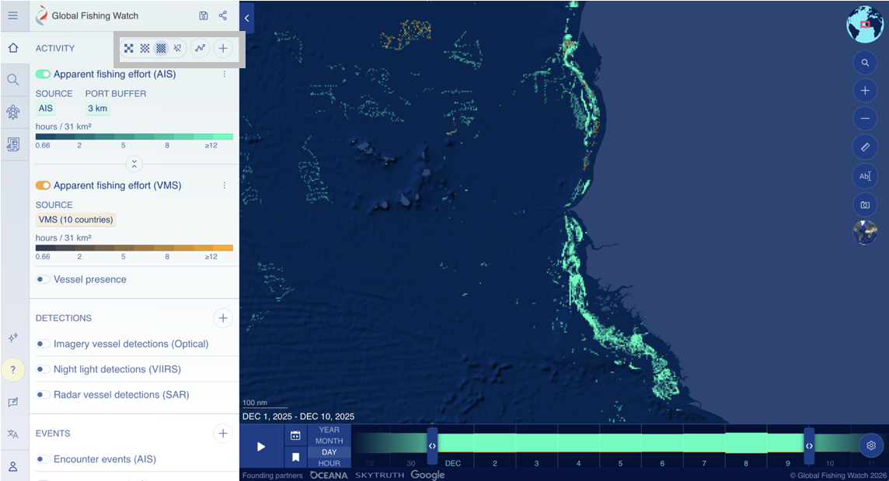
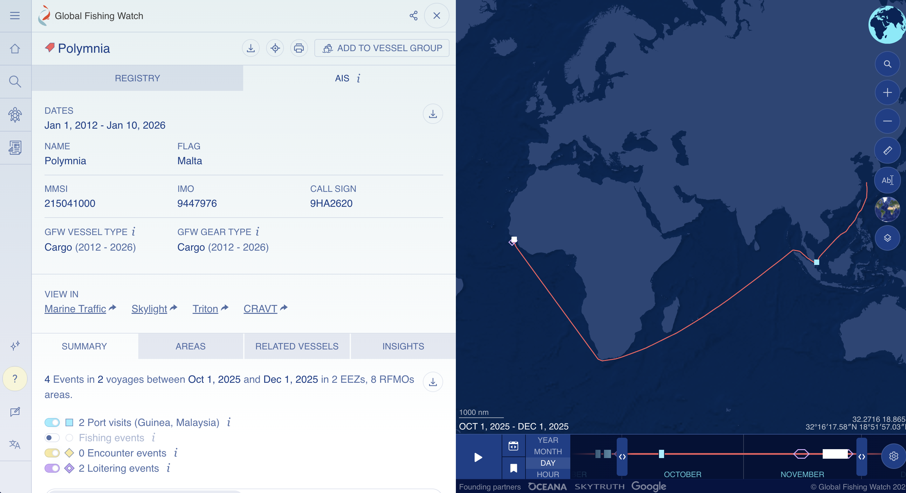
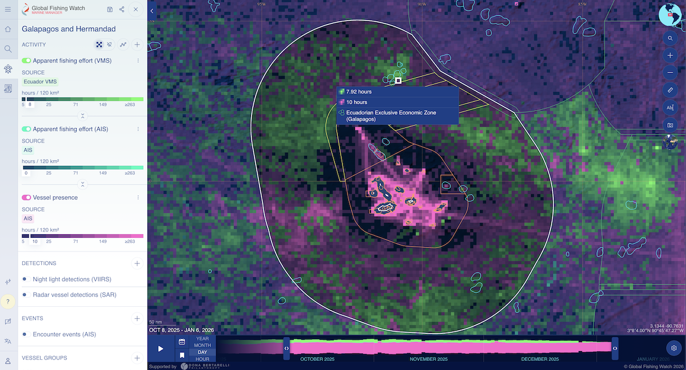

# Global Fishing Watch

## URL

[https://globalfishingwatch.org](https://globalfishingwatch.org/map)

## Description

Global Fishing Watch provides a set of open-access tools for the visualization and analysis of vessel activities at sea, with a focus on supporting ocean governance. Global Fishing Watch (GFW) uses a variety of data sources, including:

* Automatic Identification System ([AIS](https://www.dma.dk/safety-at-sea/navigational-information/ais-data)) data
* Satellite imagery, including low-resolution, frequently updated Sentinel 1 and Sentinel 2 [from the European Space Agency (ESA)](https://www.esa.int/Applications/Observing_the_Earth/Copernicus/The_Sentinel_missions), and high-resolution (3-metres) optical imagery [from Planet Labs](https://www.planet.com/pulse/our-ocean-our-future-how-near-daily-earth-observation-empowers-governments-to-protect-and/)
* [Apparent fishing efforts](https://globalfishingwatch.org/dataset-and-code-fishing-effort/): Estimations based on machine learning algorithms, indicating start and end times of fishing, and the type of gear deployed
* Data layers and datasets: [Night light detections](https://globalfishingwatch.org/data/ais-viirs-reveals-dark-fleet/), [radar detections](https://globalfishingwatch.org/platform-update/new-detections-from-synthetic-aperture-radar/), bathymetry (i.e., measurement of water depth and physical features of sea floor), chlorophyll-a concentration, coral reefs, mangroves, and nitrate concentration
* [Vessel information](https://globalfishingwatch.org/datasets-and-code-vessel-identity/): [IMO](https://www.pew.org/-/media/assets/2017/05/eif_the_imo_number_explained.pdf), MMSI, current ownership structure and past ownership records

### Potential use cases

GFW offers different possibilities to investigate issues in coastal waters or at sea. Here are some potential use cases:



* IUU [activities](https://ig.ft.com/supermarket-tuna/): where, when, and by whom
* Effects of [bottom trawling](https://globalfishingwatch.org/article/partnering-with-planet-to-bring-coastal-waters-and-small-vessels-into-focus/) or other gear deployment that may be controversial
* Carbon emissions: Current and historical data showing vessel types and speeds means that [carbon emissions](https://globalfishingwatch.org/article/mapping-industrial-vessel-emissions-at-sea/) can be estimated and tracked.
* Marine protected areas: Changes in human activity and changes in habitats for marine species [before and after legal protections go into effect](https://www.science.org/doi/10.1126/science.adt9009).
* [Migratory fish species](https://www.globalseafood.org/advocate/can-tracking-fishing-fleets-reveal-early-warning-signs-of-marine-ecosystem-changes/) and marine ecosystem health.



* Access [historical data](https://doi.org/10.1016/j.marpol.2018.04.023) (AIS) dating back to 2012, for which other platforms would require a paid subscription
* [Transshipments](https://globalfishingwatch.org/datasets-and-code-transshipment/): vessels meet at sea and move goods or personnel across vessels. Transshipments can be used to evade tariffs, sanctions, or quotas (e.g. origin of goods), or to hide IUU fishing or trafficked labor.
* Other shadow fleet activities



### How to use

_**What this page covers.**_ This page will discuss three tools under Global Fishing Watch, namely the [Map](https://globalfishingwatch.org/our-map/), [Marine Manager](https://globalfishingwatch.org/marine-manager-portal/), and [Vessel Viewer](https://globalfishingwatch.org/map/vessel-search). These tools can be considered mutually complementary for investigative purposes. All three can be accessed in the top-left corner navigation, as annotated below.

<figure><figcaption></figcaption></figure>

#### Viewing heatmap of vessel activities

From the [GFW Map](https://globalfishingwatch.org/map) page, a world map is shown. If you are interested in a particular area, pan and zoom the map there. Vessel activity data from AIS are shown in fluorescent green, and data from vessel monitoring systems (VMS) are shown in yellow.

As an example, below is a heatmap visualizing vessel activity off the coast of Mauritania from Dec 1 to 10, 2025.

View a higher (or lower) resolution heatmap by selecting the icons (shown in the gray rectangle, side panel - see left of image).

<figure><figcaption></figcaption></figure>

_**Note.**_ GFW is heavy on visual content. For those with slower internet speeds, a new page view can take 30 seconds or longer to load a new page view. Please be patient.

Click on your location of interest to see the vessel activities there. For example, these vessels were apparently fishing in the coastal waters near Nouakchott, Mauritania.

<figure><figcaption></figcaption></figure>

Clicking into each vessel will show you more information, including the MMSI and IMO identifiers and the call sign, what type of vessel and fishing gear, and information about its voyage(s) and port visit(s) during your selected time frame. An example is shown here. (Further discussion on finding vessel information is in a later section.)

<figure><figcaption></figcaption></figure>

<strong>What is a call sign?</strong>

A call sign is an alphanumeric identifier assigned to a vessel when it receives its ship radio license. It is used in radio transmission, such as distress, urgency, or safety calls.

<strong>What is MMSI?</strong>

The MMSI (Maritime Mobile Service Identity) number is a 9-digit identifier used in communication. It is sometimes described as the mobile number for a maritime object, which can be a vessel, fixed offshore installation, maritime search and rescue (SAR) aircraft, coast station, or navigational aid. \
\
The first 3 digits of the MMSI refer to the vessel's flag state, i.e., the country where the vessel is registered. These digits are called [maritime identification digits (MID)](https://en.wikipedia.org/wiki/Maritime_identification_digits). For example, vessels with Chinese flags have MIDs 412, 413, or 414. When a vessel changes its country of registration, this part of the MMSI will change. This is why a vessel can have multiple MMSI numbers. \
\
The remaining 6 digits are unique identifiers. \
\
Sometimes, vessel operators at sea may enter the wrong MMSI number in their communication, either intentionally or accidentally. [Read more here](https://globalfishingwatch.org/data/spoofing-one-identity-shared-by-multiple-vessels/) about how to interpret the data if you see such instances when accessing GFW.

<strong>What is an IMO number?</strong>

The IMO (International Maritime Organization) number is a 7-digit unique and permanent identifier assigned to vessels. The identifier is permanent throughout the vessel's life cycle, and does not change regardless of changes in the vessel's ownership, country of registration, flag, or name. \
\
The [IMO number is mandatory](https://www.imo.org/en/ourwork/iiis/pages/imo-identification-number-schemes.aspx) for all propelled sea-going merchant ships of 100 gross tonnage (GT) and above, including fishing vessels, cargo vessels, and refrigerated cargo vessels, and also mandatory for: \
\- passenger ships under 100 gross tonnage\
\- high-speed passenger craft\
\- mobile offshore drilling units on international voyages\
\- all motorized inboard fishing vessels of less than 100 gross tonnage down to a size limit of 12 metres in length overall (LOA). \
\
Further information about exceptions, such as unpropelled ships, pleasure yachts, and ships of war, [can be found here](https://wwwcdn.imo.org/localresources/en/KnowledgeCentre/IndexofIMOResolutions/AssemblyDocuments/A.1117\(30\).pdf.). \
\
By [IMO regulations](https://www.imo.org/en/ourwork/iiis/pages/imo-identification-number-schemes.aspx), the number must be permanently on a visible place on the vessel, usually on the hull or superstructure.&#x20;

\
**Adjusting the date range**

GFW data are published with a 72-hour delay, considered near real-time. A timeline is shown at the bottom of the screen. You can adjust the date range by adjusting the timeline, as shown below. Note that ranges can be Year, Month, Day, or Hours.

<figure><figcaption></figcaption></figure>

* To see the heat map changing over your chosen duration, press the Play button.
* Historical data are available dating back to January 1, 2012.

#### Search for vessels, view vessel tracks and fishing events

Select the magnifying glass icon 🔍 and you will reach the Vessel Finder tool.

* Search for a vessel by its MMSI or IMO identifiers — this is recommended for greater precision, as a vessel's name or call sign can change frequently.
* Click on **Advanced** for more search options. Search by: Owner; Info Source (Registry or Self-reported); Flag (Country); GFW Vessel Type (i.e., Fishing, Seismic Vessel, Passenger, Carrier, Gear, Bunker, Other, or Discrepancy); Gear Types (a very long list, e.g., Cargo, Dredge Fishing, Squid Jigger, Tuna Purse Seine); and Active Before and Active After dates.

As an example below, searching for IMO 9447976, the vessel information is shown and its route in a selected time frame is visualized. The vessel's port visits, encounter events (e.g., meeting with another vessel) at sea, and loitering events are counted and mapped (if any).

<figure><figcaption></figcaption></figure>

#### **What are loitering events?**

Loitering is when a single vessel exhibits behavior indicative of a potential encounter event — these can be understood as possible transshipments.

* Only loitering events greater than one hour are shown in GFW, and users can filter to see loitering between 1 to 48 hours.
* Loitering is estimated using AIS data. (AIS data alone cannot confirm if goods or people were exchanged when vessels meet, but the data can help identify potential transshipment events at sea.)
* Loitering occurs when a vessel travels at average speed of < two knots, while at least an average of 20 nautical miles from shore.

According to [Kroodsma, Miller, & Roan](https://imcsnet.org/resource/global-view-transshipment-revised-preliminary-findings) (2017) and [Miller et al.](./#url) (2018), 47% of transshipment events occur on the high seas, and 42% involve vessels flying flags of convenience.

Researchers can take these estimated loitering events as leads for their investigations, subject to further verification. (For example, a transshipment vessel may be loitering with no other AIS signal nearby. An additional view from satellite imagery might be needed to verify whether a fishing vessel was present.)

#### Monitor a protected area

Via the [Marine Manager](https://globalfishingwatch.org/map/marine-manager) tool, researchers can search for specific protected areas with a simple keyword search.

For example, the protected area near the Galapagos was [expanded in 2022](https://www.galapagos.org/newsroom/breaking-ecuador-announces-expansion-of-galapagos-marine-reserve/) as the Hermandad Marine Reserve was created. The boundaries of the protected areas are clearly shown.

The boundaries of these protected areas, as well as the Exclusive Economic Zone (EEZ) of Ecuador around the Galapagos, are clearly shown in GFW.

<figure><figcaption></figcaption></figure>

#### Downloading data

GFW supports users downloading the vessel activity dataset based on their chosen parameters (e.g., location, time frame, and data layers). This is a valuable function for researchers who may be analyzing data about a large fleet, or if you need to build your own map.

* Make sure you have selected the data layers you would like to include.
* Right-click a grid cell from the map and select Download.
* Formats available: CSV, GeoTIFF
* Remember to select how to group the data

#### Other Tips

1. _**Languages:**_ Global Fishing Watch is available in English, Spanish, French, Bahasa Indonesia, and Portuguese. To switch languages, find this symbol in the bottom-left corner (circled in orange).

<figure><figcaption></figcaption></figure>

2. _**Upload your own data**_: To create visualizations using GFW's data overlaid on your own dataset, you can upload your data.

<figure><figcaption></figcaption></figure>

## Cost

* [x] Free
* [ ] Partially Free
* [ ] Paid

## Level of difficulty

<table><thead><tr><th data-type="rating" data-max="5"></th></tr></thead><tbody><tr><td>3</td></tr></tbody></table>

## Requirements

* **Email address:** a registered account is required for [some features](https://globalfishingwatch.org/our-map/) (e.g. downloadable fishing reports; saving a workspace)
* **API:** a registered account and an API Token
* For users less familiar with using an API, **Python and R** **packages** are available. (See links for Github repos: [Python](https://github.com/GlobalFishingWatch/gfw-api-python-client) gfw-api-python-client; [R](https://github.com/GlobalFishingWatch/gfwr) gfwr package.)

Refer to the [GFW Data Availability Guide](https://globalfishingwatch.org/global-fishing-watch-data-availability/) to see which datasets are available in each type of access.

## Limitations

**Users should be aware that GFW tools involve combining different data sources, and each data source has its own strengths and weaknesses**. Users should decide for themselves whether the strengths from other GFW features mitigate those weaknesses. If not, they should seek other verification before drawing conclusions. For example:

* **AIS signals** could be affected by deliberate evasion (switching off the transponder) or [spoofing](https://www.lloydslistintelligence.com/thought-leadership/blogs/the-case-of-the-shanaye-queen), and are also influenced by extreme [weather conditions](https://www.spglobal.com/content/dam/spglobal/mi/en/documents/general/research-analysis/840090525_0222_MT_MAT_AIS-Fundamentals_Brochure_Final_LowRes.pdf) such as high-intensity precipitation.
* **Low-resolution satellite imagery** (Sentinel-1, Sentinel-2) are limited in that they allow researchers to see [vessels over 12 metres in length](https://globalfishingwatch.org/dataset-and-code-fishing-effort/), thus underrepresenting smaller vessels, which account for a majority of fishing activities ([FAO, 2024](https://openknowledge.fao.org/server/api/core/bitstreams/1273bc36-339b-43d2-8163-af4d805f2ad2/content/sofia/2024/fishing-fleet.html)). Compared to Sentinel-1, Sentinel-2 has [higher accuracy in delineating complex coastlines](https://doi.org/10.1016/j.rse.2023.113498), but is dependent on clear weather conditions.
* Since Planet Labs' high-resolution imagery became available on GFW in 2025, users can now see small vessels of 3 metres in length and operating in coastal waters.
* Additionally, satellite images are usually captured during daylight or evening hours, whereas **some fishing activities take place overnight**, so researchers need to rely on night light detection to corroborate vessel locations.

#### Other limitations

* **The apparent fishing effort data are based on machine learning algorithms rather than direct observations.** The algorithm for GFW fishing effort model ([Kroodsma et al., 2018](https://doi.org/10.1126/science.aao5646)) was developed through supervised learning on labelled datasets. Details such as the start/end times of fishing activities and the type of gear deployed (e.g., longline, trawler, or squid jigging) should also be understood as estimates from predictive modeling ([Turner et al., 2025](https://doi.org/10.1093/icesjms/fsaf167)).
* **Processing large datasets can require significant computing resources.** These may not be accessible to all researchers.
* **API Rate limits**: [rates are limited](https://globalfishingwatch.org/our-apis/documentation#terms-of-use) to 50,000 daily API requests per day and 1,550,000 per month.

## Ethical Considerations

* **Privacy**: The use of satellite imagery and remote sensing can have privacy implications for civilians and individuals. Before publishing findings, researchers should weigh the consequences of identifying individuals or their vessel locations, especially if the investigation involves a conflict zone or disputed waters.
* **Biases in data interpretation, and impact on indigenous communities:** There can be many explanations for apparent fishing efforts within and near Marine Protected Areas (MPAs), and [regulated, legal fishing activities can take place within protected areas](https://cinea.ec.europa.eu/publications/digital-publications/mapping-marine-protected-areas-and-their-associated-fishing-activities-atlantic-baltic-north-sea-and_en). Furthermore, legality and equity issues can also be intertwined. For example, there have been debates around how some MPAs may have been set up without sufficient consultation with indigenous communities, thus [affecting their customary fishing rights](https://www.humanrights.dk/files/media/document/INDIGENOUS%20PEOPLES%E2%80%99%20CUSTOMARY%20FISHING%20RIGHTS_KEY%20ISSUES%20AND%20INPUT%20FROM%20THE%20EXPERT%20MEETING%20ON%20INDIGENOUS%20PEOPLES%20AND%20FISHERIES_2023_accessible.pdf).

## Similar Tools

Global Fishing Watch is unique in its focus on providing data for ocean governance and fishery management. Several other free tools are designed for similar vessel tracking functions. **MarineTraffic** and **VesselFinder** both provide near real-time AIS ship tracking and port data. These are often considered complementary data sources (where data discrepancies and different photo views can be compared), possibly revealing the vessels' positions, routes, photos, and ports visited over time. For those unfamiliar with these tools, please see the Bellingcat Toolkit's guides to [MarineTraffic](https://bellingcat.gitbook.io/toolkit/more/all-tools/marinetraffic) and [VesselFinder](https://bellingcat.gitbook.io/toolkit/more/all-tools/vesselfinder) for reference.

Another popular tool known for its proprietary AI and predictive analytics is [**Windward**](https://windward.ai/). Windward provides predictive intelligence and pattern recognition to help uncover suspicious vessel behaviors. Going beyond AIS, satellite imagery, and remote sensing, Windward's data sources also include vessel ownership structures, cargo details, vessel behaviors, and global sanctions lists. Windward's data have been used by journalists to uncover [shadow fleet](https://windward.ai/blog/russia-reclaims-its-dark-fleet-as-venezuela-tankers-come-under-attack/), [sanctions evasion](https://www.wired.com/story/ship-tracking-winward-ai/), and [illegal fishing activities](https://cimsec.org/evolution-of-the-fleet-a-closer-look-at-the-chinese-fishing-vessels-off-the-galapagos/).

## Guides and articles

#### **Official guides**

**User guide:** [https://globalfishingwatch.org/user-guide/](https://globalfishingwatch.org/user-guide/)

**Tutorials**: [https://globalfishingwatch.org/tutorials/](https://globalfishingwatch.org/tutorials/)

**Youtube channel:** [https://www.youtube.com/@GlobalFishingWatch](https://www.youtube.com/@GlobalFishingWatch)

#### **Other tutorials**

* Google News Initiative, [https://newsinitiative.withgoogle.com/resources/trainings/global-fishing-watch-monitor-fishing-fleets-and-vessels/](https://newsinitiative.withgoogle.com/resources/trainings/global-fishing-watch-monitor-fishing-fleets-and-vessels/)

### Reference

**Bellingcat reporting**

* Logan Williams, Thomas Bordeaux, Ethan Doyle, Lotte van de Waal. (2024). _How a Leaking Barge Became an Oil Spill Disaster Off the Tobago Coast_, &#x42;_&#x65;llingcat_. [https://www.bellingcat.com/news/2024/02/20/how-a-leaking-barge-became-an-oil-spill-disaster-off-the-tobago-coast/](https://www.bellingcat.com/news/2024/02/20/how-a-leaking-barge-became-an-oil-spill-disaster-off-the-tobago-coast/)

**Other journalism and investigative publications**

* The dark truth behind supermarket tuna. Financial Times (20 Nov 2025). [https://ig.ft.com/supermarket-tuna/](https://ig.ft.com/supermarket-tuna/)
* Antunes, Jose. (July 21, 2022). An interactive map to monitor the activity of dark fleets in coastal waters. National Fisherman. [https://www.nationalfisherman.com/national-international/a-map-to-monitor-dark-fleets-activity-in-coastal-waters](https://www.nationalfisherman.com/national-international/a-map-to-monitor-dark-fleets-activity-in-coastal-waters)

**Academic research & science communication**

* Seguin, R., Le Manach, F., Devillers, R., Velez, L., & Mouillot, D. (2025). Global patterns and drivers of untracked industrial fishing in coastal marine protected areas. _Science (New York, N.Y.)_, _389_(6758), 396–401. [https://doi.org/10.1126/science.ado9468](https://doi.org/10.1126/science.ado9468)
* Paolo, F.S. _et al._ (2024) Satellite mapping reveals extensive industrial activity at sea’, _Nature_, 625(7993), pp. 85–91. [https://doi.org/10.1038/s41586-023-06825-8](https://doi.org/10.1038/s41586-023-06825-8).
* Chinacalle-Martínez, N., Hearn, A. R., Boerder, K., Murillo Posada, J. C., López-Macías, J., & Peñaherrera-Palma, C. R. (2024). Fishing effort dynamics around the Galápagos Marine Reserve as depicted by AIS data. _PloS one_, _19_(4), e0282374. https://doi.org/10.1371/journal.pone.0282374
* Raynor, J. (2024) _We used AI and satellite imagery to map ocean activities that take place out of sight, including fishing, shipping and energy development_, _The Conversation_. [http://theconversation.com/we-used-ai-and-satellite-imagery-to-map-ocean-activities-that-take-place-out-of-sight-including-fishing-shipping-and-energy-development-219367](http://theconversation.com/we-used-ai-and-satellite-imagery-to-map-ocean-activities-that-take-place-out-of-sight-including-fishing-shipping-and-energy-development-219367)
* Coro, G., Ellenbroek, A., & Pagano, P. (2021). An open science approach to infer fishing activity pressure on stocks and biodiversity from vessel tracking data. _Ecological Informatics_, _64_, 101384. [https://doi.org/10.1016/j.ecoinf.2021.101384](https://doi.org/10.1016/j.ecoinf.2021.101384)

## Tool provider

Global Fishing Watch (GFW) [https://globalfishingwatch.org](https://globalfishingwatch.org) - United States\
(Three founding partners: [Oceana](https://oceana.org/about/), [SkyTruth](https://skytruth.org/about/) and Google)

## Advertising Trackers

* [x] This tool has not been checked for advertising trackers yet.
* [ ] This tool uses tracking cookies.
* [ ] This tool does not appear to use tracking cookies.

| Page maintainer  |
| ---------------- |
| Author: River N. |
|                  |

