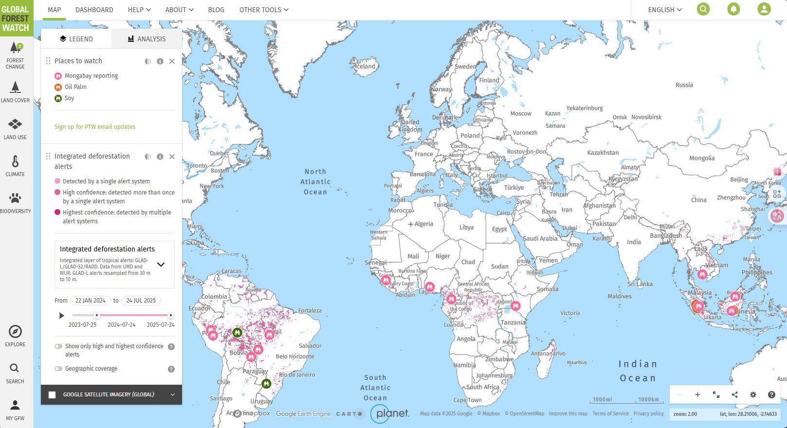

# Global Forest Watch

## URL

[https://www.globalforestwatch.org/](https://www.globalforestwatch.org/map/?map=eyJkYXRhc2V0cyI6W3sib3BhY2l0eSI6MC43LCJ2aXNpYmlsaXR5Ijp0cnVlLCJkYXRhc2V0IjoicHJpbWFyeS1mb3Jlc3RzIiwibGF5ZXJzIjpbInByaW1hcnktZm9yZXN0cy0yMDAxIl19LHsiZGF0YXNldCI6InBvbGl0aWNhbC1ib3VuZGFyaWVzIiwibGF5ZXJzIjpbImRpc3B1dGVkLXBvbGl0aWNhbC1ib3VuZGFyaWVzIiwicG9saXRpY2FsLWJvdW5kYXJpZXMiXSwiYm91bmRhcnkiOnRydWUsIm9wYWNpdHkiOjEsInZpc2liaWxpdHkiOnRydWV9LHsiZGF0YXNldCI6InRyZWUtY292ZXItbG9zcyIsImxheWVycyI6WyJ0cmVlLWNvdmVyLWxvc3MiXSwib3BhY2l0eSI6MSwidmlzaWJpbGl0eSI6dHJ1ZSwidGltZWxpbmVQYXJhbXMiOnsic3RhcnREYXRlIjoiMjAwMi0wMS0wMSIsImVuZERhdGUiOiIyMDI0LTEyLTMxIiwidHJpbUVuZERhdGUiOiIyMDI0LTEyLTMxIn0sInBhcmFtcyI6eyJ0aHJlc2hvbGQiOjMwLCJ2aXNpYmlsaXR5Ijp0cnVlLCJhZG1fbGV2ZWwiOiJhZG0wIn19XX0%3D)

## Description

Global Forest Watch offers a wide range of data layers which can be visualized on a map. The data is organized into five sections  "Forest Change", "Land Cover", "Land Use", "Climate" and "Biodiversity".

### Forest Change

The main focus of the map is to cover monitor change all across the world, including where trees are disappearing or appearing for the first time. It also offers country insights, for instance for Brazil, Cambodia, Peru and Indonesia.&#x20;

The forest change column offers insights on Disturbance Alerts, Fires and Treecover Change:

**Disturbance alerts**

GFW offers types of disturbance alerts that notify users when deforestation of degradation affects forests. The alerts are coming from satellite data that detect changes in the forest cover.&#x20;

There are three disturbance alerts:&#x20;

Integrated deforestation alerts: Those alerts are using an integrated layer called GLAD (Global Land Analysis and Discovery) deforestation alerts. These alerts are updated weekly and are based on 30-meter resolution imagery from the Landsat satellite program, which detects sudden changes in vegetation that indicate tree cover loss. GLAD alerts are available globally and are especially useful in tropical forests.

Another key type of disturbance alert is RADD (Radar for Detecting Deforestation). Unlike optical satellite sensors, RADD alerts are based on radar imagery from the Sentinel-1 satellite, which can penetrate cloud cover and collect data in all weather conditions. These alerts are available every 5 to 12 days and offer a finer resolution (10 meters).

The coverage of said deforestation covers a time frame of two years.

The system also provides a global vegetation disturbance alert but for now this alert remains under construction without any statistics or analysis being shared through the map. THere is also a places to watch alert where mongabay reporting, oil palm and soy incidents that are linked to deforestation appear in the map.

<figure><figcaption>
Disturbance alerts and their visual representation on the map.
</figcaption></figure>

#### **Fires**

GFW also provides detailed monitoring of active fires, which are a major cause of forest degradation and greenhouse gas emissions. The fire alerts come from NASA’s VIIRS (Visible Infrared Imaging Radiometer Suite) satellite sensor and are updated several times daily.

These VIIRS active fire alerts identify thermal anomalies—or “hotspots”—that are likely to be caused by open burning, including wildfires, slash-and-burn agriculture, or land-clearing fires. With a resolution of approximately 375 meters, these alerts offer global coverage and are essential for detecting both natural and human-induced fires.

&#x20;On the GFW map, users can view fire alerts in real time, filter by date, and overlay them with other data layers such as forest cover, protected areas, or concession boundaries. This helps users determine whether fires are occurring in sensitive or high-risk areas.

<figure><figcaption>
Fire layers and their visual representation on the map.
</figcaption></figure>

#### **Tree cover change**

GFW provides comprehensive data on tree cover loss and gain over time.

The Tree Cover Loss data, derived from annual satellite analysis (primarily Landsat imagery), tracks where forest cover has disappeared year by year since 2000. This data has a spatial resolution of 30 meters and includes global coverage, excluding some of the driest areas where tree cover is minimal. Users can view yearly loss, compare change over decades, and analyze drivers of deforestation.

Tree Cover Gain data shows where forests have regrown or expanded between 2000 and 2012. Although updated less frequently than loss data, this layer helps provide a more complete picture of forest dynamics.

<figure><figcaption></figcaption></figure>

### **Land Cover**

Land Cover provides essential spatial data about **what types of natural or human-altered surfaces** exist across the globe.

This Land Cover section offers:

* **Layer Toggle Panel**\
  On the left-hand side of the GFW map interface, under the **“Land Cover”** section, users can select from multiple global and regional datasets. These layers can be toggled on/off and displayed simultaneously with forest change data, protected areas, concessions, and other relevant features.
* **Timeline Control**\
  For certain land cover datasets, users can view data by year (e.g., to see land cover classification from 2015 through 2022), using the **timeline slider**.
* **Opacity and Layer Ordering**\
  Users can adjust the **opacity** of the land cover layers and rearrange their **layer order** in the map interface, allowing for better comparison between multiple datasets.
* **Analysis Tool**\
  The map’s **Analysis Tool** lets users draw a custom area, upload a shapefile, or select predefined administrative/ecological zones (like countries or river basins). GFW then calculates the **distribution of land cover classes** within the selected region.

The different types of layers that the Land cover section offers are:

* Tree cover
* Tropical Tree cover
* Primary Forests
* Tree Cover Height
* Natural Forest
* Forest landscape integrity index
* Intact Forest landscapes
* Land Cover
* Mangrove Forests
* Soy planted area
* Tree Plantations
* Global Peatlands

<figure><figcaption>
Land cover layers and their visual representation on the map.
</figcaption></figure>

### **Land Use**

**Land use** refers to how humans utilize land for various activities such as agriculture, forestry, conservation, mining, and infrastructure. The GFW map offers multiple data layers showing the **spatial distribution of economic activities and land management designations**.

This Land Use section offers:

&#x20;

* **Layer Toggle Panel**\
  On the left-hand side of the GFW map interface, under the **“Land Cover”** section, users can select from multiple global and regional datasets. These layers can be toggled on/off and displayed simultaneously with forest change data, protected areas, concessions, and other relevant features.
* **Timeline Control**\
  For certain land cover datasets, users can view data by year (e.g., to see land cover classification from 2015 through 2022), using the **timeline slider**.
* **Opacity and Layer Ordering**\
  Users can adjust the **opacity** of the land cover layers and rearrange their **layer order** in the map interface, allowing for better comparison between multiple datasets.
* **Analysis Tool**\
  The map’s **Analysis Tool** lets users draw a custom area, upload a shapefile, or select predefined administrative/ecological zones (like countries or river basins). GFW then calculates the **distribution of land cover classes** within the selected region.

The different types of layers that the Land Use section offers are:

* Logging Concessions
* Mining Concession
* Oil Palm Concessions
* Mapped Cocoa plots per square kilometer
* Palm Oil Mils
* RSPO oil Palm Concessions
* Wood Fiber Concessions
* Protected Areas
* Indigenous and Community Lands
* Population Density

### **Climate**

**The Climate section of the Global Forest Watch Map is designed to help users understand the relationship between forests and climate change.**

### **Tools for Exploring Climate Layers in GFW**

1. **Layer Panel – Climate Section**\
   On the left side of the map interface, the **“Climate”** category provides access to datasets related to **carbon stocks, carbon emissions, forest carbon flux, and forest carbon offsets**.
2. **Analysis Tool**\
   Users can select a region (by drawing, uploading a file, or choosing an administrative boundary) to calculate **carbon emissions**, **carbon loss**, or **carbon stock totals** within that specific area.
3. **Data Comparison**\
   Climate layers can be overlaid with forest change data (e.g., tree cover loss) or land use layers (e.g., concessions, protected areas) to evaluate the **climate impact of land-use change**.
4. **Temporal Exploration**\
   Some datasets (such as emissions or sequestration data) are available by year, allowing users to analyze trends over time.

The different types of layers that the Climate section offers are:

* Forest Greenhouse Gas Emissions
* Forest Greenhouse Gas Net Flux
* Forest Carbon Removals
* Tree Biomass Density
* Potential Carbon Sequestation Rate

<figure><figcaption>
Climate layers and their visual representation on the map.
</figcaption></figure>

### **Biodiversity**

The **Biodiversity section** of the Global Forest Watch Map offers spatial data and tools to help users understand how forest ecosystems support global biodiversity

**Tools for Exploring Biodiversity in GFW**

1. **Biodiversity Layers Panel**\
   Found under the **“Biodiversity”** section in the map’s left-hand layer menu, these datasets provide visual insights into species richness, habitat ranges, conservation priorities, and threats to biodiversity.
2. **Analysis Tool**\
   Users can select any region (custom-drawn, uploaded, or predefined) to analyze how much of the area falls within key biodiversity zones or critical habitats.
3. **Layer Overlap & Prioritization**\
   Biodiversity layers can be combined with **forest change data, land use data, and protection status** to identify at-risk ecosystems or areas where conservation is urgently needed.
4. **Timeline Slider**\
   While biodiversity data is generally static or updated periodically (not annually), users can still assess changes by overlaying **recent forest loss or fire alerts** over biodiversity layers.

The different types of layers that the Climate section offers are:

* Global Biodiversity Intactness
* Global Biodiversity Significance
* Alliance for Zero Extinction Sites
* Key Biodiversity Areas
* Biodiversity Hotspots
* Endemic Bird Areas

<figure><figcaption>
Biodiversity layers and their visual representaion on the map.
</figcaption></figure>

## Cost

* [x] Free
* [ ] Partially Free
* [ ] Paid

## Level of difficulty

<table><thead><tr><th data-type="rating" data-max="5"></th></tr></thead><tbody><tr><td>1</td></tr></tbody></table>

## Requirements

There are no requirements for using this tool. You can explore features such as deforestation, fires, land cover, land use, biodiversity, and weather data from 2001 on (in most of the regions) without creating an user account.\
\
However, researchers who want to optimize their research can create an account using their e-mail address which them to sign up for alerts in an area of interest, analyze data, and receive email notifications when new alerts are available.&#x20;

## Limitations

\-

## Ethical Considerations

\-

## Guide

Global Forest Watch provides a [step-by-step guide](https://www.globalforestwatch.org/help/map/guides/) on how to use the map.&#x20;

The Global Forest Watch Fire Report Map is mentioned in Wim Zwijnenburg's Bellingcat article [Black Gold Burning: In Search Of South Sudan’s Oil Pollution](https://www.bellingcat.com/news/africa/2020/01/23/black-gold-burning-in-search-of-south-sudans-oil-pollution/)&#x20;

## Tool provider

The World Resources Institute (WRI).

## Advertising Trackers

* [ ] This tool has not been checked for advertising trackers yet.
* [x] This tool uses tracking cookies. Use with caution.
* [ ] This tool does not appear to use tracking cookies.

| Page maintainer           |
| ------------------------- |
| Bellingcat Volunteer Team |
|                           |
