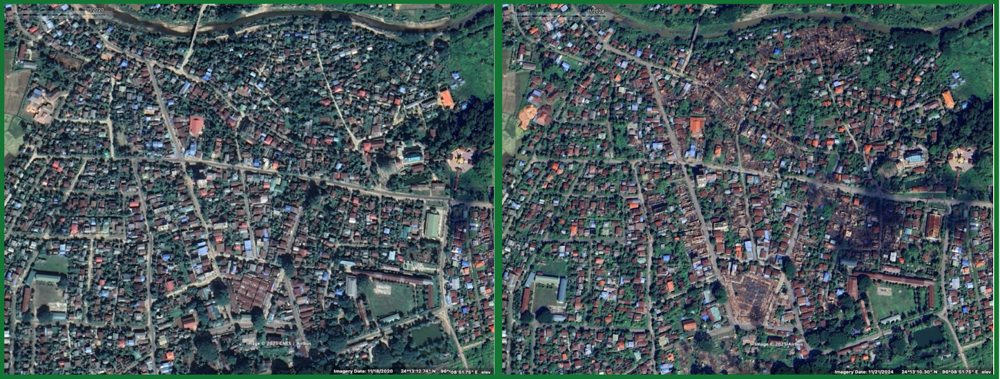

# Google Earth Pro

## URL

[https://www.google.com/earth/about/versions/](https://www.google.com/earth/about/versions/)

## Description

Google Earth is a comprehensive geographic and spatial information tool suite. It allows users to explore a 3D representation of the earth, leveraging detailed imagery, geographic data, and various layers to display geographical phenomena, landmarks, and more. It offers open source researchers satellite imagery in relatively high resolution from various regions around the world, including historical imagery.

#### Versions Available:

* **Google Earth Web**: A browser-based version that allows quick access without the need for software installation. Ideal for collaboration, casual exploration and educational purposes.
* **Google Earth Mobile**: Offers the core functionalities of Google Earth optimized for mobile devices, enabling users to explore geographic data on-the-go.
* **Google Earth Pro Desktop:** The most powerful version offering advanced features (historical imagery, sunlight angle, other planets, video tour recording) for professional users. It is recommended for open source researchers to use this version.

The example below shows a search for Amsterdam on Google Earth Pro Desktop with the "Photos" layer activated:

<figure><figcaption></figcaption></figure>

## Example Use Cases

* **Geolocation:** Open source researchers use the satellite imagery provided by Google Earth Pro to geolocate photos and videos.
* **Investigative Reporting:** Research and investigate environmental changes, urban development, and other phenomena that are best observed from an aerial or geographic perspective.
* **Historical Analysis:** Compare historical satellite images to present-day images to document changes in the environment, urbanization, and other significant transformations.

## Features

Google Earth Pro is widely used amongst open source researchers due to its free to use satellite imagery. Bellingcat, for instance, used it to [identify villages damaged by airstrikes in Myanmar](https://www.bellingcat.com/news/2025/04/29/open-sources-show-myanmar-junta-airstrike-damages-despite-post-earthquake-ceasefire/), to geolocate [Hamas-led attacks on Israeli civilians](https://www.bellingcat.com/news/2023/10/20/geolocating-hamas-led-attacks-on-israeli-civilians/) and the site [where Hamas Leader Yahya Sinwar was killed, ](https://www.bellingcat.com/news/2024/10/17/geolocating-site-where-hamas-leader-yahya-sinwar-was-killed/)amongst numerous other examples. One of its key features is the ability to compare satellite imagery of the same location over time.

### Past imagery (historical imagery)

<figure><figcaption>
As part of her <a href="https://www.bellingcat.com/news/2025/04/29/open-sources-show-myanmar-junta-airstrike-damages-despite-post-earthquake-ceasefire/">Myanmar research</a>, Bellingcat researcher Pooja Chaudhuri compared Google Earth Pro Imagery from 2020 (left) and 2024 (right) to show that parts of the town Indaw have been destroyed.
</figcaption></figure>

The use of historical images can be helpful for:

* Recognizing changes in areas (e.g. nature, urban development, infrastructure). You can find an example for such a use case in the Financial Times article ["How China is tearing down Islam"](https://ig.ft.com/china-mosques/).
* Being able to see [different views of the same object](https://www.bellingcat.com/resources/how-tos/2019/03/05/how-to-use-google-earths-three-dimensional-view-feat-syria-yemen-sudan/) (for example a building). Each image varies slightly in the angle at which it is taken. This means that different images can provide different perspectives.
* Being able to see locations at different times and therefore with different positions of the sun and shadows. This can be useful when [geolocating images](https://www.bellingcat.com/resources/how-tos/2019/03/05/how-to-use-google-earths-three-dimensional-view-feat-syria-yemen-sudan/).

<figure><figcaption>
In a <a href="https://www.bellingcat.com/resources/how-tos/2019/03/05/how-to-use-google-earths-three-dimensional-view-feat-syria-yemen-sudan/">Bellingcat article</a>, digital investigator Benjamin Strick describes how the past imagery feature of Google Earth Pro helped him see different views of <a href="https://www.youtube.com/watch?v=AuNDd_pteRQ">a prison in Sudan</a> by using satellite images taken from several angles. He also explains how the positions of shadows in a video of Sudan’s security forces firing in the air during a protest build-up in 2018 made it possible to geolocate the footage.
</figcaption></figure>

To see historical imagery in Google Earth Pro (the desktop version), select the clock symbol with the arrow in the top menu. A bar now appears in the top left-hand corner showing all available images from the past. You can use the arrow buttons to jump between the different images. The width of the slider shows the time span of available images, the vertical colored strips show the approximate time when the imagery was taken.

<figure><figcaption></figcaption></figure>

### Label map

This is a simple, yet effective tool for your day to day work with Google Earth Pro. Labeling different items on your map helps you mark places that are relevant for your research which allows you to come back to them at a later point in time.

<figure><figcaption></figcaption></figure>

1. Choose placemarks or polygons from the top menu. Placemarks tag a specific location whereas polygons are used to tag an area. You can save your placemarks and polygons in a folder on the left side to make navigation and orientation easier.
2. You can now export a folder and share it with other researchers. They can then import your tags to have a look at them in their Google Earth Pro by dragging and dropping it into the folder structure on the left hand side.

You can also download KML data from other external sources and open them in Google Earth Pro. KML is a data structure that is used to save geographical data such as placemarks and polygons. Here is an example of free KML data: [Nasa Firms](https://bellingcat.gitbook.io/toolkit/more/all-tools/nasa-firms) publishes (almost) real time fire data (Available: [https://firms.modaps.eosdis.nasa.gov/api/kml\_fire\_footprints/](https://firms.modaps.eosdis.nasa.gov/api/kml_fire_footprints/), accessed: 2. October 2025).

### Measuring distances and areas

It can be helpful to measure distances and areas on satellite images. For example, you can calculate the size of [ships](https://www.bellingcat.com/resources/2015/05/22/back-of-the-envelope-on-the-dprks-new-slbm/?utm_.com), helicopters, or plots of land using Google Earth Pro.

#### **Measuring distances**

1. Choose the ruler tool or path tool

<figure><figcaption></figcaption></figure>

2. Choose two or more points on the map

<figure><figcaption>
The screenshot shows a path which has been measured at 1.71 kilometers.
</figcaption></figure>

#### Measuring areas

1. Choose the Polygon tool in the toolbar

<figure><figcaption></figcaption></figure>

2. A window will open. One tab is called "Measurements". Click on it.

<figure><figcaption></figcaption></figure>

3\. Set as many points as you like on the Google Earth Pro map to create a polygon that covers your area of interest as accurately as possible. To do so, make sure sure to set one point after the other along the borders of the area in order to get a uniform surface. You can also move points afterwards (hover over them until the hand tool appears); the blue point is the one from which you can continue drawing. Remove erroneously set points with the Delete key on your keyboard

### Show elevation profile

Choose this tool if you wish to see how the height changes along a path.

1. If you have a path saved already, click on it using right-click , select “show elevation profile”.
2. If you don’t have a path saved yet, open the ruler from the top menu, choose “path” and tick “show elevation profile”, then select the markers along your path. When your path has reached its destination, click “save”. It’ll appear in the folders on the right side.
3. Now you can see the elevation profile on the bottom of your screen. It’ll change as you navigate through the path.

### Measuring building (or another object) height

1. Check if the building is rendered in 3D through enabling the 3D-mode in the layer section. Note: Not all regions are covered by 3D.
2. Enable the terrain layer

<figure><figcaption></figcaption></figure>

3. Find the highest point of the building. Move your cursor to the highest point of the building. The height will be displayed in the status bar at the bottom (make sure to check the correct unit!).
4.  Determine the ground level: Identify the elevation at the base of the building.\\

    <figure><figcaption></figcaption></figure>
5. Calculate the height. Subtract the ground elevation from the building’s highest point – and there you have it!

### Exploring a route via video

You can define and then explore a route as a POV-video in GEP. This might help if you want to examine a path leading to a specific destination or to get accustomed to a path you wish to take later.

1. Select the ruler from the top menu, choose “path”.
2. Place dots along the route you wish to explore and then save your path. For more precise measurements and a fluent video, it helps to place the dots closer to each other whenever there is a curve or a cross section as the line between the dots is always straight. Also, if the video is more important to you than the precise measurements of the route: Whenever you encounter a mountain, place the dots on the side opposite of the slope. Otherwise the camera will dive through the mountain and your view onto the path will not be good. But you’ll learn as you go. After saving the path appears in the folder structure on the left side.
3. Make sure your path is selected in the menu on the left side. Choose “Tools” from the top left menu → “Options” → “Touring”. Here you can select different camera settings for watching the tour. Just go by trial and error. For longer paths you might want to choose a quicker pace than for short paths. Save your settings clicking on “OK”.
4. Then click on the path symbol (three connected dots) right above the layers in the bottom left menu. Then it’ll play the tour. For more information you can view the elevation profile of your path as the tour goes along.

### Viewing GPS Data

1. When you import files that contain both geolocation data and timestamps, Google Earth can visualize the track.

* Supported formats include KML, KMZ, and GPX. However, not all GPX files contain timestamps—check before importing.
* To import you can just drag and drop the file into the places folder in Google Earth Pro. Or you choose File < Import in the top menu bar.

Note: If you import something into the “Temporary Places” folder it won’t get saved for the next time you open Google Earth Pro

.png>)\
\
.png>)

2. If the imported file contains timestamps, a timeline automatically appears in the top left-hand corner
3. Adjusting the Time Window: Two sliders allow you to set a visible time range. This helps analyze movements or track data for a specific time period.

<figure><figcaption></figcaption></figure>

### Shadow and Sun simulation tool

Primary use: Geolocating photos and videos. By comparing shadow patterns, you can estimate the time a photo was taken, if the shadow in Google Earth matches the one in the image. But there are things to consider: Google Earth does not show exact shadow projections for all regions – the accuracy depends on the underlying data.

1. First step: Activate the 3D Buildings layer to view realistic shadows.

Note: not all regions are covered with 3D view

2. Click on the sun symbol in the top menu

Note: you can simulate the sun's movement for an entire year – meaning a full earth orbit around the sun. This allows you to view shadow patterns for any day and time of the year.

<figure><figcaption></figcaption></figure>

3. Using the Timeline and fine adjustment: In the top-left corner, use the magnifying glass icons (+/-) (orange frame on the screenshot) to zoom in on the timeline. This allows you to adjust the sun position down to the exact second (check the green frame, here you see the time), simulating precise lighting conditions.

<figure><figcaption></figcaption></figure>

4\. Shadows and 3D Buildings in Historical Mode

In Historical Mode, 3D buildings remain visible, but they do not adjust to reflect the past. Therefore, it is recommended to **toggle the 3D mode on and off** to check if the building actually existed in the past for the selected time period.

### Insert satellite imagery from other sources

You can insert satellite imagery from other sources into Google Earth Pro. That might be helpful whenever you have access to more recent imagery or a higher resolution, as the quality of Google Earth Pro data varies a lot depending on the region.

1. All you have to do is download the image in .tif format.
2. Then drag and drop it into “places” on the left side.

## Cost

* [x] Free
* [ ] Partially Free
* [ ] Paid

## Level of difficulty

<table><thead><tr><th data-type="rating" data-max="5"></th></tr></thead><tbody><tr><td>2</td></tr></tbody></table>

## Requirements

* **Web**: any modern web browser and a Google account with an email address.
* **Mobile**: iOS and Android and a Google account with an email address.
* **Desktop**: Windows, macOS or Linux.

## Limitations

While Google Earth is a powerful tool for geographical information systems, it does have some limitations that researchers should consider:

* **Availability of up to date satellite imagery:** While Google Earth Pro offers satellite imagery for free, it is not always very recent and it depends on the location how often it is updated. Open source researchers who need both up to date and high resolution imagery will need to use another satellite imagery provider.
* **Data Accuracy and Currency**: Data in Google Earth may not always be up to date, leading to potential discrepancies with current conditions. Users should verify important information through other sources. For more information see [How accurate is Google Earth’s measurements?](https://www.ncesc.com/geographic-faq/how-accurate-is-google-earths-measurements/)
* **Resolution and Detail**: Image resolution varies across different regions, with some areas having detailed imagery and others being less clear. See [Spatial resolution of Google Earth Imagery](https://gis.stackexchange.com/questions/11395/spatial-resolution-of-google-earth-imagery).
* **3D Modeling**: While Google Earth provides 3D models of some cities, not all geographical areas have detailed 3D representations. See [List of 3D Locations in Google Earth](https://list.fandom.com/wiki/List_of_3D_locations_in_Google_Earth).
* **Data Privacy**: There are concerns regarding the exposure of sensitive locations, potentially compromising privacy and security so some areas are blurred out on Google Eart Pro. See Wikipedia's [List of satellite map images with missing or unclear data](https://en.wikipedia.org/wiki/List_of_satellite_map_images_with_missing_or_unclear_data).
* **Performance**: High-quality imagery and 3D models can be resource-intensive, possibly affecting performance on less powerful computers or devices. Too many _My Places_ locations can for instance cause laggy performance. For more information see [Why is Google Earth so CPU intensive?](https://www.ncesc.com/geographic-pedia/why-is-google-earth-so-cpu-intensive/)
* **Network Dependency**: Google Earth requires an internet connection for access to maps and imagery, limiting use in offline settings.

## Ethical Considerations

In the context of using remote sensing in online open source investigations, several ethical considerations should be considered:

* **Privacy Concerns:** Remote sensing technologies can capture detailed images from space or high altitude, potentially compromising individual privacy. Researchers must balance the public interest with the rights to privacy.
* **Accuracy and Misinterpretation:** Ensuring the accurate representation of data is critical. Misinterpretation of remote sensing data can lead to misinformation. For more information on how Google tries to ensure accuracy see [here](https://www.wired.com/2014/12/google-maps-ground-truth/) and [here](https://mapsplatform.google.com/resources/blog/9-things-know-about-googles-maps-data-beyond-map/).

## Guide

To effectively use Google Earth Pro, especially for beginners or those looking to refine their skills, the following resources are highly recommended:

#### Official Wiki

* [Google Earth Pro Desktop user guide](http://earth.google.com/intl/ar/userguide/v4/index.htm): installing, navigating, marking places, using KMLs, etc.
* [Google Earth Pro Desktop help](https://support.google.com/earth/topic/4363013?visit_id=638478310279193676-1109401564\&rd=1): official Google Earth Pro help.
* [Google Earth Web and Mobile](https://support.google.com/earth#topic=): official Google Earth help.
* [Importing GIS-Data by Google Earth](https://www.google.com/intl/en/earth/outreach/learn/importing-geographic-information-systems-gis-data-in-google-earth/)

#### Tutorials and Articles

* Britt, K., McGee, J. and Campbell, J. (2024) _An Introduction to Google Earth Pro_, _archive.is_. Available at: [https://virginiaview.cnre.vt.edu/wp-content/uploads/2020/07/smGoogle-Earth-Pro-Manual.pdf](https://virginiaview.cnre.vt.edu/wp-content/uploads/2020/07/smGoogle-Earth-Pro-Manual.pdf\() (Accessed: 2 October 2025).
* Cameroon (2018) _Geolocation of Infrastructure Destruction in Cameroon: A Case Study of Kumbo and Kumfutu, bellingcat._ Available at:[https://www.bellingcat.com/resources/case-studies/2018/11/21/geolocation-infrastructure-destruction-cameroon-case-study-kumbo-kumfutu/](https://www.bellingcat.com/resources/case-studies/2018/11/21/geolocation-infrastructure-destruction-cameroon-case-study-kumbo-kumfutu/) (Accessed: 2 October 2025).
* Hanham, M. (2015) _How Tall is That Gantry?_, _bellingcat_. Available at: [https://www.bellingcat.com/resources/how-tos/2015/03/15/how-tall-is-that-gantry/](https://www.bellingcat.com/resources/how-tos/2015/03/15/how-tall-is-that-gantry/) (Accessed: 4 April 2024).
* Katz, G. (2023) _Measuring Up: How to Calculate the Size of Objects in Open Source Material_, _bellingcat_. Available at: [https://www.bellingcat.com/resources/2023/09/07/measuring-up-how-to-calculate-the-size-of-objects-in-open-source-material/](https://www.bellingcat.com/resources/2023/09/07/measuring-up-how-to-calculate-the-size-of-objects-in-open-source-material/) (Accessed: 4 April 2024).
* (2015) _How to Locate a “Secret” Pro-Russian Training Camp, bellingcat._ Available at:[https://www.bellingcat.com/resources/case-studies/2014/08/15/how-to-locate-a-secret-pro-russian-training-camp/](https://www.bellingcat.com/resources/case-studies/2014/08/15/how-to-locate-a-secret-pro-russian-training-camp/) (Accessed: 2 October 2025).
* Seamster, R. (2024) Enhancing Project Management in Google Earth: A Guide to the Latest Updates. Available at: [https://medium.com/google-earth/enhancing-project-management-in-google-earth-a-guide-to-the-latest-updates-ad096c34d239](https://medium.com/google-earth/enhancing-project-management-in-google-earth-a-guide-to-the-latest-updates-ad096c34d239) (Accessed: 5 March 2025).
* Strick, B. (2020) _Geospatial awareness: how to add geodata to Google Earth Pro & four datasets you should try, \<Ben>._ Available at: [https://benjaminstrick.com/geospatial-awareness-how-to-add-data-to-google-earth/](https://benjaminstrick.com/geospatial-awareness-how-to-add-data-to-google-earth/) (Accessed: 2 October 2025).
* Strick, B. (2019) _How To Use Google Earth’s Three Dimensional View: Feat. Syria, Yemen, Sudan_, _bellingcat_. Available at: [https://www.bellingcat.com/resources/how-tos/2019/03/05/how-to-use-google-earths-three-dimensional-view-feat-syria-yemen-sudan/](https://www.bellingcat.com/resources/how-tos/2019/03/05/how-to-use-google-earths-three-dimensional-view-feat-syria-yemen-sudan/) (Accessed: 4 April 2024).

#### Video Tutorials

* _Google Earth Basics Tutorial_ (2016). Available at: [https://www.youtube.com/watch?v=klK27l3unng](https://www.youtube.com/watch?v=klK27l3unng) (Accessed: 4 April 2024).
* _Google Earth Pro - A Complete Beginner’s Guide_ (2021). Available at: [https://www.youtube.com/watch?v=3lGl1VZjtg4](https://www.youtube.com/watch?v=3lGl1VZjtg4) (Accessed: 4 April 2024).

#### Other Sources

* OSINT Military Base Map. Available at:[https://sites.google.com/view/osintmilitarymap/?utm\_source](https://sites.google.com/view/osintmilitarymap/?utm_source) (Accessed: 5 March 2025).
* [Google Earth Engine](https://earthengine.google.com/timelapse/?utm_source=): Shows earth changes since 1984 (e.g. glaciers melting)

#### Community and Support

* [Google Earth Help](https://support.google.com/earth/community?hl=en)

## Tool provider

Google [https://about.google/](https://about.google/) - United States of America

## Advertising Trackers

* [ ] This tool has not been checked for advertising trackers yet.
* [x] This tool uses tracking cookies. Use with caution.
* [ ] This tool does not appear to use tracking cookies.

| Page maintainer                    |
| ---------------------------------- |
| Bellingcat Volunteer Team/Clara D. |
|                                    |
