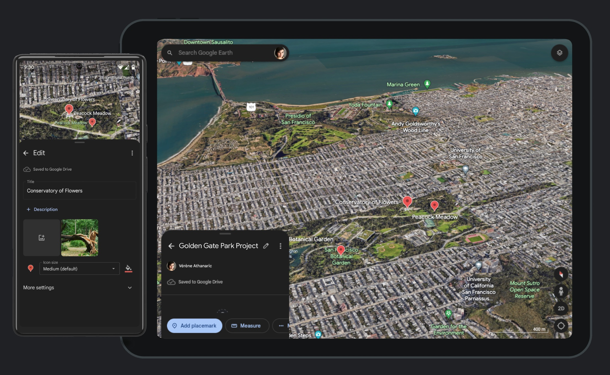
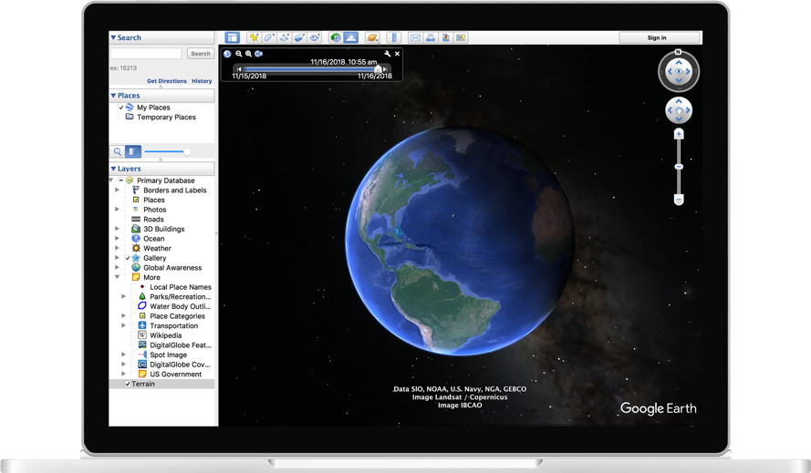

# Google Earth

## URL

[https://www.google.com/earth/about/versions/](https://www.google.com/earth/about/versions/)

## Description

Google Earth is a comprehensive geographic and spatial information tool suite available in various versions to cater to different user needs and platforms. It allows users to explore a 3D representation of Earth, leveraging detailed imagery, geographic data, and various layers to display geographical phenomena, landmarks, and more. This tool suite solves the problem of needing detailed, accurate, and accessible geographic information for both casual exploration and professional use.&#x20;

#### Versions Available:

* **Google Earth Web**: A browser-based version that allows quick access without the need for software installation. Ideal for collaboration, casual exploration and educational purposes.
* **Google Earth Mobile**: Offers the core functionalities of Google Earth optimized for mobile devices, enabling users to explore geographic data on-the-go.
* **Google Earth Pro Desktop:** The most powerful version offering advanced features (historical imagery, sunlight angle, other planets, video tour recording) for professional users, such as high-resolution printing and detailed measurements.

Each version is designed to meet specific user requirements, from desktop to mobile experiences, ensuring that users can access detailed geographic information regardless of the platform.

Google Earth Web

<figure><figcaption>
Google Earth Web Screenshot
</figcaption></figure>

Google Earth Mobile

<figure><figcaption>
Google Earth Mobile Screenshot 
</figcaption></figure>

Google Earth Pro Desktop

<figure><figcaption>
Google Earth Desktop
</figcaption></figure>

## Example Use Cases

Google Earth's sophisticated satellite imagery and 3D geographic data enable journalists to:

* **Visualize News Stories:** Create compelling visual content that supplements news stories, making complex issues easier to understand.
* **Investigative Reporting:** Research and investigate environmental changes, urban development, and other phenomena that are best observed from an aerial or geographic perspective.
* **Historical Analysis:** Compare historical satellite images to present-day images to document changes in the environment, urbanization, and other significant transformations.
* **Event Coverage:** Use real-time satellite imagery and detailed maps to cover natural disasters, conflicts, and major events from a comprehensive, bird’s-eye view.
* **Educational Content:** Produce educational material that explains geographical, political, and social issues in a visually engaging format.
* **Interactive Journalism:** Develop interactive articles where readers can explore locations related to the news stories directly within the piece.

## Cost

* [x] Free
* [ ] Partially Free
* [ ] Paid

## Level of difficulty

<table><thead><tr><th data-type="rating" data-max="5"></th></tr></thead><tbody><tr><td>2</td></tr></tbody></table>

## Requirements

* **Web**: any modern web browser and a Google account with an email address.
* **Mobile**: iOS and Android and a Google account with an email address.
* **Desktop**: Windows, macOS or Linux.

## Limitations

While Google Earth is a powerful tool for geographical information systems, it does have some limitations that researchers should consider:

* **Data Accuracy and Currency**: Data in Google Earth may not always be up to date, leading to potential discrepancies with current conditions. Users should verify important information through other sources.
* **Resolution and Detail**: Image resolution varies across different regions, with some areas having detailed imagery and others being less clear.
* **3D Modeling**: While Google Earth provides 3D models of some cities, not all geographical areas have detailed 3D representations.
* **Data Privacy**: There are concerns regarding the exposure of sensitive locations, potentially compromising privacy and security.
* **Performance**: High-quality imagery and 3D models can be resource-intensive, possibly affecting performance on less powerful computers or devices.
* **Network Dependency**: Google Earth requires an internet connection for access to maps and imagery, limiting use in offline settings.

## Ethical Considerations

In the context of using remote sensing in online open source investigations, several ethical considerations should be considered:

* **Privacy Concerns:** Remote sensing technologies can capture detailed images from space or high altitude, potentially compromising individual privacy. Journalists must balance the public interest with the rights to privacy.
* **Accuracy and Misinterpretation:** Ensuring the accurate representation of data is critical. Misinterpretation of remote sensing data can lead to misinformation, shaping public opinion based on incorrect premises.
* **Equity and Access:** The distribution of benefits from remote sensing should be equitable. Journalists should be aware of the digital divide and work towards making their findings accessible to a broader audience.
* **Environmental Impact:** The deployment and maintenance of remote sensing technologies have environmental costs. Ethical journalism considers the ecological footprint of gathering and disseminating information.
* **Informed Consent:** Where possible, obtaining informed consent from those being observed or whose data is being collected, even indirectly, reinforces ethical journalism practices.
* **Cultural Insensitivity:** Avoids the unsolicited mapping or monitoring of culturally sensitive or sacred sites without permission from the concerned communities.
* **Security Risks**: Guards against the misuse of remote sensing technology for malicious purposes, including espionage or cyber-attacks.

## Guide

To effectively use Google Earth Pro, especially for beginners or those looking to refine their skills, the following resources are highly recommended:

#### Official Wiki

* [Google Earth Pro Desktop user guide](http://earth.google.com/intl/ar/userguide/v4/index.htm): installing, navigating, marking places, using KMLs, etc.&#x20;
* [Google Earth Pro Desktop help](https://support.google.com/earth/topic/4363013?visit\_id=638478310279193676-1109401564\&rd=1): official Google Earth Pro help.
* [Google Earth Web and Mobile](https://support.google.com/earth#topic=): official Google Earth help.  &#x20;

#### Tutorials and Articles

* Britt, K., McGee, J. and Campbell, J. (2024) _An Introduction to Google Earth Pro_, _archive.is_. Available at: [https://archive.is/Kmxg2](https://archive.is/Kmxg2) (Accessed: 4 April 2024).
* Hanham, M. (2015) _How Tall is That Gantry?_, _bellingcat_. Available at: [https://www.bellingcat.com/resources/how-tos/2015/03/15/how-tall-is-that-gantry/](https://www.bellingcat.com/resources/how-tos/2015/03/15/how-tall-is-that-gantry/) (Accessed: 4 April 2024).
* Katz, G. (2023) _Measuring Up: How to Calculate the Size of Objects in Open Source Material_, _bellingcat_. Available at: [https://www.bellingcat.com/resources/2023/09/07/measuring-up-how-to-calculate-the-size-of-objects-in-open-source-material/](https://www.bellingcat.com/resources/2023/09/07/measuring-up-how-to-calculate-the-size-of-objects-in-open-source-material/) (Accessed: 4 April 2024).
* Strick, B. (2019) _How To Use Google Earth’s Three Dimensional View: Feat. Syria, Yemen, Sudan_, _bellingcat_. Available at: [https://www.bellingcat.com/resources/how-tos/2019/03/05/how-to-use-google-earths-three-dimensional-view-feat-syria-yemen-sudan/](https://www.bellingcat.com/resources/how-tos/2019/03/05/how-to-use-google-earths-three-dimensional-view-feat-syria-yemen-sudan/) (Accessed: 4 April 2024).

#### Video Tutorials

* _Google Earth Basics Tutorial_ (2016). Available at: [https://www.youtube.com/watch?v=klK27l3unng](https://www.youtube.com/watch?v=klK27l3unng) (Accessed: 4 April 2024).
* _Google Earth Pro - A Complete Beginner’s Guide_ (2021). Available at: [https://www.youtube.com/watch?v=3lGl1VZjtg4](https://www.youtube.com/watch?v=3lGl1VZjtg4) (Accessed: 4 April 2024).

#### Community and Support

* [Google Earth Help](https://support.google.com/earth/community?hl=en)

## Tool provider

Google [https://about.google/](https://about.google/) - United States

## Advertising Trackers

* [x] This tool has not been checked for advertising trackers yet.
* [ ] This tool uses tracking cookies. Use with caution.
* [ ] This tool does not appear to use tracking cookies.

| Page maintainer  |
| ---------------- |
| Volunteer needed |
|                  |

