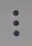
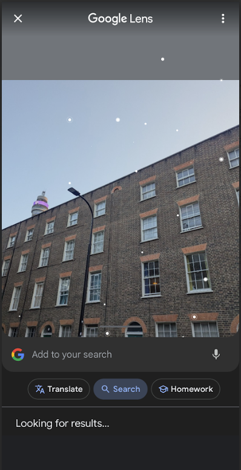
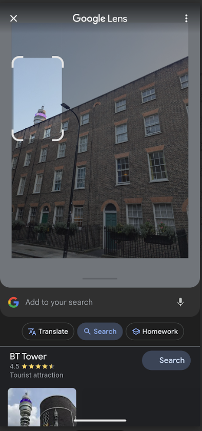
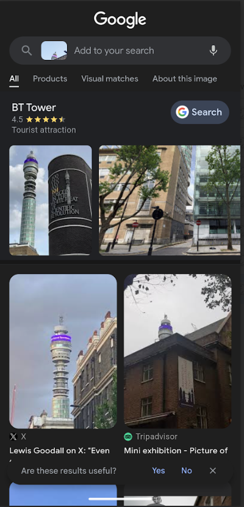

# Google Lens

## URL

[https://lens.google/](https://lens.google/)

## Description

Use Google Lens to identify objects or locations that are visible in an image. This can be useful if you want to geolocate an image, or find out more information about the objects, landmarks or vegetation in a photograph in order to better understand its contents. Primarily a mobile phone application, it can also be used in the Chrome browser.&#x20;

Google Lens now uses Google's AI tools to identify objects and places that feature in the images you search, and will sometimes provide you with an AI overview.&#x20;

### Using the Google Photos mobile application&#x20;

Open a photograph in the [Google Photos](https://play.google.com/store/apps/details?id=com.google.android.apps.photos) mobile application and click the Google Lens.png>)  icon at the bottom of the image. The app will highlight a specific part of the image in a rectangle, which you can move by dragging, or re-size using one of the corners, to make sure it captures your specific area or object of interest.

<figure><figcaption>
Screenshot 1. Click the Google Lens icon on the bottom right of the screen (second from the right).
</figcaption></figure> <figure><figcaption>
Screenshot 2. The application will start running and might suggest a specific area or object to search. 
</figcaption></figure>

<figure><figcaption>
Screenshot 3. The suggested object or area will be highlighted in a rectangle, which you can click and drag to move, or use one of the corners to re-size it. The results will appear at the bottom of your phone screen. 
</figcaption></figure> <figure><figcaption>
Screenshot 4. Drag the sidebar up to scroll through a full list of the hits and hyperlinks. You can also add keywords using the Google search bar, which is at the top of this screenshot, to narrow down your search.
</figcaption></figure>

You can also click 'About this image' (see Screenshot 4) to find out more information regarding the content of the image. There is now also an option to use AI mode, which integrates Google's Gemini AI with Google Lens's visual search capabilities.

### Using Google Lens in the browser&#x20;

Right click any photo you come across while browsing the Internet using Google Chrome and click 'Search with Google Lens'. The results will be shown on the right.&#x20;

<figure><figcaption>
Screenshot 5. Using Google Lens in the browser on an image published as part of a Bellingcat investigation. 
</figcaption></figure>

## Cost

* [x] Free
* [ ] Partially Free
* [ ] Paid

## Level of difficulty

<table><thead><tr><th data-type="rating" data-max="5"></th></tr></thead><tbody><tr><td>1</td></tr></tbody></table>

## Requirements

You need the [Google Photos](https://play.google.com/store/apps/details?id=com.google.android.apps.photos) application on your mobile phone if you want to search an image in your gallery. Otherwise, you can use Google Lens with Google Chrome or the Google application (see the Google Support page [here ](https://support.google.com/chrome/answer/15086890?hl=en)for more information).

## Limitations

Google Lens is getting more sophisticated with time, but it doesn't always work, especially with landmarks or objects that are less well-known or common. It is, however, a very useful first port of call and can potentially save you time.

## Ethical Considerations

Make sure you analyse the search results critically and cross-reference these with other sources of information to ensure you draw the right conclusions and your findings are accurate. Do not use copyright images without permission.&#x20;

## Guides and articles

'What Is Google Lens and How Do You Use It?', 23 October 2024, _Web FX._ Available at: [https://www.webfx.com/blog/seo/google-lens/#:\~:text=To%20access%20Google%20Lens%20on,should%20open%20up%20Google%20Lens.](https://www.webfx.com/blog/seo/google-lens/) (Accessed 27 December 2024).

'Search with an image on Google', _Google Search Help._ Available at: [https://support.google.com/websearch/answer/1325808?hl=en\&co=GENIE.Platform%3DAndroid#:\~:text=In%20the%20search%20bar%2C%20tap,and%20hold%20the%20Shutter%20button%20.](https://support.google.com/websearch/answer/1325808?hl=en\&co=GENIE.Platform%3DAndroid) (Accessed 27 December 2024).

'8 ways Google Lens can help make your life easier', _Google Blog._ Available at: [https://blog.google/products/google-lens/google-lens-features/](https://blog.google/products/google-lens/google-lens-features/) (Accessed 29 June 2025).

'5 ways to search what you see with Google Lens', _Google Blog._ Available at: [https://blog.google/products/search/google-lens-tips-2025/](https://blog.google/products/search/google-lens-tips-2025/) (Accessed 29 June 2025).

## Tool provider

Google [https://about.google/](https://about.google/) - United States

## Advertising Trackers

* [x] This tool has not been checked for advertising trackers yet.
* [ ] This tool uses tracking cookies. Use with caution.
* [ ] This tool does not appear to use tracking cookies.

| Page maintainer |
| --------------- |
| Ana             |
|                 |
