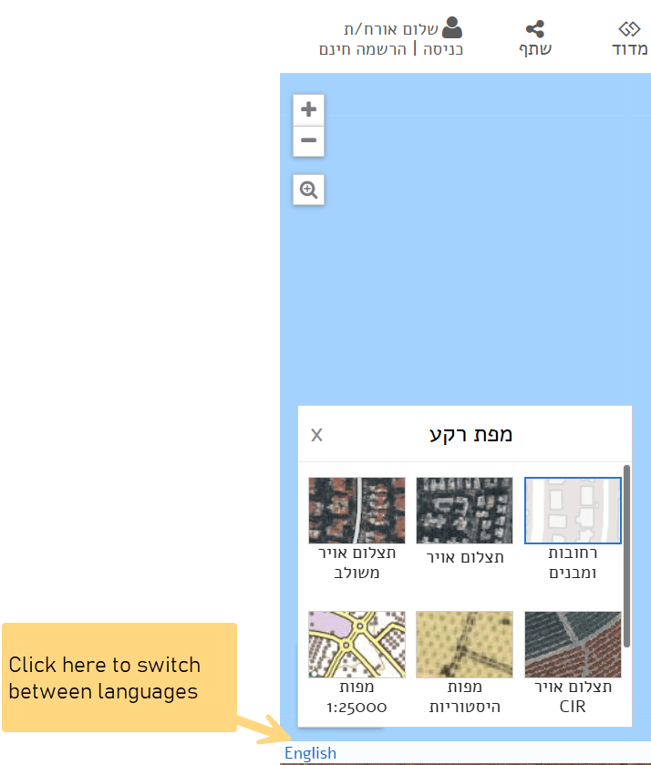

# GovMap

## URL

[https://www.govmap.gov.il/](https://www.govmap.gov.il/) - Hebrew

[https://www.govmap.gov.il/?lang=en](https://www.govmap.gov.il/?lang=en) - English

## Description

GovMap was developed by the Israeli government to provide the public with detailed geographical information about Israel. The web-based platform features a wide range of data, including property boundaries, urban planning and zoning information, and infrastructure details like cellular antennas, roads, utilities, and public institutions. It allows users to search, view, and analyze the available geographical data.

According to the [tool](https://www.gov.il/en/departments/topics/research-govmap/govil-landing-page), the map uses “government offices as \[their] data sources” and [is a collaboration project among them with the Survey of Israel as the lead. ](https://www.gov.il/en/departments/topics/research-govmap/govil-landing-page) &#x20;

### Navigating between the English and Hebrew Homepages

For beginner users, note that the Hebrew user interface is slightly different from the English user interface, given the difference in the writing system between the two. Users are immediately taken to the landing page in Hebrew, and they can choose to switch to English on the bottom corner.&#x20;

<figure><figcaption>
This is the landing page in Hebrew, switch languages at the bottom left. 
</figcaption></figure>

**Features**:

* **Amenities:** Amenities and Infrastructure mapping and filtering e.g. cell phone towers, similar to [Overpass ](https://bellingcat.gitbook.io/toolkit/more/all-tools/overpass-turbo)and the [OpenStreetMap Search](https://bellingcat.gitbook.io/toolkit/more/all-tools/openstreetmap-search-tool) tool.
* **Language:** limited to Hebrew and English.
* **Measure distance:** measure distance between points in kilometres.&#x20;
* **Screenshot:** download a screenshot of a specific area in PNG and PGW geo-referencing format.

## Cost

* [x] Free
* [ ] Partially Free
* [ ] Paid

## Level of difficulty

<table><thead><tr><th data-type="rating" data-max="5"></th></tr></thead><tbody><tr><td>3</td></tr></tbody></table>

While GovMap is designed to be user-friendly and accessible to a broad audience, new users may require some time to familiarize themselves with its various functions and data layers to fully leverage its capabilities.

## Requirements

* **Web**: any modern web browser.
* **API**: email address to register.

## Limitations

\-

## Ethical Considerations

\-

## Guide

To effectively use GovMap, especially for beginners or those looking to refine their skills, the following resources are highly recommended:

**Tutorials and Articles**

* Hanham, M. (2015) _There’s a Map for That_, _Bellingcat_. Available at: [https://www.bellingcat.com/resources/how-tos/2015/04/10/theres-a-map-for-that/](https://www.bellingcat.com/resources/how-tos/2015/04/10/theres-a-map-for-that/) (Accessed: 10 April 2024).
* _GovMap.Gov.Il - Free Israeli Government GIS Portal_ (2021). Available at: [https://www.youtube.com/watch?v=1VoXYNuVgPI](https://www.youtube.com/watch?v=1VoXYNuVgPI) (Accessed: 10 April 2024).
* Team, B.I. (2023a) _Geolocating Hamas-Led Attacks on Israeli Civilians_, &#x42;_&#x65;llingcat_. Available at: [https://www.bellingcat.com/news/2023/10/20/geolocating-hamas-led-attacks-on-israeli-civilians/](https://www.bellingcat.com/news/2023/10/20/geolocating-hamas-led-attacks-on-israeli-civilians/) (Accessed: 14 April 2024).
* Team, B.I. (2023b) _Jenin: Open Source Insights on Israel’s July Raids_, &#x42;_&#x65;llingcat_. Available at: [https://www.bellingcat.com/news/2023/08/02/jenin-open-source-insights-on-israels-july-raids/](https://www.bellingcat.com/news/2023/08/02/jenin-open-source-insights-on-israels-july-raids/) (Accessed: 14 April 2024).

**Video Tutorials**

* _GovMap.Gov.Il - Free Israeli Government GIS Portal_ (2021). Available at: [https://www.youtube.com/watch?v=1VoXYNuVgPI](https://www.youtube.com/watch?v=1VoXYNuVgPI) (Accessed: 10 April 2024).
* _Israel GIS (GovMap): Censored Satellite Imagery Around Dimona And Gaza_ (2021). Available at: [https://www.youtube.com/watch?v=w3yPtgg42AQ](https://www.youtube.com/watch?v=w3yPtgg42AQ) (Accessed: 14 April 2024).

#### Developer Resources

* [https://api.govmap.gov.il/](https://api.govmap.gov.il/)&#x20;

**Community and Support**

* [**Facebook group**](https://www.facebook.com/govmap.gov.il/)

## Tool provider

Israeli government [https://www.gov.il](https://www.gov.il) - Israel

## Advertising Trackers

* [x] This tool has not been checked for advertising trackers yet.
* [ ] This tool uses tracking cookies. Use with caution.
* [ ] This tool does not appear to use tracking cookies.

| Page maintainer                      |
| ------------------------------------ |
| Bellingcat Volunteer Team/Unassigned |
|                                      |

