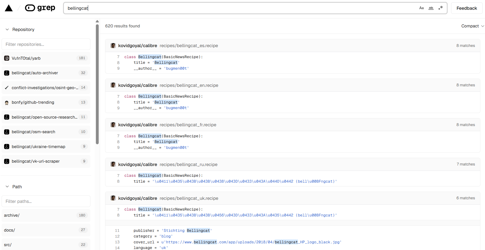
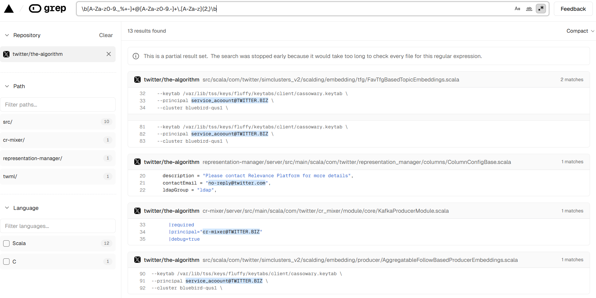

# Grep.app

## URL

[https://grep.app/](https://grep.app/)

## Description

grep.app is a free web-based search engine that allows users to search the contents of public GitHub repositories using keywords or regular expressions (regex). It is primarily used by developers, security researchers, and OSINT investigators to locate code snippets, context data, or sensitive information that may have been committed to public repositories.

## Cost

* [x] Free
* [ ] Partially Free
* [ ] Paid

## Level of difficulty

<table><thead><tr><th data-type="rating" data-max="5"></th></tr></thead><tbody><tr><td>1</td></tr></tbody></table>

## Requirements

N/A – No account required to search

## Limitations

Public Repositories Only: grep.app can only search code that is publicly available on GitHub. Any private repositories, internal servers, or non-GitHub codebases are not accessible.

Incomplete Indexing: Not all public repositories are indexed immediately. Some updates or smaller repos may not appear in searches.

## Ethical Considerations

Attribution Accuracy: Code matches do not necessarily prove authorship.

Sensitive Information: Credentials and other private information may be included in public repositories.

## Guides and articles

Use the main page to search for key words or regex. You can use this to search for domains, companies, contact details, code, and much more.

There are options on the right side of the search bar: Match case, Match whole words, and Use regular expression.

You can also toggle Compact or Expanded view in the top right corner to change how much peripheral context is included in the results.

Key word search example - searching for code referencing "Bellingcat".

<figure><figcaption></figcaption></figure>

Regex search example - searching a Twitter repository for email addresses.

<figure><figcaption></figcaption></figure>

Regex syntax guidance: [https://github.com/google/re2/wiki/Syntax](https://github.com/google/re2/wiki/Syntax)

Each result shows a snippet of matching code, the repository name and the file path. Click the filename to view it directly on GitHub.

You can filter results by Repository, Path and/or Programming Language using the left hand panel.&#x20;

Tip: Use the GitHub link to check commit history, contributors, and issues for further context.

## Tool provider

Vercel Inc. (USA) - Cloud application company that provides developer tools, frameworks, and cloud infrastructure to build and maintain websites.

## Similar tools

No other tools listed with the same purpose... yet!

## Advertising Trackers

* [ ] This tool has not been checked for advertising trackers yet.
* [ ] This tool uses tracking cookies. Use with caution.
* [x] This tool does not appear to use tracking cookies.

| Page maintainer |
| --------------- |
| Freya           |
