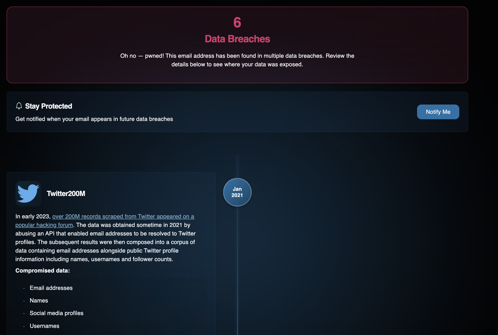

# Have I Been Pwned

## URL

[https://haveibeenpwned.com/](https://haveibeenpwned.com/)

## Description

Have I Been Pwned allows you to search across multiple data breaches to see if your email address or phone number has been compromised.  It searches through [13 billion breached records](https://www.techopedia.com/interview-with-have-you-been-pwned-creator-troy-hunt). When you search for an email address or phone number, the screen will either turn green, indicating no compromised accounts found, or red, indicating compromised accounts. If the screen turns red, you'll see a list of platforms or websites where your account details were compromised, along with additional information on when and what kind of data was affected.&#x20;

This tool is especially useful for finding where a person of interest had accounts and using those for further research. Say you have an email address you want to investigate. By running it on HIBP you find they had breaches on Twitter, Duolingo, and Last.fm -- this means they had accounts on those platforms and you can start researching these further until you find the connected accounts on the platforms.  HIPB is a starting point for researching email addresses / phone numbers.&#x20;

<figure><figcaption>
A result page after searching for a particular email address that was found in 6 Data breaches including one from Twitter.
</figcaption></figure>

## Cost

* [ ] Free
* [x] Partially Free
* [ ] Paid

The site can be used for free but there are [costs](https://haveibeenpwned.com/API/Key) for receiving an API key.

## Level of difficulty

<table><thead><tr><th data-type="rating" data-max="5"></th></tr></thead><tbody><tr><td>1</td></tr></tbody></table>

## Requirements

None

## Limitations

The result page only shows the type of data breached - "username", "ip address", "password", it does not show you the breached data itself. There are websites that collect the breached databases and let users perform searches (usually for a fee). Do not try to find out passwords via means like that with the goal to hack into accounts!

"Whilst HIBP is kept up to date with as much data as possible, it contains but a small subset of all the records that have been breached over the years",[ the tool providers write](https://haveibeenpwned.com/FAQs). Hence, do not expect to see all data breaches that exist will be included in this website. Again, use this tool as the starting point of your research into an email address/ phone number.&#x20;

It might occur that an email address shows up in connection with a data breach related to a specific site even though the email address was never used to sign up for this specific site. This can have [various reasons](https://www.troyhunt.com/why-am-i-in-a-data-breach-for-a-site-i-never-signed-up-for/), one of them is the possibility that a user signed up for a site that was later bought by another company and this company took over the user data from the acquired site which then became part of the leak.

Results for some particulary sensitive sites (dating sites for sexual contacts etc.) are not shown publicly and they can only be seen by the owner of an e-mail address. Users can also [opt out](https://haveibeenpwned.com/OptOut) from being included in the HIBP results.

## Ethical Considerations

Consider the strong ethical implications of examining leaked user data. Depending on the ethical and legal standards of your work, you may decide whether or not to use it. Assess if researching a person of interest in the leaked database is justified by the potential public benefit. Does the end justify the means?

HIBP does not show any leaked passwords etc., do not try to find out those passwords via other means with the goal to hack into accounts!

## Guides and Articles

Business Insider: [How to find out in 10 seconds whether your phone number was leaked in the giant Facebook breach that exposed the data of 533 million users](https://www.businessinsider.com/was-your-phone-number-leaked-facebook-breach-2021-4?op=1).

## Tool provider

Troy and Charlotte Hunt, Superlative Enterprises, Australia. Info on the tool providers can be found [here](https://haveibeenpwned.com/About).

## Advertising Trackers

* [x] This tool has not been checked for advertising trackers yet.
* [ ] This tool uses tracking cookies. Use with caution.
* [ ] This tool does not appear to use tracking cookies.

| Page maintainer      |
| -------------------- |
| Aiganysh Aidarbekova |
|                      |
