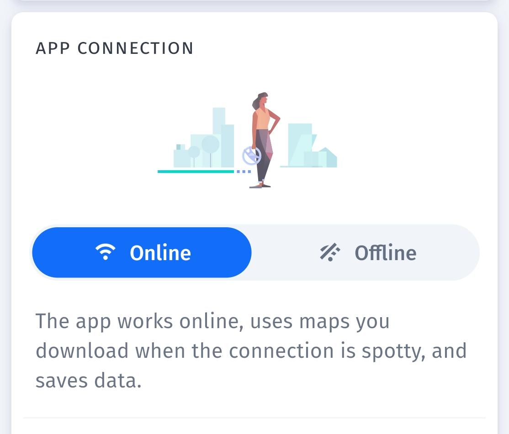

# HERE WeGo

## URL

[https://wego.here.com/](https://wego.here.com/)

## Description

Here WeGo is a navigation app that serves as a robust alternative to popular services like [Google Maps](https://bellingcat.gitbook.io/toolkit/more/all-tools/google-maps) and [Apple Maps](https://bellingcat.gitbook.io/toolkit/more/all-tools/apple-maps). It offers a range of features tailored for both casual users and those requiring more detailed navigation tools.

The app functions much like Google or Apple maps. Users that are familiar with either platform will find many of the same basic features present on the Here WeGo website or application. Key features as wel as downsides are highlighted in the points below.&#x20;

#### Key Features:

* Privacy Focus:
  * Unlike some competitors, Here WeGo emphasizes user privacy. It collects minimal data compared to other navigation apps, which is a significant plus for privacy-conscious users​​. The sharing of traffic data on the mobile application is optional and users are informed that any data that they do share will be anonymised.&#x20;
* Offline Maps:
  * One of the standout features of Here WeGo is its offline maps capability. Users can download maps for entire cities, regions, or countries, enabling navigation without an internet connection. This is particularly useful for travelers in areas with poor network coverage or those looking to save on data costs​​.
* Additional modes:
  * Here WeGo also offers users the option to overlay environmental zones over the map they are viewing. This provides an easily digestible view of low-emissions or similar types of other zones in a particular area.&#x20;

<figure><figcaption></figcaption></figure>

* Comprehensive Navigation:
  * The app provides detailed turn-by-turn directions for driving, walking, cycling, and public transit.&#x20;
  * The app also integrates real-time traffic data to help users avoid congestion and find the fastest routes. This allows it to offer information on public transportation schedules and options.&#x20;

<figure><figcaption></figcaption></figure>

* Performance and accuracy:&#x20;
  * Tested routes proposed by Here WeGo appear to be reliable and accurate. This is also the case in offline mode, where the app manages to maintain functionality even without an internet connection. However, it can be heavy on battery usage when used extensively in standalone mode, so keeping a charger or battery pack handy is advisable​​.&#x20;

#### Drawbacks:

* Advanced Features:
  * While Here WeGo covers the basics well, some advanced features found in other apps, such as street view or augmented reality navigation, are missing. Enhancing these aspects could improve its competitiveness​​.
* Voice Navigation:
  * Some users have noted that the voice directions can sound digital and processed. Smoother and more natural-sounding voices would enhance the overall user experience​​.

#### Conclusion

Here WeGo is a powerful navigation tool, particularly strong in offline capabilities and user privacy. It is a great choice for travelers who need reliable directions without relying on constant internet access. While there are areas for enhancement, such as voice navigation and advanced features, the app remains a solid option for both daily commuting and international travel. For users seeking an alternative to Google Maps with a focus on offline use and privacy, Here WeGo is definitely worth considering​.

## Cost

* [x] Free
* [ ] Partially Free
* [ ] Paid

## Level of difficulty

<table><thead><tr><th data-type="rating" data-max="5"></th></tr></thead><tbody><tr><td>1</td></tr></tbody></table>

## Requirements

The tool does not require you to sign in to use it. However, on the web version there are certain functions that require you to sign in. These include saving locations in a "collection". \
\
Registering for an account can be done via Facebook or with an email address. The latter option also requests a name, birth date and a country or region.

## Limitations

Unlike some other sattelite imagery tools, Here WeGo does not appear to indicate the date of the images it displays. Nor does it offer different chronological options, which may be limiting for researchers looking to assign a specific time to an image.&#x20;

## Ethical Considerations

Sattelite imagery captures images of the earth indiscriminately. Here WeGo's displays of sattelite imagery may therefore cause sensitive or private images and information about individuals or organisations to become unexpectedly public. Researchers are encouraged to make use of Here WeGo and the information it provides responsibly and for research in the public interest.

## Guides and articles

A guide to what Here WeGo, its setup and its use is available on a community-run website [here](https://www.herewego.info/en/here-wego/).&#x20;

## Tool provider

The tool is created and maintained by an entity named Here Technologies. They are a Dutch multinational headquartered in Amsterdam that is majority owned by a consortium of German automotive companies. The entity's core business revolves around lisencing mapping content to other companies. Here Technologies was created after a 2012 rebranding of what was formerly Nokia Maps.

## Advertising Trackers

* [ ] This tool has not been checked for advertising trackers yet.
* [ ] This tool uses tracking cookies. Use with caution.
* [x] This tool does not appear to use tracking cookies.

| Page maintainer  |
| ---------------- |
| ForgottenPidgeon |
|                  |
