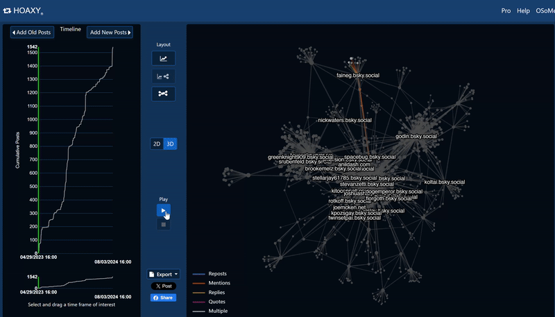

# Hoaxy

## URL




This tool has been retired as of [July 2025.](https://x.com/OSoMe_IU/status/1949394974262350098) See the new unified tool with similar functionalities at [OSoMeNet](https://osome.iu.edu/tools/osomenet/). &#x20;


## Description


NOTE: Hoaxy was [first developed in 2016](https://www.researchgate.net/publication/301841797_Hoaxy_A_Platform_for_Tracking_Online_Misinformation). This toolkit description tested the most recent version and its features to date.


Hoaxy assists in unraveling the complex web of information dissemination online, particularly on X (Twitter) and Bluesky. It primarily addresses the problem of mis- and disinformation spreading rapidly on social media platforms. Users can search for a particular topic or keyword on either platform, and it will automatically generate a graph showing the spread of information.

### What problem does it solve?

The tool providers saw that [false claims spread faster than fact-checked claims](https://www.researchgate.net/publication/301841797_Hoaxy_A_Platform_for_Tracking_Online_Misinformation)(p.1). [According to them](https://www.researchgate.net/publication/301841797_Hoaxy_A_Platform_for_Tracking_Online_Misinformation), social media networks often show us information from people who think like us, creating echo chambers where we see similar views and ideas repeatedly (p.1).

For open-source researchers wanting to verify false claims, it is important to recognize that the anatomy of information dissemination has multiple moving parts: When did a narrative start? Where did it first appear? Who is the source of the narrative? How credible is the source? And who are the receivers/audience? Among the receivers, which accounts forwarded the information? How fast did a particular narrative spread within a particular time-frame?

Hoaxy solves some of these questions through the following key features:

1. Search: This allows users to find specific keywords, URLs, or users on Bluesky and X/Twitter that may need verification or monitoring.
2. [Visualization:](https://hoaxy.osome.iu.edu/faq#faq-q11) This offers users a visual representation of data that can illustrate who is sharing the information, the connections between different users, and the chronological order in which the information is spread.

### How does it work?

Step 1: Choose either Bluesky or X/Twitter

Step 2: Enter your search terms

Step 3: Hoaxy automatically generates a visualization

Step 4: Analyze the visualization map and its data

<figure><figcaption>
The landing page of the Hoaxy tool automatically lets you choose your search preferences. You can choose to do a query on Bluesky or on X/Twitter or to import your own data. At the bottom you find a search bar for keywords, account, URL, phrases.
</figcaption></figure>

#### **DOING A BLUESKY SEARCH**

If the user is interested in tracking information spread on the Bluesky platform, users must select “Search Bluesky”, and then they can [enter the following input on the search bar](https://hoaxy.osome.iu.edu/faq#faq-q11):

* Single term (i.e. airstrike)
* Phrases (enclosed in quotation marks, i.e. “Kyiv airstrike” )
* Combine multiple terms using Boolean operators AND, OR, NOT (i.e. "Kyiv airstrike" AND (report OR news) NOT "false alarm")

#### **DOING A X/TWITTER SEARCH**


NOTES:

1. This function requires a Bearer Token that is only available if a user purchased a Basic, Pro or Premium+ subscription on X.
2. [This will only retrieve posts from the last 7 days](https://hoaxy.osome.iu.edu/faq#faq-twitter-search).


If the user is interested in tracking information spread on the X platform, users must select “Search X/Twitter”. Then, they can enter search terms in the same way they can use the advanced search feature of X (See X’s guide to building a query [here](https://developer.x.com/en/docs/twitter-api/tweets/search/integrate/build-a-query) or [this guide](https://bellingcat.gitbook.io/toolkit/more/all-tools/twitter-advanced-search)). [This tool is compatible with X’s advanced search operators.](https://hoaxy.osome.iu.edu/faq#faq-twitter-search)

For example: "Amazon deforestation" AND (illegal OR logging) has:videos

**IMPORT YOUR OWN DATA**

In addition to examining content from Bluesky and X, [users can also import their own data](https://hoaxy.osome.iu.edu/faq#faq-q30) into the tool’s visualization tool, as long as the data is in the required format: CSV and JSON.

#### **VISUALIZATION**

Once users have entered the search terms, Hoaxy will generate a visualization containing two things: “Diffusion networks” and “temporal trends”.

<figure><figcaption>
This screenshot shows the visualization automatically generated by Hoaxy for a Bluesky query for the keyword "airstrikes." The right panel shows "diffusion networks" (as described below), and on the left panel is the "temporal trends" (also described below). In between these panels are a few features that users can modify and play around with to change how the graph looks for analysis. The account shown in a yellow box (to the right) shows a cluster that is not part of the larger clusters. This represents a separate network or conversation where the keywords appear, but no user accounts overlap.
</figcaption></figure>

**Network Graphs or “Diffusion Networks”**

Understand how information spreads between accounts. Identify influencers, clusters, and potential disinformation networks. The tool provider defines these “diffusion networks” as networks that [“display how posts spread from person to person. Each node is a X/Twitter account and two nodes are connected if a post is passed between those two accounts. Larger nodes represent more influential accounts.”](https://hoaxy.osome.iu.edu/faq#faq-q5)

Within the graphs, users will notice that the connecting lines between accounts have different colors. According to the tool provider ["\[t\]he color of a connection indicates the type of post: reposts, replies, quotes, or mentions. Clicking on an edge (connecting line) reveals the post(s); clicking on a node reveals the X/Twitter account of the corresponding user.”](https://hoaxy.osome.iu.edu/faq#faq-q5)

The edges are color-coded as follows:

BLUE - reposts ORANGE - Mentions YELLOW - Replies RED - Quotes

GREY - Multiple

**Timelines or “Temporal trends”**

Track the evolution of a topic over time, identifying peak interest and potential turning points. The tool provider describes this as plotting [“the cumulative number of posts over time. The user can zoom in on any time interval.”](https://hoaxy.osome.iu.edu/faq#faq-q5)


TIP: Hovering your mouse over the graph to either the left or right will show the dates and the number of posts generated on that particular date.


<figure><figcaption>
(Click to enlarge) This image shows the timeline of how posts about a specific topic spread over time. In this example, the tool automatically generates a timeframe from 13 March 2024 to 17 April 2024 (shown in the orange square). On the top of the image are options to "add old posts" or "add new posts" (shown in green circles).
</figcaption></figure>

**Middle Panel**

The middle panel shows different features that users can change depending on their preferences. It consists of layout options, export options, a 2D or 3D display, and a short clip showing how information spreads.

<figure><figcaption>
The screenshot shows the middle menu for the visualization and the different ways users can display their results for analysis.
</figcaption></figure>

The tool also allows you to play a short animated clip showing how the nodes and connections are made, and how it unfolds over time, from the beginning date to the end date as displayed on the left panel.

<figure><figcaption>
Clicking on the "Play" icon in the middle panel shows users how the information spreads from the beginning date, 29 April 2023 to the end date, 3 Aug 2024. This shows a Bluesky query looking for mentions of Bellingcat.
</figcaption></figure>

#### CHECKING YOUR RESULTS

It is recommended to review your results to understand the type of data and content presented and determine if it aligns with your research topic. To explore, users can choose a cluster and click a node or user account. This action displays a pop up window displaying accounts it interacts with- through mentions, replies, or quotes— and includes a link to that specific post. Additionally, clicking on the connecting lines (edges) will bring up a pop up showing the related post.&#x20;

<table data-card-size="large" data-view="cards" data-full-width="true"><thead><tr><th></th><th></th><th></th><th data-hidden data-card-cover data-type="files"></th></tr></thead><tbody><tr><td>Click on a node, and it will show you actions made by that account and who it interacted with. In this example, we did a Bluesky search for @bellingcat.com. On the right side, we selected the account @scrippsnews.bsky.social, and to the left, a pop-up window appears to show the activity. Underneath (shown in green arrows) are links to the post or content being forwarded.</td><td></td><td></td><td><a href=".gitbook/assets/Bellingcat viz node feature 1.png">Bellingcat viz node feature 1.png</a></td></tr><tr><td></td><td>Click on an edge (the color-coded connecting lines) to automatically generate a pop-up window showing the content being shared from one account to another (or from one node to another).</td><td></td><td><a href=".gitbook/assets/Bellingcat viz Node 1.png">Bellingcat viz Node 1.png</a></td></tr></tbody></table>

### Use case

The main use case for Hoaxy is for verification and to get a sense of the context in which a piece of information is shared:

Open-source researchers can analyze the network of users who shared a piece of information and identify whether the original sources are credible news outlets or dubious accounts known for spreading mis- or disinformation. This can be one of the first steps when trying to get a sense of the spread of a particular claim on social networks. It also provides a clearer understanding of the networks in which a piece of information is being shared​ as well as the timeframe during which the claim was most active. See [here](https://www.engadget.com/2016-12-21-hoaxy-visualizes-how-fake-news-spreads-across-social-media.html) for an example of how it was used to debunk “Picklegate” during a presidential campaign season.

## Cost

* [ ] Free
* [x] Partially Free
* [ ] Paid

Bluesky search and importing your own data is free, but an X/Twitter search requires a Bearer Token that can only be available if the user pays for an [X Premium subscription](https://x.com/i/premium_sign_up).

## Level of difficulty

<table><thead><tr><th data-type="rating" data-max="5"></th></tr></thead><tbody><tr><td>3</td></tr></tbody></table>

## Requirements

1. X user account
2. X user account Bearer Token (available if user purchased a Basic, Pro or Premium+ subscription)

## Limitations

1.  **Beta Status:** Based on its landing page, Hoaxy still appears to be in the beta phase.

    This may affect its accessibility and ease of use, especially for users who are less technically inclined. While it sometimes takes a bit longer to load the visualization graphs, it generally performs well.
2. **Date/Time Frame Limitations:** based on some tests, Hoaxy automatically chooses a date/time frame for your search. Users have the option to fetch older or newer posts, but the tool sometimes struggles to load the visualization after doing so. Users may try using date and time search operators to see if Hoaxy can fetch posts within a timeframe of interest.
3. **X/Twitter API Limitations:** Due to recent API policy changes, Hoaxy can only access tweets from the past 7 days, limiting the scope of live searches. Mis- and disinformation may be more prevalent on X due to its larger user base. (As of Feb 2024, ["Bluesky's user numbers are still quite small compared with Threads at more than 130 million and X at 556 million."](https://www.zdnet.com/article/bluesky-snags-more-than-800000-new-users-after-opening-to-the-public/) ) A [2024 Pew Research Center report](https://www.pewresearch.org/journalism/2024/06/12/x-users-experiences-with-news/) on X users' experience with news say that 86% of its participants see news on the platform that seems inaccurate.
4. **Network Pruning:** The tool may occasionally truncate some diffusion networks to improve performance, potentially omitting relevant data. [According to the tool provider, “\[t\]he network may be pruned for performance.”](https://hoaxy.osome.iu.edu/faq#faq-q5)
5. [**Public Posts Only:**](https://hoaxy.osome.iu.edu/faq#faq-q16) Hoaxy can only retrieve and analyze public posts, leaving private conversations unexamined.
6. **Cross-Platform Limitations:** Hoaxy requires additional tools to track mis- and disinformation that spills over to other platforms, as it can rapidly spread from one platform to another. The dynamics of information spread vary significantly across different social media. [As shown in this BBC Investigation](https://www.bbc.com/news/articles/cl4y0453nv5o), the spread of misinformation in the Southport protests started on one platform and then migrated to a different platform, where it was even more amplified.
7. **Needs Some Familiarity with Network Analysis for Interpretation:** To fully understand and make sense of the data visualizations provided by Hoaxy, it's helpful to have some background knowledge in [network analysis](https://www.skopenow.com/news/uncovering-connections-how-link-analysis-can-streamline-osint-investigations).
8. **Content Analysis:** Hoaxy is not a tool for distinguishing between different types of mis- and disinformation. Users may need additional tools or methods to conduct detailed content analysis and identify various forms of mis- and disinformation accurately. According to [UNESCO World Media Trends,](https://www.unesco.org/en/world-media-trends/hoaxy) “A claim may be a false news article, hoax, rumor, conspiracy theory, satire, or even an accurate report. (Hoaxy) is not meant to be used as a fact-checking tool but rather to understand how disinformation and misinformation is being spread by non-trustworthy accounts.”

Overall, while Hoaxy is created as a comprehensive tool, its reliance on specific data sources, limited platform scope, and occasional usability issues highlight some gaps in it's capabilties. Hoaxy is best used in addition to other open-source investigative tools.

## Ethical Considerations

**Contextual Clarity:** When sharing the visualization with others, provide sufficient context to prevent misinterpretation.

**User Anonymity:** While Hoaxy might not reveal individual user identities, the tool can still expose patterns of behavior that could potentially lead to identification.

## Tool provider

[Hoaxy](https://hoaxy.osome.iu.edu/faq#faq-q10) is a project of Indiana University's Observatory on Social Media (OSoMe).

## Advertising Trackers

* [x] This tool has not been checked for advertising trackers yet.
* [ ] This tool uses tracking cookies. Use with caution.
* [ ] This tool does not appear to use tracking cookies.

| Page Maintainer |
| --------------- |
| Afton           |
|                 |
|                 |
