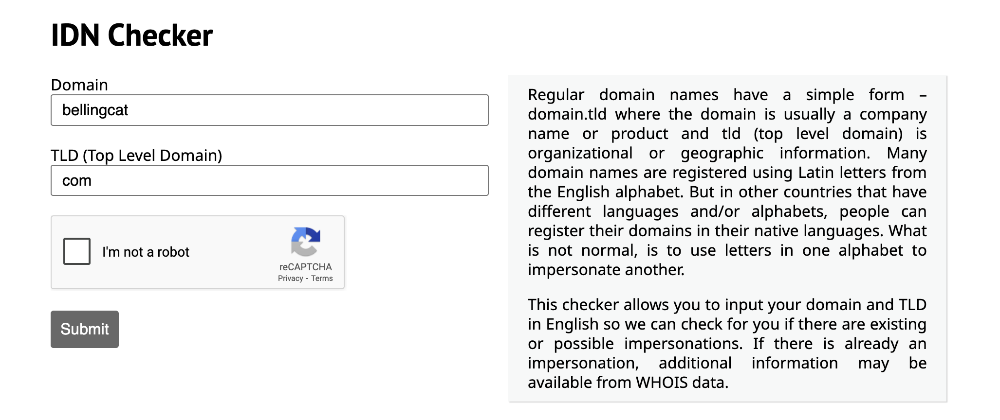
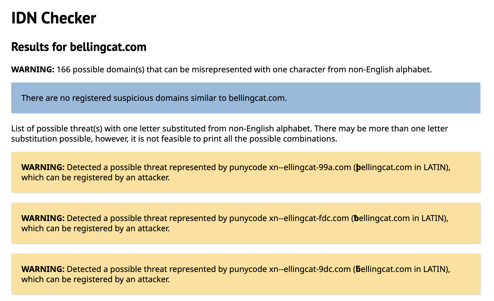
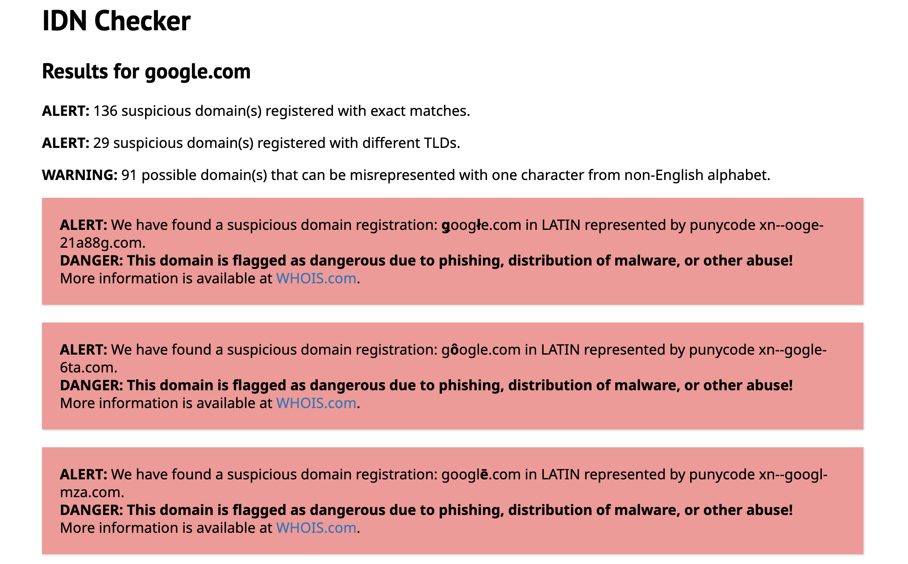
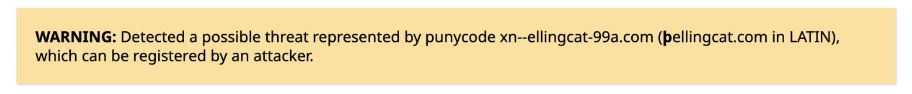
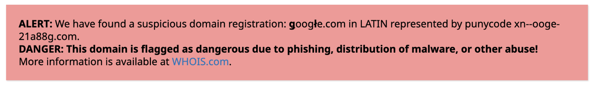

# IDN Checker

## URL

[https://holdintegrity.com/checker](https://holdintegrity.com/checker)

## Description

IDN (Internationalized Domain Name) Checker helps detect visually similar versions of a domain — often used for phishing or impersonation. Precisely, it compares a target domain with lookalike domains that use internationalized characters.

Certain characters from non-Latin alphabets, such as Cyrillic or Greek (or characters from the Latin alphabet with added diacritics), closely resemble usual characters from the Latin alphabet. This resemblance makes them a vector of choice for domain spoofing, more precisely referred to as IDN homograph attacks.

In an IDN homograph attack, a threat actor registers a domain name using characters from a different alphabet that look almost exactly like characters of the Latin alphabet. This malicious domain is then used for malicious purposes, such as tricking a target into thinking they are visiting a trusted website or exchanging emails with a trusted address, when in fact they are on a phishing site designed to steal passwords, or sending sensitive personal information to a threat actor.

IDN Checker helps identify and investigate such domains. Specific applications include:

* **Phishing detection**: exposing domains that look identical to legitimate targets
* **Brand abuse tracking**: finding spoofed sites impersonating corporate identities
* **Threat actor identification**: mapping spoofed domains back to registrants via their [WHOIS record](https://bellingcat.gitbook.io/toolkit/more/all-tools/domaintools-whois-lookup), a public record containing information on the registrant of a domain.

In order to start searching, you simply need to input the domain name and TLD in the appropriate fields, as in the example below:

<figure><figcaption></figcaption></figure>

_(Search example for the target domain bellingcat.com)_

Once the target domain search is submitted, IDN Checker will provide a list of all possible variations with their corresponding warning or alert. It is important to note that the color code of each warning or alert will correspond to different levels of threat.

**Yellow warnings** identify suspicious domains using internationalized characters that are **not yet registered,** but are available for registration.

<figure><figcaption></figcaption></figure>

_(Yellow warning for the target domain bellingcat.com, indicating homograph domains which are not yet registered)_

**Red alerts** identify suspicious homograph domains that are **currently or were** **registered**, and are or were therefore possibly used maliciously.

<figure><figcaption></figcaption></figure>

_(Red alert for the target domain google.com, indicating existing registered homograph domains)_

Red alerts will also redirect to a [WHOIS.com](https://www.whois.com/) search of the domain to find more information on the registrant.

It is notable that some of these domains will not be identifiable through a default current WHOIS search. Indeed, red alerts will also be displayed for domains that were registered in the past, but are no longer registered. For example, a current WHOIS search for the domain _gôogle.com_ (punycode _xn--gogle-6ta.com_) will show that it is not currently registered, whereas a historical WHOIS search for this domain will bring up several WHOIS records.

For each warning or alert, IDN Checker will provide the internationalized domain name, as well as the [punycode](https://en.wikipedia.org/wiki/Punycode) of the domain (the 'translation' of the international domain name using only [ASCII characters](https://en.wikipedia.org/wiki/ASCII#Character_set)). Punycode allows non-ASCII characters (like Latin accented letters, Cyrillic, or Greek characters) to be represented in domain names using only ASCII characters.

This is important because the punycode of a domain may be used for automated detection, monitoring and filtering of such domains.

<figure><figcaption></figcaption></figure> <figure><figcaption></figcaption></figure>

_(Warning/alert displaying homograph domains along with their punycode representation)_

## Cost

* [x] Free
* [ ] Partially Free
* [ ] Paid

IDN Checker is a free tool, however it is part of a broader premium suite of domain integrity services from Hold Security: [https://holdsecurity.com/solutions/domain-integrity-service/](https://holdsecurity.com/solutions/domain-integrity-service/)

## Level of difficulty

<table><thead><tr><th data-type="rating" data-max="5"></th></tr></thead><tbody><tr><td>1</td></tr></tbody></table>

IDN Checker has an easy-to-understand user interface, it does not require any technical knowledge to search and does not ask the user to create an account.

## Requirements

There are no specific requirements to use the free version of IDN Checker. You only need to know the target domain you want to investigate.

## Limitations

**Automation:**

It should be noted that the free version of IDN Checker does not enable any automation. There are no APIs available, which can be limiting if you are looking for automated monitoring and investigation of target domains.

**Accuracy:**

Warnings and alerts do not seem always accurate, in some cases a WHOIS search of homograph domains (whether current or historical) will not correspond to the level of threat identified by IDN Checker.

## Ethical Considerations

**Cultural sensitivity:**

Not all IDN usage is malicious, many legitimate websites use non-ASCII characters for valid cultural, linguistic, or branding reasons. It is preferable not to make assumptions that IDN usage automatically indicates malicious intent, as this could lead to discrimination against non-English domains and websites.

**Attribution:**

Be cautious about making definitive attributions based solely on alphabet types. Using Cyrillic characters doesn't automatically indicate Russian origins, for example, as these scripts are used across many countries and cultures, or can simply be chosen by a malicious actor.

The key is using IDN Checker as part of a broader, contextual analysis rather than as a single judgment mechanism.

## Guides and articles

There are no official guides for IDN Checker, as it is a relatively simple tool to use. Regarding IDN homograph attacks, you may find more information on Wikipedia:

* IDN homograph attack: [https://en.wikipedia.org/wiki/IDN\_homograph\_attack](https://en.wikipedia.org/wiki/IDN_homograph_attack)

For a recent example of how an internationalized domain name can be used maliciously, you may refer to:

* IDN Homograph Attack - Reborn of the Rare Case, by Jerry Shah: [https://shahjerry33.medium.com/idn-homograph-attack-reborn-of-the-rare-case-99fa1e342352](https://shahjerry33.medium.com/idn-homograph-attack-reborn-of-the-rare-case-99fa1e342352)

## Tool provider

This tool is provided by Hold Security LLC, [https://holdsecurity.com/](https://holdsecurity.com/)

This company is headquartered in the US (Wisconsin), and has offices in Ukraine and the Czech Republic.\

## Similar tools

While there exists many tools to monitor domain registrations, to our knowledge IDN Checker is the only free tool to verify IDN registrations from a target domain at this time.

## Advertising Trackers

* [x] This tool has not been checked for advertising trackers yet.
* [ ] This tool uses tracking cookies. Use with caution.
* [ ] This tool does not appear to use tracking cookies.

| Page maintainer           |
| ------------------------- |
| Bellingcat volunteer team |
