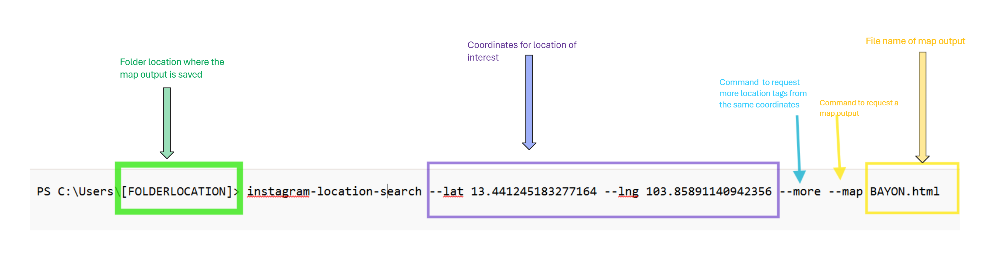

# Instagram Location Search

## URL

[https://github.com/bellingcat/instagram-location-search/tree/main](https://github.com/bellingcat/instagram-location-search/tree/main)

or

[https://pypi.org/project/instagram-location-search/](https://pypi.org/project/instagram-location-search/)

## Description

Instagram Location Search is a tool that helps users find Instagram location IDs near specified coordinates. It uses Instagram's API to retrieve location data.&#x20;

Open-source investigators can use this Python-based command-line tool to get geolocation leads on Instagram's platform or to search for photos or videos of an incident under investigation.&#x20;

### What Problem Does It Solve?

When looking for media from a particular location, searching for just an address or the name of a location on Instagram can be confusing, especially for popular spots. The problem is that Instagram suggests an abundance of location options for a single place (see [video](https://www.youtube.com/watch?v=equWt9Dq5b0) at 1:11).

This could mean the investigator will have to manually compile a list of all those possible locations and then potentially sift through the individual location tags to look for media.

<figure><figcaption>
This is an example of a post of Bayon Temple, a popular tourist destination in Siem Reap, Cambodia. However, the challenge is that when a user tags the image, various location suggestions appear. Searching for relevant media through individual location tags is inefficient and may risk excluding pertinent potential images/videos for the investigation.
</figcaption></figure>

1. This tool solves the problem of efficiency. Instagram Location Search casts a broader net by compiling all the location tags near a set of coordinates along with their respective links to Instagram’s Explore page.
2. This tool also addresses the issue of exporting data in various output formats tailored to the individual needs of the investigator.

<a href="https://github.com/bellingcat/instagram-location-search/blob/main/README.md">Here is a list of outputs that the tool can create</a>

1. \--map → This command allows users to request a map in HTML format showing the locations on the map, with links to Instagram and the media associated with the particular location tag.
2. \--csv → This command allows users to request the location data in a CSV/table-like format which they can then use on programs like Excel, Google Sheets, etc.
3. \--json → This command line argument can request a JSON file. This file will look almost the same as the data you’d see if you were getting it directly from a website or an API.
4. \--geojson → This argument helps you save a list of Instagram locations in a format that’s ready to be used for mapping and other geographic applications such as Google Maps, QGIS, etc .
5. \--ids → This specific command tells the tool that you want to get a list of location IDs, which will be saved in a .txt file. Once you have this file with the location IDs, you can use it with another tool (like Instagram scraper). This second tool can then use those IDs to gather more information, such as photos or posts from those locations.

### Steps

For a step-by-step [video guide](https://www.youtube.com/watch?v=equWt9Dq5b0), please refer to Bellingcat’s How To Series.

1. Download the tool.
2. Give the tool access to Instagram.


NOTE: Giving access to your Instagram account using this tool may breach the platform’s Terms of Service. Note that it may lead to your account being suspended or flagged. Be aware of these risks before proceeding.


3. Find the coordinates you are interested in and input them into the tool.
4. Use the tool to get more locations.
5. Use the tool to create the output format you may need for your investigation. The output is generally saved in the folder specified in the query (see below).

<figure><figcaption>
This is a sample query with the Instagram Location Search tool, with the different variables you can input. This query requests the tool for location tags based on the coordinates for the Bayon Temple in Siem Reap, Cambodia (violet). This is followed by the "--more" command which asks for more location tags for the coordinates (blue). This is followed by the "--map" command requesting the tool to create a map in a form of a website to help visualize these location tags. Then the query is followed by file name "Bayon.html" at the end (in yellow). This file can be found on the folder specified on the command prompt (highlighted in green)
</figcaption></figure>

<figure><figcaption>
This is a sample map created by the tool based on the query above. Users can zoom in and out and click on each pin. Each pin represents a location tag and will contain a link to a gallery on Instagram based on the location tag.
</figcaption></figure>

### Use Case

1. A potential use case for this tool is for real-time security or conflict monitoring, especially on developing news. According to this [review](https://web.archive.org/web/20240419233411/https://os2int.com/toolbox/identifying-and-scraping-from-instagram-locations-with-instagram-location-search/), the tool was used to help find “media of intelligence value” while monitoring the ongoing military coup in Khartoum, Sudan.
2. Another potential use case is looking for images of ships and other vessels on Instagram or posts by workers or crew members. A similar tool was used during the discovery phase in [Bellingcat’s Tobago oil spill investigation](https://www.bellingcat.com/news/2024/02/14/identifying-the-mystery-vessel-at-the-site-of-trinidad-tobagos-national-emergency-oil-spill/). In the same investigation, researchers identified potential employees by searching for photos tagged at a location of interest. Their followers and liked posts were also analyzed. This allowed researchers to discover additional employees who had posted pictures of the same location but hadn't geotagged them, providing additional leads.

## Cost

* [x] Free
* [ ] Partially Free
* [ ] Paid

## Level of difficulty

<table><thead><tr><th data-type="rating" data-max="5"></th></tr></thead><tbody><tr><td>3</td></tr></tbody></table>

## Requirements

Python

Chrome Browser

Instagram Account

Some beginner understanding of command line tools

## Limitations

1. Level of difficulty

One of the tool's limitations is that users are required to have a fundamental knowledge of both the command line and Python programming. Without this, they may struggle with basic operations and troubleshooting. However, simple guides are available.

2. Potential flagging of user account

Using Bellingcat's Instagram location search tool may pose certain risks. As mentioned above, granting access to your Instagram account through this tool could potentially violate Instagram’s Terms of Service, which might result in your account being flagged or suspended. Mitigate by using a dedicated research account.

## Ethical Considerations

1. Terms of Service Violations: This tool may violate Instagram's Terms of Service, which can lead to account suspension or other penalties for users.
2. Transparency: Users of the tool should be transparent about how data is collected and used in their investigation
3. User Consent: The tool accesses publicly available content, but it may still infringe on users' expectations of privacy. Users may not realize their posts are being aggregated for analysis.

## Guides and articles

Bellingcat Tech Series "How to" Video: [https://www.youtube.com/watch?v=equWt9Dq5b0](https://www.youtube.com/watch?v=equWt9Dq5b0)

31 Oct 2021, review by Joseph Jones of OS2INT, "Identifying and Scraping with 'Instagram Location Search'": [https://web.archive.org/web/20240222040518/https://os2int.com/toolbox/identifying-and-scraping-from-instagram-locations-with-instagram-location-search/](https://web.archive.org/web/20240222040518/https://os2int.com/toolbox/identifying-and-scraping-from-instagram-locations-with-instagram-location-search/)

## Tool provider

Bellingcat, Netherlands

## Advertising Trackers

* [x] This tool has not been checked for advertising trackers yet.
* [ ] This tool uses tracking cookies. Use with caution.
* [ ] This tool does not appear to use tracking cookies.

| Page maintainer |
| --------------- |
| Afton           |
|                 |
