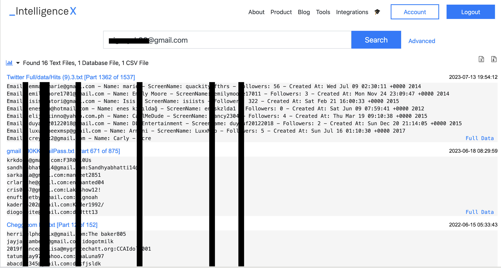

# Intelx.io

## URL

http://intelx.io/

## Description

Intelx lets you search email addresses (and other inputs) in its database of information from the darknet, document sharing platforms, whois data, public data leaks and others. You can expect to find associated accounts, names, IP addresses, passwords, dates of birth, etc.&#x20;

&#x20;In the example below, Intelx finds a particular email address in a leak of Twitter and Chegg. The twitter one shows info on names, screen names, followers and the creation time. The Chegg database shows email addresses and their passwords.

&#x20;

By clicking on the database you can see the whole file and make a search for an email of interest.&#x20;

## Cost

* [ ] Free
* [x] Partially Free
* [x] Paid

Very limited results with a free account. Prices start at € 2.500 /Year. There's been cases when journalists were given free access. &#x20;

## Level of difficulty

<table><thead><tr><th data-type="rating" data-max="5"></th></tr></thead><tbody><tr><td>1</td></tr></tbody></table>

## Requirements

\[\[Information on the requirement for using a tool, for instance, API key, e-mail address etc.]]

## Limitations

\[\[The limitations of each tool should be described. This is important for researchers if they want to decide whether they should invest the time to learn how to use a new tool.]]

## Ethical Considerations

Consider the strong ethical implications of examining leaked user data. Depending on the ethical and legal standards of your work, you may decide whether or not to use it. Assess if researching a person of interest in the leaked database is justified by the potential public benefit. Does the end justify the means?

If you decide to proceed, do not use the data to hack into accounts. Instead, consider methods used by open source researchers, such as using intelx to find associated accounts (e.g., discovering a Twitter account from an email address) and to gather more information on a research subject, like their date of birth.

## Guides and articles

\[\[Link to guides on this tool and to articles on research that was done with the help of this tool]]

## Tool provider

Founder info can be found at [https://intelx.io/about](https://intelx.io/about)&#x20;

## Advertising Trackers

* [x] This tool has not been checked for advertising trackers yet.
* [ ] This tool uses tracking cookies. Use with caution.
* [ ] This tool does not appear to use tracking cookies.

| Page maintainer                                                |
| -------------------------------------------------------------- |
| \[\[Your name here (optional) or "Bellingcat volunteer team"]] |
|                                                                |
