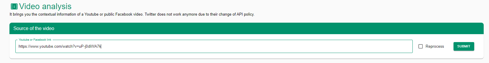

# InVID Verification Plugin

## URL

[https://www.invid-project.eu/tools-and-services/invid-verification-plugin/](https://www.invid-project.eu/tools-and-services/invid-verification-plugin/)

## Description

The InVID Verification Plugin is a comprehensive toolkit designed to assist journalists in verifying content on social networks. It offers a suite of tools to analyze and verify videos and images, including contextual information retrieval, reverse image search (Google, Yandex, Baidu), video fragmentation, and metadata extraction. The plugin supports multiple platforms, such as YouTube, Facebook, Twitter, and Instagram, making it a versatile tool for fact-checking and debunking tasks on social networks. (Some Twitter-related features may not work anymore due to the API policy change.)


If you're a journalist, fact-checker, or researcher, take a minute to apply and register to use the advanced tools. To do this, click "Advanced Tools" and then "Register". Register with your **professional email address.** Once you’re confirmed as registered, enter your email and then copy & paste the code emailed to you.


## Features

### **Video**

**Video Analysis**

Provides contextual information and metadata for YouTube and public Facebook videos, helping users understand the video's background and related comments.



<figure><figcaption>
Enter the video URL
</figcaption></figure>







**Keyframes**

Segments YouTube or Facebook videos into keyframes for detailed analysis and reverse image search, enhancing verification processes.



<figure><figcaption>
Here you can provide a source URL or upload a video and the tool will create keyframes for you for further analysis.
</figcaption></figure>



<figure><figcaption>
If you click "Show Detailed View" the number of keyframes will increase.
</figcaption></figure>



**Thumbnails**

Extracts and performs a reverse search of thumbnails from YouTube videos to check for prior usage or manipulation.



<figure><figcaption>
Provide a YouTube URL and place a checkmark for the reverse image search mechanism you want to use (you can select multiple). Note that if you check "Open Tabs," all result thumbnails will automatically be opened on all services, which might be a lot of tabs.
</figcaption></figure>



<figure><figcaption>
This will result in a list of clickable thumbnails, which will lead you to the previously selected reverse image search service.
</figcaption></figure>



<figure><figcaption>
In this case, no fact checks were found. But who knows, if you had selected another service previously, you might have found out more about our Python expert.
</figcaption></figure>



**Video Rights**

Retrieves and displays information on legal rights for YouTube and Twitter videos, helping users understand reuse conditions and copyright issues.



<figure><figcaption>
Provide a URL to the video which you want to analyze.
</figcaption></figure>



<figure><figcaption>
The results section shows you Reuse Policy, License Summary, Contact information, as well as guide you how to give attribution to the video according to the available information.
</figcaption></figure>



**Metadata**

Extracts metadata from JPEG images and videos in MP4 or M4V formats, providing details such as creation date, camera settings, and location data.



<figure><figcaption>
You can upload an image/video or provide a URL
</figcaption></figure>



<figure><figcaption>
Which will give you matadata included in the image.
</figcaption></figure>



* **Deepfake (Locked Feature)** - Uses a machine learning classifier to determine the probability that a video contains AI-manipulated faces, such as face swapping or face reenactment. Access is restricted to registered users.

### **Image**

* **Image Analysis** - Provides contextual information for images posted on Facebook, helping to verify their origin and context.
* **Magnifier** - Offers a magnifying lens and photo editor to examine images in detail, allowing for close inspection of specific areas.
* **Metadata** - Extracts metadata from JPEG images and videos in MP4 or M4V formats, providing important information for verification.
* **Forensic** - Provides an enhanced toolkit to detect image forgeries, enabling detailed forensic analysis to identify manipulations.
* **OCR (Optical Character Recognition)** - Extracts text from images, making it easier to analyze and verify textual content within images.
* **CheckGIF (Locked Feature)** - Compares an original image with a tampered one, including cropped images, and generates a GIF highlighting differences. Access is restricted to registered users.
* **Synthetic Image (Locked Feature)** - Determines the probability that an image is AI-generated, using machine learning to assess potential manipulations. Access is restricted to registered users.
* **Deepfake (Locked Feature)** - Detects if an image has been manipulated through face swapping, providing insights into possible deepfake content. Access is restricted to registered users.
* **Geolocalizer (Locked Feature)** - Attempts to geolocate an image using an algorithm, helping to identify where an image was taken. Access is restricted to registered users.

### **Audio**

* **Loccus (Locked Feature)** - Detects AI-generated text-to-speech (voice cloning by AI), analyzing audio files to identify potential deep fake audio. Access is restricted to registered users.

### **Search**

* **X Search** - Performs advanced search queries on X (formerly Twitter), including precise time intervals, enhancing the ability to find relevant content.
* **Fact Check Semantic Search (Locked Feature)** - Uses semantic search algorithms to find fact-checked information across various sources, improving the accuracy of verification. Access is restricted to registered users.
* **XNetwork** - Provides a customized search engine for cross-network queries, allowing searches across multiple social media platforms simultaneously.
* **Factchecks** - Facilitates the discovery of fact-checked articles and reports from trusted fact-checking organizations, aiding in content verification.

### **Data Analysis**

* **Twitter SNA (Locked Feature)** - Performs social network analysis on Twitter, analyzing interactions, trends, and relationships to understand information spread and impact. Deprecated since July 1st, 2023, due to X/Twitter code changes. Access is restricted to registered users.
* **CSV Analysis** - Allows the import and analysis of social network data from CrowdTangle exports, providing in-depth insights into social media activity and trends.

## Cost

* [x] Free

## Level of difficulty

<table><thead><tr><th data-type="rating" data-max="5"></th></tr></thead><tbody><tr><td>2</td></tr></tbody></table>

## Requirements

Chrome (Opera, Edge, and Firefox under development), Internet, and, for some features a professional Address

## Limitations

## Ethical Considerations

* **External Services**: Some tools within the plugin rely on external services that are not open-sourced, which may affect transparency and long-term accessibility.
* **API Restrictions**: Certain features, such as Twitter analysis, have been deprecated due to changes in platform APIs.
* **Locked Features**: Several advanced features are restricted to registered users, such as journalists and researchers, which may limit access for general users.
* **Processing Time**: The analysis of videos with a large number of comments or metadata can be slow, affecting efficiency.
* **Browser Compatibility**: The plugin is primarily designed for Chrome and Opera browsers, with limited support for other browsers like Firefox.
* **Geolocation Accuracy**: The Geolocalizer's accuracy depends on the availability and quality of metadata, which may not always be reliable.
* **AI Detection Limitations**: The accuracy of synthetic image and deepfake detection tools can vary, and false positives or negatives may occur.
* **Data Privacy**: While the plugin respects user privacy, the reliance on third-party services may involve data sharing and privacy considerations.

## Guide

[Guide To Using Reverse Image Search For Investigations](https://www.bellingcat.com/resources/how-tos/2019/12/26/guide-to-using-reverse-image-search-for-investigations/)

## Tool provider

InVID is organized by a consortium of European research groups and businesses, coordinated by The Centre for Research and Technology Hellas (CERTH) in Northern Greece.

The InVID project has received funding from the European Union’s Horizon 2020 research and innovation program.

| Page Maintainer |
| --------------- |
| Martin Sona     |
|                 |
